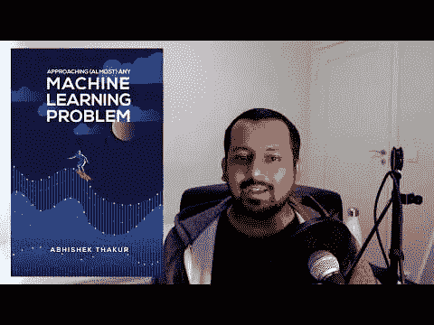
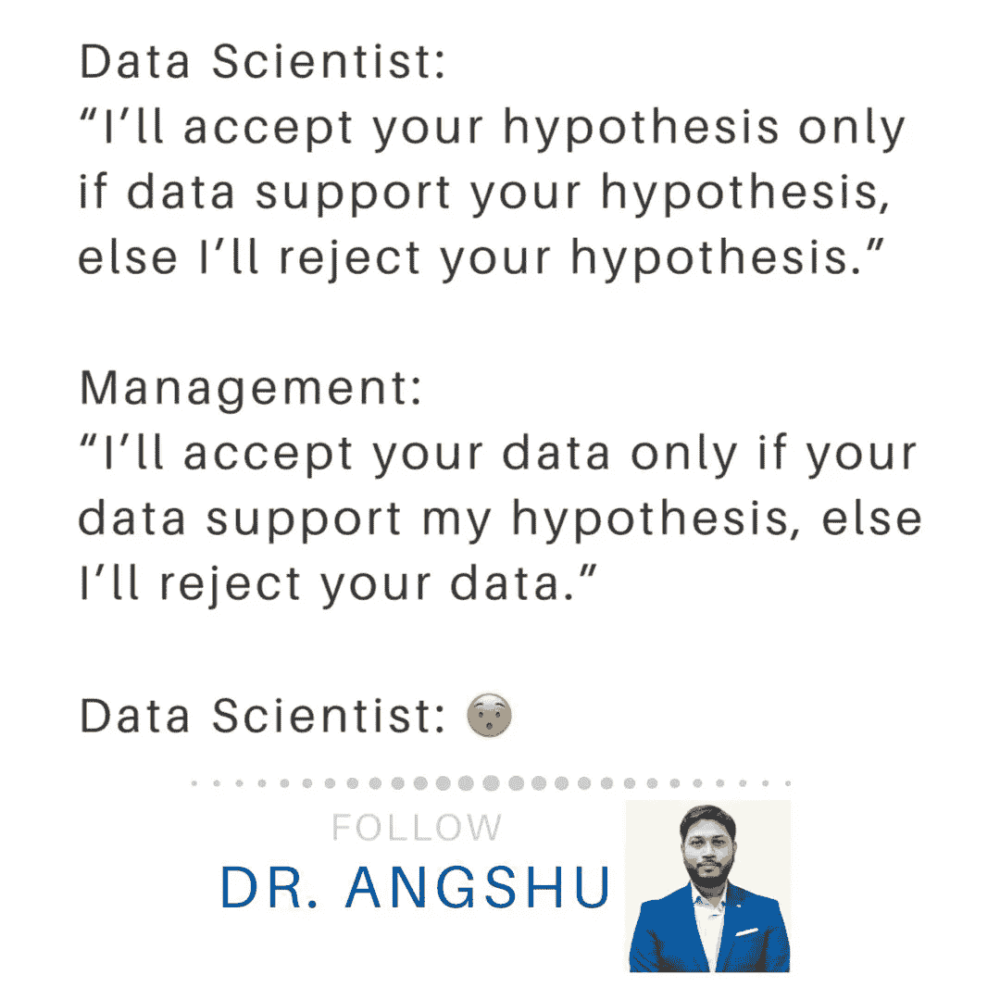
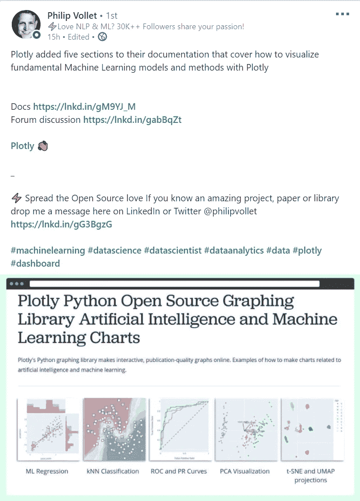
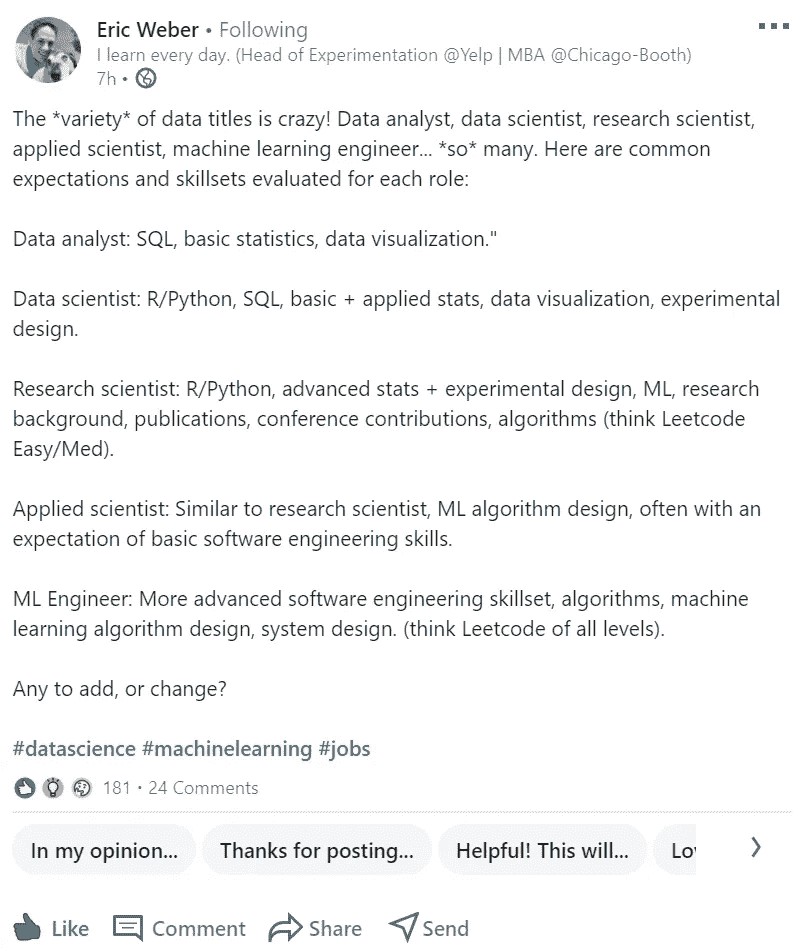
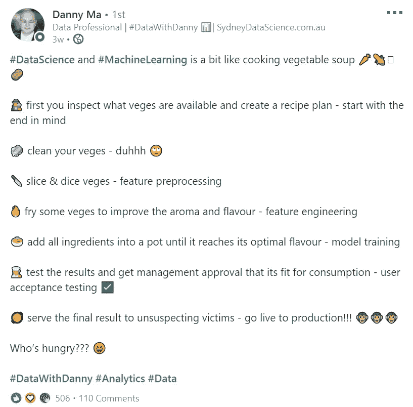
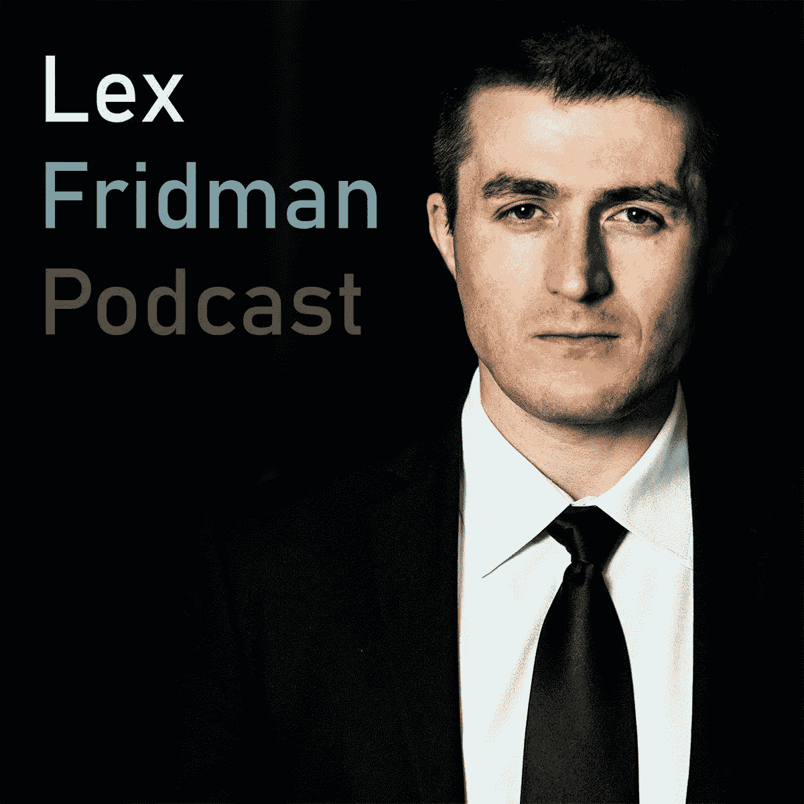

# 你应该在 LinkedIn 上关注的数据科学领域的 7 个人

> 原文：<https://towardsdatascience.com/8-folks-you-should-be-following-on-linkedin-75f8fe9e43db?source=collection_archive---------28----------------------->

## 作为一名数据科学家不断进步和跟上时代

莫尼卡·梅尔顿在 [Unsplash](https://unsplash.com?utm_source=medium&utm_medium=referral) 上的照片

如今很难找到优秀的导师。随着如此多的信息和如此多的观点充斥互联网，找到一个特定领域的权威可能相当困难。

这一壮举并没有贬低在我们生活的不同阶段和领域寻找导师的重要性。长期以来，导师一直被认为是最有效的学习方式，可以将你的学习曲线缩短一半。见鬼，上面甚至有一段圣经经文——**箴言 19:20——NLT**“*尽可能得到所有的建议和指导，这样你的余生将会变得聪明*”。

> “如果说我看得更远，那是因为我站在巨人的肩膀上。”——艾萨克·牛顿

话虽如此，我认为有必要整理一份我们都应该关注的有效数据科学专业人士的名单，特别是在 LinkedIn 上。

列出这份名单非常困难，我可以添加的名字太多了，比如 [Dat Tran](https://www.linkedin.com/in/dat-tran-a1602320/) 、 [Kevin Tran](https://www.linkedin.com/in/kevinidea/) 和 [Steve Nouri](https://www.linkedin.com/in/stevenouri/) 等等。但我认为“不”这些名字出现得如此频繁——人们现在应该知道并关注它们。我想要新鲜血液，那些我看不到被抛来抛去却为社区做出惊人贡献的名字。

> **注**:我还必须考虑到，我并不知道所有在 LinkedIn 上做出惊人工作的数据科学家。如果你愿意，请随意评论一些名字，并添加他们的 LinkedIn 个人资料，以便我们可以关注他们。

## **#1 —** [**阿布舍克·塔库尔**](https://www.linkedin.com/in/abhi1thakur/)

他是世界上第一位 4x Kaggle 特级大师，是今年最令人兴奋的机器学习书籍之一的作者，是 Youtuber 和 Boost.AI 的首席数据科学家。

如果你在 LinkedIn 上关注我，你可能知道这是迟早的事，因为我经常分享他的帖子。我个人从 Abhishek 那里获得了大量的灵感，因为他是如此的实际——所有的东西都被应用。我想我从没见过他在分享某件事情时不给出一个真实世界的例子。

**来源** : [阿布舍克·塔库尔 Youtube 频道](https://www.youtube.com/user/abhisheksvnit)

他的大部分工作无疑是针对具有机器学习经验的人，但最近他一直在发布许多围绕闯入数据科学的视频——下面是一些例子:

*   [*如何在 1 年内成为一名数据科学家(从真实世界的例子中学习)*](https://www.youtube.com/watch?v=ujGLgn3fhsg)
*   [我如何开始我的数据科学职业生涯？](https://www.youtube.com/watch?v=BFFM1JRo14E)
*   [我的旅程:我如何成为 Kaggle 上的世界第一位 4x(和 3x)大师](https://www.youtube.com/watch?v=z15TKkAPNUM&t=7s)

> **免责声明**:他的发型变化很大但我可以验证还是他！

 [## Abhishek Thakur -首席数据科学家- boost.ai | LinkedIn

### 购买我的书:接近(几乎)任何机器学习问题:美国:https://www.amazon.com/dp/8269211508UK…

www.linkedin.com](https://www.linkedin.com/in/abhi1thakur/) 

## **#2 —** [**昂舒曼·戈什博士(博士、MBA、MBE)**](https://www.linkedin.com/in/drangshu/)

Angshuman 博士分享了围绕数据科学的极具启发性、教育性和激励性的帖子。我经常发现自己在他发布的有用资源上做书签，这样我就可以在以后的数据中参考，例如这本 47 页的关于 [**机器学习数学**](https://www.linkedin.com/posts/activity-6701337357502812161-2fyp) **的书。**

他是 Target 的首席数据科学家，现在是 Grab 的高级经理，也是印度管理学院的客座教授。我肯定会建议关注昂舒博士，并与他的帖子互动。

> **注意**:由于某种奇怪的原因，当我分享他页面的链接时，Medium 没有阻塞。在 [LinkedIn](https://www.linkedin.com/in/drangshu/) 上关注昂舒博士

## 第三名——菲利普·沃莱特

Phillip 是一名高级数据工程师，也是一名激进的自然语言处理传道者——我是指字面上的激进！

他还发布了关于数据可视化、深度学习和机器学习的非常有用的内容，因此在某种程度上使他成为一个多面手，但总的来说，他肯定会谈论 NLP。

**来源** : [菲利普·沃莱特领英活动](https://www.linkedin.com/feed/update/urn:li:activity:6702966613945257985/)

给他一个关注…

 [## Philip Vollet -高级数据工程师-毕马威德国| LinkedIn

### ⚡Insights 关于自然语言处理*机器学习*数据科学*生物信息学*图形技术⚡…

www.linkedin.com](https://www.linkedin.com/in/philipvollet/?originalSubdomain=de) 

## #4 — [埃里克·韦伯](https://www.linkedin.com/in/eric-weber-060397b7/)

我最近开始关注埃里克，从那天起，它就一直是我 LinkedIn feed 上的宝石。他的帖子主要是为数据专业人员提供建议，但他偶尔也会提供一些对进入数据领域有用的资源。

**来源:** [埃里克·韦伯领英帖子](https://www.linkedin.com/in/eric-weber-060397b7/detail/recent-activity/shares/)

Eric 是 Yelp 的*实验负责人*和*数据科学负责人*，我肯定会把他列为第一批追随的人之一。

 [## 埃里克·韦伯——Yelp | LinkedIn 的实验主管

### 请点击[关注]获取有关数据专业人士社区(领导者、科学家、分析师等)的更新和建议

www.linkedin.com](https://www.linkedin.com/in/eric-weber-060397b7/) 

## #5 — [马得](https://www.linkedin.com/in/datawithdanny/)

我觉得我和丹尼有很多相似之处，所以我能理解他的帖子。Danny 是一名自学成才的数据科学家和机器学习工程师，没有科学、技术、工程或数学(STEM)学位，也没有硕士或博士学位——他甚至进一步说他没有证书，并努力完成了 3 门在线课程。我相信我们很多人都有同感。

**来源** : [马得领英帖子](https://www.linkedin.com/feed/update/urn:li:activity:6693705310496010240/)

丹尼分解现场工作的方式消除了人们对与角色相关的巨额薪酬的恐惧。看，自从我在学校放弃食品技术后，我就没做过一顿饭，但看看 how 谈论数据科学饮食。

 [## 马得-创始人&首席执行官-悉尼数据科学| LinkedIn

### 在全球最大的职业社区 LinkedIn 上查看马得的个人资料。丹尼有一份工作列在他们的…

www.linkedin.com](https://www.linkedin.com/in/datawithdanny/) 

## 凯尔·麦基乌

介绍凯尔很简单——我只要看他的标题就行了。我教数据科学家如何找到工作，简单明了。当凯尔有话要说时，他会发帖，而且通常很有价值。

**来源** : [凯尔·麦基乌帖子](https://www.linkedin.com/posts/kylemckiou_is-university-nothing-more-than-a-40kyear-activity-6702200253015187456-EQLL)

我知道…有争议！

有很多方法可以和凯尔联系:

*   [Youtube](https://www.youtube.com/channel/UCr6_XCxMLXWGguWZi_93n7w)
*   [Instagram](www.instagram.com/kylemckiou)

但是这个帖子是关于 LinkedIn 老兵的！

 [## Kyle McKiou -创始人兼首席执行官-数据科学梦想工作| LinkedIn

### 查看 Kyle McKiou 在世界上最大的职业社区 LinkedIn 上的个人资料。凯尔有 8 份工作列在他们的…

www.linkedin.com](https://www.linkedin.com/in/kylemckiou/) 

## # 7——莱克斯·弗里德曼

莱克斯·弗里德曼是独一无二的，但他的帖子确实提醒我，他是真正的人——我可以证明这一点，因为我看到他在流汗。他在麻省理工学院从事以人为中心的人工智能、自动驾驶汽车和深度学习方面的研究。

听说过埃隆·马斯克如何管理自己的时间吗？好吧，埃隆·马斯克找到了足够的时间(准确地说是 36 分钟)与“俄罗斯杀手”坐在一起——他说不是我——哦…我忘了补充，乔·罗根也认为有必要。

链接到[莱克斯·弗里德曼播客](https://lexfridman.com/podcast/)

## 包裹

读完这篇文章后，你可能会感到惊讶，但你的问题的答案是“是的！有很多杰出的女性从事数据科学研究”,我将在下一篇文章中介绍你应该在 LinkedIn 上关注的 7 位女性——如果你想获得该文章的通知，请在 Medium 上关注我。

我提供的名单没有特定的顺序，而且肯定不是世界上唯一在社区中做伟大事情的人。正如我前面提到的，我想会见更多的权威人士，所以如果你有一些我没有提到的，那么一定要把他们和我联系起来！

让我们继续 LinkedIn 上的对话…

 [## Kurtis Pykes -人工智能作家-走向数据科学| LinkedIn

### 在世界上最大的职业社区 LinkedIn 上查看 Kurtis Pykes 的个人资料。Kurtis 有一个工作列在他们的…

www.linkedin.com](https://www.linkedin.com/in/kurtispykes/)