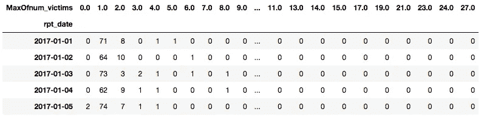
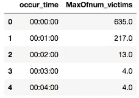
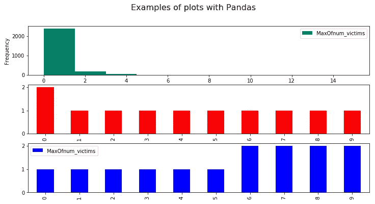

# 任何数据科学家都必须知道的 Pandas 库中的 8 个函数

> 原文：<https://towardsdatascience.com/8-functions-from-the-pandas-library-that-any-data-scientist-must-know-17f6d33521a?source=collection_archive---------50----------------------->

杰瑞米·C 在 [Unsplash](https://unsplash.com?utm_source=medium&utm_medium=referral) 上的照片

## 如果你是通过“数据科学家荣耀之路”开始你的旅程，也许在你的旅程中会出现一些问题。为了帮助你，我创建了这个指南，展示了这个小而闪亮的库的所有关键方面。

# 开始之前

你需要使用的任何工具都有一些核心概念，在使用之前必须了解，熊猫也不例外。[熊猫](https://pandas.pydata.org)开发者将该库描述为*“一个快速、强大、灵活且易于使用的开源数据分析和操作工具”*。

简而言之，我们可以说 Pandas 是一个库，我们总是需要它来阅读和理解我们的结构化数据。我所说的结构化指的是任何表格数据，比如 excel 文件等等。如果您没有收到这些术语，不用担心，它们对本指南并不重要。

> 我希望你不要忘记的事情更简单:熊猫读取数据并将其转换为一堆系列，将**系列**想象为“单列多行”。这些“串系列”在熊猫内部被称为**数据帧**。

# 关于我们的数据集

我将使用我过去工作过的数据集。我们的数据内容是关于佐治亚州亚特兰大市的犯罪。点击这里你可以获得原始版本和更多信息。

好了，我们终于能够开始做一些问题，并用代码回答它们了。我们开始吧！

## 1)如何读取数据文件？

这里你需要回答的第一个问题是:*“我的数据有什么格式？”*。答案会指引你的下一步。默认情况下，我们使用。csv(逗号分隔值),但您可以使用任何类型。

上面没找到你的格式？[点击此处](https://pandas.pydata.org/docs/reference/io.html)，您可以找到正确的代码来加载您的数据。

## 2)如何在我的数据框架内导航？

我所说的“导航”是指毫无问题地在数据集间穿行。默认情况下，我们可以只使用我们的列名来验证我们在特定列中的条目，但是使用 Python 的 slice 还有更高级的方法。

下面你可以验证一些核心导航方式的区别。

## 如何过滤我的数据框？

这么说吧，你需要数一数有多少数值高于 10，100，1000！啊，我想你明白了…你能做什么？例如，如何获取目标值不低于 100 的所有空单元格。让我们把它编码。

## 4)如何验证缺失数据？

在数据清理阶段，验证数据集是否有空值非常重要，并据此决定如何处理。不幸的是，丢失的值不仅仅是 NaN 条目，还可能是-1、0 甚至是“丢失”的字符串。我将在这里留下一堆解决这个问题的方法。

## 5)如何验证我的数据帧类型？以及如何修改？

默认情况下，上面描述的 info()方法可以完成这项工作，但是还有其他方法可以处理。这需要在数据清理/争论期间完成！如果您使用不正确的 dtypes 导出处理过的数据集，您以后需要小心(浪费时间)。这是非常简单的一步，但是非常重要。

## 6)我需要修改每个条目的值，该怎么办？

通常我们会在数据争论阶段这样做，例如，当您需要基于度量标准的一些问题来修改实际的数据时。有很多方法可以做到这一点，你可以在下面查看。

# 附加信息

即使有那么多信息，我知道这永远不够。所以我也会回答其他人的问题。把喜欢当成一种奖励。

# 如何使用 crosstab 和 groupby？

在探索性数据分析阶段，两者都是很好的工具。不用写很长的代码，你可以提取真正重要的东西，然后用一段时间。非常有趣的方法！

## **交叉表**

第一个是 crosstab，它实际上将两个系列“交叉”并返回一个对象。例如，你可以用这个结果为你的客户策划一些真正重要的信息。

使用熊猫的交叉表示例

## 分组依据

groupby 将基于一个或一小组列对整个数据集进行分组。结果不是将它们交叉，而是该列后跟所有其他列的值，这些值与分组后的值相匹配。用图像更容易理解。

以熊猫为例分组

## 我需要将这些信息可视化，有办法吗？

啊，我真的很喜欢这个！你想看什么就画什么！Pandas 有一个名为 plot 的内置函数，它使用 Matplotlib(一个绘图库)。作为回应，它可以用一种非常简单的方法为您完成这项工作！让我展示一下。

# 就是这样，伙计们！

希望你喜欢这个内容，并能熟练运用你的新知识！如果你想每天都学到有趣的东西，我很乐意成为你在 Medium 的老师！

你也可以查看我的 Github 个人资料。我从事一些数据科学项目已经有一段时间了。所有的关键概念都可以学习和重用！

 [## 雷南·洛里科

### 在 GitHub 上注册你自己的个人资料，这是托管代码、管理项目和构建软件的最佳地方…

github.com](https://github.com/renfelo)