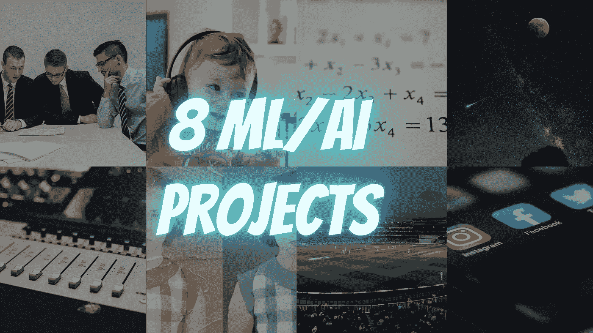

# 8 ML/AI 项目，让您的投资组合脱颖而出

> 原文：<https://towardsdatascience.com/8-ml-ai-projects-to-make-your-portfolio-stand-out-bfc5be94e063?source=collection_archive---------0----------------------->

## 有趣的项目想法与源代码和参考文章，也附上一些研究论文。



来源 [Unsplash](https://unsplash.com/?utm_source=unsplash&utm_medium=referral&utm_content=creditCopyText) ，由作者编辑

你对进入数据科学世界感到兴奋吗？
祝贺你！这仍然是正确的选择，因为在这个疫情期间，数据科学和人工智能领域的工作需求将得到最终推动。

虽然，由于危机，市场现在变得更难像以前一样用更多的劳动力重新建立起来。所以，你可能要为长期的招聘之旅和许多拒绝做好心理准备。

因此，在写这篇文章时，我假设你已经知道数据科学投资组合是至关重要的，以及如何建立它。
你可能会把大部分时间花在处理数据和争论上，而不是应用花哨的模型。

数据科学爱好者不断向我提出的一个问题是，他们应该在自己的投资组合中包含什么样的项目，以构建一个非常好且独特的投资组合。

下面，我为您的数据科学产品组合提供了 8 个独特的想法，并附上了参考文章，您可以从这些文章中深入了解如何开始任何特定的想法。

# 1.基于社交媒体帖子的抑郁症情感分析


照片由 [dole777](https://unsplash.com/@dole777?utm_source=unsplash&utm_medium=referral&utm_content=creditCopyText) 在 [Unsplash](https://unsplash.com/?utm_source=unsplash&utm_medium=referral&utm_content=creditCopyText) 上拍摄

这是一个非常敏感的话题，急需解决。全世界有超过 2.64 亿人患有抑郁症。**抑郁症**是全球范围内导致残疾**的主要原因**，也是全球疾病总负担的重要支持者，每年有近 80 万人因自杀而死亡。自杀是 15-29 岁人群死亡的第二大原因。抑郁症的治疗经常被延迟、不精确和/或完全错过。

基于互联网的生活给了主要优势改变早期忧郁调解服务的机会，特别是在年轻的成年人。一直以来，Twitter 上大约有 6000 条推文，这相当于每时每刻发送超过 35 万条推文，每天有 5 亿条推文，每年约有 2000 亿条推文。

皮尤研究中心指出，72%的公众使用某种基于互联网的生活。从社交网络发布的数据集对许多领域都很重要，例如，人类科学和大脑研究。但是从专业的角度来看，这种支持还远远不够，而且显式的方法也很不走运。

通过分析社交媒体帖子中的语言标记，有可能创建一个深度学习模型，该模型可以比传统方法更早地洞察个人的心理健康。

[](/you-are-what-you-tweet-7e23fb84f4ed) [## 你在推特上说什么就是什么

### 通过 Twitter 使用检测社交媒体中的抑郁症

towardsdatascience.com](/you-are-what-you-tweet-7e23fb84f4ed) [](https://www.jmir.org/2019/6/e12554/) [## 抑郁症的早期检测:社会网络分析和随机森林技术

### 原始论文 1 西班牙 A . Coruna 大学计算机科学学院计算机科学系 2…

www.jmir.org](https://www.jmir.org/2019/6/e12554/) [](https://www.ncbi.nlm.nih.gov/pmc/articles/PMC6111060/) [## 使用机器学习技术从社交网络数据中检测抑郁症

### 关键词:社交网络、情绪、抑郁、情绪分析

www.ncbi.nlm.nih.gov](https://www.ncbi.nlm.nih.gov/pmc/articles/PMC6111060/) 

# 2.基于神经网络的体育比赛视频文本摘要


照片由[阿克什·亚达夫](https://unsplash.com/@aksh1802?utm_source=unsplash&utm_medium=referral&utm_content=creditCopyText)在 [Unsplash](https://unsplash.com/?utm_source=unsplash&utm_medium=referral&utm_content=creditCopyText) 上拍摄

所以这个项目的想法基本上是基于从体育比赛视频中获得精确的摘要。有体育网站会告诉你比赛的精彩部分。已经提出了各种模型来完成提取文本摘要的任务，但是神经网络做得最好。一般来说，摘要是指在一个简短的结构中介绍信息，集中在传达事实和信息的部分，同时保护其重要性。

自动创建游戏视频的轮廓带来了区分游戏的精彩部分的挑战。

因此，可以使用一些深度学习技术来实现这一点，如 3D-CNN(三维卷积网络)、RNN(递归神经网络)、[、LSTM(长短期记忆网络)](/illustrated-guide-to-lstms-and-gru-s-a-step-by-step-explanation-44e9eb85bf21)，也可以通过机器学习算法来实现，将视频分成不同的部分，然后应用 SVM(支持向量机)、神经网络(神经网络)、k-means 算法。

为了更好地理解，请详细参考所附文章。

[](https://www.mdpi.com/1424-8220/20/6/1702/htm) [## 基于迁移学习的体育视频摘要场景分类

### 本文针对体育视频场景分类的特殊目的，提出了一种新的分类方法

www.mdpi.com](https://www.mdpi.com/1424-8220/20/6/1702/htm) 

# 3.使用 CNN 的手写方程求解器


安托万·道特里在 [Unsplash](https://unsplash.com/?utm_source=unsplash&utm_medium=referral&utm_content=creditCopyText) 上拍摄的照片

其中，手写数学表达式的识别是计算机视觉研究领域中令人困惑的问题之一。您可以使用[卷积神经网络(CNN)](/a-comprehensive-guide-to-convolutional-neural-networks-the-eli5-way-3bd2b1164a53) 和一些图像处理技术，通过手写数字和数学符号训练一个手写方程求解器。开发这样一个系统需要用数据训练我们的机器，使它们能够熟练地学习并做出所需的预测。

为了更好的理解，请参考下面的文章。

[](https://medium.com/@vipul.gupta73921/handwritten-equation-solver-using-convolutional-neural-network-a44acc0bd9f8) [## 使用卷积神经网络的手写方程求解器

### 介绍

medium.com](https://medium.com/@vipul.gupta73921/handwritten-equation-solver-using-convolutional-neural-network-a44acc0bd9f8) [](https://github.com/vipul79321/Handwritten-Equation-Solver) [## vipul 79321/手写方程求解器

### 一个使用 CNN 方程的手写方程解算器可以包含从 0-9 的任何数字和符号+，x，-在图像上用…

github.com](https://github.com/vipul79321/Handwritten-Equation-Solver) [](/computer-vision-auto-grading-handwritten-mathematical-answersheets-8974744f72dd) [## 计算机视觉—手写数学答题卡的自动评分

### 将徒手写在纸上的解数学方程的步骤数字化，验证步骤并最终…

towardsdatascience.com](/computer-vision-auto-grading-handwritten-mathematical-answersheets-8974744f72dd) [](https://opensourc.es/blog/he2latex/) [## LaTeX 的手写方程式

### 这篇文章还是关于机器学习，而不是关于优化，但我想提一些事情…

开放源代码](https://opensourc.es/blog/he2latex/) 

# 4.使用 NLP 生成商务会议摘要


塞巴斯蒂安·赫尔曼在 [Unsplash](https://unsplash.com/s/photos/business-meeting?utm_source=unsplash&utm_medium=referral&utm_content=creditCopyText) 上的照片

有没有遇到过这样的情况，每个人都想看到一个摘要而不是完整的报告。我在学校和大学的时候就面临这个问题，我们花了很多时间准备一份完整的报告，但是老师只有时间看摘要。

摘要已经成为解决数据过载问题的一种不可避免的有用方法。从对话中提取信息具有很好的商业和教育价值。这可以通过对对话的对话结构的统计、语言和情感方面的特征捕捉来完成。

手动把报表改成汇总的形式太费时间了，是不是？但是人们可以依靠自然语言处理技术来实现这一点。

使用深度学习的文本摘要可以理解整个文本的上下文。对于我们所有需要快速总结文档的人来说，这难道不是梦想成真吗！！

为了更好的理解，请参考下面的文章。

[](https://www.analyticsvidhya.com/blog/2019/06/comprehensive-guide-text-summarization-using-deep-learning-python/) [## 使用 Python 深度学习的文本摘要综合指南

### “我不要完整的报告，只要给我结果的摘要”。我经常发现自己处于这种情况——两者都是…

www.analyticsvidhya.com](https://www.analyticsvidhya.com/blog/2019/06/comprehensive-guide-text-summarization-using-deep-learning-python/) [](/understand-text-summarization-and-create-your-own-summarizer-in-python-b26a9f09fc70) [## 理解文本摘要并在 python 中创建自己的摘要器

### 摘要可以被定义为一项任务，即产生一个简洁流畅的摘要，同时保留关键信息和…

towardsdatascience.com](/understand-text-summarization-and-create-your-own-summarizer-in-python-b26a9f09fc70) 

# 5.面部识别检测情绪，并相应地建议歌曲


照片由 [Unsplash](https://unsplash.com/@alireza_attari?utm_source=unsplash&utm_medium=referral&utm_content=creditCopyText) 上的 [Alireza Attari](https://unsplash.com/@alireza_attari?utm_source=unsplash&utm_medium=referral&utm_content=creditCopyText) 拍摄

人脸是一个人身体的重要组成部分，在了解一个人的精神状态方面尤其重要。这消除了将歌曲手动隔离或分组到各种记录中的沉闷和乏味的任务，并有助于基于个人的情感特征生成适当的播放列表。

人们倾向于根据他们的心情和兴趣来听音乐。人们可以创建一个应用程序，通过捕捉面部表情，根据用户的情绪为他们推荐歌曲。

计算机视觉是一个跨学科领域，有助于向计算机传达对数字图像或视频的高级理解。计算机视觉组件可以用于通过面部表情来确定用户的情绪。

我也发现了一些有趣和有用的 API，虽然我没有做这些，但是把它们附在这里，希望能对你有所帮助。

[](https://nordicapis.com/20-emotion-recognition-apis-that-will-leave-you-impressed-and-concerned/) [## 20 多种情感识别 API 会让您印象深刻，并引起您的关注|北欧 APIs |

### 如果企业可以一直使用技术来感知情感，他们就可以利用技术向消费者销售…

nordicapis.com](https://nordicapis.com/20-emotion-recognition-apis-that-will-leave-you-impressed-and-concerned/) 

# 6.从开普勒等航天器拍摄的图像中寻找可居住的系外行星


由[尼克·奥瓦尔](https://unsplash.com/@astro_nic25?utm_source=unsplash&utm_medium=referral&utm_content=creditCopyText)在 [Unsplash](https://unsplash.com/@astro_nic25?utm_source=unsplash&utm_medium=referral&utm_content=creditCopyText) 上拍摄的照片

在最近的十年里，超过 100 万颗恒星被监测以识别凌日行星。人工解释潜在的系外行星候选者是劳动密集型的，容易出现人为错误，其后果很难评估。卷积神经网络适合于在嘈杂的时间序列数据中识别类地系外行星，比最小二乘法策略具有更高的精度。

[](/exoplanet-hunting-using-machine-learning-d615958e1787) [## 使用机器学习搜寻系外行星

### 搜寻太阳系以外的世界。

towardsdatascience.com](/exoplanet-hunting-using-machine-learning-d615958e1787) [](https://www.nasa.gov/press-release/artificial-intelligence-nasa-data-used-to-discover-eighth-planet-circling-distant-star) [## 人工智能，美国宇航局用于发现系外行星的数据

### 随着最近发现了第八颗行星，我们的太阳系现在是围绕着一颗恒星的行星数量最多的系

www.nasa.gov](https://www.nasa.gov/press-release/artificial-intelligence-nasa-data-used-to-discover-eighth-planet-circling-distant-star) 

# 7.旧破损卷轴图片的图像再生


来源 [Pikist](https://www.pikist.com/free-photo-xttnz)

我知道，把你损坏的旧照片恢复成原来的样子是多么耗时和痛苦。因此，这可以通过找到所有图像缺陷(裂缝、磨损、孔洞)使用深度学习来完成，并使用修复算法，人们可以根据周围的像素值轻松发现缺陷，以恢复和着色旧照片。

[](https://blog.floydhub.com/colorizing-and-restoring-old-images-with-deep-learning/) [## 利用深度学习对旧图像进行着色和恢复

### 利用深度学习对黑白图像进行着色已经成为现实世界应用的一个令人印象深刻的展示…

blog.floydhub.com](https://blog.floydhub.com/colorizing-and-restoring-old-images-with-deep-learning/) [](https://heartbeat.fritz.ai/guide-to-image-inpainting-using-machine-learning-to-edit-and-correct-defects-in-photos-3c1b0e13bbd0) [## 图像修复指南:使用机器学习来编辑和纠正照片中的缺陷

### 我们快照中的错误

heartbeat.fritz.ai](https://heartbeat.fritz.ai/guide-to-image-inpainting-using-machine-learning-to-edit-and-correct-defects-in-photos-3c1b0e13bbd0) [](/how-to-perform-image-restoration-absolutely-dataset-free-d08da1a1e96d) [## 如何在完全无数据集的情况下执行图像恢复

### 深度学习需要大量的数据。这个短语在那些考虑使用深层…

towardsdatascience.com](/how-to-perform-image-restoration-absolutely-dataset-free-d08da1a1e96d) 

# 8.使用深度学习的音乐生成


由[阿比盖尔·基南](https://unsplash.com/@akeenster?utm_source=unsplash&utm_medium=referral&utm_content=creditCopyText)在 [Unsplash](https://unsplash.com/@akeenster?utm_source=unsplash&utm_medium=referral&utm_content=creditCopyText) 上拍摄的照片

音乐是各种不同频率音调的组合。因此，自动音乐生成是一个在最少人工干预的情况下创作一小段音乐的过程。最近，深度学习工程已经成为编程音乐生成的前沿。

[](https://medium.com/analytics-vidhya/music-generation-using-deep-learning-a2b2848ab177) [## 使用深度学习的音乐生成

### “如果我能再活一次，我会定下一个规矩，至少读一些诗，听一些音乐……

medium.com](https://medium.com/analytics-vidhya/music-generation-using-deep-learning-a2b2848ab177) [](/how-to-generate-music-using-a-lstm-neural-network-in-keras-68786834d4c5) [## 如何在 Keras 中使用 LSTM 神经网络生成音乐

### 使用 LSTM 神经网络创作音乐的介绍

towardsdatascience.com](/how-to-generate-music-using-a-lstm-neural-network-in-keras-68786834d4c5) 

## 一锤定音

我知道建立一个很酷的数据科学投资组合是一件非常困难的事情。但是有了我上面提供的这些，你可以在那个领域取得高于平均水平的进步。该系列是新的，这也为研究目的提供了机会。因此，数据科学的研究人员也可以选择这些想法来工作，这样他们的研究将对数据科学家开始这个项目有很大的帮助。此外，探索以前没有人做过的事情真的很有趣。虽然，这个系列实际上是由从初级到高级的想法组成的。

因此，我不仅会向数据科学领域的新手推荐这个，也会向资深数据科学家推荐。这将在你的职业生涯中开辟许多新的道路，不仅是因为项目，也是通过新获得的网络。

这些想法向你展示了广泛的可能性，并给你跳出框框思考的想法。

话虽如此，但有一个非常有趣的发现会帮助你组织你的深度学习项目。在这里，您甚至可以跟踪您的模型，评估它们的性能，以及部署它们。

对我和我的朋友来说，学习因素、为社会增加价值和未开发的知识是重要的，某种程度上的乐趣是必不可少的。所以，基本上，我喜欢做这样的项目，它给我们一种获得大量知识的方式，让我们探索未被探索的维度。这是我们致力于此类项目时的主要关注点。

我希望你们会发现这篇文章对你们有益。请在评论框中分享你对这些项目想法的想法&如果你有 any✌️，请让我知道其他很酷的想法

所以，如果我的博客帖子对你有所帮助，而你此刻觉得很慷慨，请不要犹豫，请给我买杯咖啡。☕😍

[](https://www.buymeacoffee.com/techykajal)

是的，点击我。

```
And yes, buying me a coffee **(and lots of it if you are feeling extra generous)** goes a long way in ensuring that I keep producing content every day in the years to come.
```

您可以通过以下方式联系我:

1.  订阅我的 [**YouTube 频道**](https://www.youtube.com/channel/UCdwAaZMWiRmvIBIT96ApVjw) 视频内容即将上线 [**这里**](https://www.youtube.com/channel/UCdwAaZMWiRmvIBIT96ApVjw)
2.  跟着我上 [**中**](https://medium.com/@TechyKajal)
3.  通过 [**LinkedIn**](http://www.linkedin.com/in/techykajal) 联系我
4.  跟随我的博客之旅:-[**https://kajalyadav.com/**](https://kajalyadav.com/)
5.  成为会员:-[](https://techykajal.medium.com/membership)

**也可以看看我的其他博客:**

**[](https://medium.com/datadriveninvestor/predicting-us-presidential-election-using-twitter-sentiment-analysis-with-python-8affe9e9b8f) [## 基于 Python 的推特情感分析预测美国总统大选

### 修订数据科学基础的有趣项目，从数据集创建到数据分析再到数据可视化

medium.com](https://medium.com/datadriveninvestor/predicting-us-presidential-election-using-twitter-sentiment-analysis-with-python-8affe9e9b8f) [](/scraping-1000s-of-news-articles-using-10-simple-steps-d57636a49755) [## 用 10 个简单的步骤搜集 1000 篇新闻文章

### 如果你遵循这 10 个简单的步骤，使用 python 进行网络抓取是非常简单的。

towardsdatascience.com](/scraping-1000s-of-news-articles-using-10-simple-steps-d57636a49755)**