# Python 中复制的 8 个流行的 SQL 窗口函数

> 原文：<https://towardsdatascience.com/8-popular-sql-window-functions-replicated-in-python-e17e6b34d5d7?source=collection_archive---------7----------------------->

## [编程](https://towardsdatascience.com/tagged/programming) | [面试](https://towardsdatascience.com/tagged/interviewing) | [办公时间](https://towardsdatascience.com/tagged/office-hours)

## 关于如何在业务分析中利用 Pandas 高效复制最常用的 SQL 窗口函数的教程。


[un splash:David Backer 的紫色建筑仰视图](https://unsplash.com/photos/dMeEJRE18VI)

*更新:你们中的许多人联系我，要求在从 SQL* *过渡的同时，为数据科学或数据分析学习 Python 提供有价值的资源* ***。* *下面我分享 4 个我强烈推荐坚持学习的课程/平台:***

*   [***SQL & Python 高级编码问题(StrataScratch)***](https://stratascratch.com/?via=antonello)***→****目前为止我找到的准备 SQL 编码面试的最好平台！比 LeetCode 便宜多了。*
*   [***用 Python 进行数据科学编程***](https://imp.i115008.net/2rrmW7) →非常高质量的内容。
*   [***用 Python 操纵数据:一只熊猫速成班***](https://click.linksynergy.com/deeplink?id=533LxfDBSaM&mid=39197&murl=https%3A%2F%2Fwww.udemy.com%2Fcourse%2Fdata-manipulation-in-python%2F)
*   [***SQL 汇总统计&窗口功能***](https://datacamp.pxf.io/a1ezzR)

希望你也会发现它们有用！现在享受这篇文章:D 这个职位包括附属链接，我可能会赚一小笔佣金，没有额外的费用给你，你应该购买。

任何致力于构建公司 KPI 或创建分析业务绩效的报告的数据分析师都知道 **SQL 窗口函数**是一个强大的工具。使用它们的真正优势是可以在不同的时间范围内计算许多指标，而不会影响原始数据集的粒度。这反过来意味着不需要使用多个自连接或 cte 就可以实现更多功能，从而节省大量代码。

如果到目前为止，您主要使用 SQL 来构建指标和提取见解，并且正在学习 Python，那么您可能想知道如何在 Pandas 中复制您喜爱的窗口函数。在接下来的教程中，我将展示如何利用 Python 中的窗口函数使代码更加紧凑和高效。

# 数据集 1

在教程的第一部分，我们将使用一个模拟的**客户订单**数据集，可以通过 [GitHub](https://github.com/anbento0490/code_tutorials/blob/master/8%20Python%20Window%20Functions/customer_orders.csv) 下载。数据集最初包括七列(*订单日期、订单 ID、客户 ID、商品 ID、商品价格、数量*和*已付金额()*)，但是我们还将添加*订单月份*，如下所示:

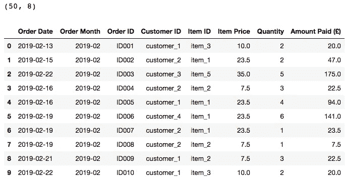

我们发现数据集包括 50 个不同的订单 id 和 8 列，但是如果我们想进一步研究它，我们可以通过运行以下命令来分析订单的分布和客户支付的金额:

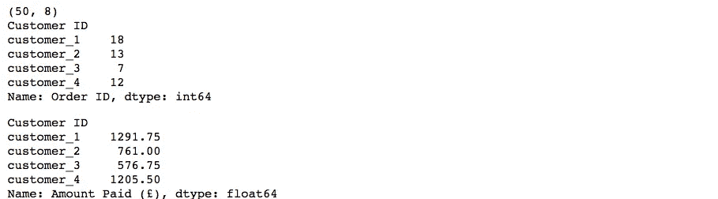

我们可以看到，总共有四个客户，其中 *customer_1* 是完成订单最多( *18* )和消费金额最高( *1291.75* )的客户。请注意如何在 Python 中使用 **DataFrame.groupby()** 方法来实现与我们在 SQL 中通过查询末尾的列进行分组相同的结果。但是还有更多，因为这个方法也被用来复制典型的窗口函数的 **over(partition by…)** 子句，我们将在下面学习。

[](/6-sql-window-functions-coding-problems-on-ranking-interview-countdown-p1-9be0ccf66453) [## 排名上的 6 个 SQL 窗口函数编码问题——采访倒计时 P1

### SQL 面试即将来临，您正在寻找一些具有挑战性的练习来测试您的准备情况？你是…

towardsdatascience.com](/6-sql-window-functions-coding-problems-on-ranking-interview-countdown-p1-9be0ccf66453) 

# **Python 中的窗口函数**

1.  **行号()→ Rank(method='first')**

SQL**[**Row Number()**函数](https://www.sqlservertutorial.net/sql-server-window-functions/sql-server-row_number-function/)，为数据集分区内的每一行分配一个连续整数。它通常用于创建一个辅助列，根据指定的分区和顺序对字段进行排序。然后，该列可用于更有效地筛选或联接数据集。**

**假设我们希望根据订单日期按客户对订单进行排序，从最近的订单开始。为了在 SQL 中实现这一结果，我们可以编写:**

```
**row number() over(partition by customer_id order by order_date)**
```

**对于熊猫，同样的结果可以通过应用 [**来实现。rank(method = ' first ')**](https://pandas.pydata.org/pandas-docs/stable/reference/api/pandas.DataFrame.rank.html)**函数对按订单日期筛选的 GroupBy 对象执行操作，以创建*行号*列:****

****我们可以验证 *customer_1* 确实完成了 18 个订单，其中第一个订单发生在 2019–02–13(**row num = 1**)，最后一个订单发生在 2020–04–25(**row num = 18**)。因为我们是按客户 ID 进行划分和排序的，一旦所有 18 个订单都被排序，该函数将开始对 *customer_2* 的订单进行排序:****

****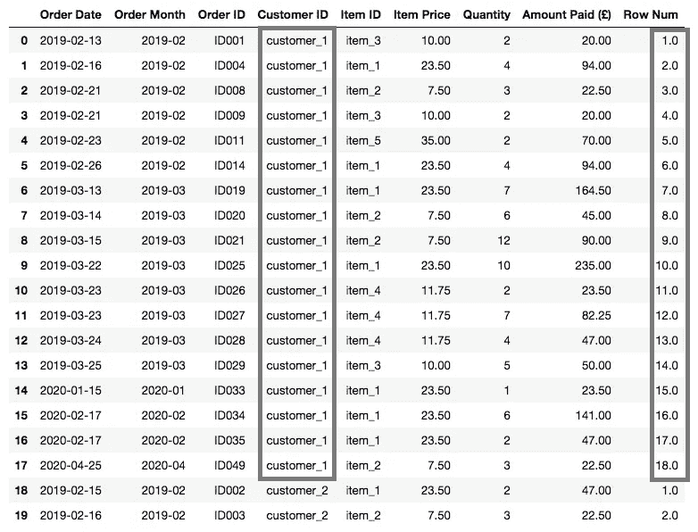****

******问题 1: *如果我们想按降序(从最近到最早的顺序)分配行号会怎样？*******

****这很简单，因为尽管代码中没有显示，pandas **rank(method = …)** 函数有一个 ***升序*** 参数，默认设置为 **true** 。通过将其设置为**假**，我们将颠倒等级的分配方式:****

```
****orders.groupby([‘Customer ID’])[‘Order Date’].rank(method=’first’, ascending = False)****
```

******问题 2: *如果我们想按多列(如客户 ID 和订单月份)进行分区，该怎么办？*******

****在这种情况下，我们只需要将首选字段添加到 GroupBy 对象中:****

```
****#SQL Syntax
row number() over(partition by customer_id, order_month order by order_date)****#Python Syntax
orders.groupby([‘Customer ID’, 'Order Month'])[‘Order Date’].rank(method=’first')****
```

******#2。Rank() → Rank(method='min')******

****SQL [**RANK()** 函数](https://www.sqlservertutorial.net/sql-server-window-functions/sql-server-rank-function/)，为结果集分区内的每一行分配一个等级。与 **ROW NUMBER()不同，**等级不是连续的，这意味着一个分区内共享相同值的行将获得相同的等级。使用与上面相同的示例，SQL 语法将是:****

```
****rank() over(partition by customer_id order by order_date)****
```

****而它在 Python 中的对应物是:****

****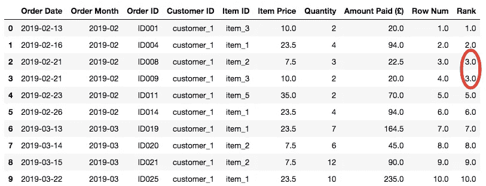****

****因为 *customer_1* 在 2019–02–21 执行了两个订单，这两个订单都被分配了 rank = 3，下面的订单被分配了 rank = 5，那么完全跳过 rank = 4。如果我们必须使用 SQL rank()窗口函数，这正是我们将得到的排名类型。****

******#3。dense _ Rank()→Rank(method = ' dense ')******

****如果我们想避免排名值的差距，我们应该使用 SQL **dense_rank()** 函数。实际上，与 **rank()** 函数不同，使用 **dense_rank()** 会返回连续的等级值。在我们的例子中，SQL 语法应该是:****

```
****dense_rank() over(partition by customer_id order by order_date)****
```

****而在 Python 中，我们只需要在 **rank()** 函数 **:** 中将 **method='min'** 替换为 **method='dense'******

****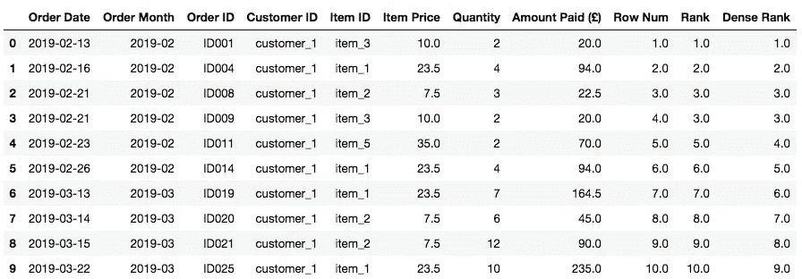****

****不出所料， *customer_1* 于 2019_02_23 执行的订单现在已被分配 **rank = 4** ，，尽管它是客户在分析期间的第 5 个订单。****

****总结一下我们到目前为止所学的内容:尽管在 SQL 中有 3 个不同的函数来计算数字数据的等级，但在 pandas 中，我们只需要使用 **rank()** 函数和方法(***‘first’，【min’***或 ***，【dense’***)以及升序( ***True*** 或 ***False*** )参数来获得想要的结果****

******#4。Sum(…) over(partition by … order by..前面无界的行)→ cumsum()******

****我们现在希望计算每个月每个客户支付金额的*累计金额，按订单日期排序。这种计算也被称为 ***运行总数*** ，它可能是商业分析中最常用的指标之一。在 SQL 中实现这一点的一种方法是:*****

```
*****sum(amount_paid) over(partition by customer_id, order_month order by order_date rows unbounded preceding)*****
```

*****上面的语法并不是最有效和最直观的:有相当多的代码要写，如果我们希望按 **order_date** 排序，我们还必须包括 **rows…** 子句来计算所选窗口中的累积和而不是总和。*****

*****这是 Python 因其简洁而大放异彩的情况之一，为了达到与上面相同的结果，我们只需要编写:*****

*****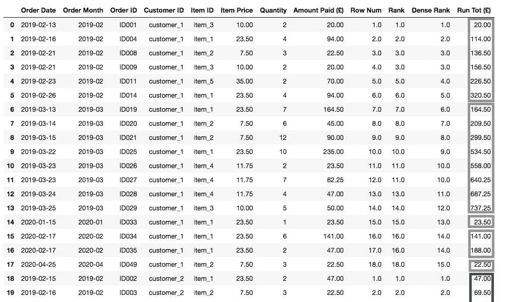*****

*****正如预期的那样， **Run Tot ( )** 列显示每个客户在一个月内支付的**金额()**的累进总和，该行对应于该月内的最后一个订单，最终显示该客户在该月的总消费金额。*****

*******#5。avg(…)over(partition by…)→transform(NP . mean)*******

*****以类似的方式，我们可能还希望计算每个客户每月花费的平均金额。这一次，SQL 语法非常直观:*****

```
*****avg(amount_paid) over(partition by customer_id, order_month)*****
```

*****然而，详细阐述 Python 解决方案是值得的:*****

*****我们之所以使用 pandas[**data frame . transform()**](https://pandas.pydata.org/pandas-docs/stable/reference/api/pandas.DataFrame.transform.html)函数，是因为它允许我们在 GroupBy 对象上计算均值后，保持序列的长度等于原始数据集的长度。这种方法让我们得到了想要的结果:*****

**********

## *****数据集 2*****

*****在本教程的第二部分，我们将使用 **yfinance** 包从雅虎财经获取 **AAPL** 和 **AMZN** 股票调整收盘价。我们应该已经在一开始就导入了它，但是如果不是这样，我们现在可以通过运行以下命令来完成:*****

```
*****!pip install yfinance # <-- to install the package
import yfinance as yf****aapl = yf.download(“AAPL”, start=”2020–04–20", end=”2020–04–30").resample(‘D’).ffill()****amzn = yf.download(“AMZN”, start=”2020–04–20", end=”2020–04–30").resample(‘D’).ffill()*****
```

*****使用上面的代码，我们还使用 **yf.download()** 方法为*2020–04–20*到*2020–04–30*期间创建了两个新数据集( **aapl** 和 **amzn** )。为了将周末和节假日包括在内，数据被重新采样，缺失的股票价格被替换为之前最近的调整收盘价格观察值。对数据集进行了额外的操作([GitHub](https://github.com/anbento0490/code_tutorials/blob/master/8%20Python%20Window%20Functions/Python%20-%20Window%20Functions%20.ipynb)中提供了全部代码)，这些数据集最终被合并到**股票**数据框架中:*****

*****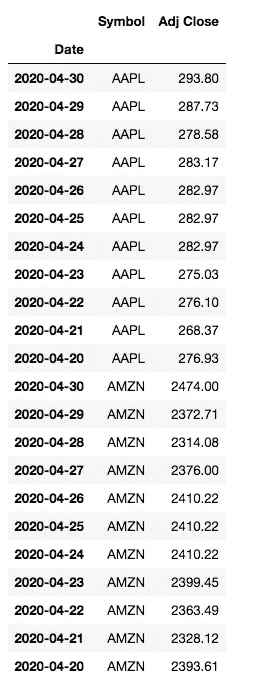*****

*******#6 超前/滞后(返回值，偏移)→移位(n)*******

*****使用**股票**数据集，我们现在希望计算 **DoD** 和**WoW adj . Close Price % Change**并通过保持数据帧长度不变来做到这一点，我们需要一个函数来访问当前行之前特定物理偏移量处的行。在 SQL 中，该窗口函数被命名为 [**lag()**](https://www.sqlservertutorial.net/sql-server-window-functions/sql-server-lag-function/) ，在我们的示例中，其语法如下:*****

```
***#Retrieves the stock price located 1 row back from the current row
**lag(adj_close, 1) over(partition by symbol order by date)**#Retrieves the stock price located 7 rows back from the current row
**lag(adj_close, 7) over(partition by symbol order by date)*****
```

*******重要提示:***因为我们已经对其进行了重新采样，我们的数据集现在有了每日粒度，* *这意味着要获得昨天的股票价格，我们只需向后移动一行，而要获得上周同一天记录的股票价格，我们只需向后移动 7 行。如果我们把周末和假期排除在外，这些计算就不会这么简单了。******

*****在 Python 中，我们可以通过对 GroupBy 对象(按 ***符号*** 分组，并按 ***Adj. Close*** 过滤)应用 [**shift()**](https://pandas.pydata.org/pandas-docs/stable/reference/api/pandas.DataFrame.shift.html) 函数来创建 ***Lag1*** 和 ***Lag7*** 列，从而获得相同的结果。注意，因为我们希望分别向后移动 1 行和 7 行(我们的数据集有一个*降序*),**shift()**函数将一个*负整数* 作为参数:*****

*****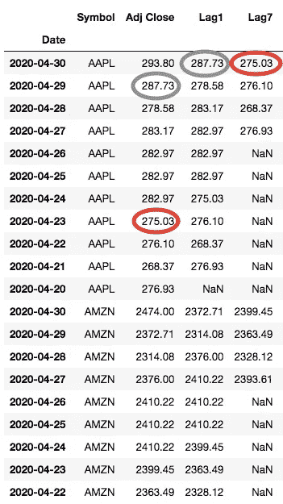*****

*****我们可以看到， **shift( *n* )** 函数已经正确地应用于每只股票，因此在第一个观察日期(*2020–04–20*)，在没有先前价格的情况下，显示 NaN 值。同样，Lag7 列中显示的第一个有效值出现在第一个观察日期(*2020–04–27*)之后 7 天。*****

*****到目前为止，我们只是设法检索滞后的股票价格，而不是计算百分比变化。为了做到这一点，我们可以应用公式:*****

```
*****[(Adj Close / Lag1) - 1] x 100 <-- DoD % Change****[(Adj Close / Lag7) -1] x 100 <-- WoW % Change*****
```

*****或者使用[**pct _ change(*n*)**](https://pandas.pydata.org/pandas-docs/stable/reference/api/pandas.DataFrame.pct_change.html)函数来计算变动的股票价格，并返回它们的变化百分比:*****

*****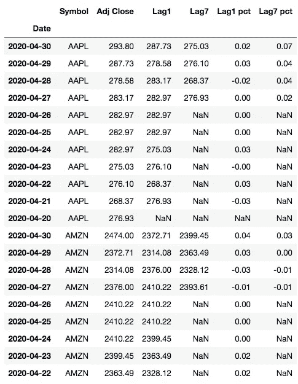*****

*****为了简洁起见，在本教程中我们不会展示一个使用 [**lead()**](https://www.sqlservertutorial.net/sql-server-window-functions/sql-server-lead-function/) 函数的等价示例，但是很容易猜到唯一真正的变化是分配给 **shift()** 和 **pct_change()** 函数的整数的符号。请记住，数据集的排序方式会影响应该传递给函数以获得预期结果的符号。*****

*******#7。第一个/最后一个值()→ rank(method ='first '，ascending = True/False) == 1*******

*****[**first value()**](https://www.sqlservertutorial.net/sql-server-window-functions/sql-server-first_value-function/)**和[**last value()**](https://www.sqlservertutorial.net/sql-server-window-functions/sql-server-last_value-function/)**窗口函数用于在数据集的有序分区中检索第一行或最后一行的值。让我们假设我们想要找到**AAPL 股票每月第一个和最后一个可获得的可调收盘价**。我们将使用的修改后的 **aapl** 数据集的前 10 行如下所示:*********

*****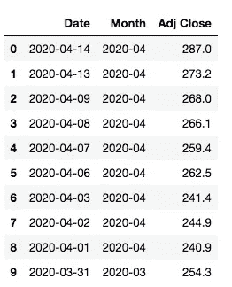*****

*****访问我的 [GitHub 账户](https://github.com/anbento0490/code_tutorials/blob/master/8%20Python%20Window%20Functions/Python%20-%20Window%20Functions%20.ipynb)获取完整代码*****

*****我们处理 SQL 查询的方式是:*****

```
*******#The aapl dataset includes prices for one stock only, therefore the #partition is just applied on order_month****first value(adj_close) over(partition by order_month order by date)****last value(adj_close) over(partition by order_month order by date)*******
```

*****在 Python 中，并不存在与 **first/last value()** 完全相同的函数，但是可以通过使用 Pandas**rank(method = ' first ')**函数对分区中的值进行排序，然后只返回 rank = 1 的值，从而获得类似的结果。根据我们如何在 rank()函数中设置**升序**参数，rank = 1 的值将与分区中的第一个或最后一个值匹配。*****

*****尽管不是特别有挑战性，但这个过程还是有点麻烦，因为我们最终需要回填或前填整个分区的第一个或最后一个值，以获得想要的结果:*****

*****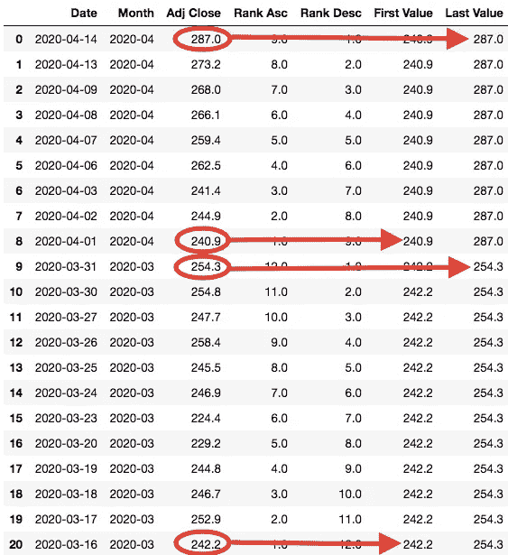*****

*****在*2020–03–16*至*2020–04–14*期间有效，三月份 AAPL 的第一个(或最近的)可用调整收盘价为 242.2 美元(*排名 Asc = 1* )，最后一个(或最近的)为 254.3 美元(*排名 Desc = 1* )。类似地，在 4 月，AAPL 的第一个可用的 Adj. Close 价格是 240.9 美元，最后一个是 287 美元。*****

*******#8。Avg(…) over(partition by … order by..前 n 行和当前行之间的行)→滚动(window = …)。平均值()*******

*****我们在本教程中要复制的最后一个窗口函数是一个**移动平均值**。移动平均线是更一般函数的特例:*****

```
*******avg(return_value) over()*******
```

*****至于在 SQL 中计算它，我们需要声明一个 **rows …** 子句(就像我们对运行总数所做的那样)。例如，如果我们想用 SQL ( *假设数据集按升序排列*)计算 AAPL 调整收盘价的 7 天移动平均值，我们应该写:*****

```
*******avg(adj_close) over(order by date rows between 6 preceding and current row)*******
```

*****在 **rows …** 子句中，我们简单地说明了我们希望在计算平均值时包括最近的观察值，因此我们只需要前面的 6 条记录就可以得到 7 天的窗口。对于更有经验的分析师来说，这些概念可能看起来微不足道，但是在新手中可能会引起混乱。*****

*****幸运的是，用熊猫计算移动平均数是一件真正令人愉快的事情，因为我们只需要创建一个**滚动对象**(指定所需的 ***窗口*** )，然后对其应用 ***mean()*** 函数。或者，我们也不妨计算一下 ***和*** ，这本身就是移动平均线的一个特例:*****

*****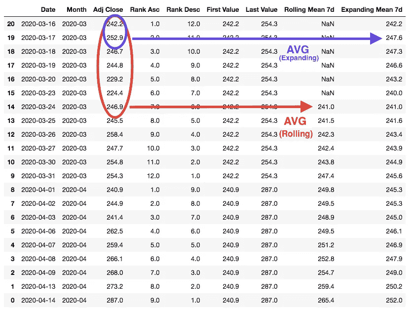*****

*****实际上，这两个指标的区别在于**当我们对滚动的对象应用函数时，窗口大小保持不变，而对于扩展的对象，窗口保持增长。**使用扩展窗口背后的逻辑是，随着每一天的过去，我们都会观察到一个新的价格，可以添加到我们的均值计算中。这是我们希望包含在计算指标中的新信息。*****

## *****结论*****

*****在这篇文章中，我们学习了如何使用 Pandas 在 Python 中复制 8 个流行的 SQL 窗口函数。如果您正在从事分析工作，那么您现在应该已经准备好使用 SQL 或 Python 来构建 KPI 以监控性能。在这两种语言中，当然有多种方法可以达到相同的效果，因此请在回复部分分享您的经验。希望你喜欢这篇教程，并期待下一篇！*****

## *****我的读者请注意*****

*****这个帖子包括附属链接，如果你购买的话，我可以免费给你一点佣金。*****

## *****您可能还喜欢:*****

*****[](https://levelup.gitconnected.com/15-git-commands-you-should-learn-before-your-very-first-project-f8eebb8dc6e9) [## 在你开始第一个项目之前，要掌握 15 个 Git 命令

### 您需要掌握的最后一个 Git 教程是命令行版本控制。

levelup.gitconnected.com](https://levelup.gitconnected.com/15-git-commands-you-should-learn-before-your-very-first-project-f8eebb8dc6e9) [](https://medium.com/@anbento4/connect-to-databases-using-python-and-hide-secret-keys-with-env-variables-a-brief-tutorial-4f68e33a6dc6) [## 使用 Python 连接到数据库时使用环境变量隐藏密钥:简要教程

### 环境变量可用于在连接到数据库时隐藏您的秘密细节。了解如何在这个快速…

medium.com](https://medium.com/@anbento4/connect-to-databases-using-python-and-hide-secret-keys-with-env-variables-a-brief-tutorial-4f68e33a6dc6)*****