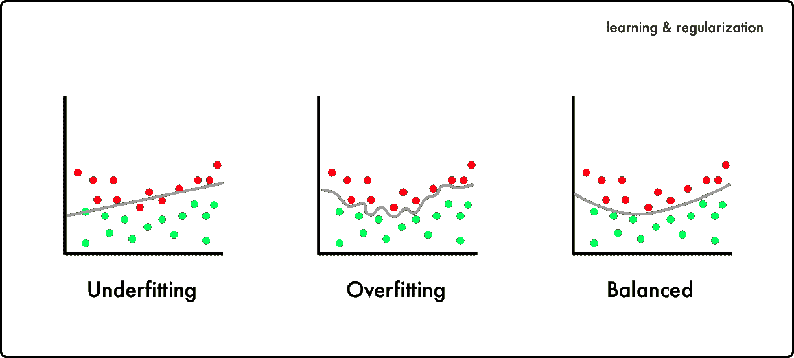
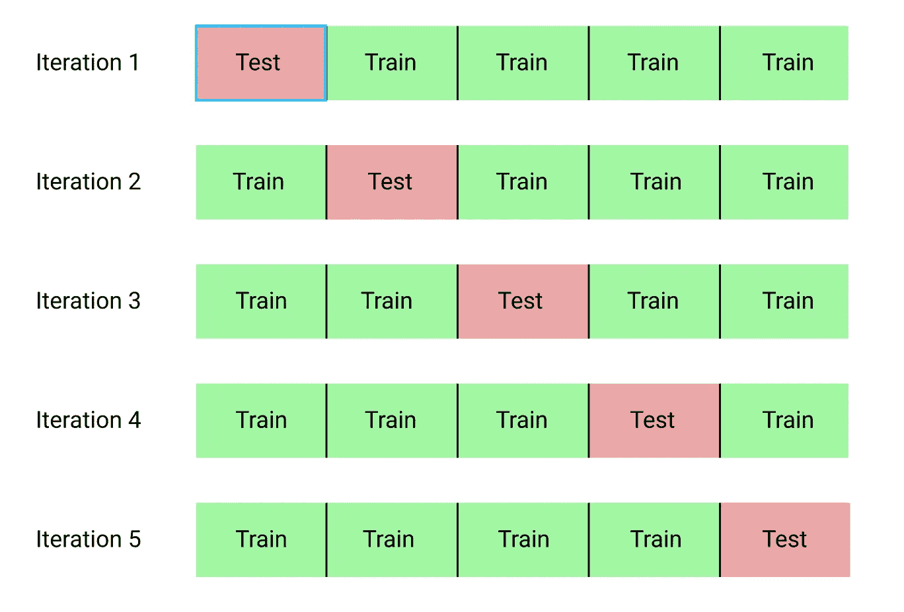
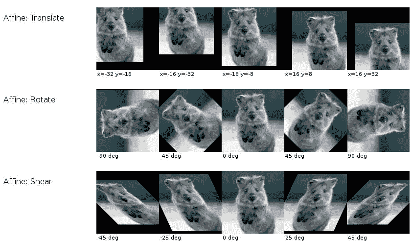
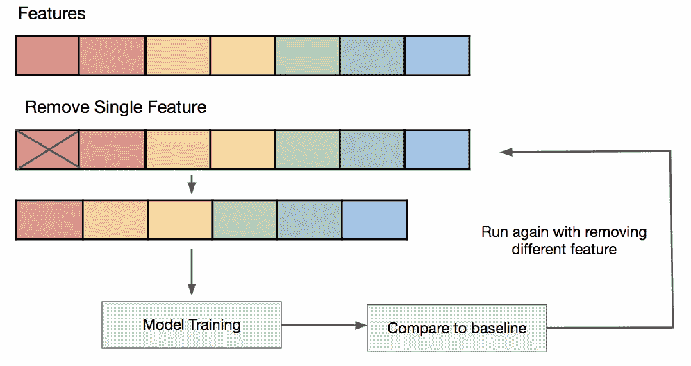
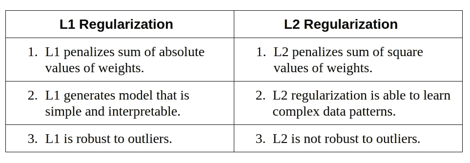
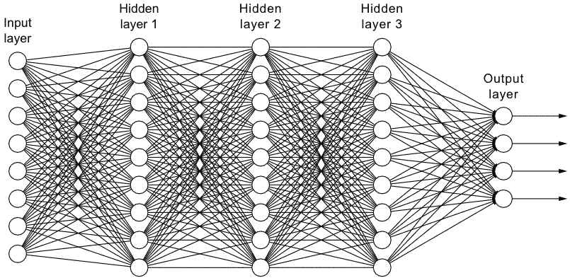
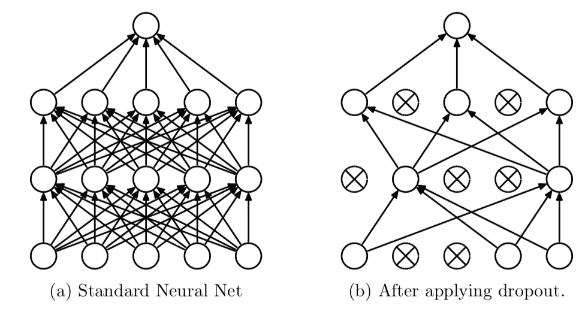
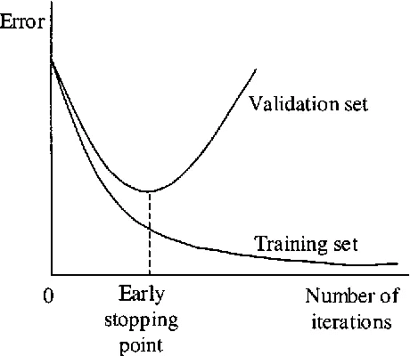
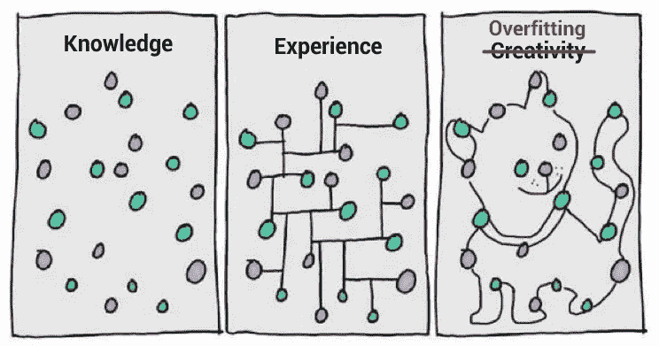

# 防止过度拟合的 8 个简单技巧

> 原文：<https://towardsdatascience.com/8-simple-techniques-to-prevent-overfitting-4d443da2ef7d?source=collection_archive---------5----------------------->

当模型对训练数据表现良好，但对看不见的数据概括较差时，就会发生过度拟合。过拟合是机器学习中非常普遍的问题，并且已经有大量的文献致力于研究防止过拟合的方法。在下文中，我将描述八种简单的方法，通过在每种方法中只引入一种对数据、模型或学习算法的改变来减轻过度拟合。

# 目录

[1。坚守](#c287)
[2。交叉验证](#d2d6)
[3。数据扩充](#f80d)
[4。特征选择](#253a)
[5。L1 / L2 正规化](#d178)
[6。移除层数/每层单元数](#87f3)
[7。辍学](#6f6a)
[8。提前停止](#98ac)

# 1.拒绝(数据)

我们可以简单地将数据集分成两组:训练和测试，而不是使用所有的数据进行训练。常见的拆分比例是 80%用于培训，20%用于测试。我们训练我们的模型，直到它不仅在训练集上表现良好，而且在测试集上也表现良好。这表明了良好的泛化能力，因为测试集表示未用于训练的看不见的数据。然而，这种方法需要足够大的数据集来训练，即使在分割之后。

# 2.交叉验证(数据)

我们可以将数据集分成 k 个组(k 重交叉验证)。我们让其中一个组作为测试集(请参见保留说明)，其他组作为训练集，重复这个过程，直到每个单独的组都被用作测试集(例如， *k* 重复)。与保留不同，交叉验证允许所有数据最终用于训练，但在计算上也比保留更昂贵。

# 3.数据扩充(数据)

更大的数据集将减少过度拟合。如果我们无法收集更多数据，并且受限于当前数据集中的数据，我们可以应用数据扩充来人为增加数据集的大小。例如，如果我们正在为图像分类任务进行训练，我们可以对我们的图像数据集执行各种图像变换(例如，翻转、旋转、重新缩放、移位)。

# 4.特征选择(数据)

如果我们只有有限数量的训练样本，每个样本都有大量的特征，我们应该只选择最重要的特征进行训练，这样我们的模型就不需要学习这么多的特征，最终会过度拟合。我们可以简单地测试不同的特征，为这些特征训练单独的模型，并评估泛化能力，或者使用各种广泛使用的特征选择方法之一。

# 5.L1 / L2 正则化(学习算法)

正则化是一种技术，用于限制我们的网络学习过于复杂的模型，这可能因此而过度拟合。在 L1 或 L2 正则化中，我们可以在成本函数上添加惩罚项，以将估计的系数推向零(并且不取更多的极值)。L2 正则化允许权重向零衰减，但不衰减到零，而 L1 正则化允许权重衰减到零。

# 6.移除层数/每层的单位数(模型)

正如在 L1 或 L2 正则化中提到的，一个过于复杂的模型更有可能过度拟合。因此，我们可以通过删除层来直接降低模型的复杂性，并减小模型的大小。我们可以通过减少全连接层中神经元的数量来进一步降低复杂性。对于我们的任务，我们应该有一个复杂的模型来充分平衡欠适应和过适应。

# 7.辍学(模型)

通过对我们的层应用 dropout(一种正则化形式),我们以设定的概率忽略了网络单元的子集。使用 dropout，我们可以减少单元之间的相互依赖学习，这可能会导致过度适应。然而，对于 dropout，我们需要更多的纪元来使我们的模型收敛。

# 8.提前停止(模型)

我们可以首先为任意大量的时期训练我们的模型，并绘制验证损失图(例如，使用排除)。一旦验证损失开始降低(例如，停止降低而是开始增加)，我们停止训练并保存当前模型。我们可以通过监控损失图或设置早期停止触发器来实现这一点。所保存的模型将是在不同训练时期值之间进行概括的最佳模型。

**您已经到达文章末尾！希望你现在有一个工具箱的方法来对抗过度适应⚔️.**

*为你完成这篇文章向你致敬，我希望你喜欢它*🎩*。如果你对更多与 ML 相关的话题感兴趣，也可以查看一些由* [*Tim*](https://taying-cheng.medium.com/) *:)撰写的有趣文章。*

[*订阅？*🙂](https://chuanenlin.medium.com/membership)