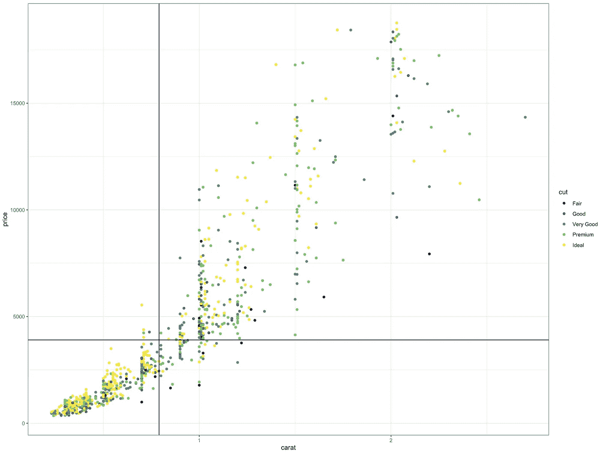
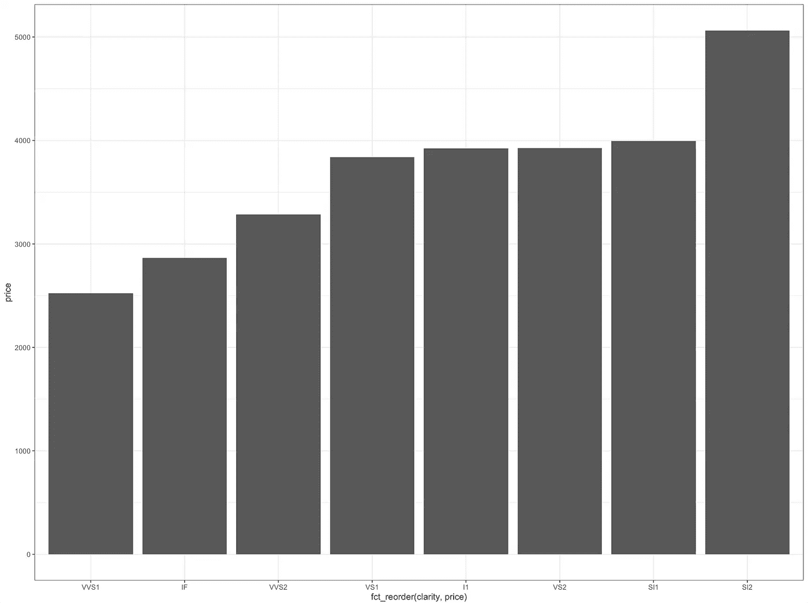

# 更好的数据可视化的 8 个技巧

> 原文：<https://towardsdatascience.com/8-tips-for-better-data-visualization-2f7118e8a9f4?source=collection_archive---------10----------------------->


照片由[爱德华·豪威尔](https://unsplash.com/@edwardhowellphotography?utm_source=medium&utm_medium=referral)在 [Unsplash](https://unsplash.com?utm_source=medium&utm_medium=referral) 拍摄

## 改善你的地图的实用建议

G gplot 是 R 的首要数据可视化包。它的流行可能归因于它的易用性——只需几行代码，您就能制作出非常棒的可视化效果。这对于刚刚开始 R 之旅的初学者来说尤其重要，因为只用两行代码就可以创建可视化的东西，这非常令人鼓舞:

```
ggplot(data = iris, aes(x = Sepal.Length, y = Sepal.Width)) +
  geom_point()
```


上述代码的输出

在本文中，我想强调 ggplot 的灵活性和可定制性。Matplotlib 和 Seaborn(都是 Python)和 Excel 等替代品也很好用，但是可定制性较差。在这篇文章中，我将通过 8 个具体步骤来改善你的 ggplot。

为了确保本文中的建议切实可行，我将遵循两个主题:

1.  **假设读者对 ggplot 有所了解:**如果你理解了上面的代码，你应该会很好。如果您不熟悉 ggplot，我将尽量使这些提示与语言无关，因此如果您使用 base R、Python 或其他可视化工具，这些提示可能仍然有用。
2.  **易于理解:**如果您想自己运行示例代码，您所需要的只是 R 和 tidyverse。不需要外部数据集，因为我们将使用 ggplot 中包含的`diamonds`数据集。


来源:https://ggplot2.tidyverse.org/reference/diamonds.html

# 1.主题是你最好的朋友

主题控制所有非数据显示，是改变图形外观的一种简单方法。为了做到这一点，只需要一行额外的代码，ggplot 已经有了 8 个独立的主题。

```
ggplot(data = diamonds, aes(x = Sepal.Width, y = Sepal.Length)) + 
  geom_point() + 
 **theme_bw()**
```

ggplot 主题很简单。它们不会真的突出，但是它们看起来很棒，容易阅读，并且能表达重点。同样，如果你想反复使用同一个主题，你可以**用一行代码设置一个全局主题，它将适用于所有的 ggplots。**

```
# Set global themetheme_set(theme_bw())
```

*关于 8 个主题的全部细节，你可以访问* [*这个链接*](https://ggplot2.tidyverse.org/reference/ggtheme.html) *。*


ggplot 主题，比较

**主题也是超级可定制的。**除了 ggplot 自带的 8 个主题，你还可以制作自己的主题，但更重要的是使用其他人已经创建的主题。在我工作过的几个公司里，我们都有内部的 ggplot 主题。例如，我在脸书公司帮助设计了`theme_fb()`，公司的设计师为它提供了意见。

如果你想在 ggplot 之外使用一些其他的主题，最流行的包是 ggthemes，它有一些有趣的选项，比如`theme_fivethirtyeight(), theme_wsj(), and theme_economist()`。下面是这些主题的一个例子，但是我绝对推荐查看 [**这个链接**](https://yutannihilation.github.io/allYourFigureAreBelongToUs/ggthemes/) 来了解更多。


ggthemes，比较

# 2.刻面是一种超能力

在可视化数据时，您总是要考虑的一件事是您想要显示多少维度的数据。大多数图表通常只需要 1-2 维的数据就可以得到一个点，例如:

*   散点图上篮球运动员的身高 x 体重
*   柱状图上洛杉矶湖人队球员的身高

随着维度数量的增加，一张图会变得更加混乱，这使得一个点更难被理解。例如:

*   散点图上篮球运动员的身高 x 体重，*但是 30 支球队中的每支球队都有不同的颜色点*。这将很难阅读，因为您需要 30 种不同的颜色来代表不同的团队，以及一个列出所有团队名称的图例。

这就是刻面的魅力所在。**如果我们不必局限于一个图会怎么样？**我的假设是，为什么我们中的许多人会有这种想法，是因为我们习惯于在 Excel 中可视化数据，我们被限制在一个单一的图表中。在 ggplot 中，我们可以打破这种思维模式，只需要一行代码就可以做到。**刻面使我们能够轻松地在可视化中添加两个额外的维度。**

让我们探索如何使用刻面来可视化钻石数据。

基本上，我们可以查看钻石的克拉数与其价格之间的关系，这是本数据集的主要目的:

```
ex2 <- 
  diamonds %>%
  sample_n(5000) %>%
  ggplot(aes(x = carat, y = price)) +
  geom_point()ex2
```


这张图只显示了两个维度的数据，但还有一些其他的数据也很重要。钻石的切割、颜色和净度——所有这些都可能与钻石的价格有关。引入这些维度的一个方法是让点有不同的颜色或者使用不同的点形状，但是让我们试试刻面。

如果您只想通过**单一尺寸分解图形，请使用**facet _ wrap()**:**

```
ex2 +
  **facet_wrap(~cut)**
```


如果您想通过**二维分解图形，请使用**facet _ grid()**:**

```
ex2 +
  **facet_grid(color~cut)**
```


这只是如何使用`facet_wrap()`和`facet_grid()`的两个例子，但是从这一节中得到的关键是，使用 ggplot，**您不会局限于在单个图形中考虑可视化。**

# 3.颜色！

颜色在数据可视化中有两个主要用途:

1.  使可视化更有吸引力
2.  表示数据的另一个维度

有很多方法可以给你的 gg 图上色，但是为了简单起见，这一节主要介绍[绿色调色板](https://cran.r-project.org/web/packages/viridis/vignettes/intro-to-viridis.html)，这是我个人最喜欢的颜色，因为它们是:

*   **丰富多彩:**跨越尽可能宽的调色板，使差异显而易见
*   **感知一致:**表示彼此接近的值具有相似的外观颜色，而彼此远离的值具有更多不同的外观颜色，在整个值范围内保持一致
*   **对色盲具有鲁棒性:**因此上述特性适用于患有常见色盲的人，也适用于灰度打印


来源:[https://cran . r-project . org/web/packages/viridis/vignettes/intro-to-viridis . html](https://cran.r-project.org/web/packages/viridis/vignettes/intro-to-viridis.html)

你可以在这里 **，**阅读更多关于上面 [**颜色背后的理论，但是这一节主要讲的是允许你使用这些颜色的 4 个关键功能:**](https://cran.r-project.org/web/packages/viridis/vignettes/intro-to-viridis.html)

*   `scale_color_viridis_d()` & `scale_fill_viridis_d()`:将此语句添加到您的 ggplot，以便在**离散/分类**变量上着色/填充您的图形。*(注意功能末尾的“d”)*
*   `scale_color_viridis_c()` & `scale_fill_viridis_c()`:将此语句添加到您的 ggplot 中，以便在**连续**变量上着色/填充您的图形。*(注意功能末尾的“c”)*

```
# Discrete
ggplot(data = diamonds %>% sample_n(1e3), 
         aes(x = carat, y = price,
             color = cut)) + 
  geom_point() +
 **scale_color_viridis_d()**
```


```
# Continuous
ggplot(data = diamonds %>% sample_n(1e3), 
       aes(x = carat, y = price,
           color = depth)) + 
  geom_point() +
 **scale_color_viridis_c(option = 'A')**
```

***Protip:*** 这里，我使用`option`参数来改变 viridis 中的调色板。您可以在选项 A-E 之间切换，这些选项反映了上面的不同配色方案。


# 4.颜色与填充:了解区别

我在上一节中介绍了这一点，但我想更明确地解决它，因为当您第一次使用 ggplot 时，它可能会令人困惑。要给 ggplot 着色，您可以使用`color`或`fill`，这取决于图形类型。

***那么有什么区别呢？*** 一般来说，`fill`定义了一个几何体填充*(即`geom_bar()`)的颜色，而*颜色*定义了一个几何体勾勒*(即`geom_point()`)的颜色。**

```
**ggplot(data = diamonds, aes(x = price)) +
  geom_histogram(color = 'blue',
                 fill = 'red')**
```

****

**因此，这里的要点是，如果你试图给一个图形着色，但看起来没有任何变化，只需将`color`切换到`fill`，反之亦然。**

**[*阅读更多关于 StackOverflow*](https://stackoverflow.com/questions/50557718/what-is-the-difference-between-the-color-and-fill-argument-in-ggplot2#:~:text=Generally%2C%20fill%20defines%20the%20colour,%2C%20to%20use%20Photoshop%20language).)**

# **5.给它贴上标签**

**好的可视化有简洁和描述性的标签。它们帮助读者理解他们所看到的，如果你希望你的视觉化图像被分享，这尤其重要。幸运的是，它在 ggplot 中非常容易标记。**

****以下是 ggplot 最有用的标签功能，按使用频率列出。**您可以挑选想要使用的标签，例如，如果您只想添加标题，您只需在`labs()`中输入标题参数。**

```
**ggplot(data = diamonds %>% sample_n(1e3), 
       aes(x = carat, y = price, color = cut)) + 
  geom_point() +
 **labs(title = 'title example',
       x = 'x-axis example',
       y = 'y-axis example',
       color = 'color example',
       subtitle = 'subtitle example',
       caption = 'caption example',
       tag = 'tag example')****
```

*****注:*** *只有当您的 ggplot 中有一种颜色作为美感时，才可以访问色域。无论你使用填充、颜色、大小、alpha 等等，这种标记方法都是有效的。***

****

# **6.线条注释**

**在用你的视觉化来讲述一个故事的主题上，线条注释是一个非常有用的工具。我个人用过的一些例子包括:**

*   **在线图中标记前/后时段**
*   **在散点图上绘制 x 或 y 值的平均值**
*   **注释我们想要达到的目标度量**

**无论什么用例，拥有一个线注释都有助于向那些将查看您的可视化的人传达一个重要的观点。要在 ggplot 中添加一条线，您可以使用:**

*   ****geom_hline():** 添加一条水平线(有 y 截距)**
*   ****geom_vline():** 添加一条垂直线(有一个 x 截距)**

**下面的例子将展示这两者的作用:**

```
**ggplot(data = diamonds %>% sample_n(1e3), 
       aes(x = carat, y = price, color = cut)) + 
  geom_point() +
 **geom_hline(data = . %>% summarise(y = mean(price)),
             aes(yintercept = y)) +
  geom_vline(data = . %>% summarise(x = mean(carat)),
             aes(xintercept = x))****
```

**请注意，上面的代码看起来可能比本文中的其他一些 ggplot 代码要复杂一些。我会试着解释那里发生了什么。为了得到平均克拉数和价格，一个更直接的方法是在你的 ggplot 代码之前计算它们。然而，因为我很懒，喜欢减少变量的数量，所以我将数据(`diamonds %>% sample_n(1e3)`)直接传输到`geom_line()`语句中，这样也能很好地工作。**

****

# **7.文本注释**

**除了线条之外，在图表中添加一些数据标签也是很有用的。然而，只有当你的数据标签易于阅读时，它才有用。例如，如果您盲目地应用文本 geom，您最终会得到一个非常难看的图形:**

```
**p <- 
  ggplot(data = diamonds %>% sample_n(1e3), 
       aes(x = carat, y = price, color = cut)) + 
  geom_point()p + 
 **geom_text(aes(label = price))****
```

****

**这很糟糕**

**在这一部分，我将谈谈有效使用`geom_text()`的三个关键技巧。**

1.  ****过滤显示哪些标签:**你可以发挥创意，但这样做的目的是只显示相关的数据标签。在下面的例子中，我只想显示高克拉钻石的价格:**

```
**p + 
 **geom_text(data = . %>% filter(carat >= 2.25),
            aes(label = price))****
```

****

**请注意，现在更容易阅读了，只显示了几个价格**

****2。hjust + vjust****

**在上面的图中，你会看到文本完全覆盖了点，看起来很丑。您可以通过在 geom_text()内对齐文本来轻松解决此问题。我认为这类似于微软 Word 中的左右对齐。**

**通常，vjust 和 hjust 的范围是从[0，1]开始，但它也接受负值和大于 1 的值(它只会在指定的方向上进一步移动标签)。下图显示了如何根据 hjust 和 vjust 值对齐文本:**

****

```
**p + 
  geom_text(data = . %>% filter(carat >= 2.25),
            aes(label = price),
           ** hjust = 0,
            vjust = 0)****
```

****

****3。颜色****

**这更多的是一种偏好，但是要知道你可以改变文本的颜色。你通常希望你的**文本尽可能与背景**形成对比，因为这样最容易辨认。如果您有一些较浅的颜色(如黄色)可能难以阅读，这一点很重要:**

```
**p + 
  geom_text(data = . %>% filter(carat >= 2.25),
            aes(label = price),
            hjust = 0,
            vjust = 0,
          **  color = 'black')****
```

****

```
**# Another example where we add contrastdiamonds %>%
  group_by(clarity) %>%
  summarise(price = mean(price)) %>%
  ggplot(aes(x = clarity, y = price)) +
  geom_bar(stat = 'identity') +
  geom_text(aes(label = round(price, 2)),
            vjust = 1.25,
           ** color = 'white')****
```

****

# **8.秩序，秩序，秩序！**

**最后，对图表进行排序可以使其更容易阅读，这对于条形图尤其有用。你所要做的就是在 x 值上使用`fct_reorder()`,这样它就按照 y 值排序了:**

```
**# By default, ggplot will order by the x valuediamonds %>%
  group_by(clarity) %>%
  summarise(price = mean(price)) %>%
  ggplot(aes(x = clarity, y = price)) +
  geom_bar(stat = 'identity')**
```

****

```
**# Reordered:diamonds %>%
  group_by(clarity) %>%
  summarise(price = mean(price)) %>%
  ggplot(aes(x = **fct_reorder(clarity, price)**, y = price)) +
  geom_bar(stat = 'identity')**
```

****

# **总结想法**

**我很难决定我想在这篇文章中涵盖哪些不同的主题。我最终专注于最初令我困惑的主题，我希望我在刚开始学习 ggplot 时能理解更多。希望这篇文章能给你一些关于如何改进可视化的具体想法，或者揭开 ggplot 一些更令人困惑/隐藏的方面。**