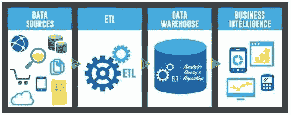

# 初级数据分析师的 8 个技巧

> 原文：<https://towardsdatascience.com/8-tips-for-the-junior-data-analyst-afdaea0eb91f?source=collection_archive---------60----------------------->

## [办公时间](https://towardsdatascience.com/tagged/office-hours)

## *祝贺你！你最近获得了第一份数据分析师的工作！作为一名过去几年的数据分析师，在您开始新的分析师职业生涯时，我想与您分享一些技巧。*

由[活动创作者](https://unsplash.com/@campaign_creators?utm_source=medium&utm_medium=referral)在 [Unsplash](https://unsplash.com?utm_source=medium&utm_medium=referral) 上拍摄的照片

## 1)充分了解客户的需求

当你收到客户的请求时，无论是新的报告/具体的分析/项目，都要理解**为什么**客户会有这样的请求。他到底在寻找什么？了解**更大的**图片。如果需要，不要不好意思问很多问题，直到你完全理解为止。准确理解他的需求是你工作的一大部分。通过理解工作的价值，它还会帮助你感受到更多与工作的联系。

## 2)有时你最清楚，提供替代方案

你的顾客可能认为他知道自己需要/想要什么，但有时你最清楚。问一些尖锐的问题，你需要这个做什么？你真的需要这个吗？**在**你确切了解了他**需要**什么之后，想想替代方案。有没有一个**现有的解决方案**可以让你适度满足他的需求？技术上的最佳解决方案是什么？提供你认为最好的解决方案。

## 3)始终尝试自动化您的流程

分析师的部分工作有时包括“繁重的工作”，大量的复制和粘贴 excel 等。然而，在某些情况下，您可以选择来使流程更加自动化。总是寻找**更好的自动解决方案**。例如——不要在 excel 中做很多你下次无法复制的动作，试着把它放在一个查询表单中。试着从大处着眼——整个**数据处理**运行不顺畅怎么办？**有哪些可以改进的地方**？

## 4)“保存您的查询”

尽可能做好记录。总是认为同样的问题会在几周后出现。您会希望**轻松访问**您所做的事情。例如-在 excel 中添加一个 SQL 表。在长查询中添加注释。甚至你发的邮件——写得非常**清楚**。添加一个额外的句子，只是为了适当地记录，这样当你或另一个人读回来的时候，就会很清楚了。

## 5)思考你的下一步职业发展

你不能也不应该确切知道你的职业道路会把你引向何方。最好的还在前面。但是重要的是**与你内心的自我和想法联系起来**。不要让时间白白流逝。思考你的下一步行动并不是一件容易的事情，但尽管如此，试着想象一下你在未来几年里想在**的什么地方。你想去哪里？更技术性？更多的生意？你觉得哪个职位有意思？你喜欢你工作中的什么？你错过了什么？**

## 6)记录你从事的有趣的事情

你在做一些有趣的项目吗？记录下来！可以在 LinkedIn，Medium 或者私人博客上。你还可以制作一个幻灯片，展示给**其他可能感兴趣的团队成员**。试着想一想，这对其他人来说是否也有**价值**？也许公司里的其他人也能从中受益？努力让你的工作创造出**最大的内部和外部效益**。

## 7)了解您的技术前景

除了熟悉你公司使用的软件 ETL、仓库和报告软件，还要彻底理解**技术前景**。这些选定工具的竞争对手是谁？你的公司为什么选择这些特别的软件？它们的利弊是什么？

信用:blog.aimultiple.com

## 8)努力让你的工作充满你喜欢的任务

“数据分析师”可能意味着很多不同的东西，这取决于你的公司、它的技术前景和你的特定角色定义。有些角色技术性更强，甚至接近于数据工程师，而有些则更面向产品或业务。虽然你的公司可能已经定义了你的角色，但是你可以自由地改变你的工作定义。**你对哪些方面感兴趣？你对商业方面的事情感兴趣吗？靠上去。你喜欢教书吗？靠上去。你的公司只有在你提出新的想法和项目，并在这个过程中利用你最好的技能时才会受益。**

> 分析师可以成为非常有价值的关键人物。如果这是你想要的，那就看你了。或者，您的工作可以简化为更技术性的工作，只是反复运行一些查询。那些成功到达顶端的人，和你我没有什么不同，**他们只是想要并被推着到达那里。**