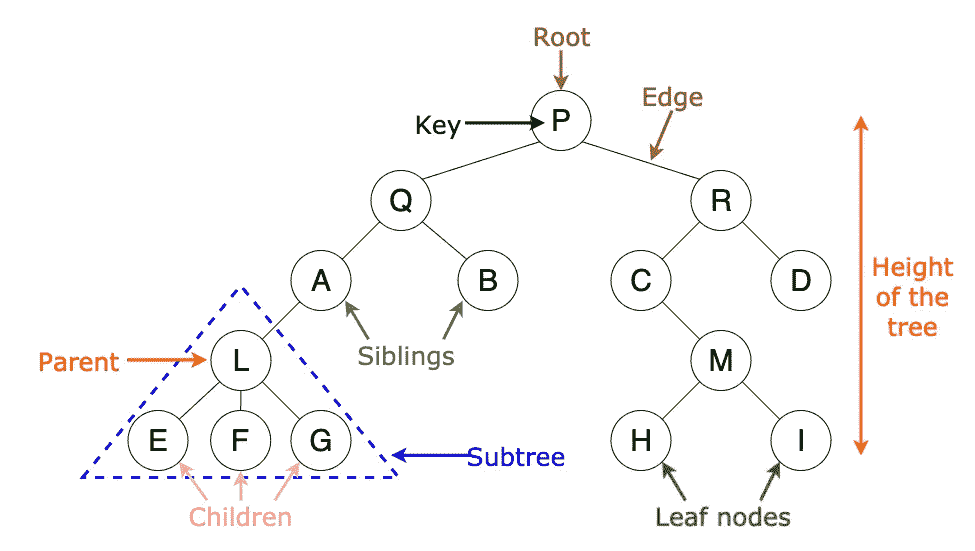
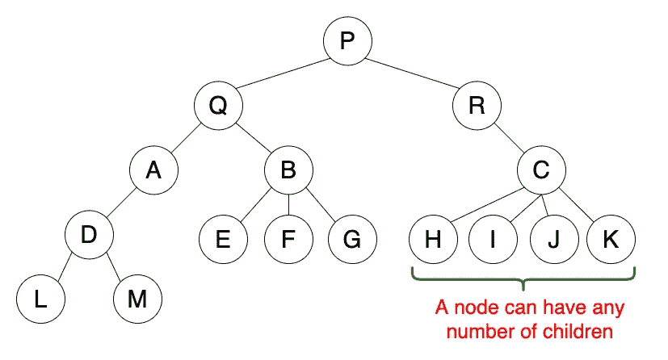
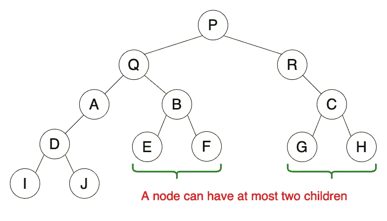
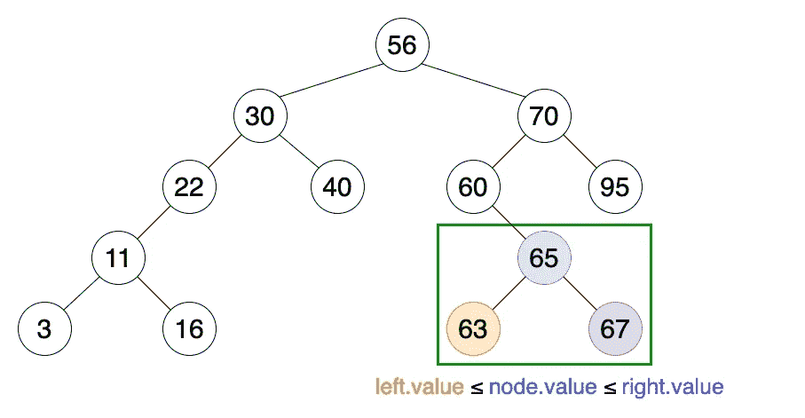
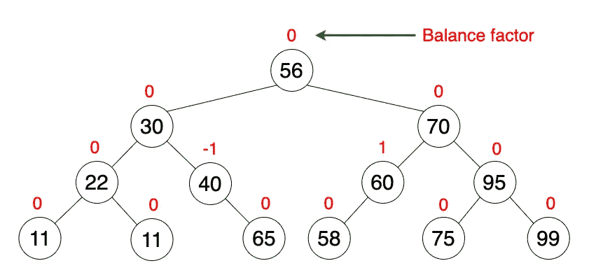
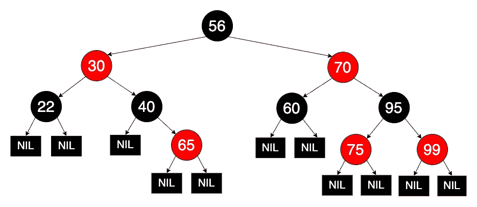
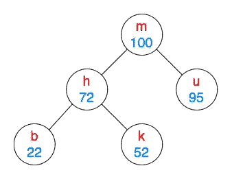
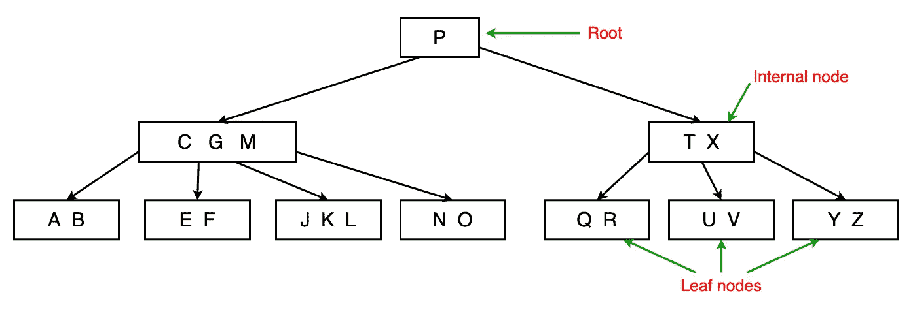

# 值得了解的 8 种有用的树数据结构

> 原文：<https://towardsdatascience.com/8-useful-tree-data-structures-worth-knowing-8532c7231e8c?source=collection_archive---------3----------------------->

## 8 种不同树形数据结构的概述

当你想到一棵树时，你会想到什么？根、枝、叶？你可能会想到一棵有根、有枝、有叶的大橡树。同样，在计算机科学中，树形数据结构有根，有枝，有叶，但是画倒了。树是一种分层数据结构，可以表示不同节点之间的关系。在本文中，我将简要介绍 8 种类型的树数据结构。

## 树的属性

*   一个树可以不包含任何节点，也可以包含一个称为根**的特殊节点，根**有零个或多个子树。
*   树的每条边都直接或间接地起源于根。
*   每个孩子只有一个父母，但一个父母可以有很多孩子。

图一。树木术语

在本文中，我将简要解释以下 10 种树数据结构及其用法。

1.  通用树
2.  二叉树
3.  二叉查找树
4.  AVL 树
5.  红黑树
6.  八字树
7.  Treap
8.  B 树

# 1.通用树

一个**通用树**是一个树形数据结构，其中没有对层次结构的约束。

## 性能

1.  遵循树的属性。
2.  一个节点可以有任意数量的子节点。

图二。通用树

## 使用

1.  用于存储分层数据，如文件夹结构。

# 1.二叉树

一个**二叉树**是一个树形数据结构，其中可以找到以下属性。

## 性能

1.  遵循树的属性。
2.  一个节点最多可以有两个子节点(子节点)。
3.  这两个子节点被称为 ***左子节点*** 和 ***右子节点*** 。

图三。二叉树

## 使用

1.  由编译器用来构建语法树。
2.  用于实现表达式解析器和表达式求解器。
3.  用于存储路由器中的路由表。

# 3.二叉查找树

二叉查找树是二叉树的一个更严格的扩展。

## 性能

1.  遵循二叉树的属性。
2.  有一个独特的属性叫做**二叉搜索树属性**。该属性声明给定节点的左子节点的值(或键)应该小于或等于父节点的值，右子节点的值应该大于或等于父节点的值。

图 4。二叉查找树

## 使用

1.  用于实现简单的排序算法。
2.  可以用作优先级队列。
3.  在许多数据不断进出的搜索应用程序中使用。

# 4.AVL 树

AVL 树是一种自平衡二叉查找树。这是第一棵自动平衡高度的树。

## 性能

1.  遵循二分搜索法树的属性。
2.  自我平衡。
3.  每个节点存储一个名为**平衡因子**的值，该值是其左侧子树和右侧子树之间的高度差。
4.  所有节点的平衡系数必须为-1、0 或 1。

在执行插入或删除之后，如果至少有一个节点不具有-1、0 或 1 的平衡因子，则应该执行旋转来平衡树(自平衡)。你可以从 [**这里**](/self-balancing-binary-search-trees-101-fc4f51199e1d) 阅读我之前文章中关于旋转操作的更多内容。

图五。AVL 树

## 使用

1.  用于需要频繁插入的情况。
2.  在 Linux 内核的内存管理子系统中使用，用于在抢占期间搜索进程的内存区域。

# 5.红黑树

红黑树是一个自我平衡的二叉查找树，每个节点都有一种颜色；红色或黑色。节点的颜色用于确保树在插入和删除过程中保持近似平衡。

## 性能

1.  遵循二分搜索法树的属性。
2.  自我平衡。
3.  每个节点不是红色就是黑色。
4.  根是黑色的(有时省略)。
5.  所有的叶子(标记为 NIL)都是黑色的。
6.  如果一个节点是红色的，那么它的两个子节点都是黑色的。
7.  从给定节点到它的任何叶节点的每条路径必须经过相同数量的黑节点。

图六。AVL 树

## 使用

1.  作为计算几何中使用的数据结构的基础。
2.  用于当前 Linux 内核中使用的*完全公平调度器*。
3.  用于 Linux 内核的 *epoll* 系统调用实现。

# 6.八字树

八字形采油树是一种自平衡二叉查找树。

## 性能

1.  遵循二分搜索法树的属性。
2.  自我平衡。
3.  最近访问过的元素可以快速地再次访问。

在执行搜索、插入或删除后，张开树执行一个称为**张开**的动作，其中树被重新排列(使用旋转),使得特定元素被放置在树的根部。

图 7。显示树搜索

## 使用

1.  用于实现缓存
2.  用于垃圾收集器。
3.  用于数据压缩

# 7.Treap

一个**树堆**(这个名字来源于**树+堆**)就是一个二叉查找树。

## 性能

1.  每个节点有两个值；一个**键**和一个**优先级**。
2.  这些键遵循二进制搜索树属性。
3.  优先级(随机值)遵循堆属性。

图 8。Treap(红色字母键遵循 BST 属性，蓝色数值遵循最大堆顺序)

## 使用

1.  用于维护公钥密码系统中的授权证书。
2.  可用于执行快速设置操作。

# 8.B 树

b 树是一个自平衡搜索树，它包含多个节点，这些节点按照排序的顺序保存数据。每个节点有 2 个或更多的子节点，并由多个键组成。

## 性能

1.  每个节点 x 都有以下内容:

— x.n(键的数量)

— x.keyᵢ(以升序存储的密钥)

— x.leaf(无论 x 是否为叶子)

2.每个节点 x 都有(x.n + 1)个子节点。

3.键 x.keyᵢ分隔每个子树中存储的键的范围。

4.所有的树叶都有相同的深度，也就是树高。

5.节点对可以存储的键的数量有上限和下限。这里我们考虑一个值 t≥2，称为 B 树的**最小度**(或**分支因子**)。

—根必须至少有一个键。

—每个其他节点必须至少有(t-1)个键，最多有(2t-1)个键。因此，每个节点将至少有 t 个子节点，最多有 2t 个子节点。如果节点有(2t-1)个键，我们说它是**满的**。

图九。B 树

## 使用

1.  用于数据库索引，以加快搜索速度。
2.  在文件系统中用来实现目录。

# 最后的想法

数据结构操作的时间复杂性的备忘单可以在这个[链接](https://www.bigocheatsheet.com/)中找到。

我希望作为对树结构的简单介绍，这篇文章对您有用。我很想听听你的想法。😇

请继续关注关于更多数据结构的后续文章。如果你没有读过我以前写的关于数据结构的文章，可以通过下面的链接来看看。

 [## 每个程序员都必须知道的 8 种常见数据结构

### 数据结构是一种在计算机中组织和存储数据的专门方法，以这种方式我们可以执行…

towardsdatascience.com](/8-common-data-structures-every-programmer-must-know-171acf6a1a42)  [## 自平衡二分搜索法树 101

### 自平衡二分搜索法树简介

towardsdatascience.com](/self-balancing-binary-search-trees-101-fc4f51199e1d) 

非常感谢你的阅读！

干杯！😃

# 参考

[1]《算法导论》(第三版)，作者:Thomas H. Cormen、Charles E. Leiserson、Ronald L. Livest 和 Clifford Stein。

[https://en.wikipedia.org/wiki/List_of_data_structures](https://en.wikipedia.org/wiki/List_of_data_structures)