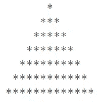

# 80 个 Python 面试练习题

> 原文：<https://towardsdatascience.com/80-python-interview-practice-questions-f1640eea66ac?source=collection_archive---------2----------------------->

## 来自许多来源的 Python 问答集


麦克斯韦·尼尔森在 T2 的照片

许多数据爱好者开始用 Python 编程语言学习他们的数据科学之旅。为什么是 Python？因为它很容易理解，而且现在许多公司都在使用 Python 编程语言。此外，Python 是一种多用途语言，不仅仅是数据科学家专用的；人们也将 Python 用于开发目的。

当你申请一个数据科学家的职位时，许多公司会需要你参加一个具有 Python 知识的工作面试。在这种情况下，我试图概述我从许多来源和我自己的来源收集的 Python 面试问题。我试着选择最有可能被问到的问题，以及知道什么是重要的。他们来了。

**1。Python 是什么？**

Python 是一种具有对象、模块、线程、异常和自动内存管理的编程语言。Python 被设计成具有高度可读性。它经常使用英语关键字，而其他语言使用标点符号，并且它的语法结构比其他语言少。

**2。使用 Python 有什么好处？**

pythons 的好处在于它是简单易用、可移植、可扩展的内置数据结构，并且是开源的。

**3。Python 是怎样一种解释型语言？**

解释语言是在运行前不在机器代码中的任何编程语言。因此，Python 是一种解释型语言。

**4。Python 是如何解读的？**

Python 语言是一种解释型语言。Python 程序直接从源代码运行。它将程序员编写的源代码转换成中间语言，中间语言又被翻译成必须执行的机器语言。

**5。Python 中是如何管理内存的？**

*   Python 中的内存由 Python 私有堆空间管理。所有 Python 对象和数据结构都位于私有堆中。这个私有堆由 Python 解释器自己负责，程序员无权访问这个私有堆。
*   Python 内存管理器负责 Python 私有堆空间的分配。
*   Python 私有堆空间的内存由 Python 内置的垃圾收集器提供，垃圾收集器回收并释放所有未使用的内存。

**6。pep 8 是什么？**

PEP 代表 Python 增强提案**。**这是一组规定如何格式化 Python 代码以获得最大可读性的规则。

**7。用 python 怎么写注释？**

Python 中的注释以#字符开头。

```
#Comment Example
```

**8。如何在 python 中注释多行？**

多行注释出现在多行中。所有要注释的行都要加上前缀#。你也可以用一个非常好的快捷方法来注释多行。你所需要做的就是按住 ctrl 键，在你想要包含#字符的地方点击鼠标左键，然后输入一次#字符。这将对您引入光标的所有行进行注释。

**9。Python 中的 docstrings 是什么？**

文档字符串实际上不是注释，但是，它们是*文档字符串*。这些文档字符串在三重引号内。它们不赋给任何变量，因此，有时也可以用作注释。

```
""" 
This is Docstring example
It is useful for documentation purposes
"""
```

10。Python 中缩进是可选的吗？

Python 中的缩进是强制性的，是其语法的一部分。

所有编程语言都有某种方式来定义代码块的范围和程度；在 Python 中，它是缩进。缩进为代码提供了更好的可读性，这可能是 Python 强制使用缩进的原因。

**11。Python 中的函数是什么？**

函数是一段代码，只有在被调用时才会被执行。要定义 Python 函数，需要使用 def 关键字。如果函数返回一些东西，他们需要一个 return 关键字。

```
def example(a):
   return a*2
```

**12。Python 中的局部变量和全局变量是什么？**

***全局变量:***

在函数外部或全局空间中声明的变量称为全局变量。程序中的任何函数都可以访问这些变量。

***局部变量:***

任何在函数中声明的变量都称为局部变量。这个变量存在于局部空间，而不存在于全局空间。

```
#Example of Global Variable
a = 1#Example of Local Variable
def sample():
   #Local Variable
   a = 1
```

13。什么是 lambda 函数？

匿名或未命名的函数称为 lambda 函数。该函数可以有任意数量的参数，但只能有一条语句。它通常用作一次性功能，而不是重复使用的功能。

```
#Example of Lambda Functiontest = lambda x,y: x*y
print(test(2,4))
```

14。为什么 python 中的 lambda forms 没有语句？

python 中的 lambda 表单没有语句，因为它用于创建新的函数对象，然后在运行时返回它们。

15。Python 中支持哪些数据类型？

Python 有五种标准数据类型

*   数字(整数和浮点数)
*   线
*   目录
*   元组
*   词典

16。什么是索引？

要访问有序序列中的元素，我们只需使用元素的索引，即特定元素的位置号。索引通常从 0 开始，即第一个元素的索引为 0，第二个元素的索引为 1，依此类推。

```
#Example usage of indexlist_ex = [1,2, 'Test']
print(list_ex[0])
```

17。什么是负指数，为什么使用负指数？

当我们使用索引来访问列表末尾的元素时，我们称之为反向索引。在反向索引中，元素的索引从索引号为 1 的最后一个元素开始。倒数第二个元素的索引为“2”，依此类推。反向索引中使用的这些索引称为负索引。

```
#Example usage of indexlist_ex = [1,2, 'Test']
print(list_ex[-1])
```

**18。Python 中的字典是什么？**

Python 字典是 Python 中支持的数据类型之一。这是一个无序的元素集合。字典中的元素存储为键值对。字典是按关键字索引的。数据类型由`{}`表示。

```
#Example of Dictionarydictionary = {'key' : 'value'}
```

19。如何访问字典中的值？

您可以通过使用键进行索引来访问字典中的值。索引由`[]`呈现。

```
#Accessing Dictionarydictionary = {'key' : 'value'}
print(dictionary['key'])
```

**20。如何获得字典中所有键的列表？**

在字典中，我们可以使用 keys()属性。

```
dictionary = {'key' : 'value', 'key1': : 'value1'}
print(dictionary.keys())
```

**21。list 和 tuple 有什么区别？**

列表和元组的区别在于列表是可变的，而元组不是。元组可以被散列，例如作为字典的关键字。使用`[]`定义列表，使用`()`定义元组。

```
#Example of list and tuple#List
list_ex = [1,2,'test']#List is mutable
list_ex[0] = 100#Tuple
tuple_ex = (1,2,'test)#Tuple is not mutable
tuple_ex[0] = 100 #It would error
```

**22。在 Python 中什么是迭代器？**

在 Python 中，迭代器用于迭代一组元素，如列表或字符串等容器。通过迭代，这意味着它可以通过使用语句来循环。

**23。[::-1}是做什么的？**

[::-1]用于反转任何可迭代对象的顺序。

```
#Reverse examplestring = 'this is a string'
print(string[::-1])
```

**24。python 中如何使用三元运算符？**

三元运算符是用于显示条件语句的运算符。这包括 true 或 false 值以及必须对其进行评估的语句。

```
#Ternary operators examplea = 1 #The true values
if a < 1:
   print('Less')
#If the previous condition haven't fulfilled
else:
   print('More')
```

**25。休息是如何工作的？**

break 语句允许在满足某些条件时终止循环，并将控制权转移到下一条语句。

```
#Break examplefor i in range(5):
   if i < 3:
      print(i)
   else:
      break
```

26。python 中的 purpose pass 语句是什么？

Python 中的 pass 语句在语法上需要一个语句，但您不希望执行任何命令或代码时使用。

```
#Pass examplefor i in range(10):
   if i%2 == 0:
      print(i)
   else:
      pass
```

27。Python 中的地图函数是什么？

map()函数将一个函数作为参数，然后将该函数应用于 iterable 的所有元素，并作为另一个参数传递给它。它将返回一个 map 对象，所以我们需要将它转换成一个 list 对象。

```
#map function exampledef number_exponential(num):
   return num**2number_list = [2,3,4,5]print(list(map(number_exponential, number_list)))
```

28。python 中的枚举函数是什么？

enumerate()方法向 iterable 添加一个计数器，并以 enumerate 对象的形式返回它。该对象将由计数器和可迭代的值组成。

```
#Enumerate exampleiter_example = ['test', 'test2', 'test3']
for idx, val in enumerate(iter_example):
   print(idx)
   print(val)
```

29。什么是字典和列表理解？

它们是基于现有 iterable 简化字典或列表创建的语法结构。它是通过在字典或列表对象中循环来创建的。

```
#Dictionary comprehensiondict_comprehension = {key:val for key, val in emumerate('sample')}
print(dict_comprehension)#List comprehensionlist_comprehension = [i for i in range(5)]
print(list_comprehension)
```

**三十。Python 中的切片是什么？**

切片是一种从序列类型(如列表、元组、字符串等)中选择一系列项目的机制。这种切片是通过索引方法完成的。

```
#Slicing examplelist_example = [1,2,3,4,'test','test2']
print(list_example[1:4])
```

**31。不在运算符中的目的是什么？** 运算符是特殊函数。它们接受一个或多个值并产生相应的结果。`not`将返回布尔值的倒数。

```
print(not 1 == 2)
```

**32。python 中** `**//**` **的用途是什么？**

它是一个除法运算符，用于将两个操作数相除，结果只显示小数点前的数字。

```
print(5//2)
```

**33。如何向列表对象添加新值？**

您可以通过使用。列表具有的 append()属性。通过将任何值传递给。append()属性，新值将放在列表序列的末尾。

```
list_example = [1,2,3,4,5]
list_example.append(6)
print(list_example)
```

**34。什么是浅抄？**

*浅拷贝*在创建新的实例类型时使用，它保留在新实例中拷贝的值。浅层复制用于复制引用指针，就像复制值一样。这意味着当我们把一个对象复制到另一个变量时，它会被连接起来。

```
#Example of shallow copylist_example = [1,2,3,4,5]
another_list = list_example
another_list[0] = 100
print(list_example)
```

**35。什么是深度复制？**

*深度复制*用于存储已经复制的值。深度复制不会复制指向对象的引用指针。它引用一个对象，并存储由其他对象指向的新对象。与浅层副本相比，在原始副本中所做的更改不会影响使用该对象的任何其他副本。这意味着它们没有联系。

```
#Example of Deep copylist_example = [1,2,3,4,5]#Iniating Deep copy with .copy attribute
another_list = list_example.copy()
another_list[0] = 100
print(list_example)
```

36。如何在 Python 中创建空类？

空类是指在其块中没有定义任何代码的类。可以使用 *pass* 关键字创建。但是，您可以在类本身之外创建该类的对象。在 Python 中，`pass`命令在执行时什么也不做。这是一个无效的声明。

```
class sample:
    pass
test=sample()
test.name="test1"
print(test.name)
```

37。Python 中的自关键字是什么？

Self-keyword 用作表示类实例的类中函数的第一个参数。类的对象或实例被自动传递给它所属的方法，并在“self-keyword”中接收。用户可以为捕捉类对象的函数的第一个参数使用另一个名称，但建议使用“self-keyword ”,因为它更符合 Python 约定。

**38。如果不以分号结尾，do-while 循环会起作用吗？**

这是一个**的绝招问题！** Python 不支持内在的 do-while 循环。其次，终止 do-while 循环对于像 C++这样的语言来说是必要的。

**39。你如何将一个列表转换成一个字符串？**

在这种情况下，我们可以使用字符串对象的. join()属性。这里我们将列表对象传递给了属性。

```
list_example = ['apple', 'grape', 'orange']
print(' '.join(list_example))
```

40。什么是会员运算符？

运算符可以确认一个值是否是另一个对象中的成员。运算符有“in”和“not in”

```
#Example membership operatorsprint('me' in 'membership')
print('mes' not in 'membership')
```

**41。Python 中的标识运算符是什么？**

恒等运算符是告诉我们两个值是否相同的运算符。运算符有“是”和“不是”。

```
#Example Identity operators
print(1 is '1')
print(2 is not '2')
```

**42。在 Python 中你是如何接受输入的？**

为了获取用户的输入，我们可以使用函数 input()。这个函数将接受用户的输入，并将输入返回到一个字符串对象中。

```
test = input('input a number: ')
print(test)
```

**43。函数 zip()是做什么的？**

它将返回元组的迭代器。它将从传递给函数的 iterable 中形成一个 n 对值。n 是传递给函数的 iterable 的数量。

```
#Zip function exampleprint(list(zip([1,2,3], ['apple', 'grape', 'orange'], ['x', 2, True])))for num, fruit, thing in zip([1,2,3], ['apple', 'grape', 'orange'], ['x', 2, True]):
    print(num)
    print(fruit)
    print(thing)
```

**44。如果 range()函数采用一个参数、两个参数和三个参数有什么区别？**

当我们只传递一个参数时，它把它作为终止值。这里，起始值为 0，步长值为+1。具有范围的迭代将总是在停止值之前停止 1 个值。

```
for i in range(5):
   print(i)
```

当我们传递两个参数时，第一个是起始值，第二个是终止值。

```
for i in range(1,5):
   print(i)
```

使用三个参数，第一个参数是起始值，第二个是停止值，第三个是步长值。

```
for i in range(1,10,2):
   print(i)
```

**45。你能写出的交换两个数的最好的代码是什么？**

您可以用一行代码来执行擦洗。

```
a = 1
b = 2#Swab number
a, b = b, a 
```

**46。如何在一行代码中声明多个赋值？**

有两种方法可以做到这一点。首先是在同一行中分别声明变量。

```
a, b, c = 1,2,3 
```

另一种方法是在同一行中只使用一个值来声明变量。

```
a=b=c=1
```

**47。如何冲出死循环？**

您可以通过按 Ctrl+C 来中断循环过程。

48。Python 中的 `**with**` **语句是什么？**

Python 中的`with`语句通过封装常见的准备和清理任务，确保在处理非托管资源时执行清理代码。它可以用来打开一个文件，做一些事情，然后在结束时自动关闭文件。它可以用来打开一个数据库连接，进行一些处理，然后自动关闭连接，以确保资源关闭并可供其他人使用。即使引发异常，with 也会清理资源。

```
#Example of with statementwith open('database.txt') as data:
    print(data)
```

**49。在 try-except 块中，except 块何时执行？**

try-except 块通常用于我们希望在出现错误时执行的情况。当 try 块中的代码遇到错误时，将执行 except 块。

```
a = (1,2,3)
try:
   a[0] = 2
except:
   print('There is an error')
```

50。哪里会用 `**while**` **而不是** `**for**` **？**

对于简单的重复循环，当我们不需要遍历一个项目列表时——比如数据库记录和字符串中的字符。

**51。什么是 Python 模块？**

模块是独立的 Python 脚本。py 扩展，可以使用 import 语句在其他 Python 代码或脚本中重用。一个模块可以由函数、类、变量或者一些可运行的代码组成。模块不仅有助于保持 Python 代码的组织性，还有助于降低代码的复杂性，提高代码的效率。

```
import #name of the module
```

**52。什么是 PYTHONPATH？**

它是导入模块时使用的环境变量。每当导入一个模块时，还会查找 PYTHONPATH 来检查各个目录中是否存在导入的模块。解释器用它来决定加载哪个模块。

53。举出 Python 的文件处理模式的例子？

我们有以下模式:

*   只读模式(' r '):打开文件进行读取。这是默认模式。
*   只写模式(' w '):打开文件进行写入。如果文件包含数据，数据将会丢失。创建另一个新文件。
*   读写模式(“rw”):以读写模式打开文件。意思是更新模式。
*   Append mode('a '):打开以供写入，如果文件存在，则追加到文件末尾。

**54。什么是酸洗和拆线？**

Pickle 模块接受任何 Python 对象，并将其转换为字符串表示形式，然后使用转储函数将其转储到一个文件中，这个过程称为 pickle。而从存储的字符串表示中检索原始 Python 对象的过程被称为拆包。

```
import picklea = 1#Pickling process
pickle.dump(a, open('file.sav', 'wb'))#Unpickling process
file = pickle.load(open('file.sav', 'rb'))
```

**55。python NumPy 数组比 lists** 好吗？

我们使用 python NumPy 数组而不是列表是因为以下三个原因:

1.  内存更少
2.  快的
3.  方便的

56。如何用 NumPy 计算百分位数？

百分位数是某个百分位数中有序数字的位置。我们可以使用下面的代码计算 NumPy 的百分比。

```
import numpy as npa **=** np.array([i for i in range(100)])
p **=** np.percentile(a, 50) #Returns 50th percentile, e.g. medianprint(p)
```

**57。如何使用 Python 获取当前工作目录？**

使用 Python 时，您可能需要从不同的目录中读取和写入文件。为了找出我们目前工作在哪个目录下，我们可以使用 os 模块中的 getcwd()方法。

```
import os
os.getcwd()
```

**58。你在下面看到了什么？如果我们执行它会发生什么？**

```
a = '1'
b = '2'
c = '3's = a + ‘[‘ + b + ‘:’ + c + ‘]’
print(s)
```

这是字符串连接。如果其中一个变量不是字符串，就会引发一个 TypeError。我们会得到字符串连接的输出。

59。你如何就地随机化列表的内容？

我们可以利用随机模块中的函数 shuffle()的帮助。

```
from random import shuffle
list_example = [1,2,3,4,5,6,7,8]
shuffle(list_example)
```

**60。Python 中的强制转换是什么？**

转换是指我们将一个变量值从一种类型转换成另一种类型。在 Python 中，这可以通过 list()、int()、float()或 str()等函数来完成。例如，当您将字符串转换为整数对象时。

```
a = '1'
b = int(a)
```

**61。解释为什么我们在这里得到一个错误？**

```
from numpy imprt stdev**ImportError** Traceback (most recent call last)
**<ipython-input-26-685c12521ed4>** in <module>
**----> 1 from** numpy **import** stdev

**ImportError**: cannot import name 'stdev' from 'numpy'
```

在上面的代码中，我们试图从 numpy 模块中导入一个不存在的函数。这就是为什么我们得到一个错误。

**62。如何在 Python 中取消或删除变量？**

我们可以使用 del()函数来删除或取消变量。这被认为是一个好的实践，当我们不使用它时，删除所有不必要的变量。

```
a = 1
del a
```

**63。蟒蛇里的熊猫是什么？**

pandas 是一个 Python 包，它提供了快速、灵活、富于表现力的数据结构，旨在使处理“关系”或“标签”数据变得既简单又直观。它的目标是成为用 Python 进行实际的、真实世界的数据分析的基础高级构建块。

64。append()和 extend()方法有什么区别？

append()和 extend()方法都是用于在列表末尾添加元素的方法。

*   append(element):在列表末尾添加给定的元素
*   extend(another-list):在列表末尾添加另一个列表的元素

65。你如何找到当前版本的 Python？

我们可以通过使用 sys.version 找到我们的 Python 当前版本。

```
import sys
sys.version
```

66。这是什么意思:*args，**kwargs？我们为什么要用它？

当我们不确定要传递给函数多少个参数时，或者当我们想要传递一个存储的参数列表或元组给函数时，我们使用*args。* *当我们不知道有多少个关键字参数将被传递给一个函数时，可以使用 kwargs，或者它可以用于将一个字典的值作为关键字参数传递。标识符 args 和 kwargs 是可选的，因为您可以将其更改为另一个名称，例如*example **another，但是最好只使用默认名称。

```
#Example of *args
def sample(*args):
    print(args)sample('time', 1, True)#Example of **kwargs
def sample(**kwargs):
    print(kwargs)sample(a = 'time', b = 1)
```

**67。Python 中的 help()和 dir()函数是什么？**

help()函数显示文档字符串及其参数的帮助。

```
import numpy
help(numpy.array)
```

函数的作用是:显示一个对象的所有成员(任何类型)。

```
import numpy
dir(numpy.array)
```

**68。对象名前的单下划线和双下划线是什么意思？**

**单下划线** —类中带有前导下划线的名称只是为了向其他程序员表明该属性或方法是私有的。但是，名称本身并没有什么特别之处。

**双下划线**(名称混淆)—任何 __spam 格式的标识符(至少两个前导下划线，最多一个尾随下划线)在文本上替换为 _classname__spam，其中类名是去掉了前导下划线的当前类名。这种处理是在不考虑标识符的语法位置的情况下完成的，因此它可以用于定义类私有的实例和类变量、方法、存储在全局变量中的变量，甚至存储在实例中的变量。在其他类的实例上专用于此类。

**69。以下查询的输出是什么？**

```
ss = “Python Programming!”
print(ss[5])
```

答案是“不”

70。用 Python 写一个程序产生一个星形三角形。

```
def star_triangle(r):
   for x in range(r):
      print(' '*(r-x-1)+'*'*(2*x+1))star_triangle(7)
```



**71。下面这段代码有什么问题？**

```
counter = 0def increment():
   counter += 1increment()
```

Python 没有变量声明，所以它必须自己确定变量的范围。如果函数内部有一个变量被邀请，那么这个变量就被认为是局部变量。上面的计数器变量是一个全局变量，因此，上面的代码行将引发一个错误。

72。如何把一个字符串拆分成一个列表？

我们可以使用。从字符串中拆分()属性。它将分隔符作为参数，并返回由基于分隔符的字符串分割结果组成的列表。

```
text = 'hello again world !'
text.split(' ')
```

**73。用 Python 写一个程序，检查你输入的一个序列是不是回文。**

```
a=input("enter the sequence: ")
b=a[::-1]if a==b:
   print("palindrome")
else:
   print("Not a Palindrome")
```

**74。什么是发电机？**

Python 生成器通常通过使用函数来生成一系列要迭代的值。我们使用`yield`来定义一个函数，这个函数曾经一个接一个地产生一个值，然后使用一个 for 循环来迭代它。

```
def squares(n):
    i=1
    while(i<=n):
        yield i**2
        i+=1
for i in squares(7):
    print(i)
```

**75。用 Python 写一个程序，检查一个数是否是质数。**

```
a=int(input("enter a number"))     
if a>1:
    for x in range(2,a):
        if(a%x)==0:
            print("not prime")
            break
    else:
        print("Prime")
else:
    print("not prime")
```

76。Python 中单下划线(' _ ')变量的用途是什么？

它用于保存交互式解释器会话中最后执行的表达式(/statement)的结果。这个先例是由标准的 CPython 解释器建立的，其他解释器也遵循了这个先例。

**77。Python 中的继承类型有哪些？**

Python 支持不同类型的继承，它们是:

*   单一遗传
*   多层次继承
*   分层继承
*   多重遗传

**78。什么是元组解包？**

元组解包是将元组中的值解包并将其输入到几个不同的变量中的过程。

```
tup = (1,2,3)#Tuple unpacking process
a,b,c = tup
```

79。当你退出 Python 时，所有的内存都被释放了吗？

退出 Python 会释放所有内容，除了:

1.  具有循环引用的模块

2.从全局命名空间引用的对象

3.C 库保留的部分内存

**80。如果一个函数没有 return 语句，它有效吗？**

不返回任何内容的函数返回 None 对象。return 关键字不一定标志着函数的结束；它只是在函数中出现时结束它。通常，一个代码块标记一个函数，它结束的地方就是函数体结束的地方。

# **来源**

[](https://www.edureka.co/blog/interview-questions/python-interview-questions/) [## 2020 年 100 大 Python 面试问答| Edureka

### 是编程领域最受欢迎的技能。在这个 Python 面试问题博客中，我将向您介绍…

www.edureka.co](https://www.edureka.co/blog/interview-questions/python-interview-questions/) [](https://www.tutorialspoint.com/python/python_interview_questions.htm) [## Python 面试问题

### 说出 Python 的一些特性。以下是 python 的一些显著特性——它支持函数式和…

www.tutorialspoint.com](https://www.tutorialspoint.com/python/python_interview_questions.htm) [](https://intellipaat.com/blog/interview-question/python-interview-questions/) [## 2020 年 55 大 Python 面试问答

### Python 是一种高级的、解释性的、交互式的、面向对象的脚本语言。Python 被设计成…

intellipaat.com](https://intellipaat.com/blog/interview-question/python-interview-questions/) [](https://codingcompiler.com/python-interview-questions-answers-1-2-3-4-5-years/) [## 165+ Python 面试问答经验丰富的 2020

### Python 面试问答 2020。这里编码编译器分享了 python 上的 165 个面试问题列表…

codingcompiler.com](https://codingcompiler.com/python-interview-questions-answers-1-2-3-4-5-years/) [](https://data-flair.training/blogs/python-interview-questions/) [## 71 Python 面试问答【新】——准备好技术回合——data flair

### 欢迎来到 DataFlair 的 Python 面试问答系列的第二部分。如果你是第一次…

数据-天赋.培训](https://data-flair.training/blogs/python-interview-questions/) 

# 如果您喜欢我的内容，并希望获得更多关于数据或数据科学家日常生活的深入知识，请考虑在此订阅我的[简讯。](https://cornellius.substack.com/welcome)

> 如果您没有订阅为中等会员，请考虑通过[我的推荐](https://cornelliusyudhawijaya.medium.com/membership)订阅。