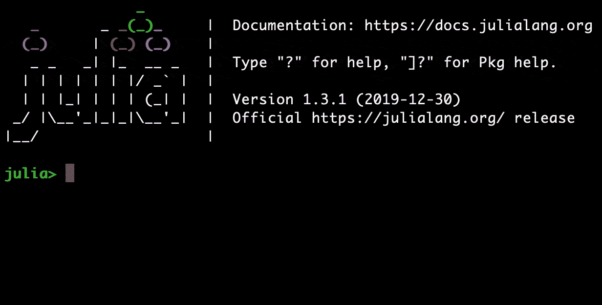
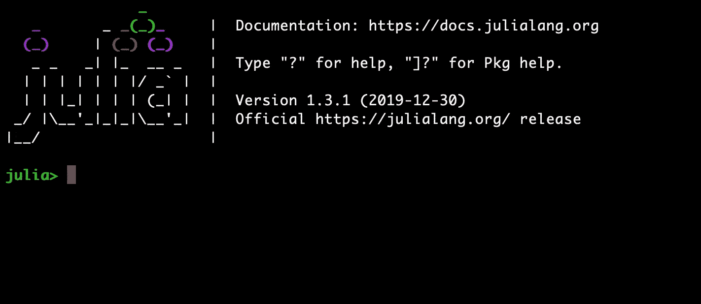
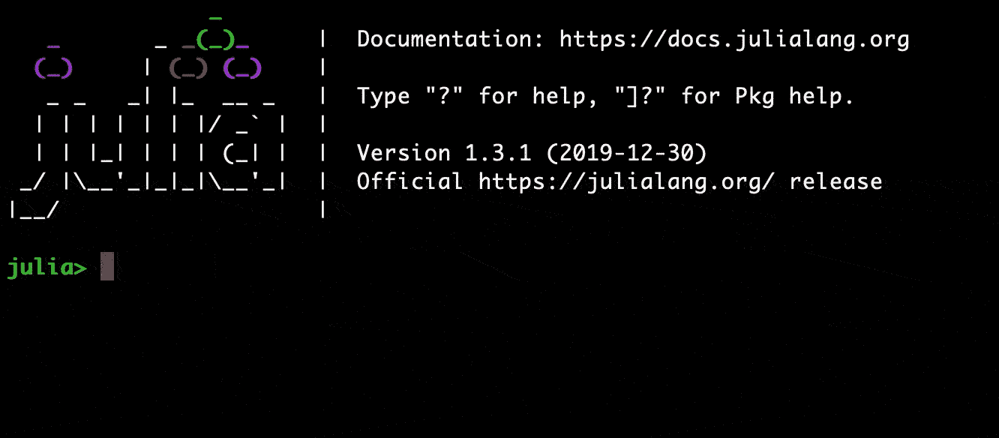

# 4 分钟内 9 个超酷的朱莉娅戏法

> 原文：<https://towardsdatascience.com/9-cool-julia-tricks-in-4-minutes-47a3a4496054?source=collection_archive---------31----------------------->

## 朱莉娅·REPL 的最佳特征


[菲利普·鲍蒂奇](https://unsplash.com/@filipbaotic?utm_source=medium&utm_medium=referral)在 [Unsplash](https://unsplash.com?utm_source=medium&utm_medium=referral) 上的照片

# 介绍

Julia 是一种新的科学计算语言，像 Python 一样容易学习，但执行速度和 C 语言一样快。Julia 是一种编译语言，但是由于它使用了实时编译器(像 Java)，你的代码可以立即执行。这个特性在朱莉娅·REPL 中得到了应用，在这里你可以运行代码行或代码块。REPL 代表读取、执行、打印和循环。

一旦安装了 Julia，在命令行输入 Julia 将打开 REPL。REPL 有许多功能可以帮助您测试代码片段和调试代码。

# 1.包装模式



包装模式下的朱莉娅·REPL

在行首键入`]`进入包模式。这是访问 Julia 的包管理器 Pkg 的快捷方式。在这种模式下，你可以安装软件包，更新它们，查看当前软件包的版本等等。在打包模式中有几个有用的命令是`add`、`remove`、`build`和`update`。

# 2.外壳模式



外壳模式

在行首键入`;`进入 shell 模式。这改变了朱莉娅·REPL 来运行 bash 命令，而不是朱莉娅。在 shell 模式下，REPL 的行为类似于 Bash shell，您可以输入标准的 Bash 命令，如`ls`、`cd`、`mkdir`等。这个功能我用过很多次。

# 3.帮助模式



帮助模式

键入`?`进入帮助模式。在这种模式下，您可以看到函数或类型文档以及其他提示和提示。当您输入文本时，Julia 将搜索与您输入的文本相匹配的文档和函数名。

# 4.函数参数制表符结束

```
**julia>** uppercase([PRESS TAB]
    uppercase(c::T) where T<:AbstractChar in Base.Unicode at strings/unicode.jl:247
    uppercase(s::AbstractString) in Base.Unicode at strings/unicode.jl:518
```

制表符补全在 REPL 中的工作方式与在 shell 或 iPython 中的工作方式相同，但是它有一个额外的有用特性。键入函数名时，在左括号后按 tab 键。如果这样做了，Julia 将显示与函数名相关的方法列表、它们的参数类型以及它们在源代码中的位置。

# 5.宏:@doc

```
**julia>** @doc max
 max(x, y, ...)Return the maximum of the arguments. See also the maximum function  to take the maximum element from a collection.
```

在函数或类型之前调用`@doc`将打印该对象的文档。(在 Julia 文档中出现在函数定义前的一个字符串中。)这有助于快速找到您需要的功能，或者提醒自己某个特定功能的用法。

# 6.宏:@时间

```
**julia>** @time sum(rand(1000));
 0.000030 seconds (6 allocations: 8.109 KiB)
```

`@time`宏是另一个非常有用的工具。正如您所料，它会计算它前面的语句的执行时间。

# 7.功能:中肯()

```
**julia>** apropos("capital")
 Base.Unicode.titlecase 
 Base.Unicode.uppercasefirst
```

该函数接受一个字符串，并在所有文档中搜索相关的函数和类型。这有助于避免在文档中寻找您需要的函数。

# 8.函数:方法()

```
**julia>** methods(uppercase)
 # 2 methods for generic function "uppercase":
 [1] uppercase(c::T) where T<:AbstractChar in Base.Unicode at strings/unicode.jl:247
 [2] uppercase(s::AbstractString) in Base.Unicode at strings/unicode.jl:518
```

`methods`函数接受一个函数，并返回该函数的所有调度定义，以及它们接受的类型和它们在源代码中的位置。当你试图寻找一个函数或者当你不记得参数的顺序时，这是很有用的。

# 9.函数:methodswith()

```
**julia>** using Flux**julia>** methodswith(BatchNorm)
 [1] show(io::IO, l::BatchNorm) in Flux at /Users/djpassey/.julia/packages/Flux/NpkMm/src/layers/normalise.jl:211
 [2] testmode!(m::BatchNorm) in Flux at /Users/djpassey/.julia/packages/Flux/NpkMm/src/layers/normalise.jl:207
 [3] testmode!(m::BatchNorm, mode) in Flux at /Users/djpassey/.julia/packages/Flux/NpkMm/src/layers/normalise.jl:207
```

这是另一个有用的功能。该函数接受类型并返回作用于该类型的所有函数。在上面的例子中，我导入了一个机器学习包 Flux，并在`BatchNorm`结构上调用`methodswith`。它向我们展示了三个接受`BatchNorm`对象作为参数的函数。

当您开始了解一个新的包并想了解库中定义的结构时，这很有用。当你在寻找一个作用于某种类型的函数时，这也是很有帮助的。

## 结论

总的来说，朱莉娅·REPL 在帮助开发人员定位正确的功能和测试代码片段方面非常有用。希望这些提示能派上用场，加速你的 Julia 发展。

[](https://medium.com/swlh/how-julia-uses-multiple-dispatch-to-beat-python-8fab888bb4d8) [## Julia 如何利用多重调度击败 Python

### 亲自看

medium.com](https://medium.com/swlh/how-julia-uses-multiple-dispatch-to-beat-python-8fab888bb4d8) [](https://medium.com/@djpasseyjr/it-only-takes-10-minutes-to-add-a-julia-kernel-to-jupyter-739490456a2b) [## 给 Jupyter 添加一个 Julia 内核只需要 10 分钟

### 为什么这很酷。

medium.com](https://medium.com/@djpasseyjr/it-only-takes-10-minutes-to-add-a-julia-kernel-to-jupyter-739490456a2b)