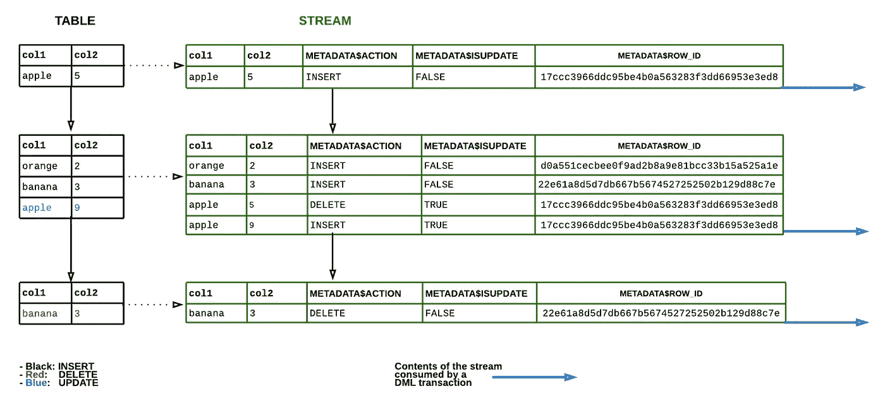

# 关于雪花数据仓库你应该知道的 9 个特性

> 原文：<https://towardsdatascience.com/9-features-that-you-should-know-about-snowflake-data-warehouse-46bdd62995ef?source=collection_archive---------21----------------------->

约翰尼斯·威贝尔在 [Unsplash](https://unsplash.com?utm_source=medium&utm_medium=referral) 上拍摄的照片

## 简单而强大——雪花开箱即用，功能丰富

雪花是一个云数据仓库，与 Google BigQuery 和 Amazon Redshift 等替代产品相比，它已经成为分析和报告的首选解决方案。它越来越受欢迎是因为它的简单——它就是管用。雪花旨在抽象出数据库管理和优化，以便用户可以从一开始就拥有一个高性能的数据仓库，并且无需管理。

如果你熟悉雪花，那么你可能已经知道它独特的整体架构-它如何将存储和计算分开，以允许各自独立扩展。以及它的虚拟仓库(独立的 MPP 集群)如何跨数据库使用，并在不使用时自动挂起。

这篇文章涵盖了 Snowflake 与众不同的一些其他独特特性，如果你打算采用它，你应该考虑一下。

# 1.合作伙伴连接计划

与 BigQuery 和 Redshift 不同，雪花没有其他内置的专门服务工具，如机器学习和商业智能。相反，雪花与广泛的行业领先的技术合作伙伴和编程接口合作，为更大的分析生态系统构建连接器和驱动器。通过这种方式，客户可以利用雪花作为核心数据存储引擎，同时将数据传输到各种第三方集成，以完成其他专业任务。Partner connect 是生态系统的扩展，让您可以轻松地将雪花帐户与精选第三方集成的试用帐户相连接，以尝试并选择最适合您的帐户。

# 2.引擎盖下优化的桌子结构

使用雪花，查询性能和表优化不是你必须担心的事情。微分区和数据集群解决了这个问题。所以你不需要考虑索引，计算分区或者分片数据。当数据被加载到表中时，这一切都为您完成了。

## **微分区**

雪花通过将行分组为 50-500 MB 数据的单独微分区来自动划分表。微分区创建了大小更加一致的分区，限制了数据倾斜，并使在极其精细的级别上修剪大型表变得容易。换句话说，查询可以使用微分区元数据来确定哪些分区与查询相关，以便只扫描那些分区。Snowflake 更进一步，将对分区的扫描限制在查询中筛选的列。

## **聚集表**

当表中的数据没有排序时，查询的性能就不会很好。存储在表中的数据可以按照用于协同定位数据的列的子集进行排序，这个子集称为聚集键。在雪花中，为数据加载期间创建的每个微分区收集集群元数据。然后利用元数据来避免不必要的微分区扫描。对于非常大的表，如果查询运行速度比预期慢，可以显式创建聚集键。

# 3.在帐户之间共享数据

安全数据共享是雪花的一项创新功能，允许您与另一个雪花帐户共享您帐户中数据库的对象(如表),而无需实际创建数据副本。因此，共享数据不会占用额外的存储空间，也不会增加数据消费者的存储成本。由于数据共享是通过雪花的元数据存储完成的，因此设置很快，数据消费者可以即时访问数据。

通过这种架构，Snowflake 可以创建一个数据提供者和数据消费者的网络，支持多种用例。其中之一是雪花数据市场——一个连接希望与消费者分享免费或付费数据的提供商的市场。消费者可以在他们的帐户中直接获得共享数据，以便查询和加入他们喜欢的其他数据源。数据交换是 Snowflake 的另一个用例，它允许用户与受邀成员就数据进行协作。这使得在商业客户、供应商和合作伙伴之间共享数据变得非常容易。

对于没有雪花帐户的数据消费者，雪花使提供商能够创建读者帐户，这是一种经济高效的方式，允许消费者在不成为雪花客户的情况下访问共享数据。

# 4.零拷贝克隆

在传统的数据仓库服务中，克隆数据是非常痛苦的，因为如果您想要克隆一个现有的数据库，您必须部署一个全新的独立环境并将数据加载到其中。为了测试变更、进行特别分析或创建开发/测试环境而不得不经常这样做是不可行的，因为您要为额外的存储付费。雪花的零拷贝允许您几乎瞬间克隆任何数据库或表，而无需创建新的副本。它通过跟踪元数据存储上克隆的更改来实现这一点，同时在后端仍引用相同的数据文件。零拷贝克隆的好处是，您可以创建相同数据的多个独立克隆，而无需任何额外成本。更酷的是，你可以使用雪花的时间旅行功能来克隆过去某个时间点的数据。

# 5.使用 undrop 恢复对象

UNDROP 命令对于从错误中恢复是一个很好的特性，比如删除错误的表。通常发生这种情况时，您必须花费大量时间来恢复备份和还原数据。使用 UNDROP 命令，雪花允许您即时恢复对象，只要您仍在恢复窗口内。

# 6.支持半结构化数据

迈向大数据的最大一步是雪花能够结合结构化和半结构化数据，而不必使用 Hadoop 或 Hive 等复杂技术。数据可以以多种形式来自机器生成的数据、传感器和移动设备等来源。雪花支持摄取各种格式的半结构化数据，如 JSON、Avro、ORC、Parquet 和 XML，VARIANT 数据类型的大小限制为 16MB。Snowflake 还通过以列的形式提取尽可能多的数据并将其余数据存储为一列来优化数据。使用可以解析、提取、转换和操作数据的数据函数，简化半结构化数据中的嵌套结构也很容易。

# 7.连续数据管道

连续数据管道自动化了将数据加载到雪花表中，然后转换数据以供进一步分析的许多手动步骤。雪花提供了一组功能，支持连续数据接收、变更数据跟踪和设置重复性任务，从而为连续数据管道构建工作流。

## Snowpipe 用于连续数据摄取

Snowpipe 是雪花的持续数据摄取服务。Snowpipe 提供了一个管道，一旦 AWS S3 等外部阶段提供了新数据，就可以以微批处理方式加载新数据，使您在几分钟内就可以获得这些数据，而不必使用 COPY 语句手动加载更大的批处理。

Snowpipe 通过利用外部阶段中的事件通知来告诉它有新文件可供接收。这些文件然后被复制到一个队列中，从那里它们被加载到雪花。Snowpipe 也可以通过它的 REST 端点进行调用。这对于可以调用 Snowpipe 的应用程序来说是非常有利的，Snowpipe 提供了一个需要获取的数据文件名列表。

在 [Snowpipe](/streaming-real-time-data-into-snowflake-with-amazon-kinesis-firehose-74af6fe4409) 上查看这个教程。

## 使用流更改数据捕获

当把新数据从临时表复制到其他表时，知道哪些数据发生了变化是很有用的，这样只有发生变化的数据才能被复制。雪花表流是实现这一目的的一个有用特性—捕获关于对表所做的 DML 更改的元数据以及更改前后行的状态，以便可以使用更改的数据采取行动。这也称为变更数据捕获。

这里有一个为 CDC 收集的数据流的例子(来自[雪花](https://docs.snowflake.com/en/user-guide/streams.html#data-flow)

## 使用任务调度 SQL 语句

任务是一种允许 SQL 语句按计划执行的功能，这些 SQL 语句按创建任务时定义的时间间隔触发。任务可以执行单个 SQL 语句，也可以调用存储过程。它们对于定期工作非常有用，比如生成报告表，或者作为数据管道的一部分，从表流中捕获最近更改的表行，并转换它们以插入到其他表中。

# 8.缓存结果

雪花架构包括不同级别的缓存，有助于加快查询速度和降低成本。例如，当执行一个查询时，雪花将查询结果保存 24 小时。因此，如果相同的用户或帐户中的另一个用户再次执行相同的查询，只要底层数据没有改变，就已经可以返回结果。这对于不需要重新运行复杂查询来访问以前的数据的分析工作，或者当您想要比较复杂查询在更改前后的结果时，尤其有用。

# 9.外部表格

外部表允许您查询存储在数据湖(如 AWS S3)中的文件中的数据，就好像它在雪花数据库中一样。您不必事先知道数据文件的模式或记录的格式，外部表在读取时使用模式，并将所有常规或半结构化数据转换为变量数据类型。这个特性为您提供了对雪花支持的任何格式的数据文件执行查询的优势，以便在将数据实际接收到雪花中之前查看数据的样子。

# 结束语…

雪花是功能丰富的开箱即用。我在这里提到的功能只是我们没有提到的许多其他功能中的一部分，如时间旅行和故障保险。了解每种方法的优点需要时间，并且取决于您打算如何使用雪花，但是了解它们可以帮助您决定使用哪个数据仓库。在为你选择合适的数据仓库之前，花时间研究你所有的选择是很重要的。像 Snowflake 这样一个易于设置和操作的平台可以大大简化您的分析用例的构建和维护。

如果您正在研究雪花相对于其他解决方案的利弊，并且需要一些见解，请通过 [Waterfront Analytics](http://www.waterfrontanalytics.com) 联系我们。那里有大量的信息，我们可以根据您的分析目标帮助您决定您需要什么。