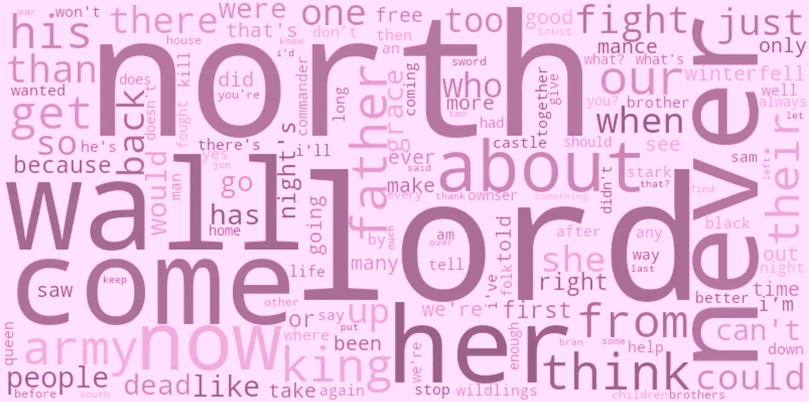
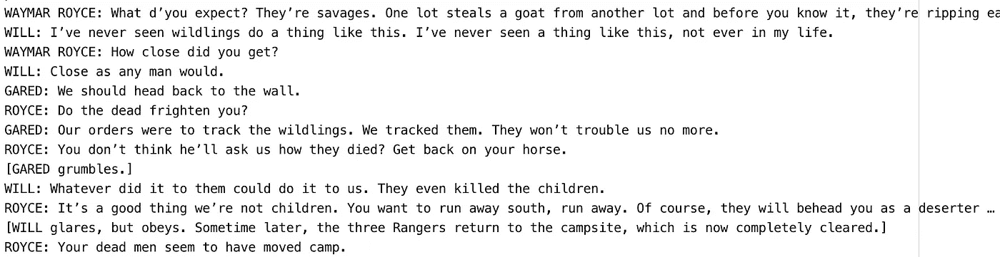
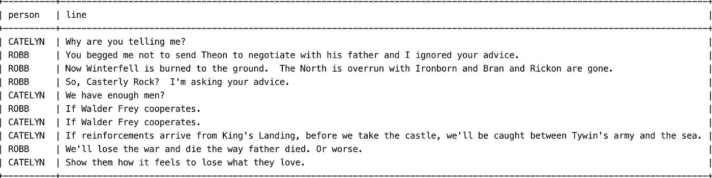
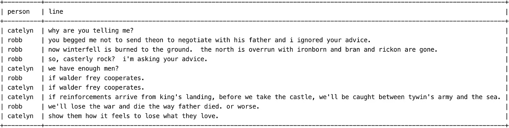
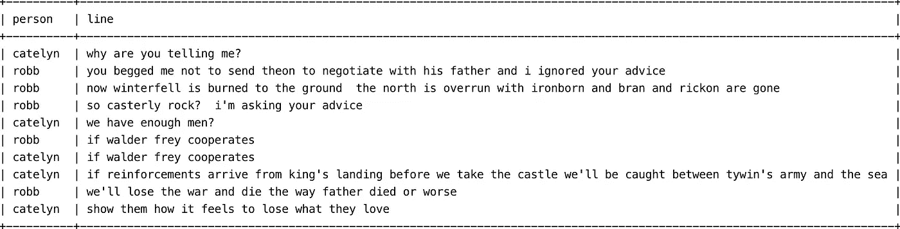
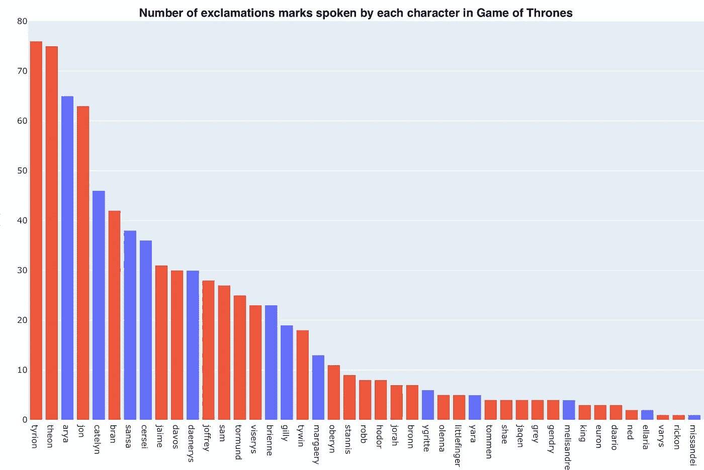
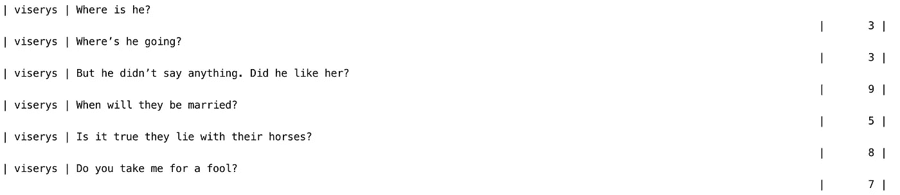
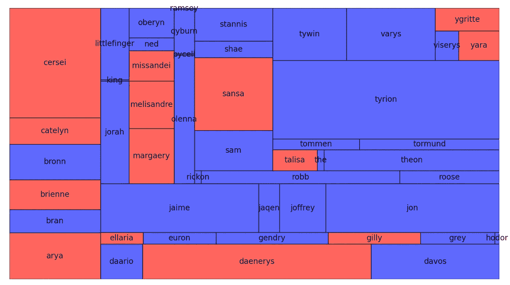

# 让自然语言预处理变得轻而易举的 9 个函数

> 原文：<https://towardsdatascience.com/9-functions-that-make-natural-language-pre-processing-a-piece-of-cake-8b885c151955?source=collection_archive---------16----------------------->

## NLP 最耗时的方面可以总结为快速简单的步骤。表情符号处理奖金。



# 什么是 NLP，为什么它很重要

自然语言处理帮助计算机用人类自己的语言与人类交流。它使计算机有可能阅读文本，听到讲话，翻译它，测量情绪，并确定哪些部分是重要的。

它允许我们和我们的机器发展我们的逻辑、情感和直觉智能，这对当今世界的生存和发展特别有用。

如果您还不是会员，请在此获得您的中级会员资格[！](https://medium.com/@alejandra.vlerick/membership)

## 你会在这篇文章中发现什么——清洁和处理

1.  从文本文件创建熊猫数据帧
2.  将所有单词变为小写
3.  删除标点符号
4.  去掉不必要的空格
5.  使用**正则表达式**删除你将在这篇文章中找到的内容
6.  统计**字符**或**单词的重复次数**
7.  数一行中**字**的**号**
8.  计算一行中**字符**的数量
9.  统计最多的**重复**字
10.  处理 ***表情符号*** 。奖金❤️

## NLP 中一些常用的可视化

1.  词云
2.  树形地图

## 图书馆

我在 Pycharm 上运行我的代码，这些是我在分析的第一部分中使用的库。如你所见，我把事情做得又好又简单:)

```
import pandas as pd
import numpy as np
import regex as re
from collections import Counter
```

## 1.从文本文件创建熊猫数据帧

对于这个例子，我们将使用《权力的游戏》的剧本。每集的文本文件可以在这里找到。

我想做的第一件事是创建一个有两列的熊猫数据帧，第一列是角色的名字，第二列是角色说的台词。



通过添加参数 **sep: ":"** 我们指出列之间的分隔将使用每个冒号。使用 **error_bad_lines=False** 参数，当没有找到冒号时，该行将被删除。这对于我们的非语音行特别有效，比如[GARED grubbles]，我不想保留它。

```
df = pd.read_csv('r"file.txt"**,** sep=":"**,** error_bad_lines=False)
```



## 2.将所有单词变为小写

ASCII 或 UNICODE 编码区分小写和大写字母，因此在我们开始 NLP 分析之前，所有的**单词都是小写是很重要的。否则，我们会得到不必要的重复**

```
df1['name']= df1['name'].str.lower()
df1['line']= df1['line'].str.lower()
```



## 3.用一个字符替换另一个字符

我想去掉这一行中的所有标点符号，我决定保持简单，并使用了 replace()函数。我发现这一步在统计单词重复次数和频率时相当重要。逗号后面的单词将被不同地计数，这使得我的结果非常嘈杂，难以分析。

```
df['line'] = df['line'].str.replace(','**,** '')
df['line'] = df['line'].str.replace('.'**,** '')
```



## 4.去掉不必要的空格

区分“提利昂”和“提利昂”。当试图根据名称合并数据帧时，或者当我们生成单词云时，它们以不同的间距多次计数同一个单词，这会导致许多问题。

```
df1['name'] = df1['name'].str.strip() # Delete preceding spaces
```

## 5.使用正则表达式删除特殊字符分组

最近发现了 Regex，心生敬畏。它是如此强大！

> 一个**正则表达式 *(Regex)*** 是一个定义搜索模式的字符序列。通常，字符串搜索算法使用这种模式对字符串进行“查找”或“查找和替换”操作，或者进行输入验证。它是在理论计算机科学和形式语言理论中发展起来的一种技术。

我注意到，有时带有角色名的那一行会在括号中包含情感和语气指示。使用这些正则表达式可以去掉括号和括号内的所有内容。我们得到了结果

```
Arya (crying and shouting): How dare you!
Arya: How dare you!
```

这种删除可以通过以下函数和正则表达式编码来实现:

```
# Delete everything between the brackets
df['person']=df['person'].str.replace(r"\(.*\)","")
```

另一个方便的 Regex 应用程序的例子是删除 name 列中每个字符的姓。

```
# Delete last name
df['name']=df['name'].str.replace(r"^(\s*(?:\S+\s+){1})\S+",r"\1")
```

## 6.计算字符或单词的重复次数

我想调查一个角色使用感叹号来表达强烈情感的次数。我决定使用 **lambda** 和 **count()** 函数对感叹号进行计数，并创建一个包含总计数的新列。

```
df['exc'] = df['line'].map(lambda x: x.count("!"))
```


一行包含感叹号的次数

完全相同的函数也可以用来计算一个特定单词重复出现的次数。

```
df['queen'] = df['line'].map(lambda x: x.count("Daenerys!"))
```



每个字符使用的感叹号的数量

## 7.计算一行中的字数

*看一下本文末尾的* ***树形图*** *来可视化《权力的游戏》全部 8 季中每个角色说的话的比例。*

```
df['words'] = [len(x.split()) for x in df['line'].tolist()]
```



## **8。计算一行中的字符数**

```
df['characters_nb'] = df.line.apply(len)
```

## 9.统计重复次数最多的单词

这个函数和 6 中的函数的区别在于，这个函数查看所有的单词，并计算它们被说的次数。步骤 6 中的函数搜索输入中给出的单个特定单词。

```
wd = pd.DataFrame(Counter(words.split()).most_common(200), columns=[**'word'**, **'frequency'**])
```

当我们运行这个函数时，我们得到一个字典，映射所有说过的单词和它们被说的次数。

为了只查看一个角色说的话，我可以使用下面的代码行只保留他/她的台词。

```
df = df[df[‘name’] == “arya”]
```

*看看本文末尾的* ***词云*** *来可视化《权力的游戏》全部 8 季中每个角色最常用的词。*

## 10.计算表情符号

我认为添加关于处理表情符号的信息是必要的。它们无处不在，我们必须知道如何充分利用这些新信息。

这是我另一个项目的代码摘录，我在这个项目中分析了一个 WhatsApp 对话。

我导入了表情库，然后使用 append()函数创建了所用表情的列表。然后我用 **Counter()** 函数统计了每个表情符号在列表中出现的次数。我用所有使用的表情符号和它们相应的频率创建了一个字典。最后，我应用了 sorted()函数来枚举和排序使用最多和最少的表情符号。

```
import emojiemojis_df=[]for string in df['line']:
    my_str = str(string)
    for each in my_str:
        if each in emoji.UNICODE_EMOJI:
            emojis_df.append(each)freq = dict(Counter(i **for** sub **in** emojis_df **for** i **in** set(sub))) sort_orders = sorted(freq.items(), key=**lambda** x: x[1], reverse=**True**)
```

对于所有这些功能(尤其是表情符号)的实际应用，看看这篇文章:“WhatsApp 的对话告诉了我们什么关于我们的友谊”

[](/what-whatsapp-conversations-tell-us-about-our-friendships-73ce7104d84e) [## WhatsApp 上的对话告诉我们关于友谊的什么

### 三年的友谊能告诉你什么关于你的交流习惯？

towardsdatascience.com](/what-whatsapp-conversations-tell-us-about-our-friendships-73ce7104d84e) 

# 数据可视化

**看着吓人，其实真的不是！**

首先，我们选择想要分析的角色。然后我按照和表情符号练习完全一样的步骤。列出单词，统计重复次数，创建词典，最后绘制单词云！容易的。

```
from wordcloud import WordCloud**,** STOPWORDS**,** ImageColorGenerator# Choose a character
df = df[df[**'name'**]  == **"cersei"**]*# Make all words lowercase and add them to an array*
words = **''
for** i **in** df.line.values:
    words += **'{} '**.format(i.lower())*# Create a pandas dataframe with the word and its frequency* wd = pd.DataFrame(Counter(words.split()).most_common(200), columns=[**'word'**, **'frequency'**])# Convert the dataframe to a dictionary
data = dict(zip(wd[**'word'**].tolist(), wd[**'frequency'**].tolist()))

wc = WordCloud(background_color=**'white'**,
               stopwords=STOPWORDS,
               max_words=200).generate_from_frequencies(data)
plt.imshow(wc, interpolation=**'bilinear'**)
plt.show()
```

关于颜色、形状和字体，Word Cloud 文档可以在[这里](https://amueller.github.io/word_cloud/)找到。


## 树形地图

这个情节背后的想法是为了形象化电视节目中我和女主角的对话比例。

我把我的数据帧格式化，这样单词就可以按字符计数，每个字符都被赋予一个性别和一种颜色。女人是红色的，男人是蓝色的。我需要改变数据帧的每一列，使其成为熊猫系列。然后，这可以用作使用 squarify.plot()函数的树形图的输入。

```
import squarifydf = df.groupby([**'name'**,**'sex'**, **'color'**])[**'words'**].sum().reset_index()

x1=pd.Series(df[**'name'**])
x2=pd.Series(df[**'words'**])
x3=pd.Series(df[**'color'**])
x2=x2.tolist()
x1=x1.tolist()
x3=x3.tolist()

squarify.plot(
sizes=x2, 
label=x1, 
color =x3,
alpha=.7,
bar_kwargs=dict(linewidth=1, edgecolor=**"#222222"**))plt.show()
```

瞧啊。



对于《权力的游戏》的粉丝来说，看看[这篇](/3-quick-and-easy-data-visualisations-inspired-by-game-of-thrones-37c0e611b9bf)文章:**受《权力的游戏》启发的 3 个快速简单的数据可视化**

[](/3-quick-and-easy-data-visualisations-inspired-by-game-of-thrones-37c0e611b9bf) [## 受《权力的游戏》启发的 3 种快速简单的数据可视化

### 回答这个问题:我在看什么？

towardsdatascience.com](/3-quick-and-easy-data-visualisations-inspired-by-game-of-thrones-37c0e611b9bf) 

# 非常感谢你的阅读！

更多类似的文章，请点击在 Medium [上找到我！](https://towardsdatascience.com/medium.com/@alejandra.vlerick)

如果你有任何关于如何改进的**问题**、**建议**或**想法**，请在下面留下评论或通过 LinkedIn [这里](https://www.linkedin.com/in/alejandra-g-283595b8)取得联系。


照片由[威廉·冈克尔](https://unsplash.com/@wilhelmgunkel?utm_source=unsplash&utm_medium=referral&utm_content=creditCopyText)在 [Unsplash](https://unsplash.com/s/photos/thank-you?utm_source=unsplash&utm_medium=referral&utm_content=creditCopyText) 上拍摄

# Github 知识库

所有代码都可以在 Github [上的 **got_analysis.py** 文件中找到这里](https://github.com/alejandra-gutierrez/Chat_Analysis.git)。