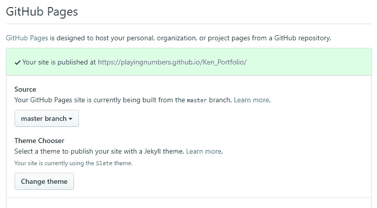

# 9 分钟到达数据科学产品组合网站

> 原文：<https://towardsdatascience.com/9-minutes-to-a-data-science-portfolio-website-80b79ced6c54?source=collection_archive---------41----------------------->

## 如何用 GitHub 页面构建一个简单免费的网络作品集

个人网站是展示你作品的好方法。对于数据科学求职来说，这也是非常有价值的。投资组合使您能够分享您的数据科学项目的高级概述。它比你的简历更深入你的项目，但比你的 github repos 技术性更低，更具说服力。这是招聘人员和数据科学经理的最佳水平。

建立一个简单的投资组合比你想象的要容易。你所需要的只是一个 GitHub 账户和一点 markdown 的知识。不需要 html 或 web 框架！

这种方法使用 GitHub 页面作为网站来提供项目的自述文件。GitHub 托管这些网站，所以它们对你是免费的。这个投资组合只是冰山一角；GitHub 页面也可以用来为你的每个项目制作简单的网站。

在本教程中，我将使用 markdown 建立一个投资组合；然而，如果你想使用更传统的网站创建工具，你也可以使用 html。在我们建立我们的网站后，我们将使用 Jekyll 现有的一个主题，使它更具美感。

**最终结果:**[**【https://playingnumbers.github.io/Ken_Portfolio/】**](https://playingnumbers.github.io/Ken_Portfolio/)

**本教程视频版:**[**https://www.youtube.com/watch?v=1aXk2RViq3c**](https://www.youtube.com/watch?v=1aXk2RViq3c)

## 步骤 1:创建一个新的 GitHub repo

首先，我们创建一个新的 repo 并初始化 README.md 文件。

## 第二步:进入设置，向下滚动到 GitHub 页面部分

单击列表最右侧的“回购设置”选项卡。

向下滚动到 Github 页面框所在的底部。

将源从无切换到**主分支。**

## 第三步:检查你的网站是否正常

单击 GitHub 页面部分顶部的链接，转到您的新网站。

网页应该显示你的 repo 的 README.md 的内容。

恭喜你。你已经有一个工作网站。如果您遇到 404 错误，不要担心。有时候服务器设置需要一点时间(根据我的经验，可能需要 5 分钟)

## 步骤 4:将网站内容添加到 README.md 文件中

因为网页上显示的是自述文件，所以你所要做的就是改变它，在你的网站上显示你想要的内容。你可以使用 markdown 来实现(我强烈推荐这个备忘单[https://github . com/Adam-p/Markdown-here/wiki/Markdown-cheat sheet](https://github.com/adam-p/markdown-here/wiki/Markdown-Cheatsheet))。

如果您已经有了包含详细自述文件的项目，您只需复制并粘贴它们即可。

首先单击自述文件右上角的编辑图标。

接下来，在这一部分填入你想要的网站内容。对我来说，我只是使用了我以前做过的一些项目的项目概述。我还链接了其他的回复，并添加了一些简单的图片。降价指南(如上)告诉你如何做所有这些事情。

您可以单击“预览更改”按钮来查看网页上的所有内容。

要将图片添加到网站，您需要创建一个单独的图像文件夹。您可以使用该文件夹中图像的路径将它们显示在屏幕上。

要在 github 中创建一个 images 文件夹，您可以在 repo 的内容上单击 create new file 按钮。

在文件目标中，键入 images/README.md

当你输入/后，它会自动将图片变成蓝色

然后转到底部，单击“提交新文件”按钮。这里不用添加任何内容。

当你回到你的文件夹时，你应该会看到一个图片文件夹。

现在，点击图片文件夹，上传你想在网站上展示的文件。

要让图片显示在你的网站上，你必须在你的减价中使用以下路径格式:！

## 第五步:选择主题

至此，你应该有了一个非常基础的网站，看起来和你的 github repo 自述完全一样。如果你想添加一些基本的格式，你可以使用 Jekyll 的主题。

为此，您可以再次单击 repo settings 按钮，并返回到 Github Pages 设置框。

这一次你点击“改变主题”按钮。

在顶部，选择您想要的主题，然后单击选择主题。

如果您返回到 repo，您现在应该有一个 _config.yml 文件。这就是管理主题的东西。如果你删除它，主题就会消失。

现在去你的网站，你应该有一个简单的投资组合，使用你选择的主题！