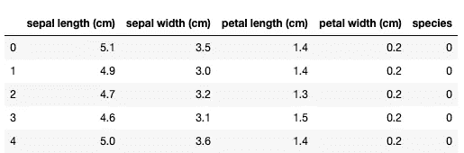
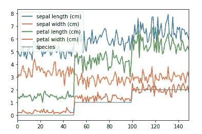

# 9 熊猫有效数据分析的可视化技术

> 原文：<https://towardsdatascience.com/9-pandas-visualizations-techniques-for-effective-data-analysis-fc17feb651db?source=collection_archive---------17----------------------->

## 学习如何使用线形图，散点图，直方图，箱线图，和一些其他可视化技术只使用熊猫图书馆


图片由 [Mediamodifier](https://pixabay.com/users/Mediamodifier-1567646/?utm_source=link-attribution&utm_medium=referral&utm_campaign=image&utm_content=3033203) 来自 [Pixabay](https://pixabay.com/?utm_source=link-attribution&utm_medium=referral&utm_campaign=image&utm_content=3033203)

**简介**

在本文中，我将向您介绍九种不同的可视化技术，它们将帮助您分析任何数据集。大多数这些技术只需要一行代码。我们都喜欢简单，不是吗？

您将学习如何使用:

> 线形图，
> 
> 散点图，
> 
> 面积图，
> 
> 条形图，
> 
> 饼状图，
> 
> 直方图，
> 
> 核密度函数，
> 
> 箱线图，
> 
> 和散点图。

我们将讨论所有上述可视化技术，探索使用它们的不同方法，并学习如何定制它们以适应数据集。

让我们开始吧。

**加载数据集和快速数据浏览**

为简单起见，我们将使用 Iris 数据集，该数据集可通过以下代码从 scikit-learn 库中加载:

```
from sklearn.datasets import load_iris
import pandas as pddata = load_iris()
df = pd.DataFrame(data['data'], columns=data['feature_names'])
df['species'] = data['target']
df.head()
```



如您所见，我们的数据集只有五列。让我们调用数据框上的 info()函数进行快速分析:

```
df.info()
```


如您所见，只有 150 个条目，任何一列都没有丢失值。

此外，我们已经知道前四列有浮点值，而最后一列只允许整数。事实上，从数据集描述中，我们知道*物种*列将只取三个值，每个值代表一种花。

要确认这一点，您可以对该列调用 unique()函数:

```
df.species.unique()
array([0, 1, 2])
```

实际上*物种*列只取三个值:0、1 和 2。

了解了数据集的基本信息，我们就可以进行可视化了。请注意，如果列中有一些丢失的值，您应该删除它们或填充它们。这是因为我们稍后将讨论的一些技术不允许丢失值。

**线条图**

我们将从一个简单的线图开始我们的可视化。我们姑且称之为整个数据框架。

```
df.plot()
```



正如您在这里看到的，它用不同的颜色绘制了所有列值与索引值(x 轴)的关系。当我们不为函数提供 x 轴参数时，这是默认行为。

如你所见，这个图不是很有用。如果 x 轴是时间序列，则折线图是一个不错的选择。然后，我们可能会在数据中看到一些时间趋势。

在我们的例子中，我们只能看到数据是按*物种*列排序的(图中的紫色阶梯)，其他一些列有遵循该模式的移动平均值(花瓣长度，特别是用红色标记的)。

**散点图**

我们将要发现的下一种观想是散点图。这是显示两个连续变量之间相互关系的完美图形。让我们用萼片长度对萼片宽度作图来证明这一点。

```
df.plot.scatter(x='sepal length (cm)', y='sepal width (cm)')
```


正如您所看到的，为了生成这个图形，您需要通过提供它的列名来指定绘图的 x 轴和 y 轴。这张图表显示这两个变量之间没有很强的相关性。让我们检查另一对，*萼片长度*和*花瓣长度*:

```
df.plot.scatter(x='sepal length (cm)', y='petal length (cm)')
```


在这种情况下，我们可以看到，当萼片长度增加时，花瓣长度也增加(萼片长度大于 6 cm 的值更强)。

**面积图**

让我们为数据框创建一个面积图。我将在我的图中包括所有厘米尺寸，但删除*物种*列，因为在我们的例子中没有意义。

```
columns = ['sepal length (cm)', 'petal length (cm)', 'petal width (cm)', 'sepal width (cm)']
df[columns].plot.area()
```


这张图表上的测量值一个压一个。查看此图表，您可以直观地检查图表中包含的每个测量值之间的比率。你可以看到所有尺寸都有向后期条目增长的趋势。

**条形图**

当显示条目的平均值或计数时，这是一种很好的图表类型。让我们用它来计算数据集中每个物种在每个维度上的平均值。

为此，您需要使用 groupby()和 mean()函数。我不打算在这里详细解释它们是如何工作的，但是你可以查看这篇解释这些概念的文章。

```
df.groupby('species').mean().plot.bar()
```


正如你所看到的，这是非常直接的阅读。我可以看到，不同物种和不同列的平均测量值存在差异。

**饼状图**

您可以使用饼图来可视化目标变量的类计数。我们将在这里为我们正在处理的 Iris 数据集做这件事。同样，我们将需要一些助手功能。这次是 groupby()和 count():

```
df.groupby('species').count().plot.pie(y='sepal length (cm)')
```


正如你所看到的，我们的类有完美的比例，因为我们的数据集由每个类的 50 个条目组成。

注意，我们必须在这里使用 *y* 参数，并将其设置为某个列名。我们在这里使用了*萼片长度*列，但它可以是任何列，因为所有列的计数都是相同的。

**直方图**

对于任何连续变量来说，这都是一个完美的可视化。让我们从简单的 hist()函数开始。

```
import matplotlib.pyplot as plt
df.hist()
plt.tight_layout()
```


如您所见，这为数据集中的每个数值变量生成了一个直方图。

我不得不添加一些额外的代码行来定制图表。这是第一个导入行，也是我调用 tight_layout()函数的最后一行。如果不添加，标签和子图名称可能会重叠，并且不可见。

**核密度函数**

与直方图类似，您可以使用核密度函数:

```
df.plot.kde(subplots=True, figsize=(5,9))
```


您可以看到它给出了与直方图相似的结果。

我们必须在这里指定一个图形大小，因为没有它，图形在垂直方向上被挤压得太厉害了。此外，我们已经将 subplots 参数设置为 *True* ，因为默认情况下所有列都将显示在同一个图形上。

**箱线图**

另一个应该用于数字变量的可视化。让我们为所有测量列创建箱线图(我们排除了*物种*列，因为箱线图对该分类变量没有意义):

```
columns = ['sepal length (cm)', 'petal length (cm)', 'petal width (cm)', 'sepal width (cm)']
df[columns].plot.box()
plt.xticks(rotation='vertical')
```


正如你所看到的，所有的箱线图都绘制在同一个图上。这在我们的情况下很好，因为我们没有太多的变量来可视化。

请注意，我们必须旋转 x 标签，因为没有它，标签的名称会相互重叠。

**散点图矩阵图**

这是我最喜欢的熊猫可视化技术之一，因为它可以让你快速分析数据集中的所有数值及其相关性。

默认情况下，它将生成数据框中所有数值变量对的散点图和所有数值变量的直方图:

```
from pandas.plotting import scatter_matrix
scatter_matrix(df, figsize=(10, 10))
```


正如你所看到的，结果就是这组漂亮的图表，它只用一行代码就能告诉你很多关于数据集的信息。我只需浏览一下，就能发现这个数据集中变量之间的一些相关性。

我必须设置的唯一额外参数是图形大小，这是因为图非常小，具有默认的图表大小。

**总结**

我希望你已经喜欢这个关于不同熊猫可视化技术的简短教程，并且你将能够把这些知识应用到你选择的数据集上。

> 制图快乐！

*最初发表于 aboutdatablog.com:* [9 熊猫有效数据分析可视化技术](https://www.aboutdatablog.com/post/9-pandas-visualizations-techniques-for-effective-data-analysis)，*2020 年 5 月 13 日。*

*PS:我正在 Medium 和*[](https://www.aboutdatablog.com/)**上撰写深入浅出地解释基本数据科学概念的文章。你可以订阅我的* [***邮件列表***](https://medium.com/subscribe/@konkiewicz.m) *每次我写新文章都会收到通知。如果你还不是中等会员，你可以在这里加入**[***。***](https://medium.com/@konkiewicz.m/membership)**

**下面还有一些你可能喜欢的帖子**

**[](/sorting-data-frames-in-pandas-a5a3af6f346a) [## 对熊猫中的数据框进行排序

### 如何快速有效地排序数据帧

towardsdatascience.com](/sorting-data-frames-in-pandas-a5a3af6f346a) [](/7-practical-pandas-tips-when-you-start-working-with-the-library-e4a9205eb443) [## 当你开始与图书馆合作时，7 个实用的熊猫提示

### 解释一些乍一看不那么明显的东西…

towardsdatascience.com](/7-practical-pandas-tips-when-you-start-working-with-the-library-e4a9205eb443) [](/jupyter-notebook-autocompletion-f291008c66c) [## Jupyter 笔记本自动完成

### 数据科学家的最佳生产力工具，如果您还没有使用它，您应该使用它…

towardsdatascience.com](/jupyter-notebook-autocompletion-f291008c66c)**