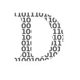
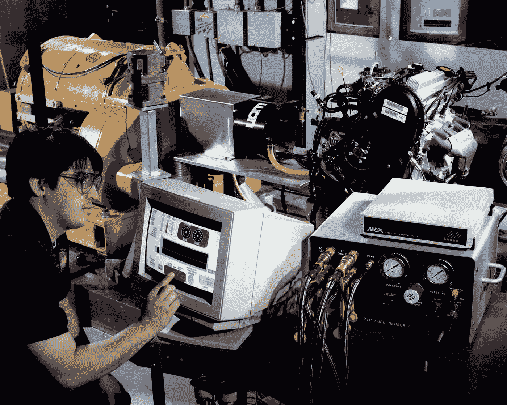
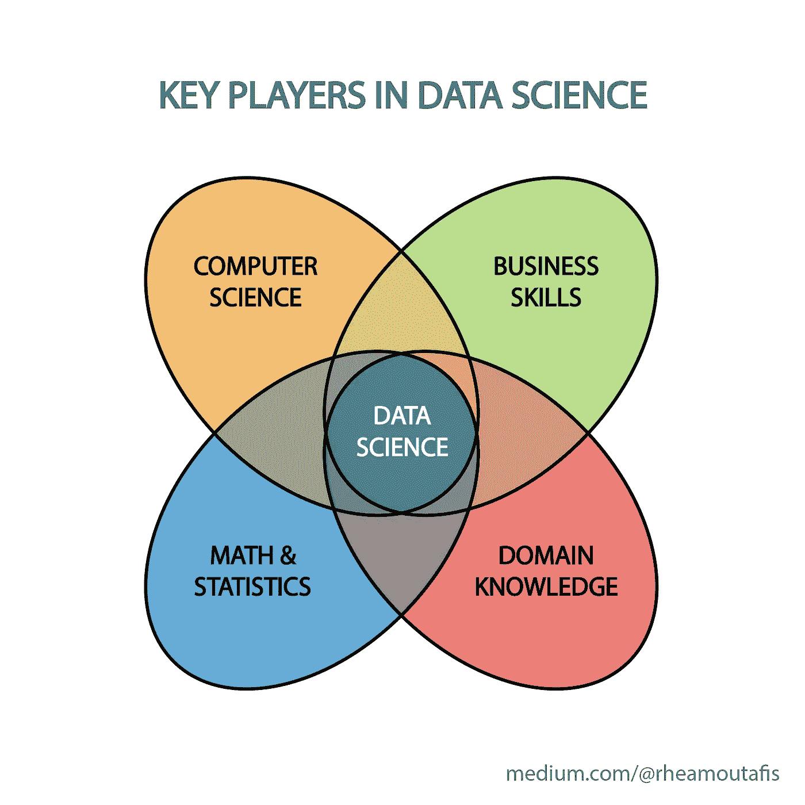

# 你永远不会成为数据科学家的 9 个原因

> 原文：<https://towardsdatascience.com/9-reasons-why-youll-never-become-a-data-scientist-c8c5b75503cf?source=collection_archive---------0----------------------->

## 你需要改变你的心态

数据科学是一个艰难的领域。做好准备。安妮·斯普拉特在 [Unsplash](https://unsplash.com/s/photos/work?utm_source=unsplash&utm_medium=referral&utm_content=creditCopyText) 上的照片

D*isclaimer*:这个故事不是要打击你。更确切地说，它应该是一面长时间的镜子。

你对数据科学充满热情，阅读了几十篇博客文章，完成了几门在线课程。现在你梦想以此为职业。毕竟，根据《哈佛商业评论》的报道，这是 21 世纪最性感的工作。

但是尽管你充满热情，数据科学可能并不适合你。此时此刻，你持有太多的幻想和错误的成见。

现在，你的任务很简单:清除那些阻碍你前进的东西！你会惊讶于自己前进的速度。

## 1.你认为你的学位足够了

你有定量领域的硕士学位，甚至可能是博士学位。现在，您想要在数据科学方面领先一步。

但是你以前用过贝壳吗？当您遇到错误时，您是否感受到了来自命令行界面的威胁？您是否曾经使用过大型数据库——万亿字节规模的数据库？

如果你对这些问题中的一个回答“不”，你还没有准备好。你需要一些真实世界的经验，建立一些真实的项目。只有这样，你才会遇到作为数据科学家每天都会遇到的问题。只有这样，你才能掌握解决问题的技巧。

祝贺你获得学位。现在开始努力工作吧。

 [## 没有量化学位能成为数据科学家吗？

### 一个故事和一些见解

towardsdatascience.com](/can-you-become-a-data-scientist-without-a-quantitative-degree-8046e254fa48) 

## 2.你缺乏激情

你曾经在一个极客项目上投入了整个周末吗？你有没有在你的朋友出去聚会的时候花了一晚上浏览 GitHub？你有没有因为宁愿编码而对自己最喜欢的爱好说不？

如果你不能用“是”来回答以上任何一个问题，那么你不够热情。数据科学是关于面对真正困难的问题，并坚持下去，直到你找到解决方案。如果你不够热情，你会在第一个困难面前退缩。

想想是什么吸引你成为一名数据科学家。是光鲜亮丽的职称吗？或者是通过挖掘大量数据来寻求见解的前景？如果是后者，你的方向是正确的。

没有最起码的激情，你不会成功。布鲁克·卡吉尔在 [Unsplash](https://unsplash.com/s/photos/work?utm_source=unsplash&utm_medium=referral&utm_content=creditCopyText) 上的照片

## 3.你还不够疯狂

只有疯狂的想法才是好主意。作为一名数据科学家，你需要很多这样的东西。你不仅需要接受意想不到的结果——它们经常发生！

但是你也必须为真正困难的问题开发解决方案。这需要一种超乎寻常的水平，是你用正常的想法无法完成的。

如果人们不断地告诉你，你疯了，你正朝着正确的方向前进。如果没有的话，你需要努力克服你的疯狂。

当然，这需要一些勇气。一旦你发泄出你的怪癖，有些人会挠头，背对着你。

但是值得。因为你对自己真实。你点燃了作为一名数据科学家所需要的伟大火花。

## 4.你从教科书和网络课程中学习

不要误解我。教科书和在线课程是一个很好的开始方式。但仅仅是为了开始！

你需要尽快着手真正的项目。当然，如果不能用 Python 编写一行代码，构建 Python 项目是没有意义的。但是一旦你建立了一个适度的基础，就开始行动吧。

边做边学是关键。

开始构建您的 GitHub 投资组合。参加一些黑客马拉松和 Kaggle 比赛。写下你的经历。

每个人都可以做教科书。要成为数据科学家，你必须做得更多。

## 5.你认为你可以在某个时候停止学习

您已经订阅了一些关于数据科学的在线课程，并且正在阅读一些教科书。现在你认为一旦你掌握了这些，你已经学到了足够的东西来突破数据科学。

不对。这还只是开始。如果你认为你现在学到了很多，想想三年后你会学到多少。

如果你最终成为一名数据科学家，你将会学到比现在多十倍的东西。这是一个不断变化的领域，不断需要新技术。如果你一旦找到工作就停止学习，你的轨迹将会从一个数据科学初学者变成一个糟糕的数据科学家。

如果你想在数据科学方面出类拔萃(如果你正在阅读这篇文章，你就会这么做)，你需要面对这样一个事实:随着时间的推移，你的学习曲线将变得更加陡峭。如果你不喜欢大规模学习，就不要梦想成为数据科学家。

做一个数据方面的极客是不够的。在 [Unsplash](https://unsplash.com/s/photos/computer-scientist?utm_source=unsplash&utm_medium=referral&utm_content=creditCopyText) 上[科学高清](https://unsplash.com/@scienceinhd?utm_source=unsplash&utm_medium=referral&utm_content=creditCopyText)拍摄的照片

## 6.你没有其他领域的专业知识

所以你对计算机科学略知一二，你的数学技能也没那么差。你能在数据科学领域找到工作吗？

不，你不会。你在 IT 和数学方面的技能是必不可少的，但不足以让你从所有其他数据科学爱好者中脱颖而出。

数据科学家在各种公司和各种行业工作。为了给你的客户提供关键的见解，你需要了解他们的领域。

例如，下面故事中的 [Kate Marie Lewis](https://medium.com/u/feb55b31bbd5?source=post_page-----c8c5b75503cf--------------------------------) 在六个月后获得了数据科学领域的一个职位。但与众不同的是，作为一名神经科学家，她拥有医疗保健领域的知识。

 [## 我如何在 6 个月内从零编码技能成为数据科学家

### 我用来自学数据科学的 4 个工具没有花一美元

towardsdatascience.com](/how-i-went-from-zero-coding-skills-to-data-scientist-in-6-months-c2207b65f2f3) 

你擅长哪个领域？你在哪些领域有经验？

试着把自己定位成你所在领域的专家，而不是普通的数据科学家。这才是你真正找到工作的方式。

## 7.你缺乏商业技能

所以你更喜欢分析。你喜欢数字和定量分析，你讨厌软技能和人际交往。

这并不能让你成为一个好的数据科学家，我的朋友。即使在定量工作中，软技能也很重要。软技能最终会让你在面试中胜出。

 [## 每个数据科学家都需要向商业领袖学习什么

### 因为软技能很重要。

towardsdatascience.com](/what-every-data-scientist-needs-to-learn-from-business-leaders-47dcf3204076) 

在你能获得的所有软技能中，你的商业技能需要提高。记住你的客户是商业领袖。因此，他们需要懂商业的人。只有这样，你才能产生为客户增值的洞察力。

## 8.你没有有意义的联系

你想在这个领域找到一份工作，但你不认识任何数据科学家同事？是时候开始了，我的朋友。

去聚会。加入 LinkedIn 上的相关群组。了解黑客马拉松上的人。在 Twitter 上关注合适的人。会见 GitHub 项目的其他贡献者。做点刺激的事！

就像任何求职一样，你 90%的成功并不取决于你的技能有多强。这取决于谁能为你提供参考，谁能给你介绍。

如果你在 LinkedIn 上的联系仅限于你妈妈和你那份没有前途的工作的同事，那么是时候提升你的个人资料了。如果你在 Twitter 上的追随者屈指可数，那就发微博吧。如果你的博客没有读者，试试 SEOing 和跨平台营销。

联系会来的。但是你需要先开始破解。

见面吧。合作。建立你的人际网络。布鲁克·卡吉尔在 [Unsplash](https://unsplash.com/s/photos/meeting?utm_source=unsplash&utm_medium=referral&utm_content=creditCopyText) 上的照片

## 9.你不喜欢脏活累活

你已经听到了所有关于机器学习和人工智能的嗡嗡声。你认为数据科学可以打开与尖端技术合作的大门。

也许你会。但我向你保证，你做这件事的时间不会超过你时间的 5%。

一旦你找到了理想的工作，你会花大部分时间清理数据。恭喜你，你刚找到一份看门人的新工作！

如果你不喜欢，回家吧——你不应该读这篇文章。如果你看完这些还想成为一名数据科学家，那你是时候爱上这份脏活了。

 [## 数据科学家:21 世纪最肮脏的工作

### 40%的吸尘器，40%的看门人，20%的算命师。

towardsdatascience.com](/data-scientist-the-dirtiest-job-of-the-21st-century-7f0c8215e845) 

## 数据科学不是职业选择。这是一种职业

数据科学家是非常受欢迎的人——这使得许多人涉足其中。但是要想在这个领域获得一个职位，仅仅涉猎是不够的。你需要努力工作。

如果在读完这个故事后，你仍然坚信要成为一名数据科学家，那么恭喜你。你可能会走上一条非常好的道路。

如果此时你对成为一名数据科学家不确定，找出你怀疑的最大原因。然后开始在这些点上努力。你能做到的！