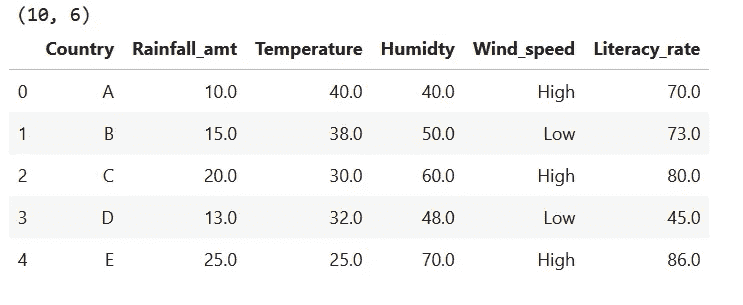
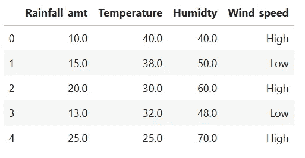
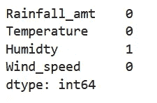
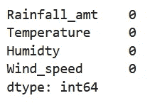
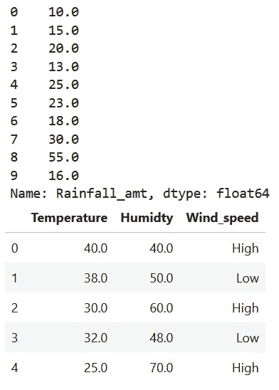
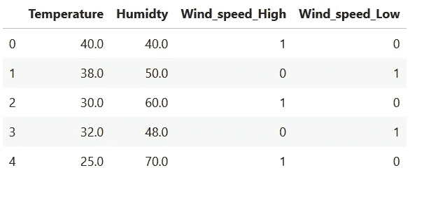
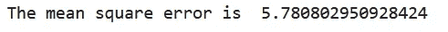
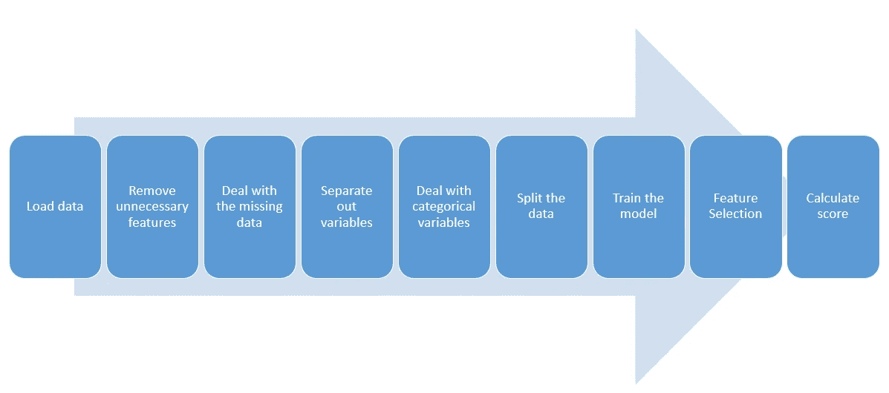

# 模型训练过程中的 9 个步骤需要一个序列

> 原文：<https://towardsdatascience.com/9-steps-in-model-training-process-that-demands-a-sequence-7672a95fcf79?source=collection_archive---------56----------------------->


图片由[皮克斯拜](https://pixabay.com/?utm_source=link-attribution&utm_medium=referral&utm_campaign=image&utm_content=3210944)的 Gerd Altmann 提供

不仅仅是模特训练，生活中的每件事都需要一个顺序。举一个点燃煤气炉的例子:

1)你打开通往炉子的煤气管道阀门。

你打开炉子的旋钮。

3)你传递一个火花去点燃它。

能不能把上面三个步骤重新排一下，还能点炉子？答案是否定的，尝试任何组合，比如先传递一个火花，然后打开炉子的旋钮&然后排好煤气管道。是的，你猜对了，不会有火焰。工程师通常定义操作机器的顺序，他们称之为 sop(标准操作程序)。操作泵的一个简单的标准操作程序是首先将吸入口和排出口排成一行，然后打开它。sop 的定义是为了使流程顺畅、高效、无差错。有些工作非常关键，不定义 SOP 或顺序会造成混乱。

在本文中，我们将讨论在[机器学习](https://www.wildregressor.com/2020/05/machine-learning-overview.html)中模型训练过程的相同程序。我们将考虑一个使用湿度、温度等各种预测因子通过线性回归进行降雨量预测的例子。像其他工程过程一样，顺序在这里也很重要。我们可以称之为“模型训练的一个 SOP”。那么，让我们开始吧。

**第 0 步:加载模块**

我们将从零开始。零，因为这个步骤的位置在这个地方并不重要，你可以根据需要运行它。步骤是首先导入您认为在培训过程中需要的所有必要的模块和类。您在这里错过的任何内容也可以在以后导入。我们这里需要的模块和类导入如下:

```
import pandas as pd
from sklearn.linear_model import LinearRegression
from sklearn.model_selection import train_test_split
from sklearn.metrics import mean_squared_error
```

**第一步:加载数据**

模型训练过程的第一步是获取、查看和理解训练过程中所需的数据。我们将要使用的数据是带有湿度、温度等预测因子的降雨量数据。如前所述。我们将使用 pandas read_csv 函数来导入数据帧，并使用 head 函数来查看它

```
df = pd.read_csv(‘rain_data.csv’) print(df.shape)
df.head()
```



我们先来了解一下数据。这是 10 个国家的数据，它们的名称被标记为 A、B、C…J。因变量是 rain _ AMT，它提到了与特定国家对应的降雨量(mm)。自变量是温度(摄氏度)、湿度(百分比)、风速(高或低)和国家的识字率。数据框的形状是(10，6)，这意味着它有 10 行 6 列。

**第二步:删除不必要的特征**

去掉不必要的功能。您的数据框可能包含许多自变量，您的直觉和经验告诉您这些自变量与因变量无关，因此是不需要的。去除这些额外的信息是必要的，因为为什么要携带垃圾。

在我们的数据框架中，我们不需要国名和识字率，因为这两个变量与降雨量无关。

```
df.drop([‘Country’,’Literacy_rate’], inplace = True, axis = 1) df.head()
```



**第三步:处理缺失数据**

处理丢失的数据。不是每个数据集都是干净的。缺失的价值观无处不在。有必要预先处理丢失的值，以便它们不会影响流程的其余部分。您可以用多种方法处理缺失值。您可以删除包含缺失值的整行，也可以用某个常量值或某个统计值等来替换它们。

让我们首先检查数据框中是否有缺失值:

```
df.isnull().sum()
```



我们在湿度栏下缺少一个值。让我们用湿度的平均值来代替它:

```
df[‘Humidty’].fillna(df[‘Humidty’].mean(), inplace = True)df.isnull().sum()
```



我们的数据现在没有丢失的值，因此我们可以继续。

**第四步:分离出变量**

从你的数据集中分离出因变量。既然丢失的值都不见了，是时候分别查看因变量和自变量了。为什么会这样，你会知道的。

在我们的数据框架中，rain _ AMT 列包含因变量的数据，其余变量是独立的。我们把降雨量 _amt 分离出来，称之为 **Y.**

```
Y = df.pop(‘Rainfall_amt’) 
print(Y) 
df.head()
```



**第五步:处理分类变量**

模型训练程序无法处理分类变量；它需要数字来处理它们。所以是时候处理分类变量了。您可以用数字替换分类值，比如用 0 替换女性，用 1 替换男性，或者您可以使用一键编码，只要适合您。

我们的数据框包含 Wind_speed 列下的分类值。让我们用一键编码来编码它们。

```
df = pd.get_dummies(df)
df.head()
```



风速列被分成两列，风速高和风速低。值 1 表示存在，0 表示不存在。

**第六步:拆分数据**

将数据分为训练集和测试集。根据具体情况，该步骤可以被认为是可选的。在没有向我们提供测试数据文件的场景中，我们需要分割提供给我们的数据，以制作测试数据框架，用于稍后测试我们的模型。

我们的数据帧只有 10 行，因此对其进行分割是不实际的，但我们仍将以 70:30 的训练:测试比率对其进行分割，以理解这一概念。

```
x_train, x_test, y_train, y_test = train_test_split(df, Y, test_size = 0.30)
```

**第七步:训练模型**

这是使用期待已久的拟合模型功能的时候了。到目前为止的等待和上面的 7 个步骤都是值得的。因此，让我们在训练数据上拟合回归模型:

```
lr = LinearRegression() 
lr.fit(x_train, y_train)
```

**第八步:特征选择。**

这一步是最重要的，也是经常被业余爱好者忽略的。当你有了合适的模型，是时候计算哪些特征或独立变量对你的模型真正重要了。总之如果可能的话，我们再废话少说。

特征选择是一个广泛的话题，涉及许多技术。大多数专家会争论这一步的位置是否符合模型。我们将把这一部分留在没有代码的地方，并把它当作一项任务，让读者了解更多。你可以先阅读[的这篇](https://scikit-learn.org/stable/modules/feature_selection.html)文章

**第九步:计算分数**

使用测试数据集进行预测并计算指标，以了解拟合模型的表现。我们将计算均方差来了解相同的情况。

```
print(‘The mean square error is ‘,mean_squared_error(lr.predict(x_test),y_test))
```



以上所有步骤将构成一个典型的培训标准操作程序。这个序列有它自己的含义。像煤气炉的例子，我们不能只是重新安排步骤，继续进行。例如，假设**步骤 4:**在**步骤 3:【处理缺失值】**之前，您将拥有独立变量和因变量的独立数据。现在，如果在处理缺失值时，这里或那里的几行数据帧被丢弃，这将导致数据帧长度不匹配，并将产生错误。如果碰巧连大小也匹配，这可能会在模型中产生偏差，想象一下删除因变量数据中的第 3 行和自变量数据中的第 5 行。它要么产生错误，要么使结果和模型产生误导。整个过程顺序如下图所示:



上述步骤可以形成递归训练过程的一个循环。大多数时候，我们最后得到的分数并不令人满意，因此整个过程一次又一次地重复。

我希望你喜欢这篇文章。请发表您的评论。如有任何疑问，您也可以通过 LinkedIn[**联系我。**](https://www.linkedin.com/in/tanvirhurra/)

谢谢，

祝你玩得愉快😊

这篇文章也发表在[茶统计](https://www.teastatistic.com/2020/05/9-steps-in-model-training-process-that.html)上