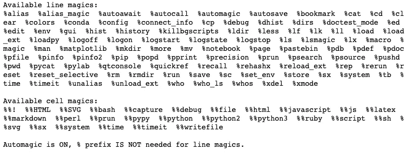
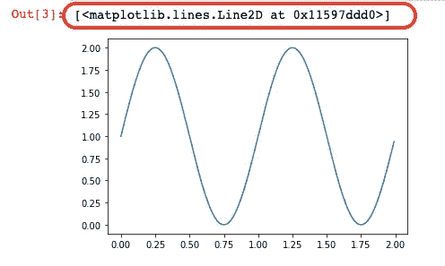
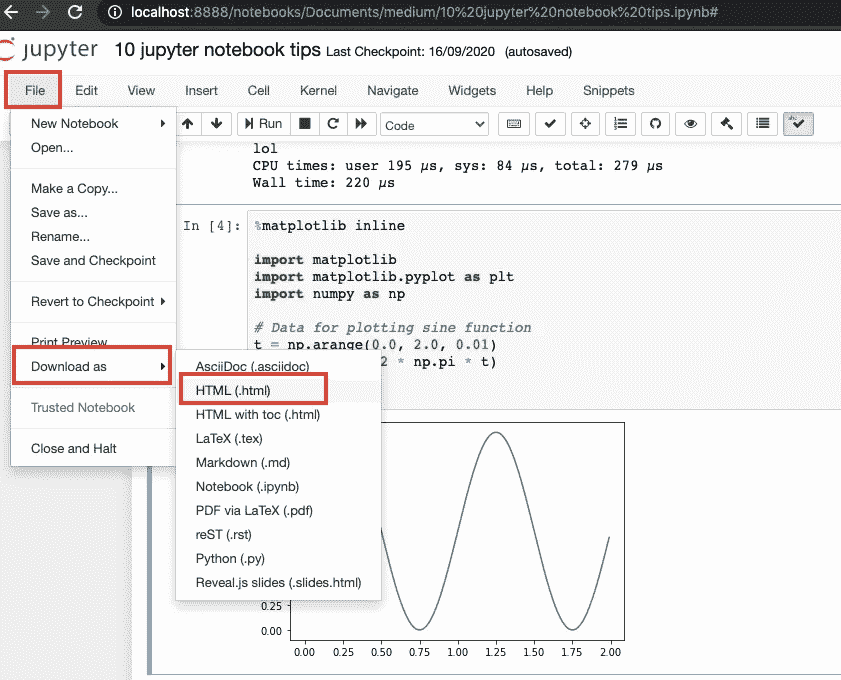
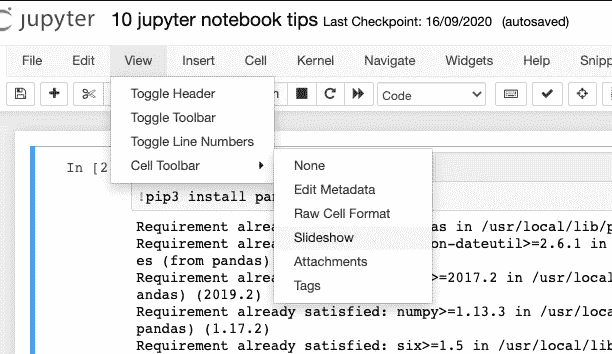
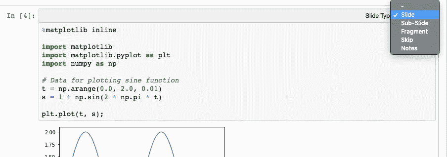
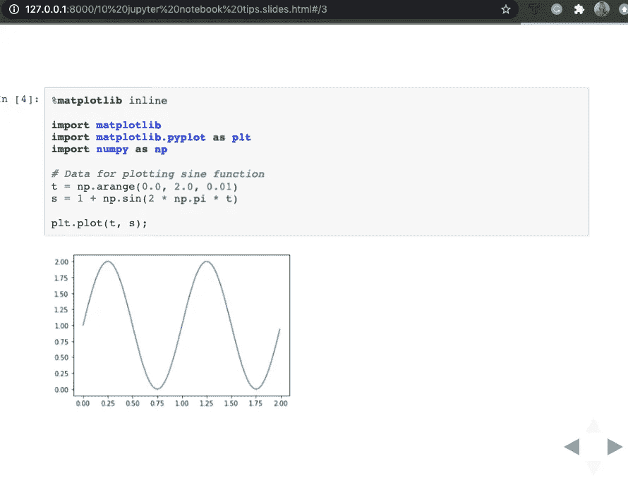
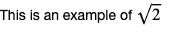

# 关于 jupyter 笔记本你不知道的 9 件事

> 原文：<https://towardsdatascience.com/9-things-you-did-not-know-about-jupyter-notebook-d0d995a8efb3?source=collection_archive---------14----------------------->

## 用这些建议提高你的工作效率


图片来自 [Pixabay](https://pixabay.com/?utm_source=link-attribution&utm_medium=referral&utm_campaign=image&utm_content=1834294) 的[像素](https://pixabay.com/users/Pexels-2286921/?utm_source=link-attribution&utm_medium=referral&utm_campaign=image&utm_content=1834294)

作为一名数据科学家，您将每天使用 jupyter notebook。尽可能熟悉这个工具是至关重要的。

在本文中，我将分享一些我在使用这个工具时使用的 Jupyter 笔记本技巧。这些提示将帮助您更加熟悉笔记本电脑本身，并提高您的工作效率。

让我们开始吧。

**1。你可以从 jupyter 笔记本**运行 shell 命令

你们中的许多人将熟悉在 Jupyter notebook 中运行 python 代码，并使用 markdown 来创建描述和文本。有些人可能不知道您可以从笔记本本身运行 shell 命令。

为此，您可以在代码单元格中输入命令。该命令的格式与它在 shell 中的格式相同，但是它还附加了一个感叹号(！).

例如，您可以将安装包与 pip 一起使用。

```
!pip install pandas
```

或者您可以检查您安装的软件包的版本。

```
!pip show pandas
```

您还可以使用标准 shell 命令，例如:

```
!pwd
!ls
```

所有这些都不需要打开外壳本身。这意味着在笔记本和终端之间切换不会浪费时间！

**2** 。**朱庇特笔记本有魔法命令。**

如果您使用 shell 命令，您会注意到有些命令无法执行。这种情况的一个例子是“cd”命令。为了证实这一点，您可以在 jupyter notebook 中运行以下代码。

```
!pwd
!cd <directory name>
!pwd
```

请注意，第一个和第二个“pwd”命令将产生相同的路径。原因是这些 shell 命令是在临时子 shell 中执行的。

为了有效地更改目录，您将需要一个神奇的命令。

```
%cd <directory>
```

魔术命令是帮助你运行和分析你的笔记本中的数据的特殊命令。如果它们在一行代码中，则按%处理；如果它们写在几行代码中，则按%%处理。

最有用的魔术命令之一是列出所有魔术命令的命令。

```
%lsmagic
```



解释所有神奇的命令需要整篇新文章，所以让我们仅限于几个例子。

您可以在 jupyter 笔记本上运行 python 文件，方法是:

```
%run <file name>
```

或者可以用下面的代码来计时单元格的执行。

```
%% time

<your code>
```

你可能见过这个神奇的命令，但不知道它是什么。

```
%matplotlib inline
```

以上确实是一个几乎伴随每一个笔记本的神奇命令。它用于在笔记本本身中呈现您的图形。

**3。您可以使用快捷方式更快地浏览笔记本。**

您是否使用图形用户界面浏览过笔记本电脑？

> 停下来。

是时候学习 jupyter 笔记本快捷键了。您可以使用“Enter”和“Esc”在命令和编辑模式之间切换。

进入命令模式后，您可以使用以下快捷键:

*   在当前单元格上方添加一个新单元格，
*   **b** 在当前单元格下方添加一个新单元格，
*   **d + d** (d 按两次)删除当前单元格，
*   **m** 将单元格从编码改为降价，
*   **y** 将单元格从 markdown 改为 code，
*   **上下箭头**使用箭头改变当前单元格，
*   **shift + enter(同时按下)**运行单元格中的代码。

还是不确定怎么做？我过去写过一篇文章对此有更好的解释。

[](https://medium.com/towards-artificial-intelligence/jupyter-notebook-keyboard-shortcuts-for-beginners-5eef2cb14ce8) [## Jupyter 笔记本键盘快捷键，适合初学者

### 使用 Jupyter 笔记本编辑器时，了解提高工作效率的最重要的快捷方式。

medium.com](https://medium.com/towards-artificial-intelligence/jupyter-notebook-keyboard-shortcuts-for-beginners-5eef2cb14ce8) 

**4。您可以用分号取消 final 函数的输出。**

如果您已经使用 Jupyter notebook 有一段时间了，您可能已经注意到它会自动呈现单元格执行的最后一个函数的输出。这通常是我们想要的行为，但不是在所有情况下！

在笔记本里渲染图形的时候特别烦人。我们来看正弦函数作图的例子。

```
%matplotlib inline

import matplotlib
import matplotlib.pyplot as plt
import numpy as np

# Data for plotting sin function
t = np.arange(0.0, 2.0, 0.01)
s = 1 + np.sin(2 * np.pi * t)

plt.plot(t, s);
```

如果您在 Jupyter 笔记本中运行此命令，您将得到类似于以下内容的输出:



请注意，我用红色标记了该图的输出。这些信息通常与我们的分析无关，我们可以通过在代码块的最后一行添加一个分号来隐藏它。

```
plt.plot(t, s);
```

**5。Jupyter 笔记本具有内置的自动完成功能。**

你们中的一些人可能已经知道了，但是对于那些不知道的人来说，这将是一个非常有用的特性。为了使用它，您可以开始键入代码，然后按“Tab”按钮，以便查看自动完成建议。

如果您想了解更多关于自动完成的细节，请查看这篇文章。

[](/jupyter-notebook-autocompletion-f291008c66c) [## Jupyter 笔记本自动完成

### 数据科学家的最佳生产力工具，如果您还没有使用它，您应该使用它…

towardsdatascience.com](/jupyter-notebook-autocompletion-f291008c66c) 

**6。您可以将 jupyter notebook 导出为 HTML 文件。**

您可能已经注意到，Jupyter 笔记本保存为。ipynb 文件。如果你把这个发给一个数据科学家或者程序员，他们可能会毫无问题地打开它。

但是如果你想和非技术人员分享你的笔记本会怎么样呢？您可以向他们发送 HTML 版本，他们将能够看到您笔记本的渲染版本。

这很简单。只需导航到文件-> Downloas as -> .HTML。



7。您可以从 Jupyter 笔记本创建演示文稿。

您是否使用过 Microsoft PowerPoint 或 Google slides 来创建演示文稿？虽然这些都是不错的选择，但可能还有更好的方式来制作技术演示文稿。

您可以使用 Jupyter 笔记本本身创建演示文稿。这样做的好处是，您可以重复使用笔记本中已经使用过的内容。它允许您选择要用于演示文稿的单元格、如何组织它们以及跳过哪些幻灯片。

当您的笔记本准备就绪时，您可以通过进入“视图”->“单元格工具栏”->“幻灯片”来创建演示文稿。



一旦你这样做了，每个单元格的右上角应该有一个幻灯片类型选项。你可以选择销售是幻灯片，子幻灯片，片段，笔记，或跳过决定跳过它。



决定每种幻灯片类型后，您可以通过在终端窗口中运行以下命令来呈现您的演示文稿:

```
jupyter nbconvert <notebook name> --to slides --post serve
```

或者从笔记本上运行下面的命令。

```
!jupyter nbconvert <notebook name> --to slides --post serve
```

这应该会在本地主机上运行的新选项卡中呈现演示文稿。



您可以使用右下角的箭头浏览演示文稿。

适应 Jupyter 笔记本演示需要时间，因此我建议您尝试一下不同的幻灯片类型，以便学习如何有效地使用它们。一旦您掌握了它，jupyter 笔记本可能会成为您创建技术演示文稿的首选工具。

**8。你可以在 Jupyter 笔记本上用 LaTeX 做公式。**

这是一个简单的提示，可以让你在笔记本上输入数学公式。您可以使用 LaTeX 语法创建一个公式，然后将其嵌入到 markdown 单元格中。

让我们来看一些例子。实际上，有几种方法可以做到这一点，这取决于您希望公式呈现的位置。

如果你想让数学代码与文本一致，你可以使用一个美元符号。

```
This is an example of $\sqrt{2}$
```



或者，如果您希望公式呈现在单元格的中间，您可以使用两个美元符号($$)，如下所示。

```
$$\sqrt{2}$$
```


看看这个更复杂的公式，看看它在笔记本上渲染的有多漂亮！

```
$$\sum_{i=1}^{n}i=\frac{n(n+1)}{2}$$
```


**9。您可以安装扩展来进一步增强 Jupyter 笔记本的功能。**

你觉得 Jupyter 笔记本的能力不够吗？实际上，您可以安装扩展来访问一些附加功能。

不久前，我写了一篇文章，介绍了我最喜欢的 jupyter 笔记本扩展。

[](/top-9-jupyter-notebook-extensions-7a5d30269bc8) [## 9 大 Jupyter 笔记本扩展

### 改进笔记本电脑功能，提高您的工作效率

towardsdatascience.com](/top-9-jupyter-notebook-extensions-7a5d30269bc8) 

如果您想了解如何在笔记本中启用扩展以及如何使用以下扩展，请阅读本手册:

*   拼写检查器，
*   目录，
*   可折叠标题，
*   Autopep8，
*   执行时间，
*   切换所有行号，
*   变量检查器，
*   隐藏代码，
*   跳过追溯。

**总结**

这些是我最喜欢的 Jupyter 笔记本实用技巧。这是一个令人惊奇的工具，遗憾的是有时我们没有使用它的所有功能。

我希望你已经学到了一些新的东西，并且下次你在吃 jupyter 笔记本的时候能够复制一些技巧。

*原载于 aboutdatablog.com:* [关于朱庇特笔记本你不知道的 9 件事](https://www.aboutdatablog.com/post/9-things-you-did-not-know-about-jupyter-notebooks)，*2020 年 9 月 23 日。*

*PS:我正在 Medium 和*[***aboutdatablog.com***](https://www.aboutdatablog.com/)*上撰写以简单易懂的方式解释基本数据科学概念的文章。你可以订阅我的* [***邮件列表***](https://medium.com/subscribe/@konkiewicz.m) *在我每次写新文章的时候得到通知。如果你还不是中等会员，你可以在这里加入*[](https://medium.com/@konkiewicz.m/membership)**。**

*下面还有一些你可能喜欢的帖子*

*[](/best-data-science-books-be1ab472876d) [## 最佳数据科学书籍

### 帮助您学习数据科学的前三本书

towardsdatascience.com](/best-data-science-books-be1ab472876d) [](/medium-writers-you-should-follow-as-an-aspiring-data-scientist-13d5a7e6c5dc) [## 作为一名有抱负的数据科学家，你应该关注的中型作家

### 我最喜欢的 10 个数据科学博主，让你的学习之旅更轻松。

towardsdatascience.com](/medium-writers-you-should-follow-as-an-aspiring-data-scientist-13d5a7e6c5dc) [](/terminal-for-data-scientists-3615159e936c) [## 数据科学家的终端

### 学习你的第一个命令

towardsdatascience.com](/terminal-for-data-scientists-3615159e936c)*