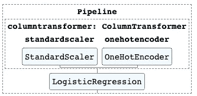

# 关于 Scikit 你应该知道的 9 件事-学习 0.23🎉

> 原文：<https://towardsdatascience.com/9-things-you-should-know-about-scikit-learn-0-23-9426d8e1772c?source=collection_archive---------45----------------------->

## 了解 Python 机器学习库的最新版本

Scikit-learn 版本 0.23.0 于 2020 年 5 月 12 日发布。以下是你应该知道的最重要的变化，这样你就能给你的书呆子朋友留下深刻印象。🤓


资料来源:pixabay.com

# 需要注意的 9 处变更

## 1.仅限 Python 3.6 或更高版本🐍

使用 scikit-learn 0.23 需要 Python 3.6 或更高版本。不再有 Python 3.5。这是升级的好借口，如果你需要的话。🙂

## 2.交互式管道图形⬇

现在，您可以在笔记本电脑中以交互式图形的形式直观显示您的管道。数据从上到下流动。从技术上讲，你是在可视化一个 DAG(有向无环图)。这里有一个例子:



你可以在 GitHub [这里](https://github.com/discdiver/sklearn-0.23.0/tree/58fe12098c77be6ff8cccba14b7588eff2dd3572)看到这篇文章附带的代码。

只需添加以下代码，制作并安装一个管道，图形就出现了！😀

`sklearn.set_config(display=”diagram”)`

管道是 scikit 的一大特色——学习！管道和列转换器功能强大，但对于新手来说可能很难掌握。这些图表可以帮助人们更快地学习和理解正在发生的事情。👏

一个`ColumnTransformer`对象允许不同的转换应用于不同的特征。我建议你用`make_column_transformer`方便法创建它们。注意，如果您使用`passthrough`参数不加修改地传递列，这不会显示在 DAG 上。☝️

## 3.泊松和伽马射线已经到达🎉

泊松和伽马广义线性模型可以分别用`[linear_model.PoissonRegressor](https://scikit-learn.org/dev/modules/generated/sklearn.linear_model.PoissonRegressor.html#sklearn.linear_model.PoissonRegressor)` 和`[linear_model.GammaRegresso](https://scikit-learn.org/dev/modules/generated/sklearn.linear_model.GammaRegressor.html#sklearn.linear_model.GammaRegressor)r`**导入。现在，如果您需要 scipy.stats 或 statsmodels 的功能，您不需要离开 scikit-learn。**

**泊松回归通常适用于计数数据，伽玛回归通常适用于预测两个泊松事件之间的时间。如果你正在寻找更多关于何时使用伽马 GLM 的信息，请看[这篇交叉验证的文章](https://stats.stackexchange.com/q/67547/198892)。**

## **4.呼叫`fit()`并不能显示所有信息🚫**

**`fit()`方法返回您调用它的估计器。现在，如果您打印评估程序，将只显示您更改了默认值的参数。**

**要像在早期版本中一样，在每次打印评估器时显示所有参数，请运行以下代码:**

**`sklearn.set_config(print_changed_only=False)`**

**或者，只需调用估计器上的`get_params()`方法来查看参数。😀**

***2020 年 5 月 14 日更新，以澄清措辞。向尼古拉斯拥抱致敬。***

## **5.n_features_in_ 向您显示有多少功能🔢**

**大多数估算器现在公开了`n_features_in_`属性来显示有多少特性被传递给了`fit()`方法。**

**请注意，使用 OneHotEncoder `n_features_in`的管道将向您显示有多少功能进入，而不是有多少适合最终模型。☝️**

## **6.更简单的样本数据集加载🧭**

**大多数样本数据集可以更容易地加载到 pandas 数据框架中。只需通过论证`as_frame=True`。那么`.frame`属性就是一个包含 X 和 y 列的数据帧。**

**例如，以下是加载糖尿病数据集的方法:**

```
diabetes = load_diabetes(as_frame=True)
df_diabetes = diabetes.frame
```

***2020 年 5 月 25 日更新添加。框架属性。* [*帽子尖到*](https://medium.com/u/a9e4103439ec?source=post_page-----9426d8e1772c--------------------------------) *。***

**`.data`属性是没有目标列的 DataFrame。**

**`.target`属性是一系列目标列。**

**从 scikit-learn 加载数据集曾经有点麻烦。现在比较容易，但还是没有 seaborn 那么容易。请注意，`load_boston()`返回波士顿住房数据集，但还没有实现`as_frame`。☝️**

****

**波士顿。资料来源:pixababay.com**

## **7.避免键入提示错误⚠️**

**Scikit-learn 现在可以和 mypy 一起工作而不会出错。如果你使用类型提示，这很好。😀**

## **8.🧪实验班的改进**

**`[HistGradientBoostingRegressor](https://scikit-learn.org/stable/modules/generated/sklearn.ensemble.HistGradientBoostingRegressor.html)`和`[HistGradientBoostingClassifier](https://scikit-learn.org/stable/modules/generated/sklearn.ensemble.HistGradientBoostingClassifier.html)`，这两个受 [LightGBM](https://github.com/Microsoft/LightGBM) 启发的树集成算法，仍处于实验阶段。它们仍然需要特别进口。然而，他们得到了一些改进。与`[IterativeImputer](https://scikit-learn.org/stable/modules/generated/sklearn.impute.IterativeImputer.html)`相同——它仍然是实验性的，并且已经被改进。**

## **9.和新熊猫一起玩更好🐼**

**说到 scikit-learn 估算器，它们现在接受 pandas 可空整数 dtype 和缺失值——参见[我关于 Pandas 1.0 新特性的文章](/whats-new-in-pandas-1-0-ffa99bd43a58)来了解这些。熊猫和 scikit-learn 之间的持续摩擦对我来说是天籁之音。**

****

**音乐。资料来源:pixabay.com**

**0.23.0 版的完整发行说明可从[这里](https://scikit-learn.org/stable/whats_new/v0.23.html)获得。这些文档是目前稳定的文档，可以在[这里](https://scikit-learn.org/0.23/)获得。感谢所有为这次发布做出贡献的人！👍**

# **包装**

**您已经看到了 scikit-learn 0 . 23 . 0 版中 9 个最重要的变化。现在你可以用你的知识打动你的朋友和同事。😉**

**我希望这个指南对你有所帮助。如果你有，请在你最喜欢的社交媒体上分享，这样其他人也可以找到它。😀**

**我写关于 [Python](https://memorablepython.com) 、 [SQL](https://memorablesql.com) 、 [Docker](https://memorabledocker.com) 、数据科学和其他技术主题的文章。如果你对此感兴趣，请关注我并在此阅读更多。如果你想了解最新的数据科学技巧和工具，请订阅我的 [Data Awesome 邮件列表](https://dataawesome.com)。**

**[](https://dataawesome.com)**

**sklearning 快乐！🚀**