# Jupyter + TensorFlow 搭配谷歌云…90 秒！

> 原文：<https://towardsdatascience.com/90-second-setup-challenge-jupyter-tensorflow-in-google-cloud-93038bcac996?source=collection_archive---------15----------------------->

## 数据科学初学者有可能在 2 分钟内启动并运行吗？

数据科学爱好者们，从零到谷歌云 Jupyter 笔记本能有多快？让我们来了解一下！

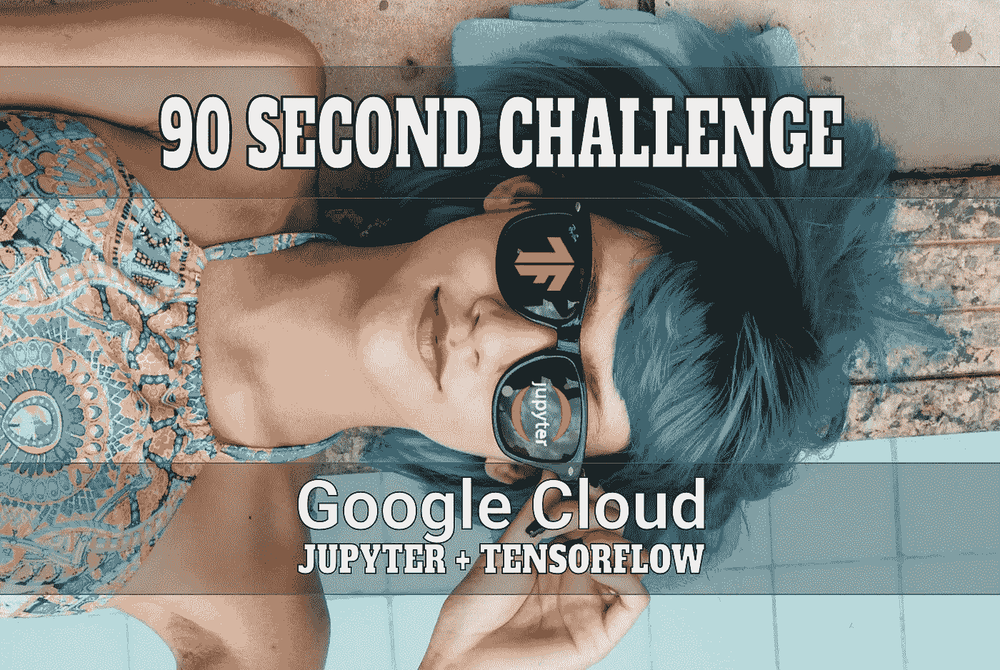

图片:[来源](https://pixabay.com/photos/blue-sunglasses-woman-swimming-pool-2705642/)。

# 定制还是不定制？

如果你想对你的设置进行超级定制，[谷歌云](http://bit.ly/gcp-hello)会给你令人眼花缭乱的粒度。对于开始企业级项目的团队来说，这是一件令人难以置信的事情，它会扩大你削减的每个角落的后果。

> 初学者必须在众多选项中跋涉才能入门吗？

但是，如果你是一个只想玩玩[数据科学](http://bit.ly/quaesita_datascim)笔记本的初学者，该怎么办呢？你必须在选择的森林中跋涉才能开始吗？好消息:你没有。您可以在 90 秒内启动并运行！(请随意跳到下面的演练。)

> 您可以在 2 分钟内启动并运行！(下面走一遍。)

如果这是你第一次，我打赌你可能特别渴望尽快到达`hello world`。你会想跳过控制面板，使用别人的安装解决方案。如果是这样，你会爱上谷歌云[市场](https://bit.ly/gcpmarketplace)！

# 什么是市场？

欢迎来到预先烘焙的[机器图像](http://bit.ly/quaesita_mimag)合集，你可以用它作为自己工作的跳板。是的，如果需要的话，您可以在以后定制这些第三方模板(点击了解更多[)。](http://bit.ly/quaesita_mimag)

> 预烘焙模板的集合。

# 90 秒挑战

序言够了！让我们看看是否有可能在 2 分钟内从零到英雄。我将在下面分解这些步骤——这只是证明它是可行的。我们开始吧:

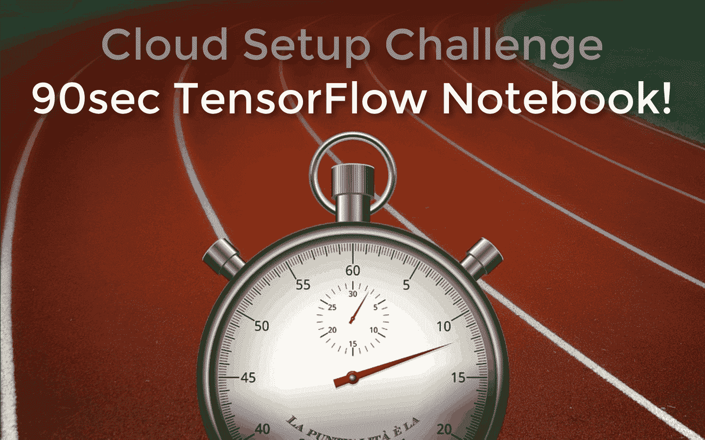

我屏幕上的这段记录向你展示了在 90 秒内开始是可能的，但是你酸痛的眼睛可能更喜欢下面的一步一步截图指南。

# 我们刚刚看了什么？

第一，我们有哪些*没看的*？步骤 0.1–0.3。

## 步骤 0.1:创建谷歌账户

你需要一个[谷歌账户](https://bit.ly/myaccountgoogl)才能使用谷歌云。我已经有一段时间了，所以没有显示出来。

## 步骤 0.2:打开谷歌云控制台

我的视频从谷歌云仪表盘屏幕开始，你可以点击[console.cloud.google.com](https://bit.ly/consolecloudgoogle)进入。第一次使用的用户会被提示一些日常用品。

## 步骤 0.3:创建新项目

我用的是我做的一个项目，名为 *ItsTimeForDemos* 。为了创建一个新项目，我点击了仪表板的这一部分:

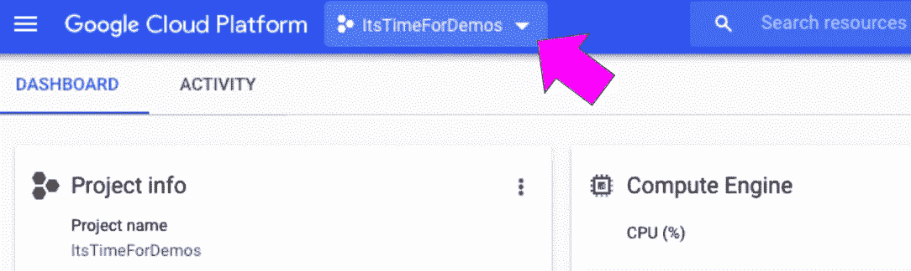

现在我们准备好了，让我们检查一下我们在屏幕上看到的内容。

## 第一步:去市场！

为了跳过重新发明自己的轮子，你将前往谷歌云[市场](https://bit.ly/gcpmarketplace)。

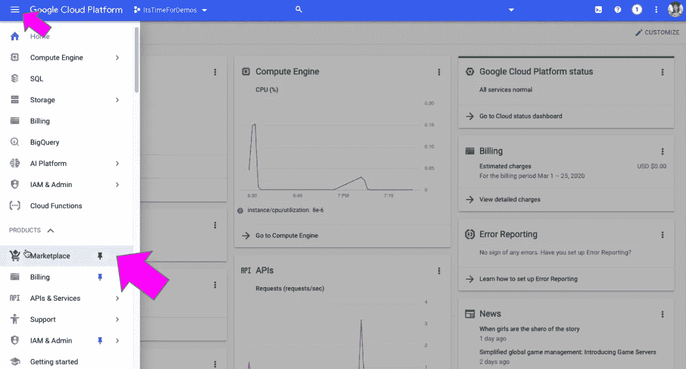

## 第二步:寻找你需要的解决方案

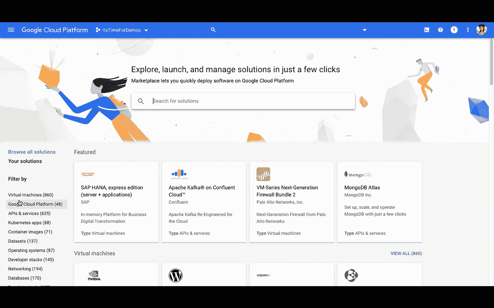

在搜索栏里，我会输入关键词“ *ai cpu。*”

*为什么* [*AI*](http://bit.ly/quaesita_ai) *？我想用一台支持人工智能的笔记本来做这个演示。如果你在找别的东西，只需问搜索栏。这里几乎有 2000 个解决方案。*

*为什么是 CPU？这是最普通的选择。更强大的硬件——比如 GPU——更强大……这通常也意味着它更贵，并且会更快地消耗掉你的 300 美元免费积分。除非您已经知道为什么需要 beast 选项，否则从它的轻量级同类开始可能是个好主意。*

## 第三步:选择你的赢家

在解决方案中，我选择了 TensorFlow Jupyter 笔记本。你喜欢什么就挑什么。

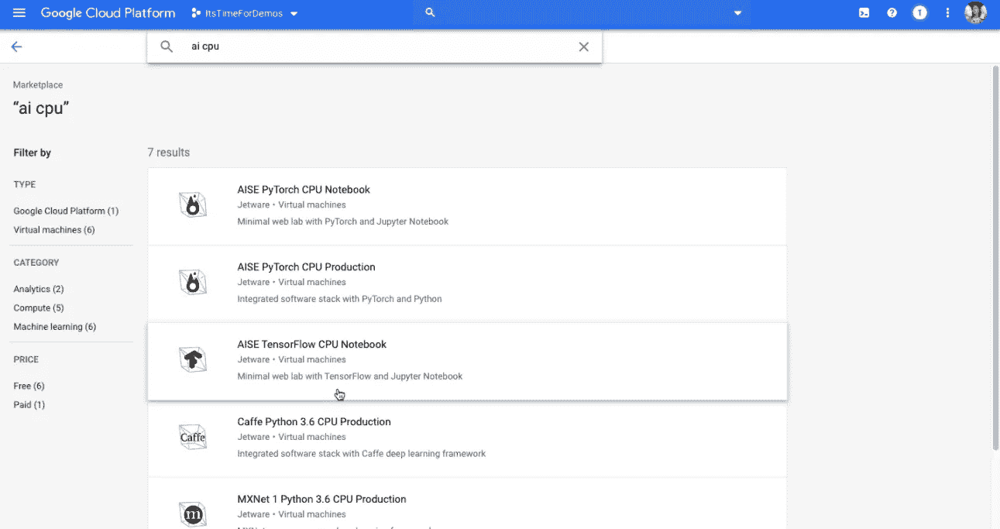

*为什么是笔记本？* [数据科学家](http://bit.ly/quaesita_universe)喜欢笔记本，因为它们结合了最好的交互式数据分析和漂亮的报告制作。

*为什么*[*Jupyter*](http://bit.ly/jupyter_try)*？*这是你最有可能听说过的笔记本电脑解决方案。

*为什么*[*tensor flow*](http://bit.ly/quaesita_tf)*？*这是一个强大的[深度学习](http://bit.ly/quaesita_emperor)框架；在这里获得更多信息。

## 步骤 4:启动和部署

点击蓝色的大按钮。重复一遍。

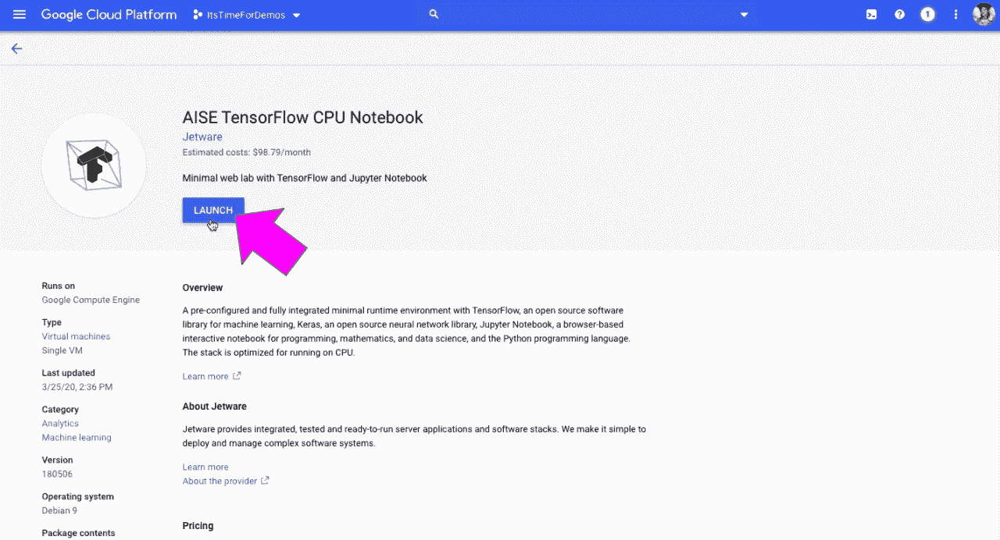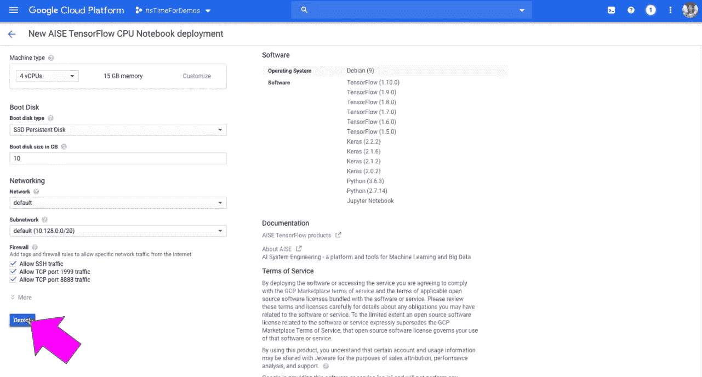

## 第五步:复制提供的密码并打开笔记本

将为您创建一个随机生成的密码。耐心等待几秒钟，复制它的文本，然后在该选项可用时打开 Jupyter 笔记本。

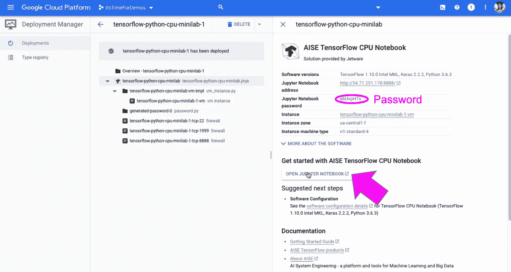

## 第六步:你好世界！

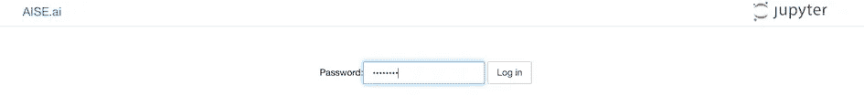

粘贴您复制的密码来打开 Jupyter，然后创建一个新的笔记本。

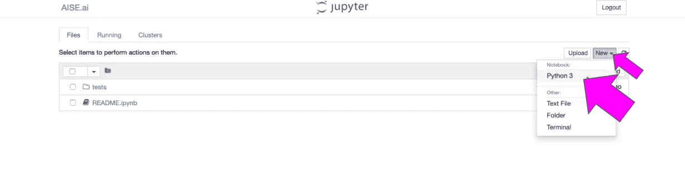

一旦你进入，你会看到 TensorFlow 已经安装好，你可以开始探索了。

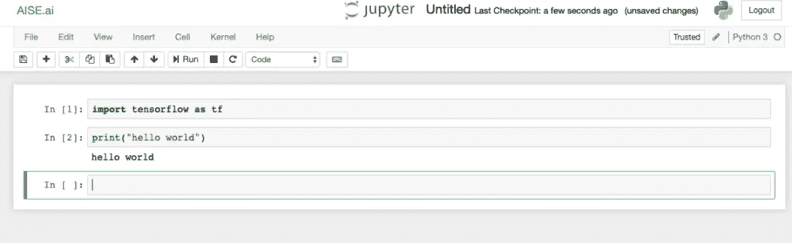

起床跑步用了不到 90 秒！

# 游戏开始。

这是你能拥有的最好的数据科学环境吗？不，因为为你创造*完美的*解决方案意味着[根据*你的*个人需求定制](http://bit.ly/quaesita_mimag)一切。有一天，你可能会选择这么做。但与此同时，这是我发现的起床跑步的最短路径。我写这篇博文的目的只是想告诉你，有很多超快速的选择。

> 你能做得比我快吗？

你能做得比我快吗？也许吧！把它当成一个挑战，然后[让我知道](https://twitter.com/quaesita/status/1255625073924472833)你花了多少秒。

# 别忘了

为了避免充电，当你用完的时候不要忘记关灯；使用搜索栏找到*部署管理器*页面，在这里您可以删除/停止任何您不再需要的内容。

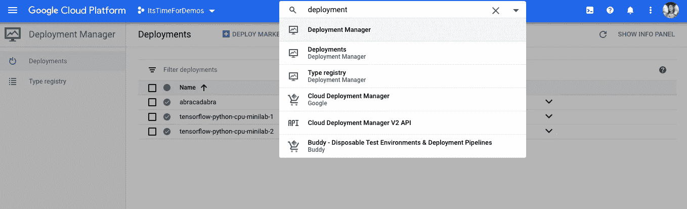

# 放弃

这篇博文写于 2020 年 4 月，所以如果你来自未来，你的世界可能会有所不同。

# 感谢阅读！人工智能课程怎么样？

如果你在这里玩得开心，并且你正在寻找一个为初学者和专家设计的有趣的应用人工智能课程，这里有一个我为你制作的娱乐课程:

在这里欣赏整个课程播放列表:[bit.ly/machinefriend](http://bit.ly/machinefriend)

# 与凯西·科兹尔科夫联系

让我们做朋友吧！你可以在 [Twitter](https://twitter.com/quaesita) 、 [YouTube](https://www.youtube.com/channel/UCbOX--VOebPe-MMRkatFRxw) 和 [LinkedIn](https://www.linkedin.com/in/kozyrkov/) 上找到我。有兴趣让我在你的活动上发言吗？使用[这种形式](http://bit.ly/makecassietalk)取得联系。