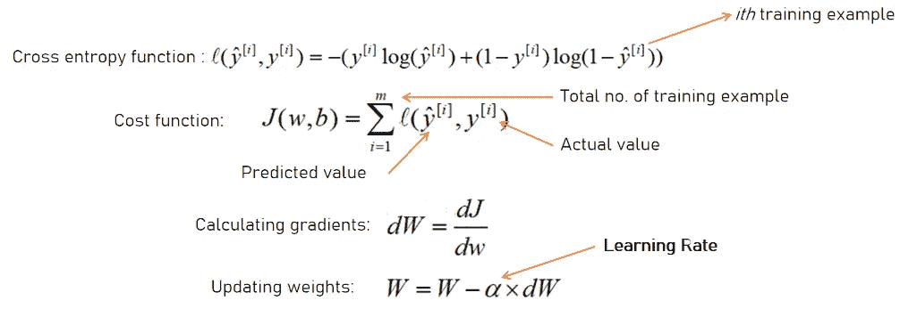
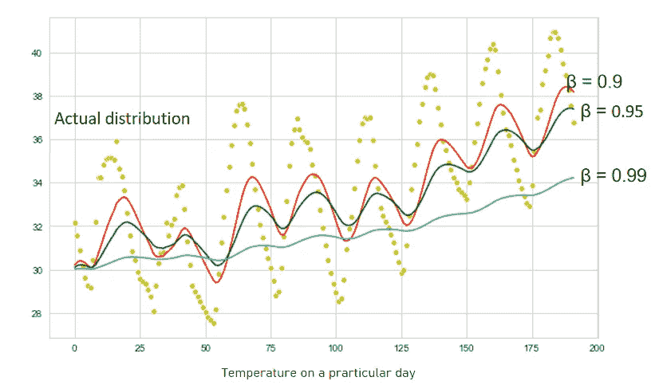
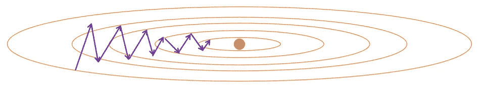
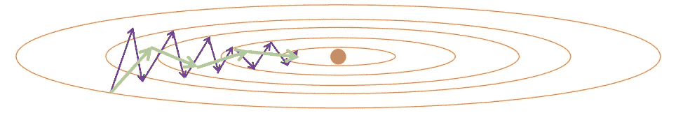
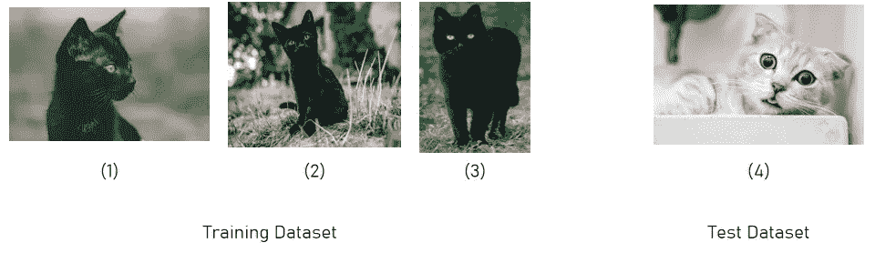
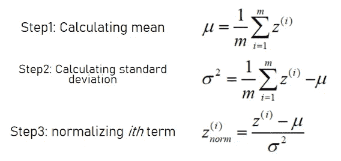
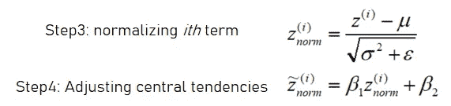
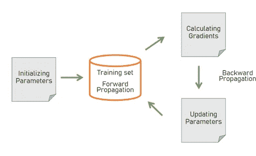
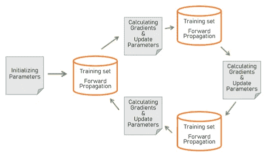
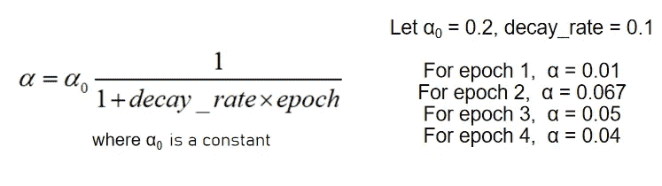

# 深度学习超参数的 a、B、Cs……

> 原文：<https://towardsdatascience.com/a-b-cs-of-deep-learning-hyperparameters-4d5de9a37de1?source=collection_archive---------66----------------------->

## 超参数:是福是祸，由你决定。好吧，我们都知道“人工智能是新的电力”，我们不可避免地需要力量和知识来综合和控制它。


Diomari Madulara 在 [Unsplash](https://unsplash.com/s/photos/abc?utm_source=unsplash&utm_medium=referral&utm_content=creditCopyText) 上拍摄的照片

D eep learning 目前成为新闻，因为它的准确性和对我们现有模型的控制。有了大量的编程软件，如 **TensorFlow** 、 **Keras** 、 **Caffe** ，以及一个巨大的列表，简化了深度学习编程的工作。现在，我们不必担心反向传播步骤、权重更新等，而只需调整超参数。

然而，深度学习的人知道这不是一件简单的事情。由于预测精度高，深度学习有利于拥有大量超参数，这些超参数由从业者根据他们的任务或他们实施深度学习模型的问题类型来使用。

> 人工智能对世界来说是一种恩惠，但如果你不明智地使用它，它可能会成为你的诅咒，而要明智地使用它，你需要准确地理解它。

因此，为了准确地理解它们，我们需要回答三个问题，即何时、何地以及在何种背景下。在此之前，让我们列出它们，以便顺利开始。

我们将讨论以下超参数的三个 w:

1.  学习率
2.  隐藏单元数和隐藏层数
3.  β(带动量的梯度下降)
4.  β1、β2 和ϵ (Adam 优化器)
5.  学习率衰减
6.  小批量(小批量梯度下降)

# 1.学习率

当你写出梯度下降的最基本形式并更新参数时，这里就是学习率出现的地方



梯度下降的步骤(由作者出版)

学习率决定了你在梯度下降的每次迭代中要跳多远。一般来说，学习率在 0.001 和 1 之间，这可以随着你向函数的最小值前进而变化。

# 2.隐藏层和隐藏单元的数量

另一个重要的超参数是隐藏层中隐藏单元的数量和隐藏层本身。它决定了模型在给定数据点中描述的函数有多复杂。隐藏单元和隐藏层的数量越多，模型概述的函数就越复杂，因此过度拟合的机会就越多。

通常，人们采用许多隐藏层和隐藏单元来构建深度神经网络，并使用一些技术，如 L2 或辍学正则化，以防止数据过拟合的规定。

没有规定的方法来确定正确的或最佳的层数，您必须从某个最小的层数开始并增加它，直到您达到期望的预测精度。这就是为什么应用机器学习是一个高度迭代的过程。

另一个参数是你的系统， **CPU** ，或者 **GPU** 决定了隐藏层和单元的数量。因为这是一个高度迭代的过程，你需要迅速得到每次迭代的结果，为此你应该有很高的计算能力。

# 3.带动量的梯度下降

## 什么是加权平均？

假设我们记录了夏季 200 天的温度(黄色散点分布)。附加曲线代表不同权重(β)的加权平均温度。

```
##CODE FOR WEIGHTED AVERAGE
temp                      ## list of temperatures of 200 days
v[0]  = temp[0]           ## random initialization (for scalability)
for i in range(len(temp)) :
    v[i+1] = (beta)*v[i] + (1-beta)*temp[i+1]
```



印度德里 200 天的温度分布((作者发表))

**注意**:我们已经初始化了 v[0] = temp[0]，以确保加权平均温度保持在实际分布的范围内。

## 我们如何利用这一点？

假设我们有以下类型的成本函数，我们的梯度下降与它很好地合作。



成本函数上的批量梯度下降(由作者发表)

但是，当我们有足够的数据来训练时，梯度下降在振荡中花费了大量的时间来达到成本函数的最小值。当我们将加权平均应用于梯度下降时，它将两个方向的值平均化。因此，垂直值相互抵消，我们在水平方向获得更多的动量。



成本函数上带有动量的梯度下降(由作者发表)

这叫做动量梯度下降。通常，β的范围从 0.9 到 0.99，我们使用对数标度来寻找该超参数的最佳值。

```
## UPDATION STEP OF GRADIENT DESCENT
W = W - learning_rate * dW
b = b - learning_rate * db## CHANGE IN UPDATION STEP OF GRDIENT DESCENT
## WEIGHTED AVERAGE form of  GRADIENT DESCENT
VdW = beta * VdW + (1-beta)*dW    ## Taking weighted avg of weights Vdb = beta * Vdb + (1-beta)*db    ## Taking weighted avg of biases## Updating weights and biases
W = W - learning_rate*VdW
b = b - learning_rate*Vdb
```

# 4.Adam 优化器

## 批量标准化

据观察，当我们标准化输入数据时，训练变得更快。那么，为什么我们不对每个隐藏层的输入进行标准化呢？这种技术被称为批处理规范化。通常，在将它们放入激活函数之前，我们会对值进行归一化。

但是，如果我们对如下所示的给定的猫图片进行训练，我们的模型就有可能预测不正确。



(1)Kazuky aka yashi 在 [Unsplash](https://unsplash.com/s/photos/black-cats?utm_source=unsplash&utm_medium=referral&utm_content=creditCopyText) 上的照片，(2)Lamna The Shark 在 [Unsplash](https://unsplash.com/s/photos/black-cats?utm_source=unsplash&utm_medium=referral&utm_content=creditCopyText) 上的照片，(3)Daria Shatova 在 [Unsplash](https://unsplash.com/s/photos/black-cats?utm_source=unsplash&utm_medium=referral&utm_content=creditCopyText) 上的照片，(4)Tran Mau Tri Tam[在](https://unsplash.com/@tranmautritam?utm_source=unsplash&utm_medium=referral&utm_content=creditCopyText) [Unsplash](https://unsplash.com/s/photos/cats?utm_source=unsplash&utm_medium=referral&utm_content=creditCopyText) 上的照片

这是因为训练数据集中的所有猫都是黑色的，而测试数据集中的图片是白色的猫。从数学上讲，测试数据集和训练数据集的数据分布是不同的。

标准化是一种技术，通过这种技术，我们每次必须提供输入时都可以获得相同的数据分布。标准化的一般步骤是:



规范化输入数据的步骤(由作者发布)

这些步骤使平均值为零和单位标准偏差。这种特殊的分布可能并不总是有效。可能存在这样的情况，我们需要具有不同集中趋势的分布。因此，我们需要调整分布参数，即平均值和偏差。



调整标准化数据集中趋势的附加步骤(由作者发布)

步骤 4 允许我们调整分布参数。此外，在步骤 3 中，我们添加了一个ε项，以确保分母永远不等于零。

# 5.小批量

梯度下降的一次迭代过程:



分批梯度下降法(作者发表)

当训练集非常大时，比如说大约 500 万个样本，那么升级一次参数所需的时间将会很长。因此，作为一种补救措施，我们将大型数据集划分为较小的数据集，对于这些较小数据集的每次迭代，我们都要更新参数。



小批量梯度下降法(作者发表)

这里，我们将训练集分成三个更小的集合，但是有一些规范可以做到这一点。人们建议我们应该在小批量中生产相当于 2 的某个幂的批量，即 64、128、1024 个样品。这在某种程度上优化了内存分配，实际上优化了模型的性能。

整个数据集的一个循环的完成被称为一个**时期**。当我们使用批量梯度下降(简单梯度下降)时，我们在一个时期内更新一次参数，但是在小批量梯度下降中，在一个时期内更新多次参数。

# 6.学习率衰减

取学习率的大值可以优化时间，但是我们可能永远达不到最小值。相反，如果我们取一个小的学习率，学习速度就低。那么，为什么我们不能在训练模型时改变学习率呢？

当学习速率接近收敛(成本函数的最小值)时，可以减慢学习速率以获得更好的结果。在这种情况下，学习率的一个非常一般的形式可以表示为



实现学习率衰减(由作者出版)

在这个例子中，我们可以观察到学习率是如何变化的。现在明智地选择“**衰变率**变得很重要，因此可以称为另一个超参数。

# 猜测…

当你训练一个模型时，感知每个参数和超参数的细节是非常重要的，因为你梦想它会给世界和社会带来一些变化。即使是一件小事也能引发一项大的创新。

至此，我希望这篇文章能为你增添一些东西。请分享你的想法，因为

> "批评是自我吹嘘的一种间接形式。"埃米特·福克斯