# A/B 测试统计变得简单

> 原文：<https://towardsdatascience.com/a-b-test-statistics-made-easy-4e94098758d9?source=collection_archive---------17----------------------->

## 第 1 部分:连续度量

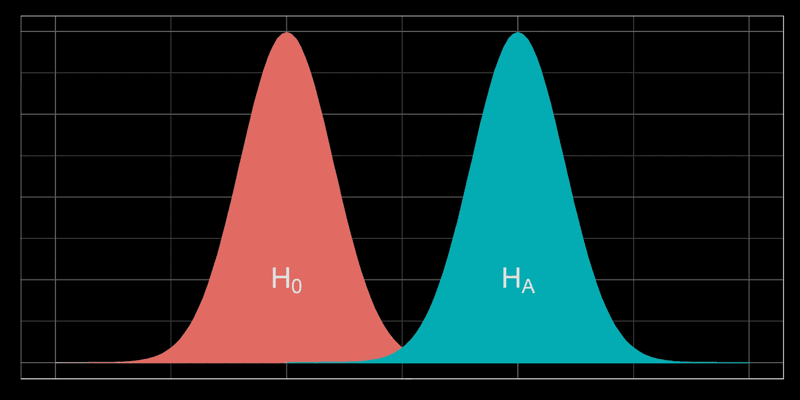

我们的 A/B 测试刚刚结束，看起来测试的表现比控制组好。但是这个结果仅仅是因为随机噪声吗？还是结果大到有统计学意义？本指南将告诉你如何使用推断统计学来回答这些问题。

统计学常常是一门令人生畏的学科。许多教科书，甚至是那些针对初学者的教科书，都太快地陷入像这样看似复杂的公式:σd = sqrt( σ1^2 / n1 + σ2^2 / n2)。或者他们太快进入抽象概念，如“测试统计”。公式和抽象有一个重要的位置:它们允许你快速有效地执行统计分析。但它们不是*吸引*观众*或教授*统计概念的最佳工具。

在本文中，我们将使用模拟将关键的统计概念带入生活，而不是依赖于公式。我们将解构抽象来阐明所有隐藏的组件。总之，我们将揭开这个迷人的主题领域的神秘面纱，让读者更容易理解和享受。

唯一的先决知识是熟悉均值、标准差和密度图。这篇文章(第 1 部分)关注于连续指标的分析(考虑年龄、身高、收入等。).在以后的文章中([第二部分](https://medium.com/@rezwan.islam99/a-b-test-statistics-made-easy-8805ac2533d6))，我们将检查比例指标(想想转化率，吸烟者的百分比，满意的顾客比例，等等)。).

# 1.通过模拟创建采样分布

想象一个有 100 万居民的城镇。一半居民是男性，另一半是女性。每个组的平均年龄是 35 岁。女性年龄的标准差略高于男性年龄。以下是总体参数的汇总:

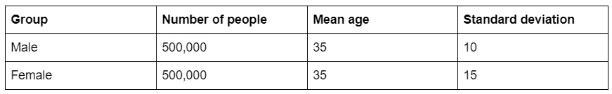

如果我们要绘制每个群体的年龄密度图，它可能是这样的:

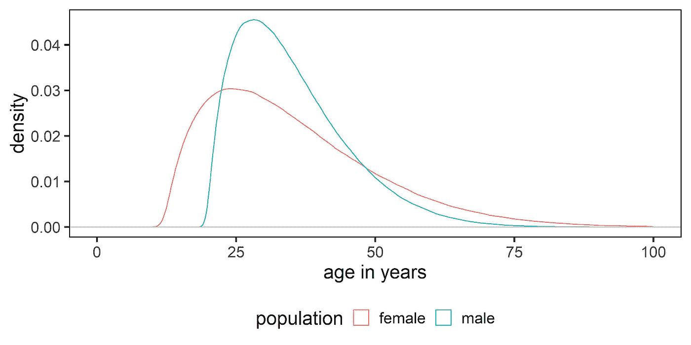

现在想象一下，我们想要探究两个群体之间平均年龄的差异。我们知道它应该是 0，因为两个人口有相同的平均年龄。让我们运行以下过程:

1.  我们随机抽取 200 名男性样本，计算他们的平均年龄
2.  我们随机抽取了 200 名女性，并计算了她们的平均年龄
3.  我们计算平均年龄的差异

在运行完这个过程一次后，我们得到以下结果:

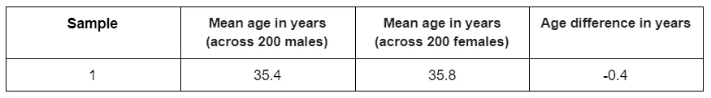

现在，让我们运行一个模拟，将上述过程重复 10，000 次:

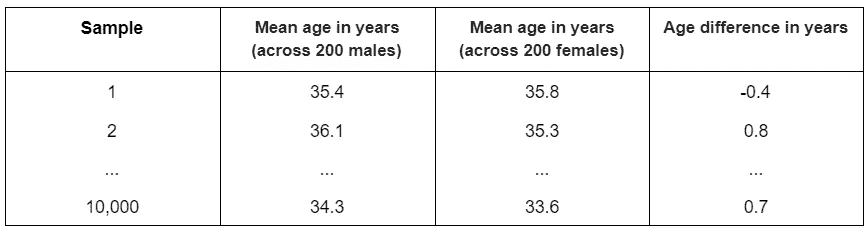

尽管我们知道两个群体的平均年龄都是 35 岁，但我们对平均值的估计因样本而异。有些估计值高于 35，有些则低于 35。样本之间的这种自然变化被称为随机 ***采样误差*** 。

抽样误差也会导致样本之间的估计年龄差异(最后一列)不同。有些估计值高于 0，有些则低于 0。让我们来看看这些值的分布情况:

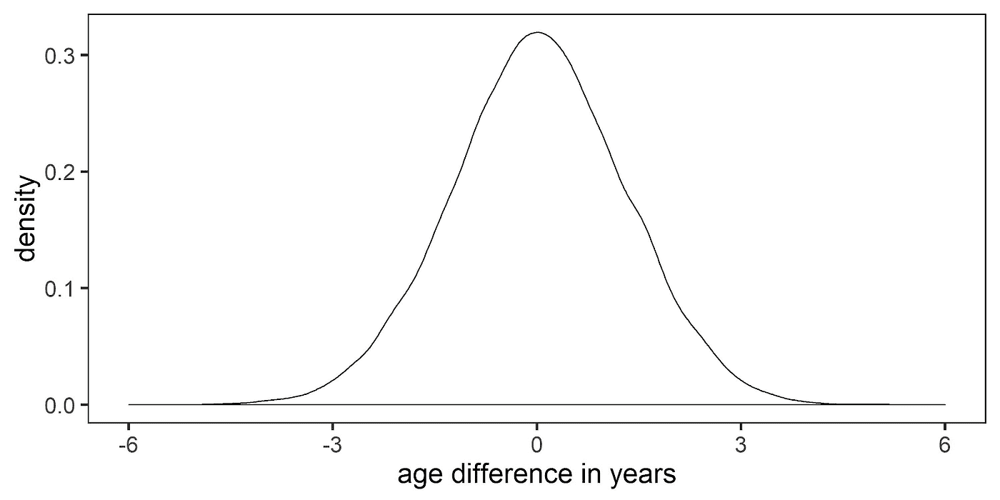

这个图叫做 ***抽样分布*** 。具体来说，就是均值之差的抽样分布。大多数差值接近于零，这是意料之中的，因为两个群体的平均值相同。也有一些样本产生很大的差异，也是由于随机采样误差。这些值出现在分布的尾部，这告诉我们它们出现的频率较低。

**总结:使用模拟，我们创建了一个抽样分布。这种抽样分布说明了由于随机抽样误差引起的样本之间的自然变化。**

# 2.生成采样分布的一种更快速的方法

模拟有助于我们理解什么是抽样分布以及它是如何创建的。一旦我们理解了这些概念，我们就可以完全不用模拟，直接计算抽样分布。这种方法更快、更准确。

为了计算抽样分布，我们只需要知道三个属性:

1.  **形状**。一个抽样分布是[总是对称的](https://en.wikipedia.org/wiki/Central_limit_theorem)(给定足够的数据点)，不管潜在人口分布的形状如何。具体来说，形状被称为 ***正常*** (对于足够大的样本)。
2.  **的意思是**。抽样分布的平均值是两个基础分布的平均值之差。在我们的例子中，这将是零，因为两个潜在的人口有相同的平均年龄。
3.  **标准偏差**。当涉及抽样分布时，这也被称为 ***标准误差*** ，因为抽样分布表征了抽样误差。原来我们可以这样计算:

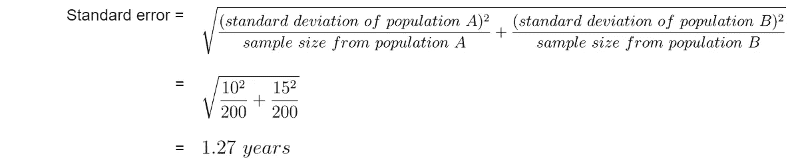

现在我们知道了这三个属性，我们可以使用大多数编程语言快速计算采样分布。例如，在 *R* 中，我们可以简单地写:

```
rnorm(n = 10000, mean = 0, sd = 1.27)
```

这一行代码将生成 10，000 个值的正态分布，平均值为 0，标准偏差为 1.27。让我们绘制这些计算值(红色)相对于我们通过模拟创建的先前分布(黑色)的分布图:

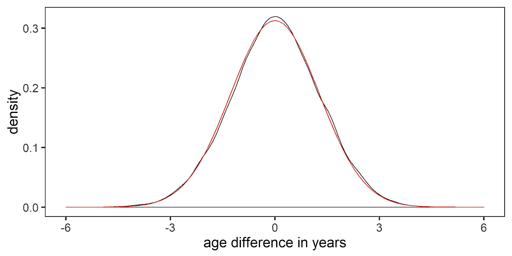

注意这两个发行版是多么的相似。计算出的分布是*精确的*。模拟分布是一个不完美的*估计*。因此，两者之间略有差异。

**重述:我们不再需要运行许多模拟来*估计*抽样分布。原来有一个简单的公式来计算我们的抽样分布的标准偏差。有了这个，我们现在可以快速计算*精确的*采样分布。**

# 3.对一些 A/B 测试结果的初步看法

现在想象你必须解释 A/B 测试的结果。例如，你为你的网站设计了一个全新的主页，你认为这将会给每个访问者带来更高的收入。你设置了一个持续几周的 A/B 测试，其中一半的访问者看到了新的主页(测试组)，另一半看到了现有的主页(控制组)。测试结束时，我们会看到以下结果:

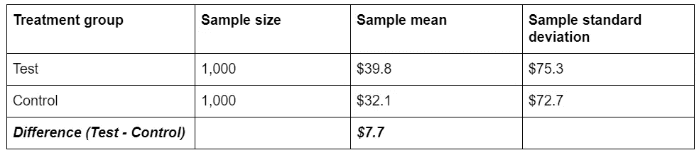

乍看起来，测试实际上比控制组的表现要好，每个访问者多花了 7.7 美元。但是我们能相信这个结果代表了总体均值之间的真实差异吗？毕竟，在前面的章节中，我们已经观察到，即使两个总体具有相同的均值，由于抽样误差，我们仍然会产生一系列的差异估计值。

因此，假设测试和控制人口有相同的手段，有多大的可能性，我们会看到高达 7.7 美元的结果，仅由于抽样误差？这种假设——即测试和控制群体均值之间没有实际差异——被称为*(***H0***)。按照惯例，我们总是从 H0 开始，然后着手检查支持或反对它的证据的力度。*

***总结:尽管第一次看起来测试比控制组表现得更好，但我们需要了解在假设无效的情况下，我们看到 7.7 美元结果的可能性有多大。***

# *4.计算零假设的抽样分布*

*为了理解在给定零假设的情况下看到结果$7.7 的概率，我们首先需要理解假设测试和控制人群具有相同均值时可能出现的值的分布。*

*换句话说，我们需要在假设零假设为真的情况下生成结果的抽样分布。我们可以使用与之前相同的步骤进行计算，我们只需要知道三个属性:*

1.  *形状=正常(如所示)*
2.  *均值=零(如零假设所述)*
3.  *标准误差(计算)*

*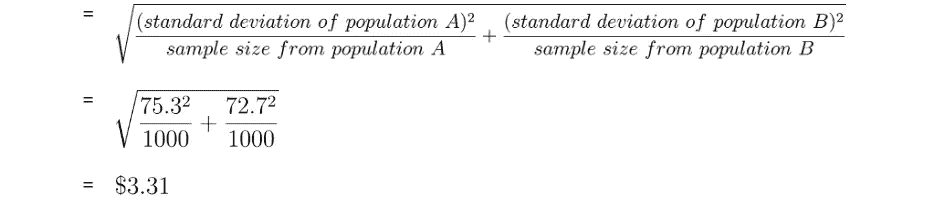*

*请注意，我们使用样本标准差作为总体标准差的最佳猜测。下面是我们的抽样分布图:*

*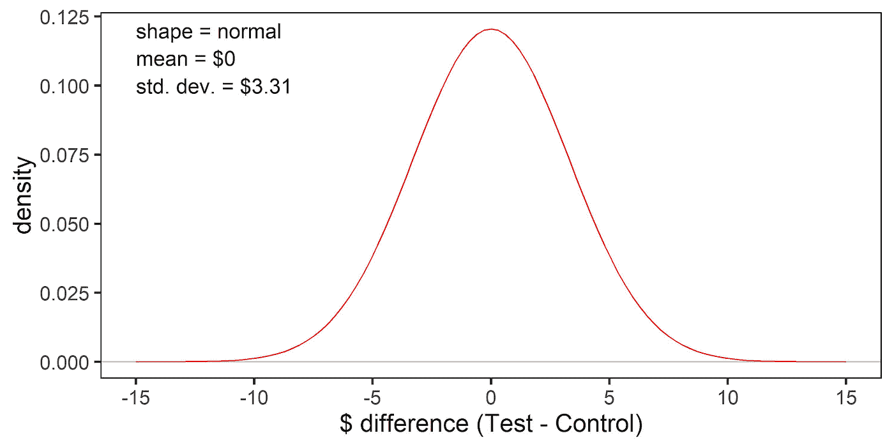*

***回顾:假设假设无效，我们看到 7.7 美元结果的可能性有多大？要回答这个问题，我们首先需要了解零假设下的抽样分布。我们可以这样计算，假设 a)分布的形状是正态的，b)测试和控制群体具有相同的平均值，c)我们的样本标准偏差代表总体标准偏差。***

# *5.解释 A/B 测试结果*

*给定零假设下的抽样分布，我们有多大可能看到测试和控制均值之间的差异为 7.7 美元？请记住，如果零假设是真的，那么分布是对称的平均值为零。这意味着我们获得 7.7 美元的结果的机会与获得-7.7 美元的机会相等。因此，问题变成了:在给定零假设的情况下，获得极端结果*或更极端结果*7.7 美元的概率是多少？*

*让我们重新检查我们的抽样分布:*

*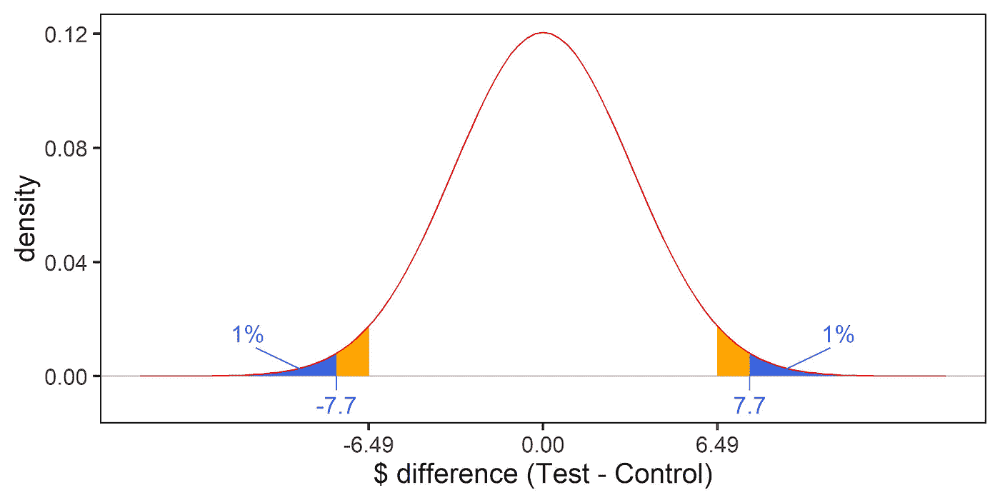*

*这里，我们用蓝色阴影标出了曲线上由*和*7.7 美元一样极端或更极端的值所限定的区域。两个面积之和为 2%，该值称为 ***p 值*** 。它告诉我们，如果零假设是真的，那么在 100 个 A/B 测试中，只有 2 个测试的结果会达到 7.7 美元或更高。*

*相比之下，橙色阴影区域(你必须想象橙色区域一直在蓝色区域之后)占曲线下总面积的 5%。5%的值是任意选择的，它被称为 ***显著性水平*** 或𝛂.当 p < 𝛂时，我们拒绝零假设。*

*换句话说，我们是说，如果我们看到一个 A/B 测试结果只可能在 100 个 A/B 测试中出现不到 5 个(假设是零假设)，那么我们将拒绝零假设(即使它是真的)。这意味着我们有 5%的几率会冒*错误地*拒绝零假设的风险。因此，𝛂也被称为第一类错误率。*

***总结:在零假设下，看到极端或超过 7.7 美元的结果的可能性不大。具体来说，我们的 p 值为 0.02 意味着我们只可能在 100 个实验中的 2 个实验中看到极端或超过 7.7 美元的结果。这个比率小于我们的显著性水平(𝛂)0.05，因此，我们拒绝零假设。这可能是也可能不是正确的结论，从长远来看，我们的 1 型错误率= 0.05 (= 𝛂).***

# *6.计算 p 值的更快方法*

*在实践中，统计学家不会根据每组 A/B 测试结果创建定制的抽样分布。对于足够大的样本量，他们采用单一的、 ***标准正态分布*** 。这个分布的平均值为 0，标准偏差为 1。任何平均值为 0 的正态分布都可以通过除以标准误差转换为标准正态分布。*

*因此，如果我们将之前分布中的所有值除以标准误差($3.31)，我们会得到以下结果:*

*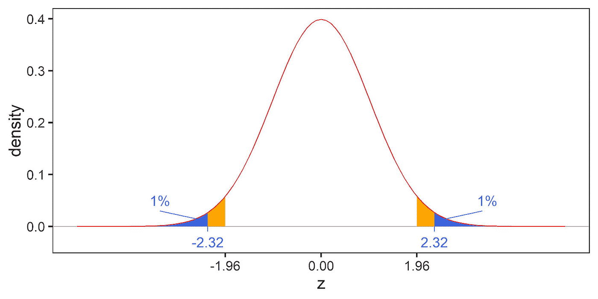*

*转换后的值被称为 **z 值**，它们是无单位的。*

*对于标准正态分布，5% *的显著性水平始终*对应于等于或大于 1.96(大约)的 z 值。我们将 1.96 称为具有 5%显著性的 ***临界 z 值*** 。我们的 p 值不变，还是 0.02。在这里，曲线下的面积对应于 z 值达到或超过 2.32(7.7 美元/3.31 美元)。这个值称为 ***z 得分*** 或 ***检验统计量*** 。*

*按照惯例，统计学家使用标准的正态分布，其平均值为 0，标准差为 1。这消除了为每个 A/B 测试计算定制取样分布的需要。我们只需要计算 z 得分(观察到的差异/标准误差)。p 值就是由 z 得分限定的曲线下的面积。*

# *7.置信区间*

*概括地说，我们的 A/B 测试结果是每个访问者 7.7 美元，我们认为，如果实际上测试人群和控制人群具有相同的平均值，这个值不太可能出现。更正式地说，我们的 p 值 0.02 小于我们的显著性水平 0.05，因此我们拒绝零假设。*

*我们拒绝了总体均值之差= 0 的(无效)假设。因此，我们自动接受了 ***的替代假设(HA)*** 其中，在这里，状态之间的差异意味着≠ 0。*

*所以如果均值之差*不等于*等于 0，那么等于什么*？一个答案是 7.7 美元。假定我们现在认识到了采样误差的影响，一个更好的*答案将确定一个可能值的*范围*。***

那么，给定另一个假设，可能值的范围是什么呢？同样，我们只需要参考抽样分布。替代假设的抽样分布与零假设的抽样分布相同，只有一个例外:它的平均值等于观察结果($7.7):

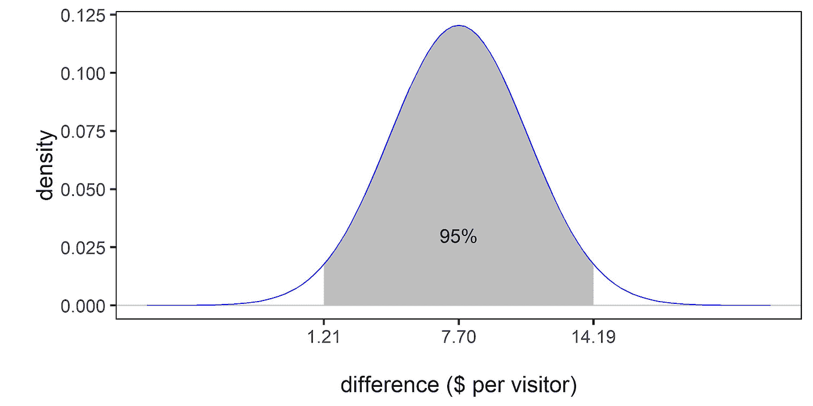

灰色阴影区域代表图表的中间 95%，对应于(1.21，14.19)或 7.7±6.49 的*。每个置信区间都有一个相关的 ***置信水平*** ，该置信水平由显著性水平(𝛂)预先确定，等于 1—𝛂= 1–0.05 = 95%。*

*置信区间和置信水平的另一种解释是这样的:如果我们要重复整个 A/B 测试，那么我们可能会得到测试和控制样本，由于采样误差，它们的样本标准偏差略有不同。所以我们会产生一个稍微不同的抽样分布，从而产生一个稍微不同的置信区间。现在，如果我们多次重复整个 A/B 测试，那么从长远来看，95%的置信区间将包括总体均值之间的*真*差。请注意，这与说有 95%的概率我们的单一置信区间包含总体间的真实差异是不同的。*

***概述:置信区间(在相关置信水平上)显示了我们的 A/B 测试结果的可能值范围。在这里，我们报告的置信区间为 7.7±6.49，置信水平为 95%。***

# *8.力量*

*关于假设检验，需要理解的另一个关键概念是统计功效。权力类似于意义:*

*   *显著性(𝛂) =当 H0 为真时拒绝 H0 的概率。*
*   *功率(1-𝛃) =当 HA 为真时接受 HA 的概率。*

*既然我们已经接受了 HA，那么在这里权力的概念基本上是多余的。我们将在以后关于样本大小计算的文章中讨论它。*

***重述:测试的功效是当 HA 为真时接受 HA 的概率。在测试运行之前，当您计算测试所需的样本量时，这是最重要的。***

# *9.R 中的统计分析*

*至此，您应该对统计分析的总体框架感到相当满意了。现在，让我们看看如何将上述所有步骤简化为几行代码。在 *R* 中我们会写:*

*这会产生:*

```
*[1] "standard error"
3.30989123688377[1] "p-value"
0.0199993307409128[1] "critical value at alpha = 95%"
6.48726761703693[1] "confidence interval, lower bound"
1.21273238296307[1] "confidence interval, upper bound"
14.1872676170369*
```

***回顾:一旦你熟悉了统计分析中的所有步骤，你就可以使用计算机程序，如 *R* 快速进行计算。***

# *10.摘要*

*在本文中，我们探讨了统计分析中涉及的许多关键概念和层次。我们回顾了一些捷径，一旦理解了这些概念，就可以更快地找到答案。希望这已经让你对 A/B 测试统计有了更好的理解。在下一篇文章的[中，我们将使用我们在这里学到的知识来分析一个不同的 A/B 测试，其中成功度量是一个比例。](https://medium.com/@rezwan.islam99/a-b-test-statistics-made-easy-8805ac2533d6)*