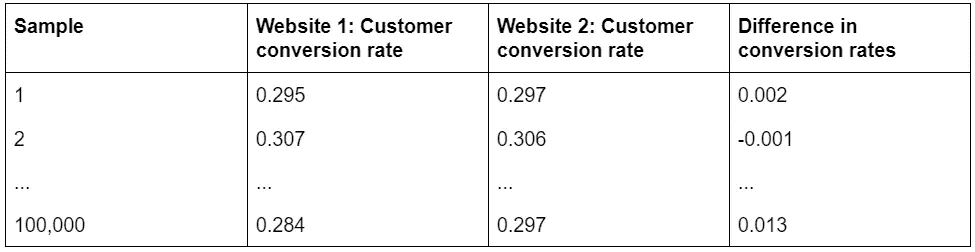

# A/B 测试统计变得简单

> 原文：<https://towardsdatascience.com/a-b-test-statistics-made-easy-8805ac2533d6?source=collection_archive---------13----------------------->

## 第 2 部分:比例度量


这篇文章将展示当输出指标是一个比例，比如客户转换率时，如何评估 A/B 测试的结果。这里我们利用了我们在[第 1 部分:持续度量](/a-b-test-statistics-made-easy-4e94098758d9)中建立的统计基础，所以如果你需要复习，就从这里开始吧。

统计学可能是一门令人望而生畏的学科，但也不尽然。这些指南的目的是让人们更容易使用统计工具。本指南使用模拟数据来揭开主题的神秘面纱，并使关键的统计概念变得生动。尽情享受吧！

# 1.模拟两个相同网站的转化率

想象一下，我们拥有 2 个网站。每个网站以 30%的比率将访问者转化为客户。让我们看看 1000 个访问者访问每个网站后会发生什么:


现在我们运行一个模拟，可以对总共 100，000 个样本重复上述过程。以下是结果的一瞥:


因此，尽管我们知道真实转换率是 30%，但由于随机 ***采样误差*** ，我们看到这个数字周围有一些变化。现在让我们把上面所有的数字转换成比例:



最后，让我们绘制转换率差异的分布图(最后一列):


**总结:我们有两个转化率相同的网站。所以转换率的差异应该等于零。但是由于抽样误差，我们看到结果的抽样分布在零附近。**

# 2.将模拟应用于 A/B 测试

现在假设 A/B 测试产生以下结果:


测试处理真的提高了 45 个客户的转化吗？或者测试组和对照组有相同的转化率吗？在这种情况下，我们观察到的任何差异都只是随机抽样误差的结果？

让我们更正式地捕捉这些假设:

*   *(***零假设*** ):人口转换率之差= 0。任何观察到的差异都是由于采样误差造成的。*
*   ****哈*** ( ***替代假设*** ):人口转化率之差≠ 0。观察到的差异不太可能仅仅是由于采样误差。*

*因此，让我们从确定假设为零时的抽样分布开始。我们需要知道的只是真实的(人口)转换率可能是多少。我们最好的猜测是样本转换率的平均值:(0.335 + 0.290) / 2 = 0.3125。现在，让我们模拟一下测试组和对照组的转换率均为 0.3125 时的分布情况:*

**

***回顾:我们再次使用模拟来生成抽样分布。这里我们假设测试人群和控制人群具有相同的转化率——这是我们的零假设。***

# *3.生成采样分布的一种更快速的方法*

*模拟是生成抽样分布以展示抽样误差影响的一个很好的工具。如果我们想移动得更快，我们可以，事实上，*计算*采样分布如下:*

***第一步:计算汇集样本比例( *p* )。***

*我们已经计算出这是 0.3125。*

*下面是实际的公式，当测试组和对照组的样本量不同时，这个公式特别有用:*

**

***第二步:用 *p* 计算标准误差( *se* )。***

**

***步骤 3:计算一个均值= 0，标准差= 0.0207 的正态分布。***

*在 *R* 中，我们可以简单地写:*

```
*rnorm(n = 10000, mean = 0, sd = 0.0207)*
```

*让我们来看看这个计算值的分布(红色)与之前我们通过模拟创建的分布(黑色)相比是什么样的:*

**

*如你所见，我们有一个几乎完美的匹配！事实上，模拟导致对采样分布的*估计*。然而，如果我们无限次运行模拟，我们将获得计算出的采样分布。因此，它是*精确的*抽样分布。*

*概述:我们不再需要运行许多模拟来估计抽样分布。我们现在可以计算精确的采样分布。*

# *4.解释 A/B 测试结果*

*那么，给定上面的抽样分布，在零假设下，获得 0.045 或更大的结果的概率是多少？让我们重新检查我们的抽样分布:*

**

*这里我们的 ***p 值*** (蓝色阴影)是 3%，它告诉我们，如果零假设为真，那么我们预计在 100 次 A/B 测试中只有 3 次会看到极端或大于 0.045 的结果。由于我们的 p 值小于我们的 ***显著性水平*(**【𝛂】**)**0.05，我们拒绝零假设。*

***总结:在零假设下，转换率提高到 0.045 或更高的可能性不大。具体来说，我们的 p 值为 0.03 意味着我们只可能在 100 个实验中的 3 个实验中看到极端或大于 0.045 的结果。这个比率小于我们的显著性水平(𝛂)0.05，因此，我们拒绝零假设。***

# *5.计算 p 值的更快方法*

*我们可以通过使用 ***标准正态分布*** 来加速这个过程。我们可以通过除以标准误差将我们的分布转换成标准正态分布。同样，我们也可以通过除以标准误差将我们的测试结果转换成一个 ***z 分数*** 。所以这里我们得到 0.045 / 0.0207 = 2.17。*

*使用这个 z 值，我们现在可以通过[查找表](https://en.wikipedia.org/wiki/Standard_normal_table#Table_examples)快速确定 p 值，或者使用编程语言如 *R* 计算 p 值:*

```
*pnorm(q = -2.17, mean = 0, sd = 1) * 2*
```

*在这两种情况下，我们得到了与之前相同的 p 值:0.03。*

***概述:通过将我们观察到的转换率差异(0.045)转换为 z 值(2.17)，我们能够利用标准正态分布的查找表来快速得出 p 值。***

# *6.置信区间*

*概括一下:*

*   *我们已经*否定了原假设***【H0】***认为人口转换率之差= 0。**
*   **因此，我们必须 ***接受*** 的替代假设 ***(哈)*** 即人口转换率之差≠ 0。**

**如果我们接受人口转换率的差异*不等于零，那么*等于多少？给定替代假设，可能值的范围是什么？让我们参考给定替代假设的抽样分布:**

****

**灰色阴影区域代表图表的中间 95%,对应于置信区间(0.004，0.086)或 0.045±0.041。每个置信区间都有一个相关的置信水平，该置信水平由显著性水平(𝛂)预先确定，等于 1-𝛂= 1–0.05 = 95%。置信区间告诉我们，如果我们多次重复整个 A/B 测试，那么从长远来看，95%的置信区间将捕捉到人口转换率之间的真实差异。**

****概述:置信区间(在相关的置信水平上)显示了我们的 A/B 测试结果的可能值的范围。在这里，我们报告的置信区间为 0.045±0.041，置信水平为 95%。****

# **7.R 中的统计分析**

**至此，您应该对统计分析的总体框架感到相当满意了。现在，让我们看看如何将上述所有步骤简化为几行代码。在 *R* 中我们会写:**

**这会产生:**

****

# **8.摘要**

**在这里，我们探索了分析 A/B 测试所涉及的步骤，以及将所有步骤联系在一起的框架。希望这已经让你对 A/B 测试统计有了更好的理解。在这种情况下，我们有足够的证据(根据 p 值)来拒绝零假设。但是，如果我们没有收集到足够大的样本来产生 p 值怎么办？下一篇文章中，我们将演示如何提前推断出所需的样本量。**