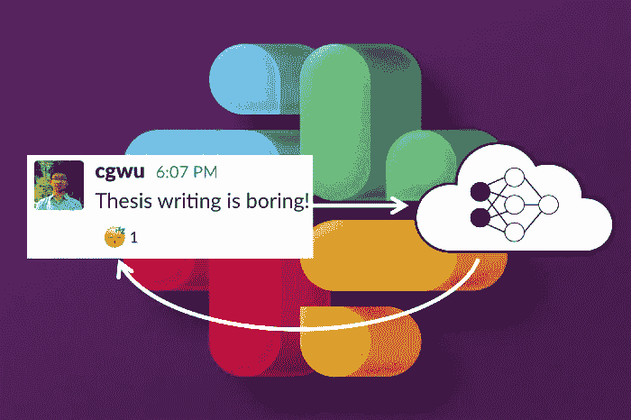
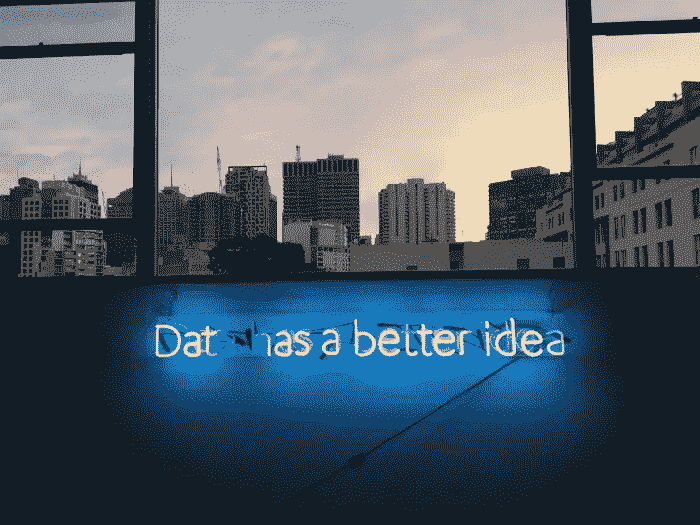
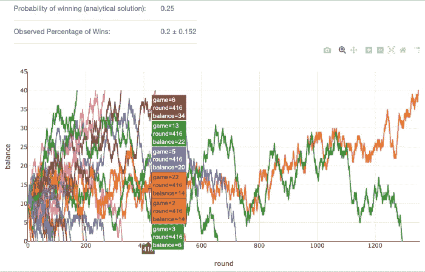

# 简而言之，A/B 测试

> 原文：<https://towardsdatascience.com/a-b-testing-in-a-nutshell-97c6fa86370a?source=collection_archive---------50----------------------->

[Pixabay](https://pixabay.com/fr/illustrations/r%C3%A9sum%C3%A9-color%C3%A9-arri%C3%A8re-plan-losange-1900585/)

## [A/B 测试是如何进行的？](/how-do-a-b-tests-work-996842ce6fc0)

由[凯西·科济尔科夫](https://medium.com/u/2fccb851bb5e?source=post_page-----97c6fa86370a--------------------------------) — 8 分钟阅读

简而言之:A/B 测试就是通过创建可信的克隆来研究因果关系——两个相同的项目(或者，更典型的是，两个统计上相同的组)——然后观察不同对待它们的效果。

照片由 Unsplash 上的 Morning Brew 拍摄，由作者编辑

## [我如何构建一个深度学习的表情符号 Slackbot](/how-i-built-a-deep-learning-powered-emoji-slackbot-5d3e59b76d0)

由[吴](https://medium.com/u/248495f0734?source=post_page-----97c6fa86370a--------------------------------) — 12 分钟读完

当我在加州大学伯克利分校完成我的计算机系统博士论文时，我经常想知道人工智能世界的生活是什么样的。我的人工智能朋友们不断吹嘘深度学习将如何彻底改变从医学到网上购物的一切——他们的论文一经发布就获得了 100 次引用(见鬼！).

弗兰基·查马基在 Unsplash 上的照片

## [生产中的深度强化学习](/deep-reinforcement-learning-in-production-7e1e63471e2)

由[迈赫迪·本·阿耶德](https://medium.com/u/1cd7c33105f4?source=post_page-----97c6fa86370a--------------------------------)和[帕特里克·哈林娜](https://medium.com/u/19d5b94064a5?source=post_page-----97c6fa86370a--------------------------------)——6 分钟阅读

设计用户体验是一门困难的艺术。与其他应用程序相比，视频游戏为设计师提供了一个巨大的工作空间。在 Zynga，我们一直在想创新的方法来最大化用户在玩游戏时的体验。

## [编写一个 Web 应用程序来模拟赌徒的破产问题](/coding-a-web-app-to-simulate-the-gamblers-ruin-problem-1bc82660a878)

由 Claudia Ng — 4 分钟阅读

我发现模拟是理解数学概念的一种有用的方式，所以我最近编写了一个程序来说明赌徒的破产问题。我做了一个 web app，用 Python 模拟了一系列游戏及其结局。

我们的每日精选将于周一回归！如果你想在周五收到我们的 [*每周文摘*](/receive-our-newsletters-681049ffa0cf) *，很简单！跟随* [*我们的出版物*](http://towardsdatascience.com/) *，然后进入你的设置，打开“接收信件”您可以在此* *了解有关如何充分利用数据科学* [*的更多信息。*](/how-to-get-the-most-out-of-towards-data-science-3bf37f75a345)