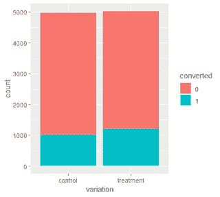
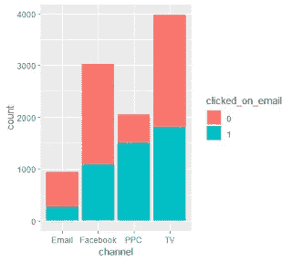
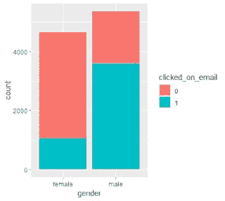
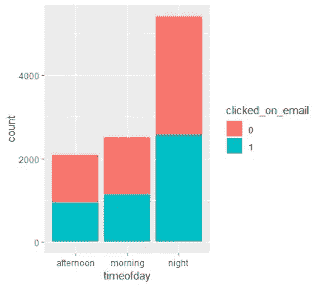
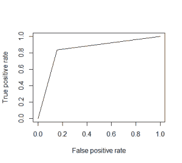

# R 中的 A/B 测试

> 原文：<https://towardsdatascience.com/a-b-testing-in-r-ae819ce30656?source=collection_archive---------15----------------------->

## 测量用户体验的分析

# 什么是 A/B 测试？

A/B 测试是一种用于测试同一特性的两个变体的响应率是否不同的方法。例如，您可能想要测试对网站的特定更改(如将购物车按钮移动到网页的右上角而不是右侧面板)是否会改变点击购物车并购买产品的人数。

A/B 测试也称为分割测试，在这种测试中，同一网页的两个变体同时显示给网站访问者群体中的不同样本。然后，比较两种变体的转换次数。通常，给出更高比例变体的变体是获胜变体。

然而，由于这是一个数据科学博客，我们希望确保两种变体的转换比例差异具有统计学意义。我们可能还想了解访问者的哪些属性在推动这些转化。那么，让我们继续你的数据问题。

# 数据问题

*   最近进行了一次 A/B 测试，贵公司的产品经理想知道新版本的网页是否会带来更多的转化率。根据你的分析向你的产品经理提出建议
*   CRM 经理很想知道，根据我们收集的用户首次访问网站时的属性，我们可以多准确地预测用户是否有可能使用我们的电子邮件。向客户关系经理汇报你的发现。

# 数据集

提供了四个数据集。

*   访问包含来自 10，000 个不同用户的数据，并包含以下各列:
*   user_id:用户的唯一标识符
*   visit_time:时间戳，表示访问网站的日期和时间
*   渠道:提示用户访问网站的营销渠道
*   年龄:用户访问网站时的年龄
*   性别:用户的性别
*   电子邮件参与度包含那些参与最近电子邮件活动的用户的数据。该文件包含以下列:
*   user_id:用户的唯一标识符
*   clicked_on_email:表示用户参与电子邮件的标志，其中 1 表示用户点击了电子邮件
*   变化包含指示每个用户看到 A/B 测试的哪些变化的数据。该文件包含以下列:
*   user_id:用户的唯一标识符
*   变化:用户看到的变化(控制或处理)
*   测试转换包含由于 A/B 测试而转换的用户的数据。该文件包含以下列:
*   user_id:用户的唯一标识符
*   converted:表示用户已转换的标志(1 表示已转换

# 导入数据集并清理

我总是首先使用主键或唯一标识符来组合文件。然后我决定如何处理这些数据。我发现这种方法很有用，因为我可以扔掉以后不需要的东西。它还帮助我从整体上查看数据集。

在这个实例中，我们的惟一标识符是 user_id。使用以下代码合并文件后，

```
merge_1<-merge(variations_df,visits_df,by.x="user_id",by.y="user_id")  
 merge_2<-merge(merge_1,test_conv_df,by.x="user_id",by.y="user_id",all.x=TRUE)  
 merge_3<-merge(merge_2,eng_df,by.x="user_id",by.y="user_id",all.x=TRUE)
```

我发现我必须创建自己的二进制变量，来判断用户是否转换了邮件，以及他们是否点击了邮件。这是基于在 test_conversions.csv 和 email_engagement.csv 文件中找不到他们的用户 ID。我用 0 代替了所有的 NA。

```
merge_3$converted<-if_else(is.na(merge_3$converted),0,1)  
 merge_3$clicked_on_email<-if_else(is.na(merge_3$clicked_on_email),0,1)  
 merge_3$converted<-as.factor(merge_3$converted)  
 merge_3$clicked_on_email<-as.factor(merge_3$clicked_on_email)
```

下一个任务是将访问时间之类的变量转换成能够为用户提供有意义信息的信息。

```
merge_3$timeofday<-  mapvalues(hour(merge_3$visit_time),from=c(0:23),  
               to=c(rep("night",times=5), rep("morning",times=6),rep("afternoon",times=5),rep("night", times=8)))  
 merge_3$timeofday<-as.factor(merge_3$timeofday)
```

现在，数据已经被清理了，是时候探索数据，以了解用户转换和他们在网站上访问的变化之间是否有关联。

# 数据探索和可视化

要检查的数据的最简单的方面是确定根据用户查看的变化类型转换的用户比例是否确实存在差异。运行博文末尾提供的代码，会给出下面的图形和比例:

对照:0.20 处理:0.24



# A/B 检验显著性的统计检验

为了测试比例差异是否具有统计学意义，我们可以进行比例差异测试或独立性卡方测试，其中零假设是用户是否转换与他们访问的变异类型之间没有关联。

对于这两个测试，p 值< 0.05 was observed indicating a statistically significant difference in proportions.

I went a step further and ran logistic regression to understand how the other attributes of the users contributed to the difference in proportions. Only the type of variation and income (p-values less than 0.05) appeared to contribute to the difference in conversion proportions. A calculation of McFadden’s R-squared tells us that only 12.94% of the variation in proportions can be explained by the variation type and user attributes provided within our dataset.
因此，我对产品经理的回答如下:

*与对照组相比，治疗组的转换率存在统计学显著差异。然而，很难理解为什么会这样。最好重复这个测试 2-3 次，以交叉验证结果。*

# 探索性数据分析，了解用户参与电子邮件的驱动因素

柱状图的产生是为了检查用户属性和他们是否点击了电子邮件之间的视觉关系。



在运行探索性数据分析时，我注意到 1，243 个用户的年龄缺失。这些用户在分析中被忽略了，因为我无法在没有任何知识的情况下估算他们的年龄。为了了解点击电子邮件的用户平均年龄的差异，制作了箱线图和数字摘要。

结果发现，点击电子邮件(“1”)的人平均收入比不点击的人高。然而，两组都有很高的标准差，因此收入似乎不是一个有用的指标。

# 使用统计模型进行显著性检验

数据集被随机分为训练集(70%)和测试集(30%)用于建模。运行逻辑回归来确定哪些属性在解释用户是否点击电子邮件方面具有统计上的显著贡献。

该模型在训练集上进行训练，并在测试集上进行准确性预测。通过在不同阈值设置下绘制真阳性率(TPR)对假阳性率(FPR)的曲线来生成 ROC 曲线。AUC 是 ROC 曲线下的面积。根据经验，具有良好预测能力的模型的 AUC 应该更接近 1 (1 是理想的)而不是 0.5。在我们的例子中，我们的 AUC 为 0.84，显示了相当好的准确性。



虽然分数不错，但最好进行某种形式的交叉验证，以进一步验证结果并确保可重复性。

逻辑回归模型的总结证实了我们直观看到的情况，即用户点击电子邮件的可能性的最佳预测因素是:

频道

表示“作用”

-性别

我对 CRM 经理的回答是，电子邮件转化率的主要预测因素是年龄(年长用户更有可能点击)、渠道(点击付费在点击用户中很受欢迎)和性别(男性比女性更有可能点击)。然而，我想通过更大的样本来验证这些结果，以允许交叉验证。

# 最后的想法

希望这篇博文在某种程度上揭开了 A/B 测试的神秘面纱，为您提供了一些测试统计显著性的方法，并向您展示了探索性数据分析和统计测试如何一起工作来验证结果。

请注意，本例中使用了非常小的样本量(大约 4000 名用户)，因此运行和训练复杂的机器学习算法没有意义。

我很喜欢你的反馈和建议，所有有用的代码都在下面提供，也可以在 github 上下载。:)

[https://gist . github . com/shedoedasdatascience/de 3c 5d 3c 88132339347 c7da 838 a 126](https://gist.github.com/shedoesdatascience/de3c5d3c2c88132339347c7da838a126)