# A/B 测试——有更好的方法吗？多兵种土匪初探

> 原文：<https://towardsdatascience.com/a-b-testing-is-there-a-better-way-an-exploration-of-multi-armed-bandits-98ca927b357d?source=collection_archive---------6----------------------->

## 使用ε-贪婪算法、Softmax 算法、UCB 算法、Exp3 算法和 Thompson 采样算法

Benoit Dare 在 [Unsplash](https://unsplash.com/?utm_source=unsplash&utm_medium=referral&utm_content=creditCopyText) 上的照片

> 被困在付费墙后面？点击[这里](https://medium.com/@raffg/98ca927b357d?source=friends_link&sk=4635341ddef1ec4bc903e4945966d714)阅读完整的故事和朋友链接！

我是 Greg Rafferty，湾区的数据科学家。这个项目的代码可以在我的 [GitHub](https://github.com/raffg/multi_armed_bandit) 上找到。

在这篇文章中，我将模拟一个传统的 A/B 测试并讨论其缺点，然后我将使用蒙特卡罗模拟来检查一些不同的多臂 bandit 算法，这些算法可以缓解传统 A/B 测试的许多问题。最后，我将讨论 Thompson 抽样特定情况下的终止标准。

# 第 1 部分:传统的 A/B 测试

今天的网站精心设计，以最大化一个甚至几个目标。应该“现在就买！”按钮是红色还是蓝色？哪条新闻标题吸引了最多的点击量？哪个版本的广告点击率最高？为了确定这些问题的最佳答案，软件开发人员采用了 A/B 测试——一种统计上合理的技术来比较两种不同的变体，版本 A 和版本 B。本质上，他们试图确定下面蓝色分布的平均值是否实际上不同于红色分布的平均值，或者这种明显的差异实际上只是随机的？

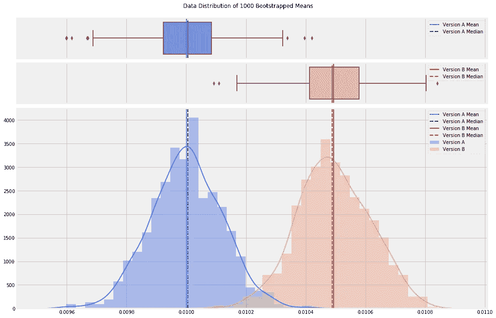

还有一个中心极限定理的例子

在传统的 A/B 测试中，您首先要定义版本之间有意义的最小差异。在上述分布中，版本 A(通常是当前版本)的平均值为 0.01。假设这是 1%的点击率，或者说 CTR。为了将我们的网站改为 B 版，我们希望看到至少 5%的改进，或至少 1.05%的点击率。接下来，我们设置我们的置信水平，即统计置信水平，即我们观察到的结果是由于真实的差异而不是随机的机会。通常，这被称为 **alpha** ，并被设置为 95%。为了确定要收集多少观察值，我们使用功效分析来确定所需的样本量。如果α可以被认为是产生 I 型错误(假阳性)的可接受的比率，那么**幂**可以被认为是产生 II 型错误(假阴性)的可接受的比率。

许多统计学家认为，第一类错误的代价是第二类错误的 4 倍。换句话说:你的电子商务网站目前运行良好。你相信你已经发现了一个可以增加销售额的改变，所以你实施了这个改变，却发现这个改变实际上伤害了网站。这是一个**I 型错误**，已经让你失去了销售。现在想象一下，你考虑做出改变，但决定它不会改善事情，即使事实上它会改善，所以你没有做出改变。这是一个**第二类错误**，除了潜在的机会，你什么也没损失。因此，如果我们将我们的置信水平设为 95%，这意味着我们只愿意接受 5%的实验中的 I 型错误。如果第一类错误的代价是第二类错误的 4 倍，这意味着我们将功率设置为 80%；我们愿意保守一点，在 20%的时间里忽略潜在的积极变化。

版本 A 是当前运行的版本。因此，我们有历史数据，可以计算平均 CTR 和相应的标准差。不过，我们需要 B 版本的这些值，而 B 版本还不存在。对于平均值，我们将使用 5%的改进值，因此`mean_b = 1.05 * mean_a`。尽管标准偏差需要估计。当这种估计很困难时，这对于传统的 A/B 测试来说是一个严重的缺点。在我们的例子中，我们假设版本 B 与版本 a 具有相同的标准偏差。用 **sigma** 代表标准偏差，用 **d** 代表我们两个平均值之间的差值，我们需要查找 **alpha** 和 **beta** 的 **z 值**，并用以下等式计算我们的样本量:

这样，我们只需运行我们的 A/B 测试，直到获得所需的样本大小。我们随机向我们网站的访问者展示版本 A 或版本 B，并记录每个版本的点击率。然后，您可以使用统计软件包或[t-检验计算和 t-检验表](https://github.com/raffg/natgeo_instagram_anomaly/blob/master/README.md)来得出一个 **p 值**；如果 p 值小于您的 alpha 值，在本例中为 0.05，那么您可以 95%的信心声明您观察到了版本 A 和版本 B 之间的真正差异，而不是偶然的差异。

## 传统 A/B 测试的缺点

传统的 A/B 测试的最大缺点是一个版本可能比另一个版本差很多，但是你必须继续向访问者提供那个版本，直到测试完成，因此失去了销售。如前所述，您还必须对版本 B 的标准偏差进行估计；如果你的猜测不正确，你可能收集不到足够的样本，无法达到统计功效；也就是说，即使版本 B 确实比版本 A 更好，即使你的实验证明了这一事实，你也没有足够的样本来宣布这种差异具有统计学意义。你会被迫接受假阴性。

如果有一种方法可以运行 A/B 测试，但又不浪费时间在劣质版本 B(或者 C、D、E……)上，那就太好了。

# 第 2 部分:多股武装匪徒

那些边上只有一个杠杆的老式吃角子老虎机总是拿走你的钱——那些被称为独臂强盗。想象一下，一整排机器并排排列，以不同的利率和价值支付。这是多臂大盗的想法。如果你是一个想要最大化你的赢款的赌徒，你显然想要玩最高支付的机器。但是你不知道这是哪台机器。你需要随着时间的推移探索不同的机器，以了解它们的收益是多少，但你同时也想利用收益最高的机器。类似的场景还有[理查德·费曼的餐厅问题](https://www.feynmanlectures.caltech.edu/info/exercises/Feynmans_restaurant_problem.html)。每当他去餐馆，他都想点菜单上最美味的菜，但他必须点所有可用的菜才能找到最好的菜。这种**开发**的平衡，选择一个在过去有良好回报的行动的愿望，和**探索**，尝试可能产生更好结果的选择的愿望，就是多臂强盗算法被开发的目的。

他们是怎么做到的？我们来看几个算法。我不会花太多时间讨论这些算法的数学，但是我会在我的 Github 上链接到每个算法的 Python 实现，您可以参考这些实现了解更多细节。我对每个算法都使用了相同的符号，所以`select_arm()`和`update()`函数应该能够完整地描述数学。

## ε-贪婪的

ε贪婪的 T4 算法基本上平衡了开发和探索。它采用一个介于 0 和 1 之间的参数`epsilon`，作为探索选项(在多臂土匪讨论中称为 arms)的概率，而不是在测试中利用当前的最佳变体。例如，假设ε被设置为 0.1。每次访问者来到被测试的网站，都会随机抽取一个 0 到 1 之间的数字。如果该数字大于 0.1，那么将向该访问者显示表现最好的变体(最初是版本 A)。如果该随机数小于 0.1，则将从所有可用选项中选择一个随机臂并提供给访问者。访问者的反应将被记录下来(点击或不点击，销售或不销售，等等。)并且那只手臂的成功率也会相应更新。

评估多臂 bandit 算法时，需要考虑几个因素。首先，您可以查看选择当前最佳手臂的概率。每个算法都需要一点时间来稳定和找到最佳臂，但是一旦达到稳定，ε-Greedy 应该以(1-ε)+ε/(臂数)的速率选择最佳臂。这是因为(1-ε)%的时间，它将自动选择最佳臂，然后剩余时间，它将以相等的速率选择所有臂。对于不同的ε值，精度如下:

在所有这些试验中，我模拟了 5 个失败/成功比率为`[0.1, 0.25, 0.5, 0.75, 0.9]`的手臂。这些值跨越的范围比通常在这样的测试中看到的要宽得多，但它们允许手臂在模拟比其他情况下所需的迭代次数少得多的迭代后显示它们的行为。每张图都是对 5000 次实验进行平均的结果，其中 250 次实验的范围为**。**

`epsilon`的低值对应于更少的探索和更多的利用，因此该算法需要更长的时间来发现哪个是最好的 arm，但是一旦发现，它就以更高的速率利用它。这一点可以从蓝线开始时的缓慢速度看得最清楚，但随后蓝线穿过其他手臂，并以较高的速度稳定下来。

当有许多武器在使用时，所有武器的预期报酬大致相似，观察算法的平均报酬可能是有价值的。下图再次显示了一些 epsilon 的比较值:

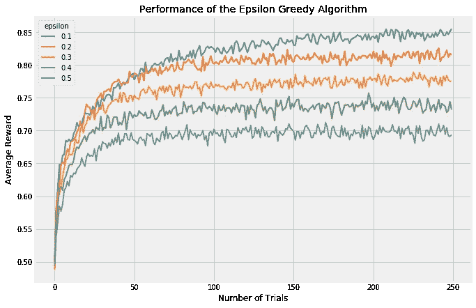

然而，这两种方法都关注于需要多少次试验才能找到最佳的手臂。一种着眼于累积回报的评估方法将更加公平地对待那些预先关注学习的算法。

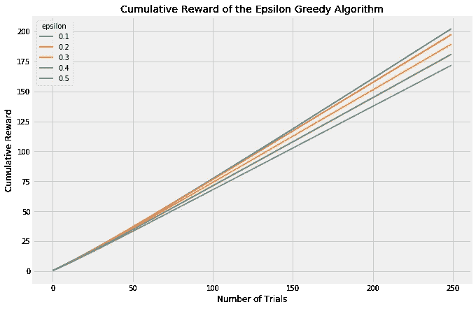

显然，选择`epsilon`的值非常重要，而且不是微不足道的。理想情况下，当试验次数很少时，您会想要一个高值(高探索),但是一旦学习完成并且知道了最佳手臂，您会转换到一个低值(高开发)。有一种技术叫做退火，我不会在这里做太多的详细介绍，但它非常简单。再次，查看我的 [Github 代码](https://github.com/raffg/multi_armed_bandit/blob/master/algorithms/epsilon_greedy_annealing.py)了解详情，但它基本上完全按照我描述的那样做:随着试验次数的增加调整`epsilon`。使用退火的ε-贪婪算法并绘制选择每个臂的比率看起来像这样:

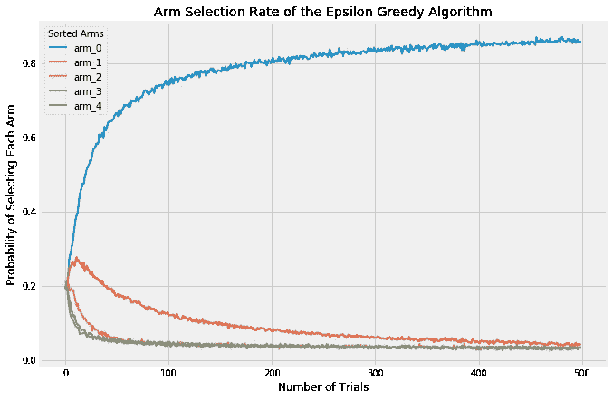

有了每个臂的这些(公认的极端)值，算法很快就选定了最佳的`arm_0`，并在很短的时间内选择其余的臂。

多臂 bandit 方法的最大优势之一是，如果一个臂明显是赢家，您可以提前取消测试。在这些实验中，每一次尝试都是伯努利试验——结果要么是成功(一次广告点击、一次销售、一封电子邮件注册)，要么是失败(用户不采取任何行动就关闭网页)。这些试验总体上可以用贝塔分布来表示。请看下图。首先，每一组都有相同的概率出现任何结果。但随着越来越多的试验积累，每只手臂的成功概率变得越来越专注于其实际的、长期的成功概率。注意，y 轴是概率密度，并且在每一帧中增加；为了清楚起见，我省略了它，所以只要记住每条曲线下的面积总是正好为 1。随着曲线变得越来越窄，它们相应地变得更高，以保持这个恒定的面积。

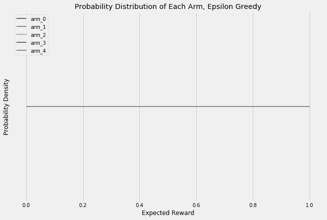

注意每只手臂的峰值是如何开始围绕其实际支付概率`[0.1, 0.25, 0.5, 0.75, 0.9]`的。您可以使用这些分布进行统计分析，如果达到统计显著性，可以提前停止您的实验。另一种静态看待这些变化的方式是:

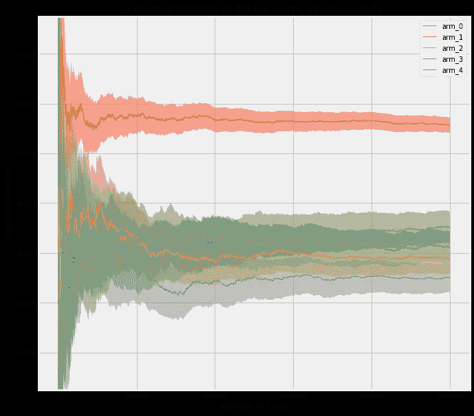

这显示了一个跨度为 1，000，000 次试验的单个实验(与跨度为 250 的 5000 次实验的平均结果相反)，以及更真实的`[0.01, 0.009, 0.0105, 0.011, 0.015]`值(在这种情况下，我模拟了点击率，CTR)。但我想指出的是，`arm_1`，最好的手臂，被使用得更频繁，因为ε-Greedy 喜欢它。它周围的 5%置信区间(阴影区域)比其他臂要紧密得多。正如在上面的 gif 中，最佳臂具有更紧密和更高的钟形曲线，代表更精确的价值估计，此图表显示使用多臂 bandit 方法允许您利用最佳臂，同时仍然了解其他臂，并且比传统 A/B 测试更早达到统计显著性。

**Softmax**

epsilon-Greedy 的一个明显缺陷是它完全随机地进行探索。如果我们有两个回报非常相似的手臂，我们需要探索很多来了解哪个更好，所以选择一个高ε。然而，如果我们的两臂有非常不同的奖励(当然，当我们开始实验时，我们不知道这一点)，我们仍然会设置一个高的ε，并在较低的支付奖励上浪费大量时间。 [Softmax](https://github.com/raffg/multi_armed_bandit/blob/master/algorithms/softmax.py) 算法(和它的[退火对应物](https://github.com/raffg/multi_armed_bandit/blob/master/algorithms/softmax_annealing.py))试图通过在探索阶段选择每个手臂来解决这个问题，大致与当前预期的回报成比例。

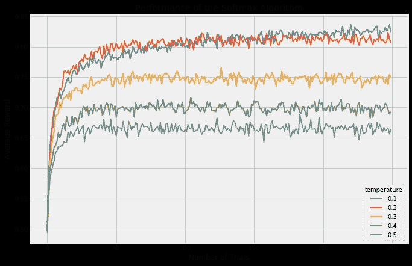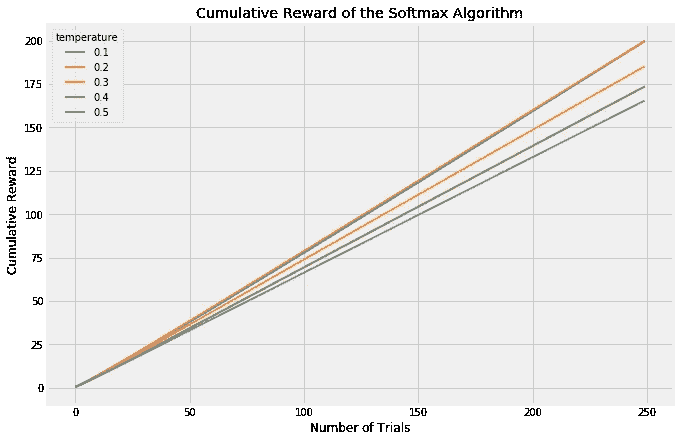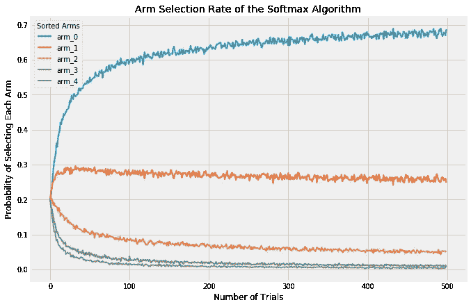

`temperature`参数的目的与ε贪婪算法中的`epsilon`相似:它平衡了探索利用的倾向。在极端情况下，0.0 的温度将*始终*选择性能最佳的手臂。无穷大的温度会随机选择任何一个臂。

在比较这些算法时，我希望您观察它们在探索/利用平衡方面的不同行为。这就是多兵种土匪问题的症结所在。

## UCB1

尽管 Softmax 算法考虑了每个 arm 的期望值，但这确实是合理的，因为一个表现不佳的 arm 最初会连续成功几次，从而在利用阶段受到算法的青睐。即使他们没有足够的数据来确定，他们也会对可能有高回报的武器挖掘不足。因此，考虑我们对每个手臂的了解程度，并鼓励算法稍微倾向于那些我们对其行为没有高度信心的手臂，以便我们可以了解更多，这似乎是合理的。算法的置信上限类就是为此而开发的；在这里，我将演示两个版本，UCB1 和 UCB2。它们的操作方式相似。

[UCB1](https://github.com/raffg/multi_armed_bandit/blob/master/algorithms/ucb1.py) 根本不显示任何随机性(你可以在[我在 Github](https://github.com/raffg/multi_armed_bandit/blob/master/algorithms/ucb1.py) 上的代码里看到，我根本不导入`random`包！).与ε-贪婪和 Softmax 相反，它是完全确定的。此外，UCB1 算法没有任何需要调整的参数，这就是为什么下面的图表只显示了一个变体。UCB1 算法的关键是它的“好奇心红利”。当选择一个手臂时，它会获得每个手臂的预期奖励，然后加上一个奖金，该奖金的计算与奖励的置信度成反比。它对不确定性持乐观态度。因此，相对于可信度较高的手臂，可信度较低的手臂会得到一点提升。这导致算法的结果在不同的试验之间摇摆不定，尤其是在早期阶段，因为每个新的试验都为所选的分支提供了更多的信息，所以在接下来的几轮中，其他分支基本上会更受青睐。

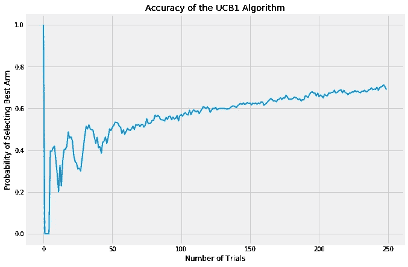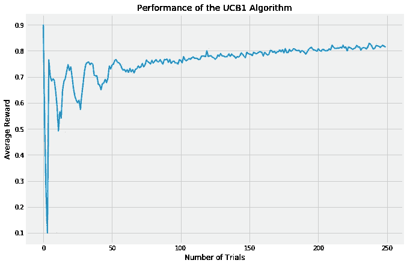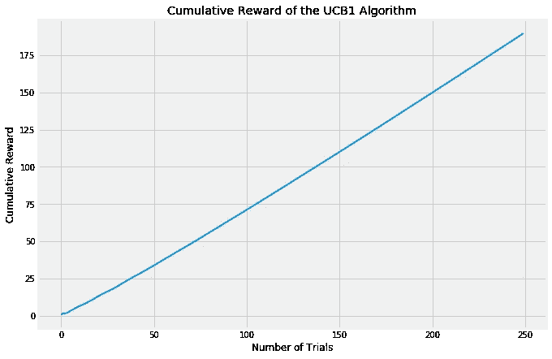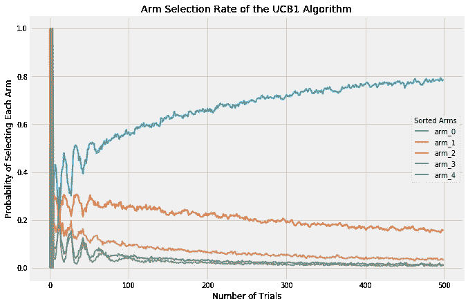

## UCB2

[UCB2 算法](https://github.com/raffg/multi_armed_bandit/blob/master/algorithms/ucb2.py)是 UCB1 的进一步发展。UCB2 的创新在于确保我们在尝试新的手臂之前，对同一只手臂进行一段时间的试验。这也确保了从长远来看，我们定期从开发中休息一下，以重新探索其他武器。当预期回报会随着时间变化时，UCB2 是一个很好的算法；在其他算法中，一旦发现最佳臂，它将被优先考虑，直到实验结束。UCB2 挑战了这一假设。

UCB2 有一个参数，`alpha`,它可以有效地调整 UCB2 支持某些分支的周期长度。

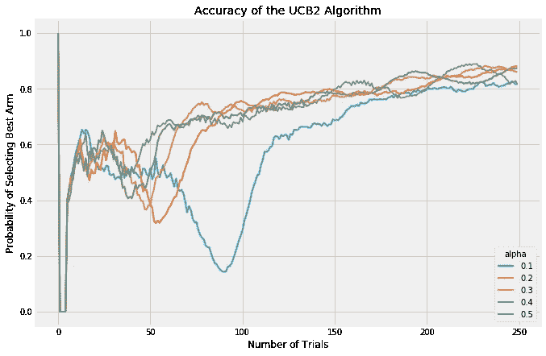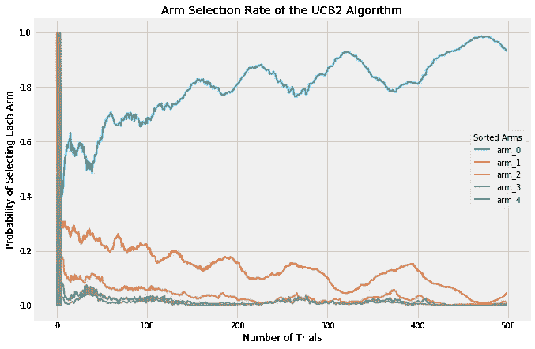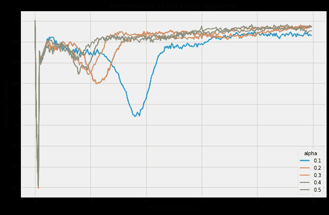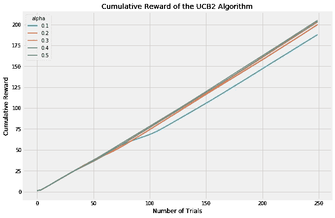

## Exp3

最后，我们有 [Exp3 算法](https://github.com/raffg/multi_armed_bandit/blob/master/algorithms/exp3.py)。UCB 类算法被认为是在**随机**环境中表现最好的算法；也就是说，每次试验的结果都是完全随机的。相比之下, [Exp3 算法](https://github.com/raffg/multi_armed_bandit/blob/master/algorithms/exp3.py)被开发用来处理审判**对抗**的情况；也就是说，我们要考虑未来试验的预期结果可能会被先前试验的结果所改变的可能性。股票市场就是一个很好的例子，可以说明 Exp3 算法什么时候是好的。一些投资者看到一只股票以较低的每股价格上市，即使它目前的回报并不是很大，也买了它，但大量购买股票的行为导致其价格飙升，其表现也是如此。由于我们的算法预测了这样或那样的事情，该股票的预期收益正在发生变化。因此，在这些实验中，Exp3 的表现似乎比其他算法差得多。我完全随机地运行每个试验，这是一个随机设置，Exp3 在其中从未被开发为强大。

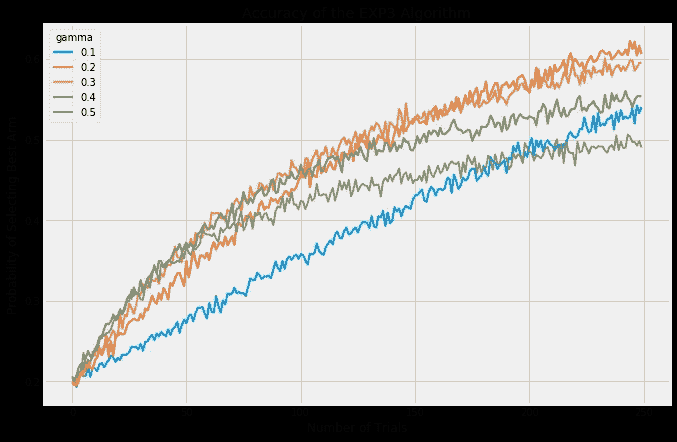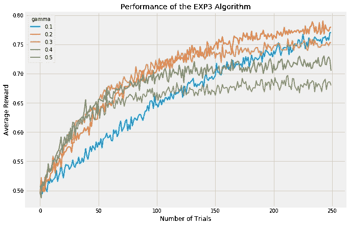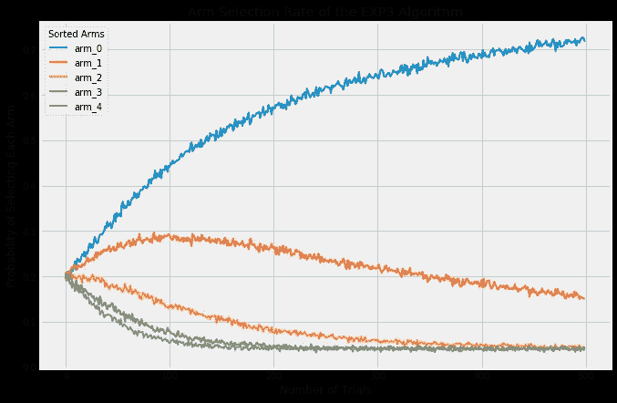

## 比较算法

现在，让我们一起来看看所有这些算法。正如你所看到的，在这一组简短的试验中，UCB2 和 epsilon-Greedy 看起来像是在一起运行，UCB2 有更多的机会进行探索。然而，UCB2 的改进速度稍快，事实上在更长的时间内，它超过了 epsilon-Greedy。Softmax 往往很早就达到峰值，这表明它继续探索，以利用其最佳臂的知识为代价。作为 UCB2 的早期版本，UCB1 落后于其更具创新性的兄弟。Exp3 是一个有趣的例子；这似乎是迄今为止表现最差的，但这是意料之中的，因为这些试验不是 Exp3 所擅长的。相反，如果试验环境是对抗性的，我们预计 Exp3 会更有竞争力。

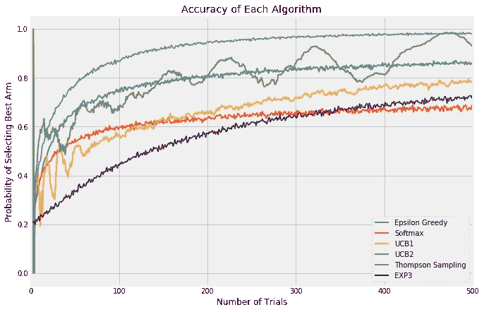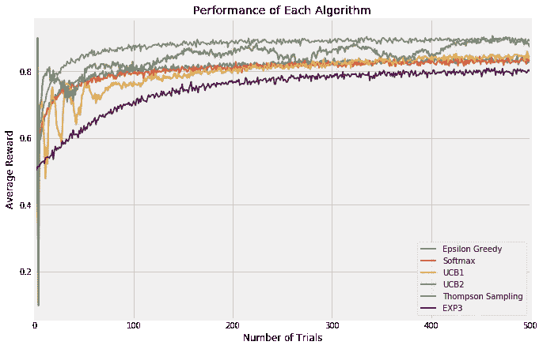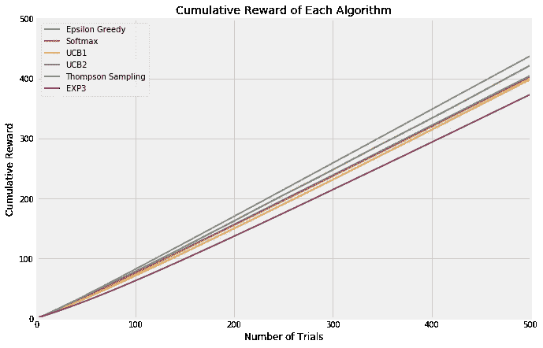

那些图表中有一个算法我们还没有讨论过， [**汤普森采样**](https://github.com/raffg/multi_armed_bandit/blob/master/algorithms/thompson_sampling.py) 。这个算法是完全贝叶斯的。它从后验分布中为每只手臂生成一个期望回报向量，然后更新该分布。

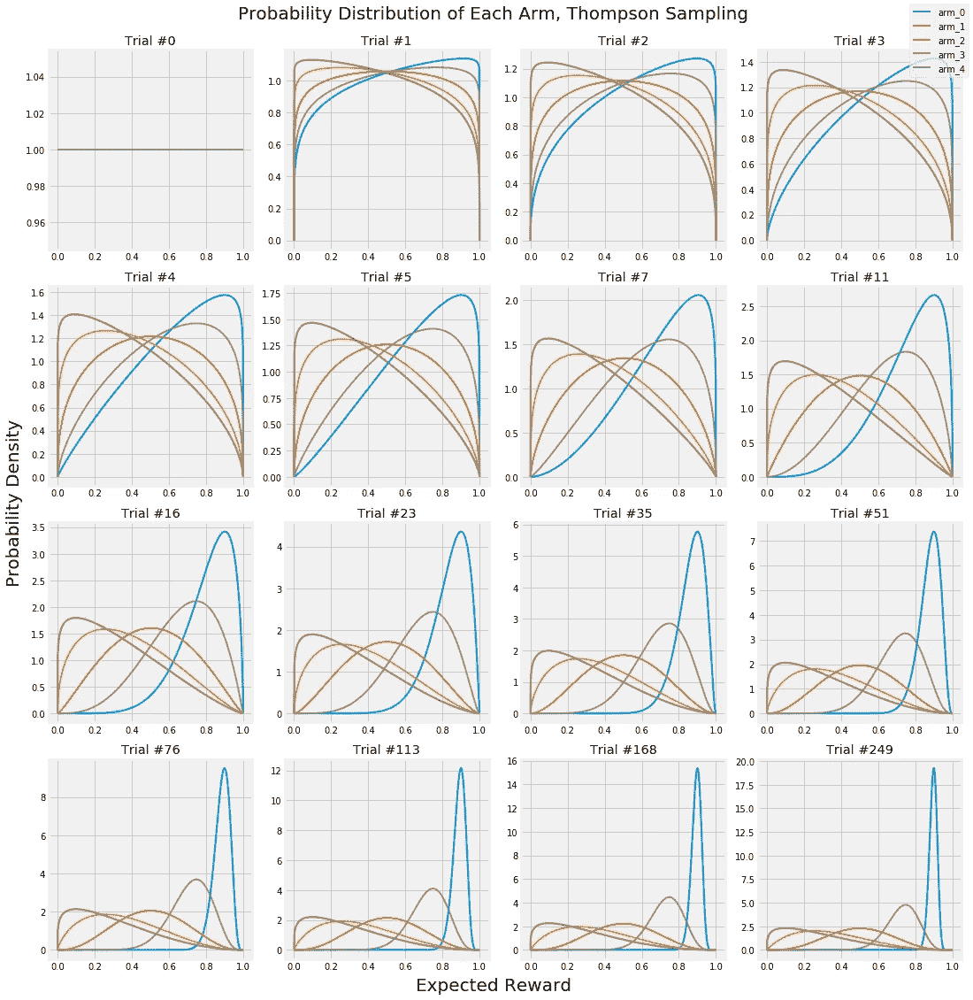

该算法从变化的概率分布中抽取一个随机数，并选择最大值。它只是在每次试验中拉动预期回报最高的杠杆。汤普森取样学*非常快*哪一个是最好的臂并且*非常*赞成它向前，以探索为代价。只要看看所有其他手臂中的不确定性(阴影区域的宽度)就知道了！那是近乎纯粹的剥削和极少探索的结果。

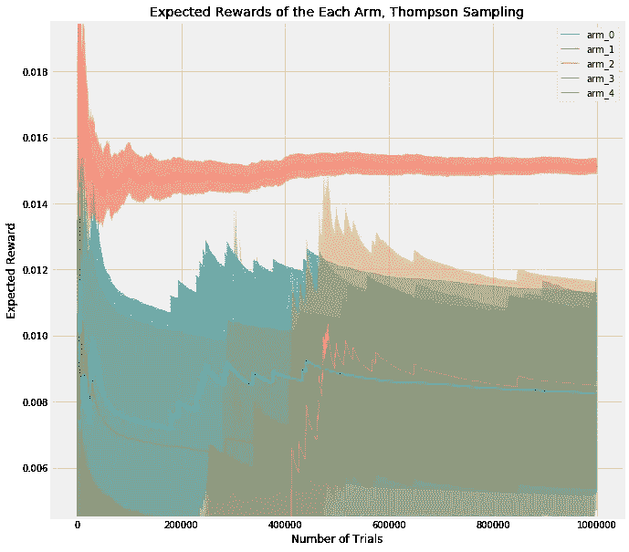

## 你的多臂强盗实验什么时候结束？

因为 Thompson 抽样是以贝塔分布给定的频率抽取臂，我们可以使用许多不确定的统计技术来知道一个臂何时由于优势而领先于机会。Google Analytics 开发了一个合理的解决方案，使用他们所谓的 [**潜在价值剩余**](https://support.google.com/optimize/answer/7405044?hl=en) 。他们首先检查是否满足三个标准，然后检查是否出现了“冠军”手臂，并宣布实验完成。这三个标准是:

*   该网站每天都有活跃的流量
*   该实验至少运行了两周，以消除任何每周的周期性。
*   剩余的潜在价值不到 1%

在这一点上，一旦任何一只手臂在至少 95%的情况下被选中，实验就结束了。

潜在价值剩余在文献中也被称为“遗憾”。它描述了 CTR 等指标在领先的基础上还能提高多少。当另一只手只比领先者多 1%的机会时，这种微弱的进步不值得继续测试。

测试中剩余的潜在值计算为`(*θ*ₘₐₓ *— θ*) / θ**`分布的第 95 个百分位数，其中`*θ*ₘₐₓ`是一行中`*θ*`的最大值，`*θ**`是最有可能达到最优的变异的`*θ*`值，`*θ*`是从每个臂的 beta 分布中提取的值。和以前一样，关于数学的细节请参考我的 [Github repo](https://github.com/raffg/multi_armed_bandit/blob/master/simulation_framework/simulation_framework.py) ，或者阅读一位谷歌工程师发表的[原始论文](https://static.googleusercontent.com/media/research.google.com/en//pubs/archive/42550.pdf)。

在我在本文开头描述的传统 A/B 测试中，置信区间为 95%,功效为 80%,版本 A 的 CTR 为 1%,假设版本 B 的 CTR 为 1.05%,所需的样本量至少是从每个版本中抽取的 **635，829** 个样本。在我的实验中，我为每只手臂取了 70 万张画。

当使用带有谷歌终止标准的汤普森抽样时，我模拟了 100 次实验，并对结果进行了平均。该算法确定版本 B 好 5%,平均**5357**拉动劣质版本 A 臂，6353 拉动优质版本 B

> **在传统的 A/B 测试中，我会为我的客户提供 60 多万次我的网站的劣质版本，而 Thompson Sampling 只需要 5000 次就能学会同样的事情。错误减少了 120 倍！**

那么哪个土匪最好呢？这真的取决于你的应用和需求。它们都有各自的优点和缺点以及对特定情况的适用性。Epsilon-Greedy 和 Softmax 是该领域的早期发展，其性能往往不如置信上限算法。在 web 测试领域，UCB 算法似乎使用得最频繁，尽管 Thompson Sampling 提供了终止标准的好处，并且是 Google Analytics 的优化工具使用的算法。如果你的环境不是随机的，你可以尝试 Exp3 算法，它在敌对环境中表现更好。