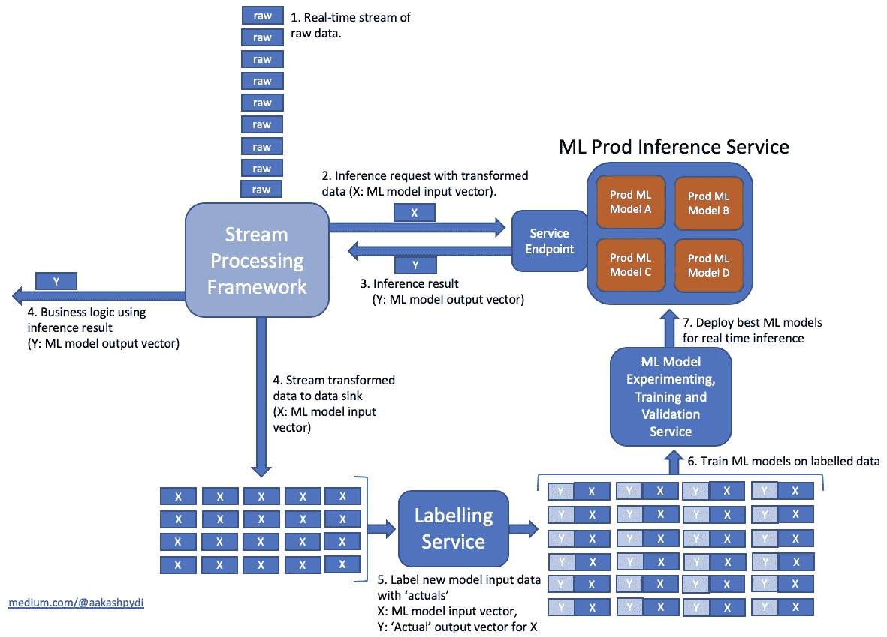

# A/B 使用 Amazon SageMaker 在生产中测试机器学习模型(讨论)

> 原文：<https://towardsdatascience.com/a-b-testing-machine-learning-models-in-production-using-amazon-sagemaker-discussion-ee8953043397?source=collection_archive---------74----------------------->

## 用潜在的实时推理 ML 工作流来考虑 A/B 测试生产中的 ML 模型

[基兰·卡瓦诺](https://www.linkedin.com/in/kierankavanagh/)、[大卫·尼根达](https://www.linkedin.com/in/david-nigenda-49aab264/)和我，最近为 [AWS 机器学习博客](https://aws.amazon.com/blogs/machine-learning/)写了一篇关于[使用亚马逊 SageMaker](https://aws.amazon.com/blogs/machine-learning/a-b-testing-ml-models-in-production-using-amazon-sagemaker/) 在生产中 A/B 测试 ML 模型的文章。我推荐阅读这篇文章，并查看我们附带的 Jupyter 笔记本([亚马逊 SageMaker](https://github.com/awslabs/amazon-sagemaker-examples/tree/master/sagemaker_endpoints/a_b_testing) 的 A/B 测试)。

在这篇文章中，我想通过分享一个潜在的实时推理生产机器学习工作流的高级设计图，为我们的 AWS 博客文章添加背景。

**一个潜在的实时推理 ML 工作流**

请注意，ML 推理服务有多个模型，可用于向其端点提供推理请求。接下来的问题是，服务使用什么逻辑将推理请求路由到特定的 ML 模型。

在 [Amazon SageMaker](https://aws.amazon.com/sagemaker/) 上下文中，一个[production variant](https://docs.aws.amazon.com/sagemaker/latest/APIReference/API_ProductionVariant.html)" I*标识了您想要托管的模型以及为托管它而部署的资源*(直接来自文档！).在本帖中，我们将讨论 SageMaker 端点如何托管多个 ProductionVariant，用户可以(1)使用加权随机方法指定如何在[production variant](https://docs.aws.amazon.com/sagemaker/latest/APIReference/API_ProductionVariant.html)和它们相应的模型之间分配流量，或者覆盖这个默认的流量分配行为，以及(2)明确指定哪个 [ProductionVariant](https://docs.aws.amazon.com/sagemaker/latest/APIReference/API_ProductionVariant.html) 和相应的模型应该服务于一个推理请求。

这种灵活性为以各种方式使用生产流量对新的 ML 模型进行 A/B 测试提供了可能性，从而在新模型的验证过程中增加了一个有效的最终步骤。

[AWS 开发者指南:生产中的测试模型](https://docs.aws.amazon.com/sagemaker/latest/dg/model-ab-testing.html)。