# A/B 测试-第 2 部分

> 原文：<https://towardsdatascience.com/a-b-testing-part-2-42b94e1fb1dc?source=collection_archive---------33----------------------->

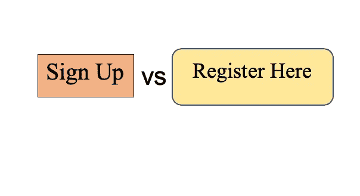

这是我的 A/B 测试系列的第二篇文章。在第一部分中，我们学习了 A/B 测试背后的想法。在这篇文章中，我将带你浏览 A/B 测试背后的统计数据，并重点分析测试的结果。我将使用 [Udacity 的 A/B 测试课程](https://www.udacity.com/course/ab-testing--ud257)的最终项目作为案例研究。

我们将回顾:

*   测试概述
*   测试前分析
*   分析测试结果
*   建议

# 测试概述

在线学习平台 Udacity 在其课程概览页面有两个选项 ***开始免费试用*** 和 ***获取课程资料*** 。

如果学生单击“开始免费试用”按钮，他们将被要求输入信用卡信息，并注册参加付费课程的免费试用。14 天后，除非先取消，否则会自动收费。

如果学生单击“访问课程材料”按钮，他们将能够观看视频并免费参加测验，但他们不会获得辅导支持或认证证书，也不会提交他们的最终项目以获得反馈。

Udacity 看到许多学生注册了免费试用，过了一段时间就放弃了这门课程，因为他们根本没有足够的时间来专注于这门课程。因此，Udacity 决定进行一项测试，如果学生点击开始免费试用按钮，他们将被询问他们有多少时间可以投入到课程中。如果学生选择每周 5 小时或更多，他们将像往常一样通过结账流程。但是，如果他们选择每周少于 5 小时，将会出现一条消息，表明 Udacity 课程通常需要更多的时间才能成功完成。此时，学生可以选择继续注册免费试用，或者免费获取课程材料。[这张截图](https://www.google.com/url?q=https://drive.google.com/a/knowlabs.com/file/d/0ByAfiG8HpNUMakVrS0s4cGN2TjQ/view?usp%3Dsharing&sa=D&ust=1588289196680000)展示了实验的样子。

## 测试背后的假设

假设是，这可能会预先为学生设定更明确的期望，从而减少因为没有足够的时间而离开免费试用的沮丧学生的数量，而不会显著减少继续通过免费试用并最终完成课程的学生的数量。这将改善学生的整体体验，并提高教练支持可能完成课程的学生的能力。

为了更好地理解用户流程，您可以查看以下图形:

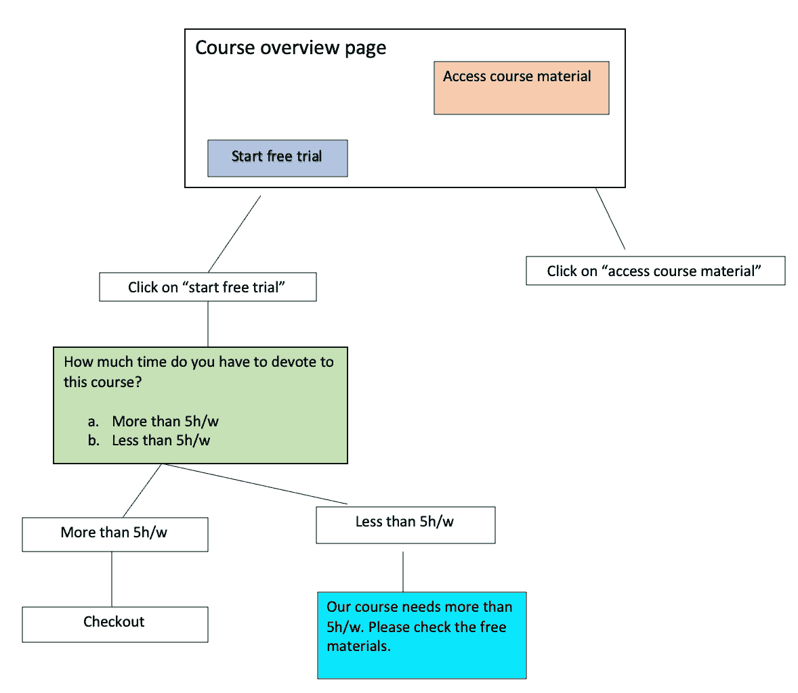

新设计中的用户流

> **提示**:在不知道用户流量的情况下，分析一个测试是没有意义的！此外，不可能对不变量和评估度量做出正确的决定。

# 测试前分析

在运行测试之前，我们需要执行测试前分析，包括:

*   选择分流单位
*   选择不变/评估指标
*   计算所需的样本量

## 分流单位

在这个测试中，Udacity 选择 cookie 作为导流单元。如果学生注册了免费试用，从那时起，他们将被一个用户 id 跟踪。同一个用户名不能注册两次免费试用。对于未注册的用户，即使他们在访问课程概述页面时已登录，也不会在实验中跟踪他们的用户 id。

## 不变/评估指标

不变指标用于健全性检查。换句话说，这些指标的值不应该受到变更的影响。查看用户流程图，我选择以下指标作为不变指标:

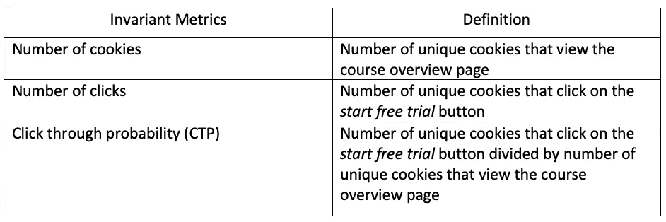

不变度量

Udacity 添加到用户漏斗的新层位于用户点击开始免费试用按钮之后。因此，与到达该按钮之前的用户旅程相关的指标应该保持不变。接下来，我们需要确定评估指标:

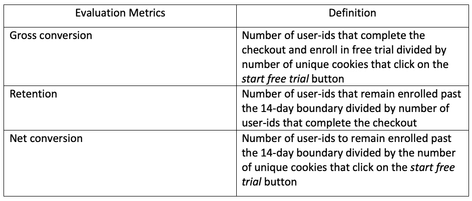

评估指标

基于我们期望看到的测试假设:

*   保留率的增加，这意味着更多的学生在免费试用后留在了测试组。
*   总转化率下降，这意味着测试组中沮丧的学生较少。
*   对净转换率没有太大影响，这意味着我们在测试组没有失去大量付费用户。

Udacity 给出了变更前每天的指标值。这些是我们的基线值。请注意，这些值与我们的用户数量相关。

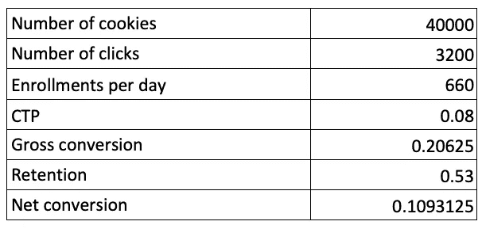

人口数据

假设我们取了一个大小为 5000 的样本，这意味着 5k 的 cookies 查看了课程概述页面。基线值需要调整，因为现在我们有 5k cookies，而不是 40k:

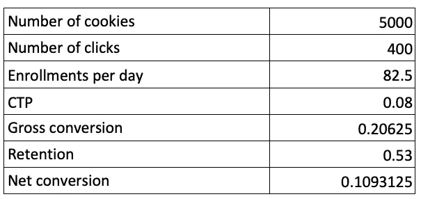

抽样资料

## 设置测试的显著性水平和功效

为了理解测试的显著性水平和功效，让我们看看在无效假设和替代假设下的 *d* (测试和控制中的度量 X 的值之间的差异)的分布:

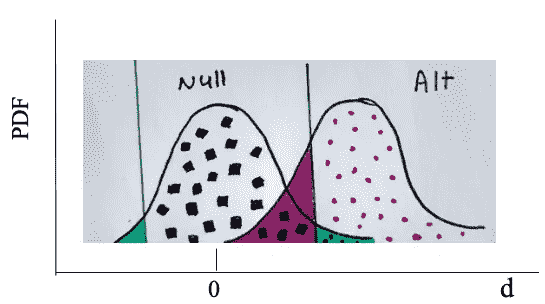

零假设和替代假设下 **d** 的分布

再次记住什么是无效假设和替代假设。零假设表明测试组和对照组之间没有真正的差异( *d* = 0)，替代假设表明有差异( *d* ！=0).你可能会问自己，在零假设下， *d* 的分布意味着什么？为什么无效假设和替代假设有分布？答案在于我们是从我们的人口中抽样的(还记得 5k 饼干吗？)!也就是说，每次采样，我们都会得到一个新的值。在零假设下，这些值的分布将是平均值为 0 的正态分布。

**显著性水平和置信度水平**:显著性水平通常被称为 1 类误差，用希腊字母 Alpha 表示。这是错误拒绝零假设的概率，在上图中用绿色标出。该区域位于零假设曲线之下，并且在其置信区间之外。在工业中这个值如果经常**设置**为 5%。黑色方块(1-alpha)显示的区域称为置信水平。当零假设为真时，置信水平基本上是拒绝替代假设的概率。如果 alpha 设置为 5%，则置信度为 95%。

**置信区间:**我们不确定 *d* 的 ***真值*** ，所以我们使用 95%的置信水平在观察到的 *d* (我们测量的 *d* 是我们实验的结果)周围建立一个置信区间，我们这样解释: ***在 95%的样本中，d 的真值落在置信区间内。***

**β和功效**:类型 2 误差或β是错误拒绝零假设的概率，这是**设置**为 20%。在上图中，贝塔以紫色突出显示。所以 1-斗鱼 a.k.a 测试的功率是**设置**为 80%。图表中的红点表示功率。换句话说，能力是在你应该拒绝零假设的时候拒绝零假设的概率！(这是*真正，*给熟悉混淆矩阵的人看。)

我的朋友就是你所需要的去理解测试背后的数据！

[来源](https://giphy.com/gifs/cbs-big-bang-theory-3ohryD06NMpRUCxsuQ/links)

## 计算所需的样本量

现在我们应该计算我们需要的最小 cookies 数(最小样本大小)，以达到期望的统计功效。

总转化、留存、净转化都是**概率**，也就是说是二项式分布。基于中心极限定理，这些度量的标准偏差由以下公式给出:

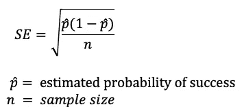

为了计算所需的样本大小，假设我们有两个样本，一个是基线(网站的当前版本)，另一个是测试版本(我们还没有推出，想找到它的大小)。实验功效与样本量有如下关系:

双尾检验中检验能力与样本量的关系

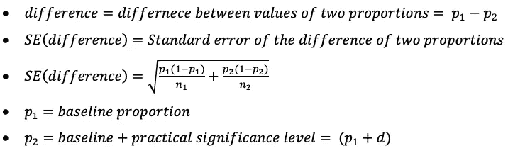

如您所见，样本大小包含在标准误差中。如果您将比例放入公式中，并假设我们希望在对照组和测试组之间有一个很好的 50/50 分割，那么样本大小将是:

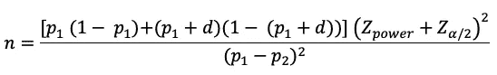

酷！我们有一个样本量的公式！假设功效设置为 80%,显著性水平设置为 5%,则更一般的公式是:

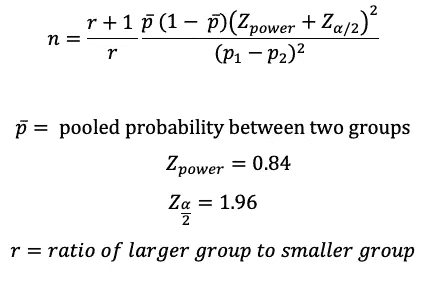

如果我们想要测试组和对照组各占一半，那么 r=1。为了能够计算每个指标所需的样本量，我们需要*基线转换*和*最小期望变化*(也称为实际显著性水平)。

[来源](https://giphy.com/gifs/finally-atlast-itsover-8UF0EXzsc0Ckg)

每个指标的预期实际显著性水平由 Udacity 给出。假设测试组和对照组的比例为 50/50，我们得到每个指标的样本大小的以下值:

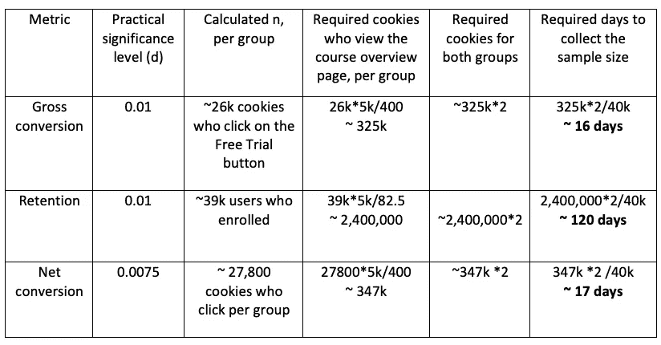

每个评估指标所需的样本量

**关于工作台的重要注意事项**:

*   您需要选择您在最后一列中为测试计算的最大天数。这属于保留指标，表明需要 100 多天才能获得保留指标所需的 cookies 数量。这将是一个非常长的时间来运行一个测试，这是不值得的努力。我们放弃这一指标，转而使用第二大数字，它属于净转换率。
*   请注意，最后一列是基于我们每天可以处理 40k cookies 的假设计算的。这不实际！我们绝不会让所有人都参与实验，而是应该选择一定比例的人。假设我选择让 80%的人参与这个实验，那么我大概需要 22 天。

# 分析测试结果

恭喜你！您设计了您的测试，并运行了大约 3 周，现在您有了[结果](https://docs.google.com/spreadsheets/d/1Mu5u9GrybDdska-ljPXyBjTpdZIUev_6i7t4LRDfXM8/edit#gid=0)！

## 健全性检查

我们需要做的第一件事是健全性检查，我在这篇文章中强调了很多。我们为健全性检查选择了三个不变指标，让我们逐一检查:

1.  查看课程概述页面的 cookies 数量:

我们决定测试组和对照组各占一半。这意味着浏览课程概览页面的 cookies 数量在两组之间应该不会有太大的差异。我们查看两组中的 cookies 总数，并检查它们是否有显著差异。如果答案是肯定的，我们查看每天的 cookies 数量，并检查差异来自哪里。

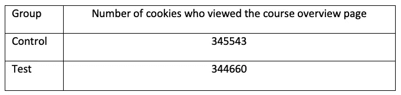

这些数字看起来非常相似。但是我们需要确定它们之间的差异是*随机*还是*显著*。我们可以通过二项式分布来模拟将 cookies 分配给控制组和测试组，成功概率为 50%(假设成功意味着被分配给控制组)。我们想要回答的问题是，如果我们有一个测试+控制组大小的样本，并且有 50%的概率被分配到控制组，那么在控制组中看到观察到的 cookies 分数有多奇怪？

为了回答这个问题，我们需要建立一个大约 50%概率的置信区间，并检查在控制组中观察到的饼干部分是否在该区间内。

如前所述，二项式分布的标准误差通过以下公式计算:

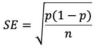

为了建立置信区间，我们首先需要计算误差幅度:

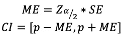

误差幅度和置信区间关系

为了让事情更容易理解，我做了这张表:

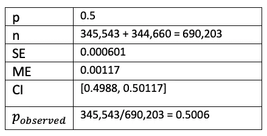

查看课程概述页面的 cookies 数量的健全性检查

请注意，我假设本次计算的置信度为 95%。

由于对照组中观察到的饼干比率在置信区间内，我们认为差异*不显著*。

2.点击开始免费试用按钮的 cookies 数量

按照与上面相同的公式和推理，我们得到这个表:

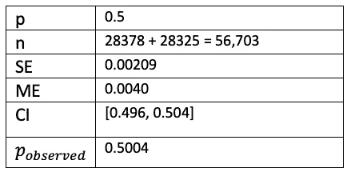

对点击免费试用按钮的 cookies 数量进行健全性检查

观察到的比例在 CI 范围内，因此我们可以检查第三个指标。

3.点击通过概率(CTP)

我们有两个概率，我们想知道它们之间的差异是否显著。

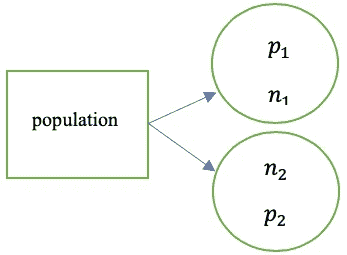

从总体中抽取两个样本，每个样本都有自己的大小和比例

我们需要利用前面提到的 *SE(差异)*公式:

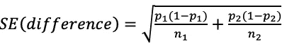

两个样本比例的标准误差

我们期望两组的 CTP 之间的差异为零。因此，我们在 *d* = 0 附近设定一个置信区间，并检查 *d* 的观测值是否落在该区间内。

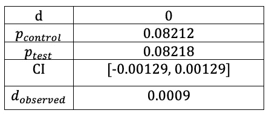

CTP 的健全性检查

根据上表，观察到的两组 CTP 之间的差异并不显著。我们的理智检查都完成了！

## 检查效果大小

现在我们进入有趣的部分！检查测试结果是否具有统计和实际意义。

1.  总转换

为了计算这个指标，我们需要注册免费试用的用户数和点击免费试用按钮的 cookies 数。注册数据是不完整的，有些日子我们有点击数据，但没有注册数据。因此，在计算总转化率时，我们需要将这些日子过滤掉。

类似于点击率，我们使用 *SE(差异)*在两组总转化率之间的*观察差异*周围做出置信区间。与对照组相比，试验组的总转化率降低了 2.06%。

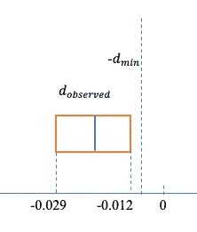

两组总转换值差异的置信区间

回头看看测试的假设，我们预计总转换值会下降。我们预期的最低降幅为 1%，置信区间的下限大于 1%。换句话说，我们可以确定下降幅度将大于 1%,并且由于置信区间不包含 0，因此该结果在统计上和实践上都是有意义的。

2.净转换

与总转化率非常相似，我们围绕两组间观察到的差异建立了 95%置信水平的置信区间。

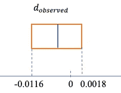

两组净转换率值差异的置信区间

在这种情况下，结果没有统计学意义，因为我们的置信区间包括 0。

# 建议

我们唯一有把握谈论的指标是总转化率。我们看到，在测试组中，这个指标的值下降了(正如我们所预料的)。然而，净转换指标的结果并不显著！这意味着我们没有信心说出*这个指标会如何变化，或者基本上*付费用户数量会如何变化！**

**我建议不要启动这项测试。虽然总转化率的下降使得沮丧的学生数量也减少了，但是不清楚通过免费试用期并付款的学生数量如何变化。**

# ****资源****

*   **[Udacity A/B 测试课程](https://www.udacity.com/course/ab-testing--ud257)**
*   **[A/B 测试背后的数学原理](/the-math-behind-a-b-testing-with-example-code-part-1-of-2-7be752e1d06f)**
*   **[斯坦福讲座](https://web.stanford.edu/~kcobb/hrp259/lecture11.ppt)**
*   **[用 Python 进行 A/B 测试](https://www.kaggle.com/tammyrotem/ab-tests-with-python)**