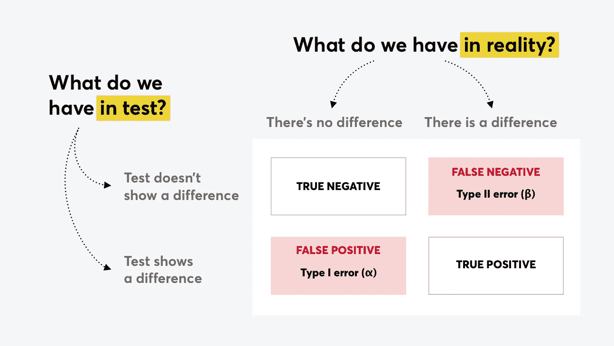
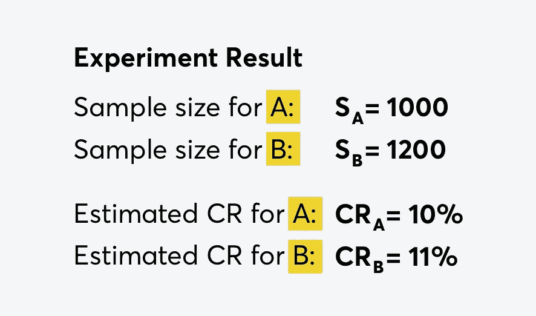
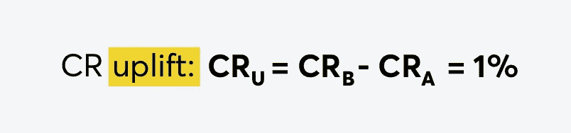
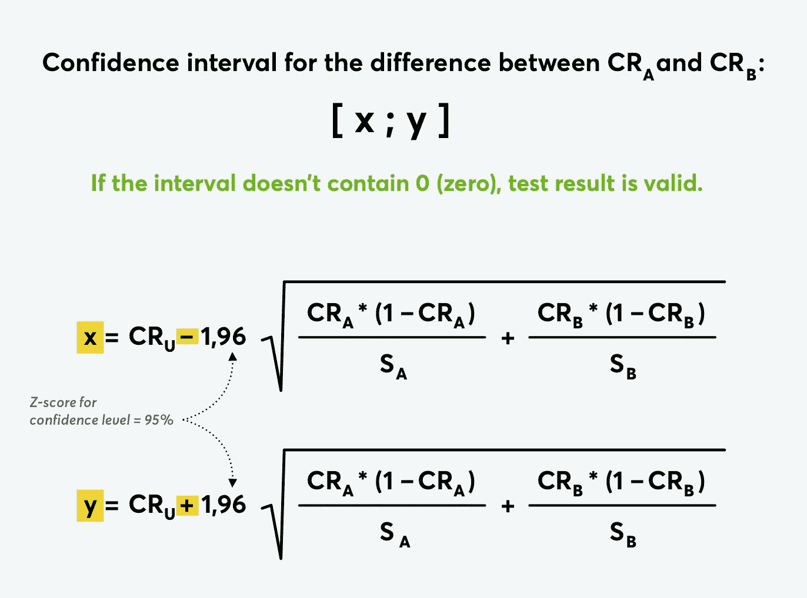

# A/B 测试统计:转化率的真实值和估计值

> 原文：<https://towardsdatascience.com/a-b-testing-statistics-true-and-estimated-value-of-conversion-rate-b7a77db6f60e?source=collection_archive---------14----------------------->

## 如何确保你的分割测试结果在统计上是显著的(简单的说)

相信分割测试还是检查其统计显著性？(感谢❤巴鲁·金的插图)

*轶事:
——我如何检查我的测试的统计显著性？
——我可以告诉你。我也能看出来。我如何检查？*

A/B 测试是最受欢迎的用户体验研究方法之一，用于评估网站或移动应用的 UX 或 UI 更改的有效性。假设你改变了一些东西，开始了测试——似乎修改后的版本赢了。但是我们能确定吗？我们有百分之几的把握？

为了回答这个问题，让我们把这种方法 A/B 测试不作为一种测量用户参与度和变化满意度的方法，而是作为一种统计实验。那么，你需要知道什么才能确定我们可以接受所获得的结果呢？

# **A/B 测试结果不显示转化率**

我的意思是它没有显示 CR 的实际值，而是估计值。无论你在实验中有多少用户，样本量仍然小于用户总数。因此，当您确定测试所需的样本量时，下一个逻辑问题是“我们需要多少用户来确保测试结果(估计的 CR 值)真正描述了事物的实际状态(真实的 CR 值)？

换句话说，**估计 CR (T)** 与**真实值(Q)** 有多接近。为了回答这个问题，我们需要置信区间。

# **什么是置信区间？**

因此，我们运行了 A/B 测试，现在有了一些估计的转化率(让我们用 T 来表示)。但实际上实际转化率可能略少，也可能略多，我们不知道一个确切的数值，但可以从[a；b]包含它。这被称为置信区间。

样本越大，区间越小。这就是为什么在开始测试之前，确定每个实验组的最小用户数量是如此重要。

置信区间是以一定的置信度计算的。例如，**如果置信度为 95%** (通常如此)，**是什么意思？**

下面是:如果我们对 100 个不同的样本进行 100 次测试，得到 100 个估计的 CR，并计算每个 CR 的置信区间，那么 100 个区间中有 95 个包含真实的 CR 值。

重要的是要理解置信水平是置信区间计算过程的特征，而不是区间本身。我们可以选择哪个置信度足以让我们相信测试结果。

> 因此，置信区间是 CR 估计的一种方式，它不仅产生单个值，而且产生包含实际 CR 值的值区间。置信水平显示了它被控制在那里的可能性。

# **那 95%从何而来？**

我希望我已经成功地传达了信心水平概念的含义，所以现在我们来看看为什么通常是 95%，而不是 75%或 80%？

而且这里我还要介绍两个来自数理统计的术语(今天最后一个，我保证！)—显著性水平和统计功效。

但首先，让我们看看下面的图片。这是一个统计测试矩阵(a/b 测试是一个统计测试)，它显示了 4 个场景:

*统计检验矩阵:4 例*

让我们仔细看看。

比方说，我们在网站上有一个红色的按钮，我们决定把它重新漆成蓝色。我们希望蓝色按钮会被更频繁地点击，所以我们运行 a/b 测试来检查这个假设。我们能得到什么结果？

*   **正误:**测试显示两个按钮有相同的 CR，这是真的——对我们的用户来说没有区别。
*   **假阴性:**测试显示两个按钮具有相同的 CR，但事实并非如此:事实上，用户更频繁地点击蓝色(或红色，无所谓)按钮。测试是错误的。
*   **true-positive:** 测试显示一个按钮比另一个好，确实如此。
*   **误报:**测试显示用户喜欢一个，讨厌另一个按钮，但实际上两个按钮的 CR 是一样的。误导性的发现，测试是错误的。

因此，在两种情况下，结果是真实的，而在另外两种情况下，测试扭曲了真实的情况。

# **置信度**

得到假阳性结果的概率通常被称为 I 型错误，通常用α表示。如果α=5%，这意味着 100 次中有 5 次我们记录到差异，而变量是相同的。

这种误导性的发现对我们意味着什么？很明显，我们很高兴，我们相信测试，我们花费时间和金钱来推出更改并将其介绍给所有用户，并且——没有影响，CR 是相同的，这是唯一可以预期的，因为从一开始就没有什么不同。无论你是在 5%的情况下还是在 1%的情况下做好了准备——这取决于你:)通常，人们同意α=5%，因此置信度(计算为 1-α)为 95%。

> 因此，置信水平(1-α)是不出现 I 类错误的概率(α)。如果测试显示变量 A 和变量 B **没有差异**，则为结果的置信百分比。

## **如果我想要 99%而不是 95%呢？**

请随意。但是你需要更多的人参与实验，或者在冠军和亚军的转化率之间有更大的差异。这会影响实验的时间，所以从你对结果有这么高的信心有多重要开始。

# **统计功效**

然而，另一个错误的场景是可能的——当变体 A 和 B 在其转换率上有真正的差异，但是测试没有检测到它。这被称为假阴性结果或 II 型错误(用β表示)。

我们这是在冒险吗？错过了一个好主意，却没有实施。这是很痛苦的，但比第一类错误要稍微少一些，所以这里我们可以设置错误概率β=20%或更少。那么以 1-β计算的统计功效为 80%或更高。

> 统计功效是未出现 II 型错误的概率(β)，即如果测试显示变量 A 和 b 之间的**存在差异**，则结果的置信百分比

# **回到置信区间**

好了，现在我们准备计算置信区间，下面是如何做:

1.收集数据:

实验结果:样本量和转化率

2.计算变量 B 和 A 转换率之间的差异(如果变量 A 是赢家，则该差异可以是负数):

CR 差异

3.计算差值的置信区间:

CR 差异的置信区间。如果它不包含零，那就没问题。如果包含-您需要更多的流量或更大的差异之间的转换率您的变种。

# **可以得出什么结论？**

*   作为 A/B 测试的结果，我们得到的不是真实值，而是每个变量的 CR 估计值
*   知道了估计的 CR 值，我们就可以计算包含真实 CR 值的置信区间
*   在计算选项 A 和 B 之间的转化率差异的置信区间后，我们可以得出是否存在真正差异的结论
*   我们不能 100%肯定这个结论，因为有两种类型的错误:第一类(误导性发现)和第二类(未能发现 CR 的真正差异)
*   然而，虽然没有 100%的置信度，但如果我们在选择置信度时决定这样做，它可以是 95%甚至 99%(通常仍然是 95%，但可以更大，例如对于 A/B/C 测试)
*   如果你想要更多的信心，你需要更多的流量或更大的冠军和亚军之间的转换率差异

# **在关闭时**

1.  只有当我们认为我们的样本分布是正态分布(可以是高斯分布、伯努利分布、皮尔逊分布等)时，上述所有方法才有效。)，这意味着我们有均匀分布的概率，即有一个主质量(通过一些参数)，在两个方向上都有微小的偏差。
2.  如果您运行多变量测试或 A/B/n 测试(比较 n 个不同的变量)，您应该使用校正值(例如 [**Bonferroni 校正值**](https://en.wikipedia.org/wiki/Bonferroni_correction) )将置信水平保持在 95%。然而，它可能要求您运行测试一段不合理的长时间。
3.  A/B 测试可能显示错误的结果，这不仅是因为统计错误，也是因为技术错误。因此，在运行 A/B 测试之前，不要忘记通过运行 A/A 测试来检查测试设置:让两个流量组 A 和 B 被分配到相同的体验。如果你在工具的设置上犯了一个错误，你会看到转换率的不同(实际上不可能)。