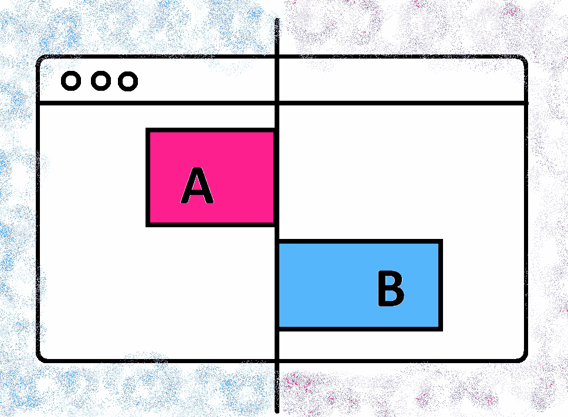

# A/B 测试:基础！

> 原文：<https://towardsdatascience.com/a-b-testing-the-basics-86d6d98525c9?source=collection_archive---------10----------------------->

在 [Unsplash](https://unsplash.com?utm_source=medium&utm_medium=referral) 上由[法扎德·纳齐菲](https://unsplash.com/@euwars?utm_source=medium&utm_medium=referral)拍摄的照片

## 什么、为什么、何时和如何

粉色和蓝色哪个颜色会让更多人点击网站**的登录按钮？**他们应该在主页上显示 Gif 而不是图片吗**？**有多少菜单选项，五个还是七个，会吸引顾客**？**哪个版本能更好地引导客户到达漏斗的末端**？**

您可以大胆猜测，继续进行更改或 **A/B 测试！**

作者图片

A/B 测试用于确定某个产品的哪个版本在市场上表现更好。

从初创公司到大型科技公司，各种规模和行业的公司都依赖 A/B 测试来做出更明智的选择。即使是最简单的测试也能帮助做出重大决定。

> **什么是 A/B 测试？**

A/B 测试是同时向网站访问者的不同部分显示同一网页的两个版本，以确定哪一个表现良好的过程。

基本就是确认哪个做的更好——**这个版本(A)还是那个版本(B)** ？

A/B 测试，也称为**分割测试**或**桶测试**，本质上是一个实验，其中一个广告**的两个或更多变体、营销电子邮件或网页**被随机显示给用户，然后使用不同的统计分析方法来确定哪个变体推动更多的转化。

通常在 A/B 测试中，给出更高转化率的变体是胜出的变体，并且该变体可以帮助你优化你的站点以获得更好的结果。

> **为什么要进行 A/B 测试？**

[活动创建者](https://unsplash.com/@campaign_creators?utm_source=medium&utm_medium=referral)在 [Unsplash](https://unsplash.com?utm_source=medium&utm_medium=referral) 上的照片

在**电子邮件活动**中，一个活动的两个变体被发送给用户。通过这样做，营销团队将知道哪封邮件在鼓励打开或点击方面最有效。

但他们不会知道到底是什么导致用户打开邮件。是标题、主题、视觉效果还是邮件内容？这可以通过 A/B 测试来确定，这是邮件中最有说服力的元素？

它可以帮助你在做出改变的重大决定之前检查你的站点上的访问者和客户的行为，并帮助你增加成功的机会。简而言之，A/B 测试通过允许你将资源用于最大效果和效率来帮助你避免不必要的风险。

> **什么时候使用 A/B 测试？**

一个**在线学习平台**想要改变他们的主页，新的、更吸引人的设计将增加浏览他们课程的用户数量。或者，他们可能希望在他们的课程概述页面上有更多关注职业的描述，这可能会鼓励更多的用户注册并完成他们的课程——A/B 测试可以为他们确认这一点。

[的照片](https://unsplash.com/@halacious?utm_source=medium&utm_medium=referral)在[的 Unsplash](https://unsplash.com?utm_source=medium&utm_medium=referral)

可以使用 A/B 测试来测试网页上可能影响访问者在网站上浏览行为的任何内容。

以下是可通过 A/B 测试评估的变化列表— *标题、内容、页面设计、图片、促销和优惠、社交媒体提及、网站导航和用户界面、行动号召(CTA)文本和按钮、支付选项、交付选项*等。

在 A/B 测试中，比较应该尽可能简单。例如，不要比较两个完全不同版本的网站，因为你不知道是什么因素造成了不同。同样，如果一个新的模块或菜单被添加到网站，它不能通过 A/B 测试进行测试，因为没有比较点。

> **如何进行 A/B 测试？**

[布鲁克·拉克](https://unsplash.com/@brookelark?utm_source=medium&utm_medium=referral)在 [Unsplash](https://unsplash.com?utm_source=medium&utm_medium=referral) 上的照片

*电子商务商店*的理想客户漏斗如下:

**首页** - > **分类列表/搜索商品** - > **查看商品页面** - > **购物车** - > **结账**

随着用户在这个漏斗的各个阶段的下降，商店会失去用户。然后进行 A/B 测试，尝试有希望提高从一个阶段到下一个阶段的转化率的变化。

A/B 测试大致分为四个步骤:

**确定变更和度量**

首先，决定你能够收集和分析什么类型的信息。我们不只是猜测，而是使用适当的分析工具来确保您首先遇到了问题，并找到问题的确切位置。

这些分析通常会让你深入了解可以从哪里开始提高。例如，我们决定将产品页面上的**行动号召(CTA)** 按钮从“*立即购买*”更改为“*立即购买*”，以增加向购物车添加商品的用户数量。

然后选择一个**指标**来衡量用户的参与度。在我们的示例中，指标将是“*立即购买*”按钮的点击率。**点击率(CTR)** 是独立用户的点击数除以独立用户的浏览量。您可以选择任意多的指标，但是您评估的指标越多，您就越有可能观察到显著的差异。

**定义你的假设**

**统计学中的假设检验**是你对一个实验的结果进行检验，看你是否有有意义的结果。假设检验最重要和最令人困惑的方面是确定**无效假设和替代假设**。

简单来说，在我们收集任何数据之前为真的陈述就是 ***零假设*** 。因此，在 A/B 测试中，基本的零假设是新版本并不比旧版本更好，甚至更差。对于我们的例子，新的点击率(CTR)小于或等于旧的点击率。

***候补*** 是相互竞争、互不重叠的无效假设。我们试图证明的陈述总是交替出现。所以，在 A/B 测试中，另一个假设是新版本比旧版本好。对于我们的例子，新的 CTR 大于旧的 CTR。

**设计实验(*样本量、影响因素、运行时间、参与者* )**

通常，用户被随机选择并分配到**对照组**或**治疗组**。然后我们进行实验，对照组看旧版本，治疗组看新版本。

每个用户只能看到一个设计(A 或 B)，即使他们更新了界面。这样，相同数量的人将查看每个版本，你可以衡量哪个版本实现了你认为有意义的提升。

您决定的样本大小将决定您可能需要等待多长时间，直到您收集到足够的数据。

**分析 A/B 测试数据**

在 [Unsplash](https://unsplash.com?utm_source=medium&utm_medium=referral) 上由 [Carlos Muza](https://unsplash.com/@kmuza?utm_source=medium&utm_medium=referral) 拍摄的照片

一旦你的实验完成，是时候分析结果了。这是分析师应该更加关注的地方。我们计算对照组和治疗组的度量值。

然后应用不同的统计技术，如使用自举、回归和各种其他机器学习算法的采样分布，来评估指标，并向您显示两个版本的页面表现之间的差异，以及是否存在统计上的显著差异。

> **A/B 测试困难**

当设计 A/B 测试并根据其结果得出结论时，有许多因素需要考虑。一些常见的有:

1.  现有用户第一次经历变化时的新奇效应和变化厌恶。
2.  足够的流量和转化，以取得重大和可重复的结果。
3.  对照组和治疗组受试者之间的一致性。
4.  做出最终决策的最佳指标选择，例如衡量收入与点击量。
5.  转换率的实际意义，推出新功能的成本与转换率增加的收益。
6.  足够长的实验运行时间，以考虑基于一天/一周的时间或季节性事件的行为变化。

尼克·莫里森在 [Unsplash](https://unsplash.com?utm_source=medium&utm_medium=referral) 上拍摄的照片

我写这篇博客尽可能简单，这样没有 A/B 测试知识的人也可以对它有一个基本的了解。业界有各种各样的[分析工具](https://www.ventureharbour.com/best-a-b-testing-tools/)用于 A/B 测试比如 Google Analytics 和 Google Optimize，Vwo，Optimizely，HubSpot 的 A/B 测试套件，Crazy Egg 等。

[对于有空闲时间的营销人员来说，A/B 不是奢侈品；他们是增长黑客的命脉。](https://www.julian.com/guide/growth/ab-testing)

A/B 测试最受欢迎的例子之一是[**41 种蓝色**](http://www.zeldman.com/2009/03/20/41-shades-of-blue/) ，当谷歌无法决定某个设计元素更喜欢两种蓝色中的哪一种时，据报道，他们使用 A/B 测试来评估 41 种不同蓝色的性能。此外，查看真实企业的 7 个令人难以置信的 A/B 测试示例**行业级 A/B 测试示例。**

**精确的 A/B 测试方法可以带来巨大的好处——提高用户参与度、增加转化率、简化分析和增加销售——这是一个双赢的局面！！**