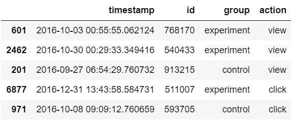
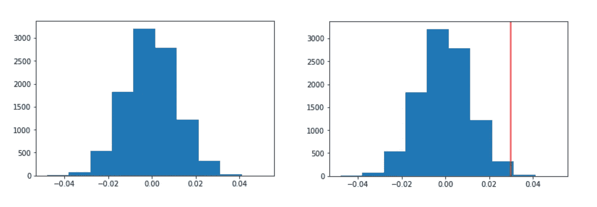
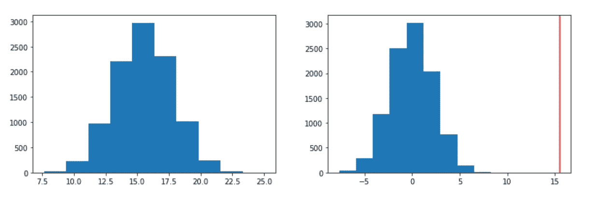

# A/B 测试:案例研究！

> 原文：<https://towardsdatascience.com/a-b-testing-the-case-study-1030a94f3c4b?source=collection_archive---------19----------------------->

作者图片

使用 Python 分析测试结果。

在理论中，理论和实践是没有区别的，但是
实践中，却有。

我之前的博客给出了什么是 [A/B 测试](/a-b-testing-the-basics-86d6d98525c9?source=friends_link&sk=86434b44e90841eb1a30e7e7cc2760eb)的基本概念。从图像在页面上的定位，到结账流程，我们都是 A/B 测试的坚定拥护者。一个概念的知识是不够的，这种知识的实现提供了最好的学习机会。

这篇博客是我作为 [Udacity](https://medium.com/u/2929690a28fb?source=post_page-----1030a94f3c4b--------------------------------) 的数据分析师 NanoDegree 项目的一部分参与的 A/B 测试案例研究的演练。本案例研究由 Udacity 开发并用于其许多项目中。

“ **Audacity** ”是一个在线学习平台，为学生提供各种课程、学位和认证。因此，Audacity 网站上典型新用户的客户漏斗如下:

**主页- >探索课程- >查看课程概述页面- >注册课程- >完成课程**

就像任何其他网站一样，漏斗顶部的用户数量会比底部多。Audacity 在这个漏斗的各个阶段都会失去用户。因此，它决定测试可以提高学生参与度的功能。Audacity 正在执行 A/B 测试，尝试有望提高从一个阶段到下一个阶段的转化率的变化。

他们决定引入的第一个变化是网页设计。Audacity 决定优化其主页，这样新的、更吸引人的设计将会增加探索他们课程的用户数量。

这基本上涵盖了漏斗的两个阶段，*主页- >探索课程*

设置了一个实验，以查看在控制组和治疗组中有多少用户参加了漏斗中的探索课程的下一阶段。然后选择主页上“*探索课程*”按钮的指标**点击率(CTR)** 来衡量各组用户的参与度。

这里的零假设是新的 CTR 小于或等于旧的 CTR。
***H0:CTR _ new—CTR _ old<= 0***

另一个假设是我们试图证明的，新的 CTR 大于旧的 CTR。
***H1:CTR _ new—CTR _ old>0***

数据收集了近 4 个月的时间，对照组人数为 3332 人，治疗组人数为 2996 人。主页动作，即*浏览或点击*按钮的访问者，被记录下来。

抽样资料

根据这些数据，我们计算了对照组和治疗组的 CTR。

对照组 CTR 为 ***0.2797*** ，治疗组 CTR 为 ***0.3097*** 。然后计算两组的 CTR 之间的观察差异，发现为 ***0.030*** 。

然后，我们使用 bootstrapping 对经过 *10，000 次迭代*的两个页面之间的 CTR 差异模拟采样分布。

> 在统计学中， [**Bootstrap 抽样**](https://www.analyticsvidhya.com/blog/2020/02/what-is-bootstrap-sampling-in-statistics-and-machine-learning/) 是一种从数据源中反复抽取样本数据并替换以估计总体参数的方法。
> 
> 一个 [**抽样分布**](https://www.investopedia.com/terms/s/sampling-distribution.asp) 显示了一个统计可以从一个总体的每个可能的样本中得到的每个可能的结果，以及每个结果出现的频率。

我们使用这个抽样分布来模拟零假设下的分布，方法是创建一个以 0 为中心的随机正态分布，具有相同的分布和大小。

零假设下采样分布上的红线是我们之前得到的观察到的差异，在零假设下它看起来很小。

Bootstrapping 下的抽样分布|零假设下的抽样分布

然后，我们通过找出大于我们观察到的差异的零分布值的平均值来计算 p 值。

当你的 p 值很小时，你会随着另一个假设移动。但是有多小呢？因此，这将基于类型 1 误差的阈值来决定。商业与研究的类型 1 错误率 alpha 为 ***0.05*** 。

我们得到的 p 值是 ***0.0061*** ，小于错误率α。所以现在我们有证据拒绝零假设。因此，A/B 测试导致实施新的主页设计。

照片由[伊戈尔·米斯克](https://unsplash.com/@igormiske?utm_source=medium&utm_medium=referral)在 [Unsplash](https://unsplash.com?utm_source=medium&utm_medium=referral) 上拍摄

接下来是 Audacity 决定尝试的第二个变化。他们在课程概述页面上对课程描述进行了更多的职业关注。他们希望这一改变可以鼓励更多的用户注册该课程并最终完成该课程。

这基本上涵盖了漏斗的三个阶段，*查看课程概述页面- >报名课程- >完成课程。*

对于这个实验，选择了四个指标。它们的定义如下:

1.  **注册率:**“*注册*”按钮的点击率被考虑在内。
2.  **平均阅读时长:**用户在课程概览页面上花费的平均秒数。
3.  **平均课堂时间:**注册该课程的学生在课堂上度过的平均天数。
4.  **完成率:**注册该课程的学生的完成率。

按照第一次更改中提到的相同步骤，对每个指标进行了单独评估。为度量计算观察到的差异，然后通过 10，000 次迭代为两个页面之间的差异模拟使用自举的采样分布。在零假设下进行同样的操作，然后将观察到的差异绘制在获得的正态分布上。

计算了 p 值，我们发现所有的指标都具有统计学意义。您评估的指标越多，您就越有可能偶然观察到显著的差异。因此，我们需要确定每个指标中观察到的差异总体上是否具有统计学意义。

Bonferroni 校正是用来抵消多重比较问题的几种方法之一。

> [***Bonferroni 校正***](https://www.statisticssolutions.com/bonferroni-correction/) 是一种多重比较校正，用于同时进行多个相关或独立统计测试的情况。

虽然给定的类型 1 误差α值可能适用于每个单独的比较，但它不适用于所有比较的集合。为了避免大量的假阳性，alpha 值需要降低，以考虑正在执行的比较的数量。

使用 Bonferroni 校正，我们将原始的 alpha 值除以度量(测试)的数量，得到错误率 alpha 的新值(***0.05/4 = 0.0125***)。

我们计算的四个指标的 p 值如下:
入学率- **0.0188**
平均阅读时长- **0**
平均课堂时间- **0.0384**
完成率- **0.0846**

新的 alpha 值为 ***0.0125*** ，唯一要考虑的重要度量是**平均读取持续时间**。下图显示了平均读取持续时间自举下的采样分布和零假设下的采样分布。

Bootstrapping 下的抽样分布|零假设下的抽样分布

p 值应小于或等于拒绝零假设的α值。因为我们有同样的证据，我们将继续改变。因此，A/B 测试的结果是在概览页面上实施了更注重职业发展的课程描述。

上面的 A/B 测试案例研究给出了如何使用统计方法分析测试数据以得到结果的想法。你可以在 [my GitHub](https://github.com/divyanitin/A-B-Testing-Case-Study) 上找到从这些实验中收集的数据以及完整的 python 代码。

如果你想提高用户参与度，提高转化率，增加销售额，你需要做出数据驱动的决策。通过 [A/B 测试](/a-b-testing-the-basics-86d6d98525c9?source=friends_link&sk=86434b44e90841eb1a30e7e7cc2760eb)，你可以看到黑色的结果&白色的，这样你就知道什么对你有效了。