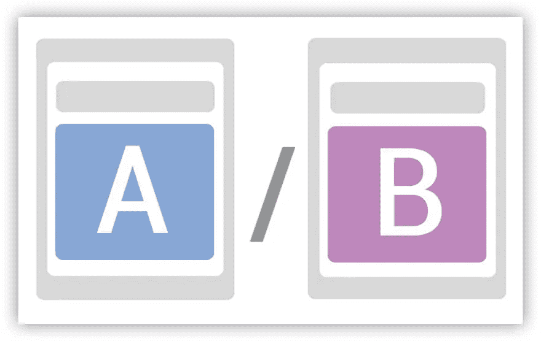
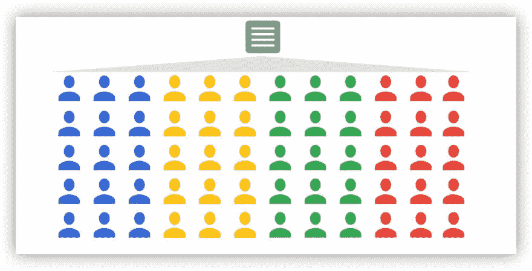
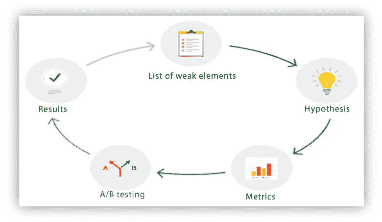
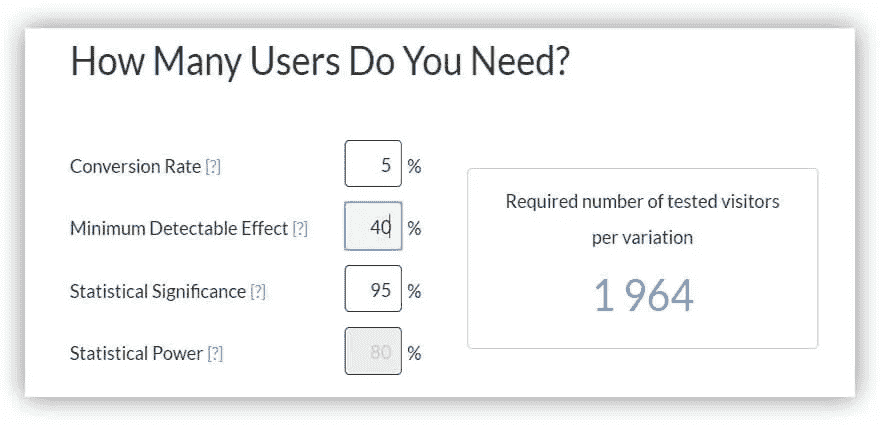
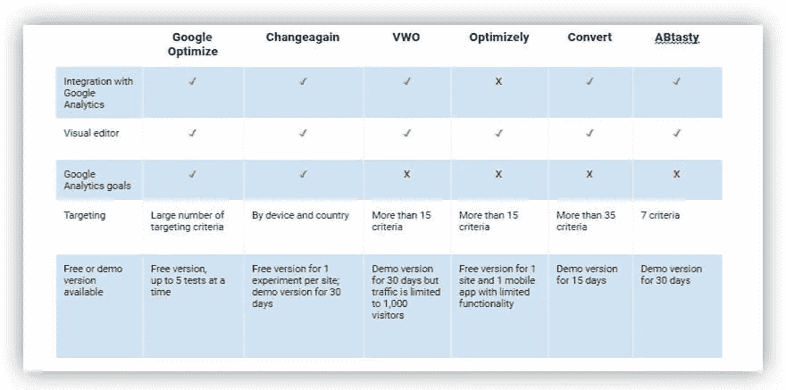
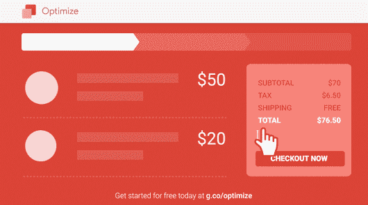
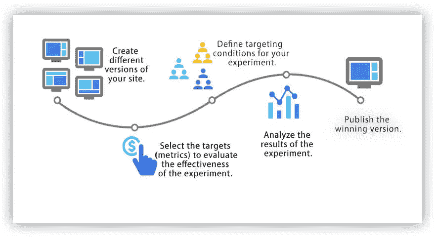
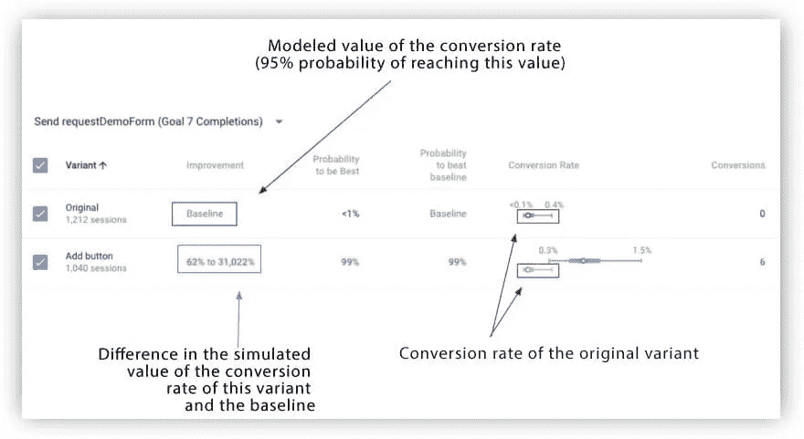

# A/B 测试:生存还是毁灭

> 原文：<https://towardsdatascience.com/a-b-testing-to-be-or-not-to-be-4097de7b6178?source=collection_archive---------32----------------------->

来源:[沉积照片](https://ru.depositphotos.com/210294482/stock-photo-red-pill-blue-pill-concept.html)

## 了解如何改善用户体验，改变用户行为，并通过谷歌优化中的 A/B 测试提高你的转化率

没有痛苦，就没有收获，也就没有领导。为了将你的广告带来的流量转化为销售额，你需要通过改善用户体验、改变用户行为和提高转化率来不断优化你的网站。但是你如何确保你实施的改变会带来预期的结果呢？这就是 A/B 测试的目的。在这篇文章中，我们告诉你什么是 A/B 测试，如何进行，有哪些细微之处值得注意。

# 什么是 A/B 测试？

营销中的 A/B 测试与分割测试是一样的——比较网站页面的两种变体，它们只有一个参数不同。A/B 测试的目标是确定这两个选项哪个更有效，带来更多的转化。

假设你卖软件。您有一个带有产品描述的登录页面，页面底部有一个按钮可以订阅试用版。为了增加订阅者的数量，您决定在登录页面上为那些已经了解您的产品或喜欢不阅读详细信息就立即试用的人多添加一个按钮。

为了检查您的假设是否正确——通过添加另一个按钮可以获得更多订户——您创建了一个原始登录页面的副本，并在其中添加了一个按钮。然后将页面访问者分成两组:一组显示原始页面(变体 A)，另一组显示更新后的页面(变体 B)。在测试的最后，您比较性能指标(在我们的例子中是订阅的数量)并确定获胜者。

图片由作者提供

# 为什么要进行 A/B 测试？

让我们看看 A/B 测试(或分割测试)帮助我们实现的一些主要事情。

**1。更好地理解你的用户，给他们想要的**。无论你从事电子商务和在线营销有多长时间，仅仅依靠你的个人经验都是错误的。

即使你似乎可以预测网站用户的行为，并确切地了解如何组织内容，使他们尽快通过销售渠道，进行 A/B 测试。结果可能会让你吃惊。

实践表明，我们的假设并不总是与现实相符。因此，我们不能仅仅根据自己的信念来决定什么对客户最好。

**2。依靠数据而不是专家意见。**第二个挑战源于第一个挑战，即在现场进行变更并最大限度降低相关风险的可行性。

通常，假设是基于个人观点，可能与观众观点不一致。因此，没有经过 A/B 测试就引入的变更不会达到预期的效果——或者更糟，它们会降低转化率。

因此，当你面临用什么做决策的问题时——数据还是专家意见——总是选择数据。

**3。个性化与客户的沟通。**客户使用不同的设备，来自不同的来源，以不同的方式与您的网站互动，浏览和购买不同的商品…

网络分析服务，如谷歌分析和 Yandex。度量帮助你组合这些数据，并系统化关于用户的知识。营销人员收集用户访问了哪些页面以及在这些页面上做了什么的信息。这使得将受众分成几十个或几百个部分成为可能，并且可以学习，例如，来自有机或付费流量的用户如何行为。

但是我们并不总是正确地使用这些信息，也不总是从中获取最大的利益。一个简单的例子:大多数在线项目仍然向所有用户显示相同的内容，而不管他们的行为和流量来源:

图片由作者提供

如果你正在这样做，一个分割测试可以帮助你解决这个问题，并使你的网站内容个性化。

# A/B 测试的主要阶段

现在让我们来看看分割测试的主要阶段(和细微差别):

图片由作者提供

## 第一阶段。找出问题所在

你需要做的第一件事是找出你网站的弱点。为此，您可以:

*   探索谷歌分析和其他网络分析系统中的数据，看看哪些页面失败率高，滚动深度低，转化率差。
*   使用 Webvisor 并单击热图来了解用户如何与您站点的元素进行交互。
*   分析支持案例或采访活跃客户，看看他们在网站上错过了什么。

例如，假设您在 Google Analytics 中查看增强的电子商务漏斗，发现很少有人在购物车中添加某样商品。同时，你有一个线下销售点，你知道这个产品很受欢迎。在这种情况下，很可能是你的网上商店出了问题。

## 第二阶段。提出假设

一旦你决定了要修复什么，你需要考虑你将如何修复它。没有 A/B 假设，测试就没有意义——你的发现的价值就很小。你要清楚的了解实验的目的，你要测试网页的什么元素，你要达到什么量化的结果。

当制定假设时，推回你的转换漏斗。问问你自己:*为了让用户更快地通过漏斗，我应该在页面的某个部分改变什么？"*每次测试检查一个假设；否则，很难确定什么样的变化对最终结果产生了什么程度的影响。

可以测试的内容:

*   转换按钮的颜色、大小、文本和位置
*   标题—更改文本；让它更短、更有趣、更相关
*   表单—减少字段数量或添加工具提示和填充示例
*   登录—更改页面结构、字体或调色板
*   内容——添加高质量的照片和视频、行动呼吁、促销优惠、“免费”一词等。

你对绩效指标的选择取决于你的假设和你想要达到的目标。这些可以是收入、购买数量、转换率、平均支票大小、应用和订阅、失败率等。

## 第三阶段。检查指标

下一步是确保您实现并记录了所有必要的指标，在此基础上，您将在测试结束时得出结论。在我们的工作中，我们遇到过这样的情况，客户已经确定了弱点并形成了假设，但没有正确地规定一个指标体系，因此他们可以理解转换率的变化恰恰是因为一个按钮的变化，而不是因为其他因素。

## 第四阶段。运行 A/B 测试

在运行实验之前，请考虑以下因素:

*   **最小样本量。**为了确保您的测试结果在统计上具有显著性并且可信，请确定所需的参与者人数。你可以使用免费的在线计算器，如 [Abtasty](https://www.abtasty.com/sample-size-calculator/) 和 [Optimizely 来计算。](https://www.optimizely.com/sample-size-calculator/)假设你的原登陆页面转化率为 5%，你期望页面的测试版达到 7%。在这种情况下，最小可见效果为 40%。将这些数字输入计算器，你会发现每个变量至少需要 1964 人:

图片由作者提供

*   **外部因素:**季节性、节假日、股票、天气、货币汇率等。因此，外部因素不会扭曲实验结果，在同一时期并行显示页面的两个版本非常重要。
*   **首先测试宏转换。如果你设定了访问某个页面的目标，很可能用户会实现这个目标，但不会进行交易或采取其他目标行动。总有必要将你的漏斗作为一个整体来考虑，以了解网站上哪些用户行为是最高优先级的。**
*   **考虑设备的类型。**如果你开始对你网站的所有流量进行测试，并且你有移动和桌面版本，检查测试选项在移动设备上看起来如何。
*   **排除内部流量**这样你的员工在网站上的行为就不会扭曲统计数据。这可以在 Google Analytics 中通过 IP 地址过滤来实现。

在考虑了这些因素之后，您可以运行测试。稍后，我们将告诉您可以用来做这件事的工具。

## 第五阶段。分析结果

实验结束时，对结果进行分析。例如，假设您的登录页面上的原始转化率为 3%，您假设您可以将其提高到 5%，测试变量显示为 3.5%。转化率有所提高，但只是略微提高。现在你需要决定是在网站上引入改变还是尝试另一种假设。

您可以使用[在线计算器](https://www.abtasty.com/sample-size-calculator/)或统计方法检查分割测试的结果是否具有统计学意义。

在我们关于网络分析中的[统计或如何成为真正的数据科学家的文章中，阅读更多关于统计能力、样本长度、置信区间、统计显著性以及如何测量它们的内容。](https://www.owox.com/blog/articles/statistics-in-web-analytics/)
如果这个过程是成功的，并且你已经收到了可靠的数据，把登陆页面的获胜者带到网站，继续下一个实验。

分析结果时可能出现的错误:

*   **过早地评估结果。我们建议进行至少 14 天的分割测试。如果任务已经开始，你正在测试不影响网站全局功能的小变化(例如，你已经改变了一个按钮的颜色)，并且你正在使用 Google Optimize，你可以对这个规则做一个例外。如果您在优化报告中看到新选项以 80–90%的概率胜出，您可以停止实验。这些指标不太可能发生巨大变化。**
*   **评估有效性阈值低于 95%的结果**是优化报告的另一个指标。当你进行实验时，Google Optimize 会考虑最终结果的有效性。如果低于 95%，Optimize 会建议继续实验。您可以在选项卡中的活动实验中看到该阈值。
*   **忽略测试结果为次要。**谁不想一次翻倍转换？！然而，即使是这样一个温和的(乍一看)2-3%的转化率增长也不是一个坏结果。尤其是如果登录页面上的变化很小的话。
*   **不检查您站点的全局指标。**毕竟，你需要检查你的全球站点指标，而不仅仅是那些你在实验中选择的指标。单个参数可能不足以评估变化的影响。例如，通过提高转换率，平均支票大小可以减小，总收入可以增加。因此，监控所有相互关联的 KPI。

# A/B 测试工具

要运行 A/B 测试，您必须创建页面的测试版本，对受众进行细分，并分别计算每个细分的目标指标。如果您有编程技能和足够的资源，您可以手动运行 A/B 测试。但是在特殊工具的帮助下做起来更容易更方便。

我们准备了一个比较流行的分割测试工具的小表格:

图片由作者提供

在 [OWOX BI](https://www.owox.com) ，我们使用 Google Optimize 进行测试，所以我们将更多地关注这个工具的特性。

# 谷歌优化的 A/B 测试

[优化](https://optimize.google.com/optimize/home/)是一项连接到你网站的在线服务，允许你尝试不同的内容显示方式。

Optimize 允许您使用您在 Google Analytics 中积累的数据，为用户提供对他们最方便、对您的企业最有利的页面版本。

## 谷歌优化的优势

*   **数据的完整性**。要建立和分析一个实验，可以使用谷歌分析的目的和细分。你可以使用谷歌分析中你熟悉和喜爱的常用指标。
*   **个性化的大量机会。**成功完成测试后，您可以使用 Google Analytics 受众和变量配置不同内容的演示，例如，在 Google Tag Manager 的 dataLayer 中实现的变量。如果实验让你为普通用户提高网站的生产力，那么基于用户信息的个性化将让你在每个细分市场中获得更高的回报。
*   **与其他谷歌产品**集成，实现更深入的定位和分析(谷歌广告、数据工作室、标签管理器等)。)
*   **易于理解的便捷界面**。可视化编辑器允许您在没有开发人员参与的情况下配置和启动新的实验。它大大减少了进行实验的时间。
*   **最低限度影响** [**页面加载速度。**](https://support.google.com/360suite/optimize/answer/7071747?hl=en)
*   **无需手动汇总数据、编制报表、应用统计公式**检查结果。谷歌优化自己做一切。

## 优化缺点

*   到目前为止，Google Optimize 还不能用来测试移动应用。
*   你不能安排测试。也就是说，如果您想要准备几十个测试，但由于某种原因无法同时开始，或者如果免费版本对同时测试的数量有限制，或者您不想在同一受众身上尝试几十个选项，这可能会成为一个问题。您需要在界面中手动启动每个测试。这不是一个严重的缺点，但是你仍然可以在其他服务中这样做。

# 谷歌优化如何工作

Google Optimize 的工作方式类似于其他进行实验和个性化的工具:

图片由作者提供

1.  首先，您需要创建各种页面、弹出窗口和其他要向用户显示的对象。
2.  然后，您需要确定目标(衡量标准),通过这些目标来确定获胜的选项。这些可以是优化中内置的指标——页面浏览量、会话持续时间、交易、收入和失败率——或谷歌分析的任何自定义目标。
3.  之后，你需要确定将参与实验的受众，并启动实验。在这一阶段，您必须通过向用户显示测试选项来决定您可以承担多大的风险。您可以在两个选项之间平均分配流量，或者，例如，进行 20/80 分割。另外，在这个阶段，你必须选择向哪部分观众展示这个实验。给大家看，还是拿 20%把你的两个选项分给他们？你为什么想这么做？如果你有一个大商店，你不确定你的假设，你不想冒险一半的流量。

除了经典的 A/B 测试之外，在 Optimize 中，您还可以运行多元测试(在多种组合中有多个变化的元素)和重定向测试(针对具有不同 URL 和设计的页面)。

在我们关于如何使用 Google Optimize 进行首次 A/B 测试的文章中，你可以了解更多关于 Google Optimize 的界面和设置。

# 分析结果

使用 Google Optimize 中的报告，您可以在实验过程中监控结果，并在实验结束后立即分析收集的数据。

图片由作者提供

**优化报告中的术语:**

*   改进——转换率的可能范围
*   最佳概率-此选项优于所有其他选项的概率
*   超出基线的概率——该选项将带来比原来更好的转换率的概率
*   转换率—预测的平均转换率
*   转换—具有转换的会话数

**获胜者是如何确定的**
谷歌优化使用[贝叶斯推理](https://support.google.com/optimize/answer/7405543)生成统计数据。无需深入细节，这意味着在实验过程中，您可以在优化报告中看到变体 B 在实验结束前胜出的概率。如果概率达到一定水平，就有可能提前完成实验，节省时间和金钱。

此外，谷歌团队计划在实验结束前实施一种有利于最佳选项的流量重新分配机制。这将为您节省资金，因为在测试过程中很少用户会看到无效的选项。

如果您将 Optimize 与您的 Google Analytics 帐户集成，您将能够在 Google Analytics 界面的**行为/实验**部分浏览和分析测试结果:

图片由作者提供

如果您的实验成功，您可以在您的网站上部署获胜选项。