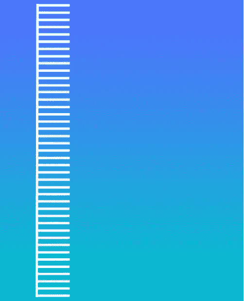
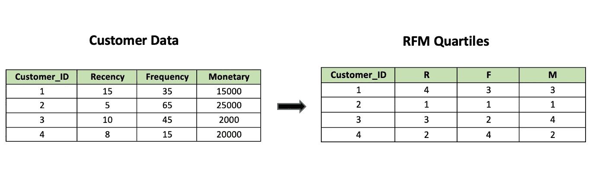

# A/B 测试:业务案例的 4 大错误及解决方法

> 原文：<https://towardsdatascience.com/a-b-testing-top-4-mistakes-with-business-cases-fixes-85e76767dfde?source=collection_archive---------22----------------------->

## 不犯错误的人永远一事无成

## ***你可能有的是*** *en* ***忽略直到你发现这篇文章***


约翰·施诺布里奇在 [Unsplash](https://unsplash.com?utm_source=medium&utm_medium=referral) 上拍摄的照片

# 介绍

史蒂夫·乔布斯在 1997 年回答一个棘手的问题时说:

> “你必须从客户体验开始，然后回溯到技术。你不能从技术入手，试图找出在哪里销售。”

我相信 A/B 测试正是基于这种想法。大多数创新型公司已经从 **HiPPO** (薪酬最高的人的观点)转向数据驱动的决策。他们在数字实验上投入大量资金，以确保最佳的客户体验和组织决策。

谈及脸书对庞大测试框架的投资，在一次采访中，马克·扎克伯格说，

> “在任何给定的时间点，世界上都不会只有一个版本的脸书。大概有一万个版本在运行。”

杰夫·贝索斯也曾经说过:

> “我们在亚马逊的成功取决于我们每年、每月、每周、每天做多少实验。”

但是，尽管有适当的预算和努力，一些可以避免的错误还是在实施过程中悄悄出现了。这篇文章指出了在 A/B 测试中经常发生而又被忽视的 4 大错误。

我将把以下内容作为本文框架的一部分:

*   我用真实的商业案例/假设的案例来阐述错误，帮助你清楚的理解思路。
*   我还会为它们建议合适的修复方法。

我保证会让你觉得非常有趣和容易理解。所以，泡一杯热咖啡，拿起你最喜欢的扶手椅。

让我们开始吧。

# **1。** **测试变量太多**

当您测试一个假设来比较两个变量时，您在某个置信区间执行统计测试。假设您的组织为某个实验决定了 5%的置信区间。这是什么意思？

这意味着有 5%的几率你的测试结果是随机的，你会发现一个错误的赢家。

```
e.g. Your test will say that Option B is better than Option A, 5 times out of 100 when that is not the case.In statistical terms, there’s a 5% probability of getting a false positive (Type 1 Error).
```

很简单，对吧？现在让我们更进一步。让我们将这个概念扩展到不止一个测试变量。

得到假阳性的概率的一般公式如下:

```
False Positive Rate = 1-(1-α)ⁿ
α → significance level
n → total number of test variants (excluding the control)
```

这个等式目前看起来像这样:

```
1-(1–0.05)¹=0.05
```

现在，随着测试变量数量的增加，第一类错误也会增加。下图清楚地描述了这种变化:


图 1 假阳性率随测试变异数的变化(图片由作者提供)

这就是所谓的 [**【多重比较问题】**](https://en.wikipedia.org/wiki/Multiple_comparisons_problem) 。

让我以谷歌的一个著名实验为基础，叫做[**【41 种蓝色测试】**](https://www.theguardian.com/technology/2014/feb/05/why-google-engineers-designers) 。



图 2 谷歌的“41 种蓝色测试”(图片由作者提供)

2009 年，谷歌想要决定在他们的搜索结果页面上产生最大点击量的蓝色色调。因此，他们进行了“1%实验”来测试 41 种不同深浅的蓝色，给 1%的用户展示一种蓝色，给 1%的用户展示另一种蓝色，以此类推。

这就是你在 Gmail 和谷歌搜索中看到的广告链接中的蓝色是如何选择的。有趣的是，它为该公司带来了每年 2 亿美元的额外收入。

很吸引人，对吧？现在，让我们回到‘多重比较问题’。我们该如何应对？谷歌会怎么做？

## **修复:**

应该测试的变体数量取决于您组织的业务需求、组织效率以及一系列因素，如转化率、收入、流量等。尽管如此，通常还是应该避免测试太多的变化。

据统计，有多种技术可以解决这个问题。我来解释一种叫做 [**【邦费罗尼校正】**](https://en.wikipedia.org/wiki/Bonferroni_correction) 的技术。

到目前为止，您已经知道，随着测试假设数量的增加，第一类错误也会增加。“Bonferroni 校正”对此有何帮助？

“Bonferroni 校正”通过在α/n 的显著性水平上测试每个假设来补偿误差的增加

例如，如果一个实验测试 40 个假设，期望的显著性水平为 0.05，那么“Bonferroni 校正”将在α=0.05/40=0.00125 测试每个假设。

所以，现在你知道了，为了维持“41 度蓝色测试”实验 95%的置信区间，谷歌会以 99.875%的置信区间测试每个假设。

# **2。** **忽略交互影响**

当多个实验以相同的观众为目标时，注意交互效应是很重要的。但是互动效应是什么呢？

这是一种在实验过程中两个变量对测量的成功度量的同时影响不是相加的情况。我们通过一个例子来理解这一点。

假设亚马逊正在改善其对外客户沟通，以提高转化率。电子商务分析团队正在对“废弃购物车”推送通知进行 A/B 测试。与此同时，营销分析团队也在对发送给客户的“推荐电子邮件”进行 A/B 测试。

下图显示了测试期间获得的转换率:


图 3 单个 A/B 测试中获得的转化率(图片由作者提供)


图 4 在综合 A/B 测试中获得的转换率(图片由作者提供)

这很奇怪，对吧？这两个新功能在各自的实验中都表现良好，但为什么联合测试槽会如此呢？

这是由于**[](https://statisticsbyjim.com/regression/interaction-effects/)**相互作用的结果。亚马逊在对外客户沟通项目上走得太远了。这两个各自表现出色的功能结合在一起的效果是，它惹恼了客户。因此，转换率下降了。****

## ******修复:******

****有一个双重方法可以消除交互效应对实验成功指标的负面影响:****

*   ****首先，留意同时推出的两个新功能之间可能存在的交互效应。如果有两个团队参与，组织中的某个人作为两个团队之间的纽带，对两个团队的工作有很好的了解，可以成为有用的资源。****
*   ****第二，当这种交互作用被识别时，不要同时进行 A/B 测试。相反，按顺序测试它们。****

# ******3。** **忽略客户价值******

****有时，组织只关注主要 KPI 的表现，如转换率或每次访问的收入，而忽略了基于客户价值的细分。这可能导致有缺陷的实验结果。让我们看一个例子。****

****假设沃尔玛超市重新设计了它的主页，改变了“搜索栏”的位置。该团队进行了一项为期两周的实验，但发现转换率和每次访问的收入都下降了。因此，结论是旧的设计更好。****

****一切看起来都很好，对吗？但是是吗？号码****

****团队忽略了一个重要的事实，即忠实客户的反应往往比新客户更不利。忠诚的顾客需要更长的时间来适应新的设计。让我们用一个更贴切的例子来理解这一点。****

****假设你去离你最近的沃尔玛实体店购物，发现他们已经完全重新布置了整个商店。你会在杂货店的通常位置找到电子产品区，在家庭必需品的通常位置找到服装区，等等。如果这是你第一次来，你不会知道有什么不同，你会买你想要的东西。但如果你是那里的常客，你会感到困惑，如果你很着急，你甚至可能会走出去。****

****我想你明白了。只是类似的网上行为可能性更大。****

## ******修复:******

****我想你现在会同意我的观点，顾客价值和对网页设计修改的积极反应之间存在反比关系，考虑到顾客价值不仅仅是一生收入的函数，也是近期和频率的函数。****

****换句话说，在一个[](https://en.wikipedia.org/wiki/RFM_(market_research))**的 RFM 模型中，上四分之一(在最近、频率和货币价值方面得分最高的客户)不会对新设计做出有利的反应。******

******让我通过 4 个客户的小样本数据来快速演示 RFM 四分位数的客户细分。******

```
****R (Recency) → Days since last conversion
F (Frequency) → Number of days with conversions
M (Monetary) → Total money spent****
```

************

******图 5 使用 RFM 模型的客户细分(图片由作者提供)******

******因此，了解基于客户价值的客户组合和细分非常重要。将它们分为新的和常规的。如果你根据 RFM 四分位数**(**[**)RFM 细分**](https://www.optimove.com/resources/learning-center/rfm-segmentation) **)** 来形成细分就更好了。******

********

****图 6 基于 RFM 四分位数的样本客户群(图片由作者提供)****

# ******4。** **不正确的测试后分割******

****实验完成后，您开始将数据分成几个部分，如流量大小、新客户与忠实客户、设备类型等。您希望根据您的成功指标对它们进行比较，以挖掘出有用的业务洞察力。这叫做**测后分割**。****

****但是，在这里你需要小心。请注意以下两个问题:****

*   ******细分的小样本量:**测试后你形成的细分可能会以非常小的规模结束。因此，你通过比较你测试的变量的不同部分得出的商业见解可能不具有统计学意义。****
*   ******多重比较问题:**还记得这个吗？是的，你是对的。我们在文章的第一点就谈到了它。如果比较太多段，类型 1 错误的概率会增加。****

## ******修复:******

****那么，你是怎么处理的呢？****

****最好的处理方法是选择[](https://www.thoughtco.com/stratified-sampling-3026731)**分层抽样，设计有针对性的测试。将样本分成同质的组，这样组内的差异就很小。这些类别或客户群可以基于设备类别、流量来源、人口统计等属性。根据业务需要和预算。然后，进行实验以比较待测试变量的相应括号。******

******给你举一个行业的例子， [**网飞**](https://netflixtechblog.com/its-all-a-bout-testing-the-netflix-experimentation-platform-4e1ca458c15) 使用分层抽样来保持一组关键指标的同质性，这些指标包括国家和设备类型(如智能电视、游戏机等。)才是最关键的。******

# ******结论******

****虽然有许多 A/B 测试错误，我的努力是指出更复杂的错误，这些错误在行业中很有可能被忽略。****

****我希望我能够兑现我的承诺，让这篇文章变得有趣和容易理解。我希望你觉得有用。****

****以托马斯·阿尔瓦·爱迪生颂扬错误并从中吸取教训的精神作为结束，****

> ****“我没有失败过一万次。我已经成功地找到了一万种行不通的方法。”****

****请随意看看我写的关于数据分析的其他文章:****

****[](/data-analytics-in-e-commerce-retail-7ea42b561c2f) [## 电子商务零售中的数据分析

### 电子商务零售中的分析概念和应用，带有简单的演示和有趣的业务示例

towardsdatascience.com](/data-analytics-in-e-commerce-retail-7ea42b561c2f) [](/indexing-for-sql-query-optimization-139b57db9fc6) [## SQL 查询优化的索引

### 是时候开始你的查询游戏了！

towardsdatascience.com](/indexing-for-sql-query-optimization-139b57db9fc6) [](/7-must-know-sql-querying-mistakes-fixes-321ee292a251) [## 7 必须知道 SQL 查询错误和修复

### 避免这些错误，提高你的查询技巧！

towardsdatascience.com](/7-must-know-sql-querying-mistakes-fixes-321ee292a251) 

请随时提供反馈，并关注我以获取更多关于数据分析的有趣文章。在 [LinkedIn](https://www.linkedin.com/in/ashish-tomar-565b1654/) 上与我联系。****