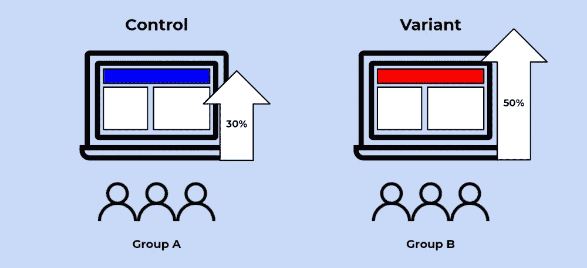
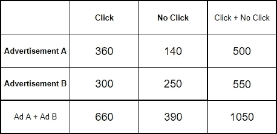
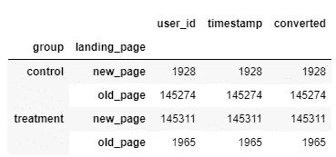
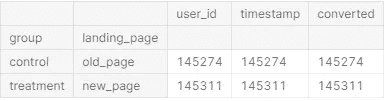
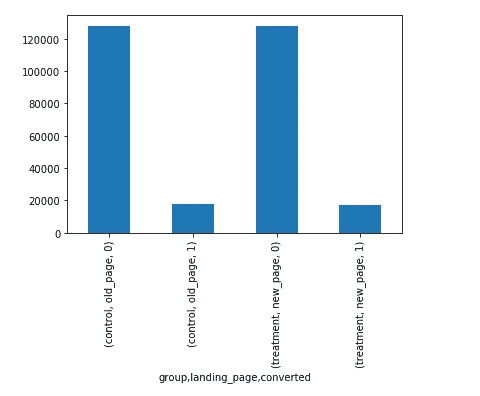
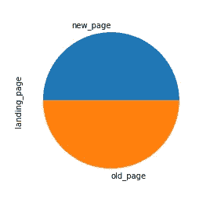

# 使用卡方检验进行 A/B 测试，以最大化转化率和 CTR

> 原文：<https://towardsdatascience.com/a-b-testing-with-chi-squared-test-to-maximize-conversions-and-ctrs-6599271a2c31?source=collection_archive---------9----------------------->

## 面向有抱负的实验者的数据科学项目演练



作者创建的图像

# 目录

前四节解释了用于此 A/B 测试的概念，后两节介绍了对转换率执行 A/B 测试的分步示例。

1.  介绍
2.  什么是 A/B 测试？
3.  卡方检验
4.  计算卡方检验统计量
5.  资料组
6.  A/B 测试项目演练

# 介绍

可以说，工作场所中最实用的数据科学概念之一是 A/B 测试。然而，这是一个很容易被误解的概念，因为它非常复杂。

举个例子，许多实验主义者使用 t 检验来确定两个选项之间是否有显著差异。但是如果不假设分布是高斯的呢？如果两组的标准差不一样呢？如果分发未知地完成了呢？

在这篇文章中，我将谈论一种特别的 A/B 测试方法，这种方法可以很好地比较点击率和转化率。

# 什么是 A/B 测试？

从最简单的意义上来说，A/B 测试是对两个变量进行的实验，根据给定的度量标准来看哪一个表现更好。通常，两个消费者群体接触同一事物的两个不同版本，以查看会话、点击率和/或转化率等指标是否有显著差异。

以上面的图片为例，我们可以将我们的客户群随机分成两组，一个对照组和一个变异(或治疗)组。然后，我们可以用一个红色的网站横幅来展示我们的变体组，看看我们是否会获得显著的转化率增加。需要注意的是，在执行 A/B 测试时，所有其他变量都需要保持不变。

更专业地说，A/B 测试是一种统计和双样本假设测试。**统计假设检验**是一种将样本数据集与总体数据进行比较的方法。**两样本假设检验**是确定两个样本之间的差异是否具有统计显著性的方法。

# 卡方检验

点击率和转化率有什么共同点？他们有一个**伯努利分布**，一个概率为 1，一个概率为 0 的离散概率分布。对于点击率，用户要么点击(1)，要么不点击(0)。同样，对于转换，用户要么转换(1)，要么不转换(0)。

因为我们正在对遵循伯努利分布的分类变量转换执行 A/B 测试，所以我们将使用**卡方测试**。

进行卡方检验的步骤如下:

1.  计算卡方检验统计量
2.  计算 p 值
3.  将 p 值与显著性水平进行比较

当您跟随项目演练时，这将更有意义。

# 计算卡方检验统计量

确定卡方检验统计量的公式如下:


让我们通过一个例子来更好地理解这一点。

假设我们展示了两个不同的广告，A 和 B，来测试用户是否点击了广告。测试结束时，收集了以下信息:



在这种情况下，我们必须进行四次计算，然后将它们相加:

1.  广告 A，点击
2.  广告 A，无点击
3.  广告 B，点击
4.  广告 B，无点击

我们以广告 A 为例。我们需要计算观察值和期望值。

观察值等于 360，如上表所示。

期望值等于广告显示的次数乘以点击的概率。因此，期望值= 500 * (660/1050) = 31.429。这些数字也取自上表。

对所有四种情况进行计算后，可以将这些数字输入到 x 方程中，以确定卡方检验统计量。

# 资料组

我用来执行这个 A/B 测试的数据集来自 Kaggle ( [这里是数据集](https://www.kaggle.com/zhangluyuan/ab-testing)的链接)。

该数据集包含 A/B 测试的结果，其中两组(对照组和处理组)分别暴露于旧网页和新网页。该测试的目的是确定与旧网页相比，新网页是否会显著提高转化率。每一行代表一个独特的用户，并显示他们是否在对照组或治疗组，以及他们是否转换。

# A/B 测试项目演练

```
*# Import libraries and data*
import numpy as np
import pandas as pd
import scipy
import matplotlib.pyplot as plt

df = pd.read_csv('../input/ab-testing/ab_data.csv')
```

和往常一样，我从导入相关的库和数据开始。

## 数据争论

在进行卡方检验之前，我想检查一些东西，因为我不知道数据有多干净。我检查的第一件事是查看控制组中是否有任何用户看到了新的网页，反之亦然。

```
# Checking to see if there are any users in control that saw new page and users in treatment that saw old page
df.groupby(['group','landing_page']).count()
```



上面，你可以看到似乎有一个错误，对照组的一些用户看到了新页面，而治疗组的一些用户看到了旧页面。因为我不确定用哪种方法来恢复错误分类的用户，所以我决定用下面的代码删除它。

```
*# Removing control/new_page and treatment/old_page*
df_cleaned = df.loc[(df['group'] == 'control') & (df['landing_page'] == 'old_page') | (df['group'] == 'treatment') & (df['landing_page'] == 'new_page')df_cleaned.groupby(['group','landing_page']).count()
```



现在，对照组被限制在旧页面，而治疗组被限制在新页面。我想检查的下一件事是基于 user_id 的重复值。

```
*# Checking for duplicate values*
df_cleaned['user_id'].duplicated().sum()
```


因为有一个副本，我想深入研究一下。

```
*# Finding user_id for duplicate value*
df_cleaned[df_cleaned.duplicated(['user_id'],keep=False)]['user_id']
```


```
df[df['user_id'] == 773192]
```


看起来这位用户看了两次新的登录页面，但两次都没有转换。为了实验的简单，我想把它限制在每个用户的第一个决定上。因此，我删除了这个用户的第二个实例。

```
df_cleaned = df.drop_duplicates(subset='user_id', keep="first")
```

## 探索性数据分析

一旦我的数据被清理，我想更好地了解我的数据。我将数据绘制成柱状图，看看两组的转化率是多少。它们似乎具有相似的转换率(大约。1/7)，但是我们将通过卡方检验来看是否有显著差异。

```
groups = df_cleaned.groupby(['group','landing_page','converted']).size()
groups.plot.bar()
```



同样，我想用饼状图看看每个组中用户数量之间的比例大小是否相似。

```
df_cleaned['landing_page'].value_counts().plot.pie()
```



## 数据准备

此时，我已经准备好为卡方数据准备数据了。下面的代码相当于上一节中我解释了如何计算卡方检验统计量的示例。

```
### Re-arrrange data into 2x2 for Chi-Squared# 1) Split groups into two separate DataFrames
a = df_cleaned[df_cleaned['group'] == 'control']
b = df_cleaned[df_cleaned['group'] == 'treatment']# 2) A-click, A-noclick, B-click, B-noclick
a_click = a.converted.sum()
a_noclick = a.converted.size - a.converted.sum()
b_click = b.converted.sum()
b_noclick = b.converted.size - b.converted.sum()# 3) Create np array
T = np.array([[a_click, a_noclick], [b_click, b_noclick]])
```

## 卡方检验

一旦我的数据格式正确，我就准备好进行测试了。这可以简单地通过从 Scipy 库中导入统计数据来完成。这一步计算卡方统计量和 p 值。

```
import scipy
from scipy import statsprint(scipy.stats.chi2_contingency(T,correction=False)[1])
```


p 值计算为 19%。假设显著性水平为 5%，我们可以推断 p 值大于α值，并且我们不拒绝零假设。简单来说，新旧网页之间的转换没有任何意义。

```
# Sanity Check
a_CTR = a_click / (a_click + a_noclick)
b_CTR = b_click / (b_click + b_noclick)
print(a_CTR, b_CTR)
```


作为健全性检查，我计算了两组之间的转换率，它们之间的差异是最小的，这再次保证了这是正确进行的。

本教程到此结束！我希望你觉得这很有用。:)

# 感谢阅读！

## 特伦斯·申

*创始人*[*ShinTwin*](https://shintwin.com/)*|我们来连线一下*[*LinkedIn*](https://www.linkedin.com/in/terenceshin/)*|项目组合这里是*[](http://terenceshin.com/)**。**