# 用概率编程和 PyMC3 进行 A/B 测试(第二部分)

> 原文：<https://towardsdatascience.com/a-b-testing-with-probabilistic-programming-and-pymc3-part-ii-10f0c16c8d1c?source=collection_archive---------31----------------------->

在我们的[上一篇文章](/a-b-testing-with-probabilistic-programming-and-pymc3-part-i-7ae52d45bc41)中，我们解释了如何使用 PyMC3 对离散变量进行贝叶斯 A/B 测试。在本文中，我们将对连续变量做同样的事情。

这篇文章的结构如下。

1.大约在 2013 年， [John Kruschke](https://psych.indiana.edu/directory/faculty/kruschke-john.html) 发明的最佳方法(贝叶斯取代 t 检验)概述。

2.要进行统计推断，我们需要数据！我们将解释如何使用名为[美汤](https://en.wikipedia.org/wiki/Beautiful_Soup_(HTML_parser))的 Python 包从互联网上抓取数据。在我们的案例中，我们将从 EPSN.com 刮 NBA 的工资来做我们的分析。

3.NBA 球员薪酬最佳方法的一个具体例子。更准确地说，我们将使用第二部分的数据比较不同位置的 NBA 球员的工资。

由于第二部分主要是获取相关数据，那些只想看看最佳作品如何的人可以跳过。我们搜集的数据可以在这个 [Github 存储库中找到。](https://github.com/tungprime/Bayesian-A-B-testing-with-PyMC3)

在我们深入细节之前，我们想对我们的分析做一点小小的评论。从我们与[奥斯汀·罗奇福德](https://austinrochford.com/)的讨论中，我们了解到薪水和职位之间的关系应该是相关的，而不是因果关系，奥斯汀·罗奇福德是[费城 76 人](https://www.nba.com/teams/sixers)的忠实粉丝。一个特别的原因是，工资完全不是随机的，因为它们取决于过去的表现。我们感谢奥斯汀对我们结果的专业反馈。

**第 1 部分:贝叶斯取代了 t 检验**

正如我们在第一部分所解释的，经典的 t 检验有几个缺点，尤其是从商业角度来看。为了克服这些问题，2013 年，印第安纳大学的 John Kruschke 从贝叶斯的角度发明了一种新的 A/B 测试程序。

正如我们在[第一部分](/a-b-testing-with-probabilistic-programming-and-pymc3-part-i-7ae52d45bc41)中解释的，经典 t 检验有几个缺点，尤其是从商业角度来看。为了克服这些问题，2013 年，印第安纳大学的 [John Kruschke](https://psych.indiana.edu/directory/faculty/kruschke-john.html) 从贝叶斯的角度发明了一种新的 A/B 测试程序。

在这个过程中，数据由一个[学生 t 分布来描述。](https://en.wikipedia.org/wiki/Student%27s_t-distribution)这种选择无疑比使用正态分布更能提供信息，因为它可以表示带尾部的分布，在我们的例子中就是这样。

我们需要三个参数来描述 Student-t 分布:均值μ、标准差σ和自由度ν。Kruschke 对这些参数使用了以下先验分布。

*   μ服从正态分布。
*   σ遵循均匀分布
*   ν遵循移位指数分布。

请注意，ν参数控制数据的正态性:当ν>30 时，学生 t 分布接近正态分布。然而，如果ν很小，学生 t 分布就有很重的尾部。这就是为什么我们在ν的先验分布中选择参数 1/29:这是正态性的“截止值”。

下面的图形表示总结了上面的描述。

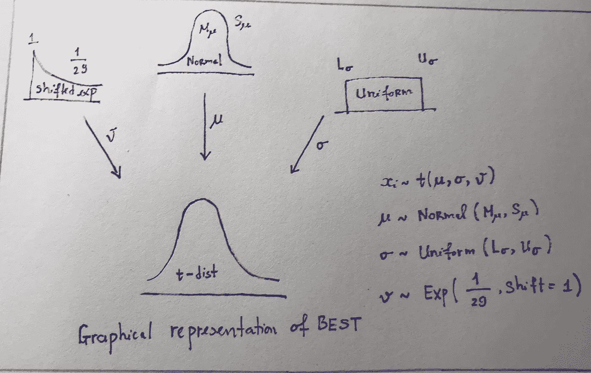

BEST 的图形表示(作者的手绘)

**第 1.1 部分。实际等效区域。**

实际等价区域(ROPE)是空值周围的区域，其中包含的值与空值的差异可以忽略不计。绳索的选择取决于特定的应用。例如，假设我们怀疑产品描述越简短，人们越有可能购买。在这种情况下，我们可以做一个 A/B 测试来比较这个新策略和旧策略(如何做的过程在我们的[上一篇文章](/a-b-testing-with-probabilistic-programming-and-pymc3-part-i-7ae52d45bc41)中有解释)。在贝叶斯框架中，我们感兴趣的是两个版本的平均订单的平均差异是否合理地接近于 0。如果我们非常有信心新策略会奏效，我们可以选择 0 左右的大绳。另一方面，如果我们不太自信，可以选择小绳子。

关于绳子的更多细节，见[本](https://cran.r-project.org/web/packages/bayestestR/vignettes/region_of_practical_equivalence.html#:~:text=The%20ROPE%2C%20being%20a%20region,enough%20to%20be%20cared%20about).&text=In%20other%20words%2C%20it%20checks,null%20region%20(the%20ROPE).)。

**第 1.2 部分。最高密度区间。**

最高密度层段(HDI)的定义相当专业。粗略地说，HDI 是这样一个区间，它包含的点比位于它之外的点具有更高的概率密度。[像置信区间](https://en.wikipedia.org/wiki/Confidence_interval)一样，我们可以选择人类发展指数覆盖整个人口的程度。通常，我们可以选择覆盖 95%分布的人类发展指数。

贝叶斯世界中一个更一般的概念，直接类似于置信区间，就是[可信区间](https://en.wikipedia.org/wiki/Credible_interval)的概念。我们不会详细讨论这个概念；鼓励读者在这里查看详细内容。

**第 1.3 部分。最佳决策。**

一旦指定了 ROPE 和 HDI，我们就可以使用它们来进行统计决策。

*   如果 ROPE 位于 HDI 之外，那么我们拒绝零假设。
*   如果 ROPE 包含 HDI，那么我们接受零假设。
*   否则，我们保留我们的决定。

在最后一种情况下，最好的测试说，没有足够的证据来做出结论性的决定。在这种情况下，我们有几种选择。例如，我们可以改变绳子和/或 HDI。更实际的是，我们可以获得更多的样品。

**第二部分:网络搜集的 NBA 薪资数据**

在本节中，我们将解释如何使用 Python 包 [Beautiful Soup](https://en.wikipedia.org/wiki/Beautiful_Soup_(HTML_parser)) 从互联网上获取数据。我们将使用 [ESPN](http://www.espn.com/nba/salaries/_/page/_/seasontype/3) 网站获取 2019-2020 赛季 NBA 球员的工资。首先，我们需要导入几个包(对于本节，相关的包是 BeautifulSoup、table 和 requests。)

```
import pandas as pd
import requests
from bs4 import BeautifulSoup
from tabulate import tabulate
import numpy as npimport pymc3 as pm
import scipy.stats as stats
import matplotlib.pyplot as plt
%matplotlib inline
from IPython.core.pylabtools import figsize
import theano.tensor as tt
from scipy.stats.mstats import mquantiles
```

我们使用下面的函数来获取原始数据。

```
def get_raw_data(link):
    """
    Given a link, get the raw data from ESPN.com
    """
    #get the raw data from the website
    res = requests.get(link) 
    soup = BeautifulSoup(res.content,'lxml')
    table = soup.find_all('table')[0] 
    df= pd.read_html(str(table))[0]

    #remove irrelevant rows df=df.drop(df[df[1]=='NAME'].index)

    #change the name of the columns  
    df.columns=['RK', 'Name', 'Team', 'Salary']

    #Make the RK column be the index
    df.set_index('RK', inplace=True)
    return df
```

例如，让我们将这个函数应用于这个[链接](http://www.espn.com/nba/salaries/_/page/_/seasontype/3)。

```
link="http://www.espn.com/nba/salaries/_/seasontype/3"
df1=get_raw_data(link)
df1.head()
```

结果是

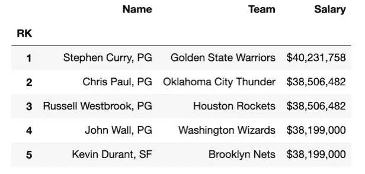

NBA 球员及其工资样本

这不是所有球员及其薪水的完整列表。还有 14 页。幸运的是，当页面在 2–14 之间时，有一个模式。我们可以利用这个事实快速获得数据。

```
df =df1
for i in range(2,15):
    #get the data for page i df_i=get_raw_data(link=    f"http://www.espn.com/nba/salaries/_/page/{i}/seasontype/3") 

    #combine all the data

    df=pd.concat([df, df_i], axis=0)
```

接下来，我们需要清理这些数据。首先，我们必须从这些数据中获得 NBA 球员的位置。正如我们所看到的，这个信息包含在 name 列中。我们可以使用下面的函数来提取它。

```
def get_position(text):
    return text.split(', ')[-1]
```

其次，薪水有美元符号；我们应该将它们转换成浮点数据类型。为了避免使用大数字，我们将使用百万美元作为单位。下面几行简单的代码完成了这些清理工作。

```
df['Position']=df['Name'].apply(get_position)df['Salary']=(df['Salary'].apply(convert_string_to_float))/10**6df.head()
```

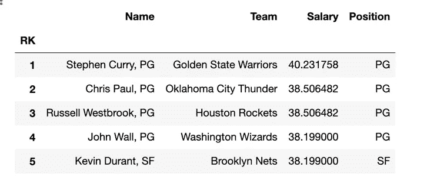

NBA 球员的薪水和职位样本

我们可以将数据保存到 CSV 文件中以备将来使用。

```
df.to_csv('NBA_salary')
```

**第三部分:NBA 不同职位的薪水**

我们将使用在第二步中获得的数据来进行分析。我们将采取可视化的方法来帮助读者对我们的分析有一个直观的理解。

首先，让我们得到这个数据集中的所有位置。

```
figsize(12.5,4)
positions=df['Position'].value_counts()
positions.sort_values(inplace=True)
bar=sns.barplot(x=positions.index, y=positions)
plt.xlabel("Position")
plt.ylabel("Number of players")
plt.title("Number of players by positions")
plt.show()
```

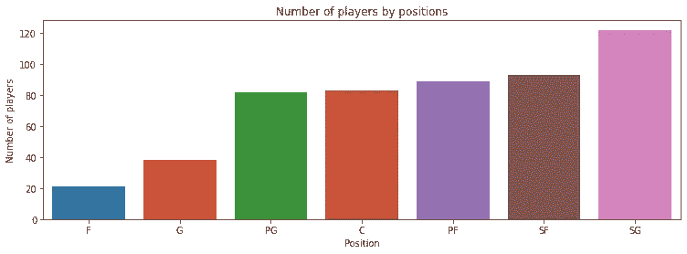

按位置分列的 NBA 球员人数

有七种不同的位置:

*   得分后卫
*   小前锋
*   大前锋
*   c(中间)
*   控卫
*   g(防护)
*   f(向前)

其中，SF 和 SG 的玩家数量最多。前锋和后卫位置的样本量明显小于其他位置。

让我们比较一下每种职位的平均工资。

```
figsize(12.5,4)
salary=df.groupby('Position')['Salary'].mean()
salary.sort_values(inplace=True)
bar=sns.barplot(x=salary.index, y=salary)
plt.xlabel("Position")
plt.ylabel("Salary, million dollar")
plt.title("Average salary across different positions")
plt.show()
```

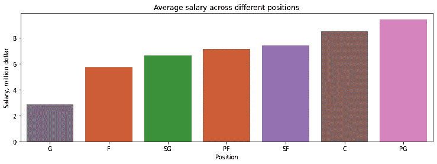

不同职位的平均工资

我们看到，平均而言，得分后卫和中锋球员收入最高。另一方面，小后卫球员挣得最少。我们也可以使用箱线图来获得一个更广阔的图景。

```
figsize(16,6)
my_order = df.groupby("Position")['Salary'].median().sort_values(ascending=False).index
sns.boxplot(data=df, x='Position', y='Salary', order=my_order)
plt.title("Salary for different positions")
plt.show()
```

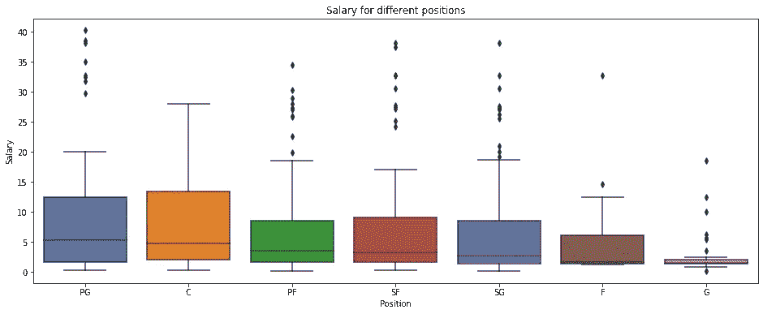

每个职位的工资箱线图

对于所有职位，工资都有尾部分布。此外，PG 和 Center 的薪资分布非常相似。总的来说，好像 SG 赚的最少。

**第 3.1 部分:得分后卫和控卫**

在第一部分，我们比较得分后卫和控球后卫的薪水。如上图所示，我们预计，平均而言，控卫球员比 SG 球员挣得多。

首先，我们过滤掉 SG 和 PG 位置的数据。我们还计算混合样本均值和混合样本方差，如[1]所述。

```
SG=df[df['Position']=='SG']['Salary']
PG=df[df['Position']=='PG']['Salary']
pooled_mean=np.r_[SG, PG].mean()
pooled_std=np.r_[SG, PG].std()
variance=2*pooled_std
```

我们为均值、方差和自由度变量设置先验分布。

```
with pm.Model() as model_1:
    mu_A=pm.Normal("mu_A", pooled_mean, sd=variance)
    mu_B=pm.Normal("mu_B", pooled_mean, sd=variance)
    std_A=pm.Uniform("std_A", 1/100, 100)
    std_B=pm.Uniform("std_B", 1/100, 100)
    nu_minus_1=pm.Exponential("nu-1", 1.0/29)
```

接下来，我们将数据放入模型中。

```
with model_1:
    obs_A=pm.StudentT("obs_A", mu=mu_A, lam=1.0/std_A**2, nu=nu_minus_1+1, observed=SG)
    obs_B=pm.StudentT("obs_B", mu=mu_B, lam=1.0/std_B**2, nu=nu_minus_1+1, observed=PG)
    start=pm.find_MAP()
    step=pm.Metropolis(vars=[mu_A, mu_B, std_A, std_B, nu_minus_1])
    trace_1=pm.sample(25000, step=step)
    burned_trace_1=trace_1[10000:]
```

一旦完成，我们就有了变量后验分布的样本。然后我们可以绘制它们来比较 SG 和 PG 球员的薪水。

首先，我们画出这两个职位的平均工资。

```
figsize(12.5, 4)
SG_mean=burned_trace_1['mu_A']
PG_mean=burned_trace_1['mu_B']
plt.hist(SG_mean, bins=40, label=r'Posterior distribution of $\mu_{SG}$')
plt.hist(PG_mean, bins=40, label=r'Posterior distribution of $\mu_{PG}$')
plt.title('Posterior distributions of average salaries for SG and PG')
plt.legend()
plt.show()
```

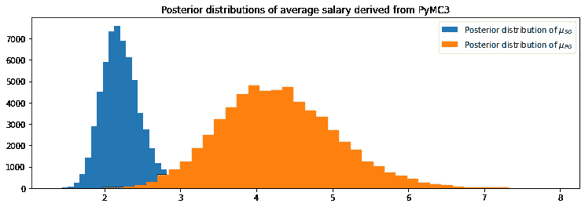

这个图说明 PG 球员平均收入比 SG 球员高。这些职位的薪资浮动情况如何？

```
figsize(12.5, 4)
SG_std=burned_trace_1['std_A']
PG_std=burned_trace_1['std_B']
plt.hist(SG_std, bins=40, label=r'Posterior distribution of $\sigma_{SG}$')
plt.hist(PG_std, bins=40, label=r'Posterior distribution of $\sigma_{PG}$')
plt.title('Posterior distributions of  standard derivation derived from PyMC3')
plt.legend()
plt.show()
```

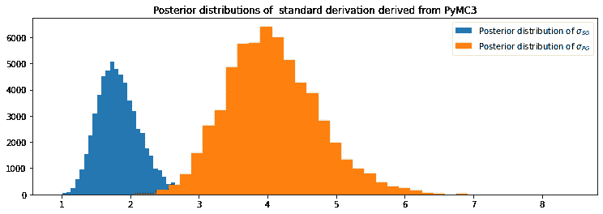

对于 PG 职位，即使平均工资更高，但波动也更大。

让我们应用 ROPE=[-0.1，0.1]和 95% HDI 的最佳值。这最好通过下面的可视化来完成。

```
figsize(12.5, 4)
difference=PG_mean-SG_mean #difference of the means hdi=pm.stats.hpd(difference, hdi_prob=0.95) #the 95% HDI interval of the differencerope=[-0.1, 0.1] #the ROPE region plt.hist(difference, bins=50, density=True, label='Differene of the mean salaries')
plt.title('Posterior distribution of the the difference of the means')
plt.vlines(hdi[0], 0,0.6, linestyle='--', color='red', label='HDI')
plt.vlines(hdi[1], 0, 0.6, linestyle='--', color='red')
plt.vlines(rope[0], 0, 0.6, linestyle='--', color='black', label='ROPE')
plt.vlines(rope[1], 0, 0.6, linestyle='--', color='black')
plt.title('Posterior distribution of the the difference of the mean salaries for PG and SG')
plt.legend(loc='upper right')
plt.show()
```

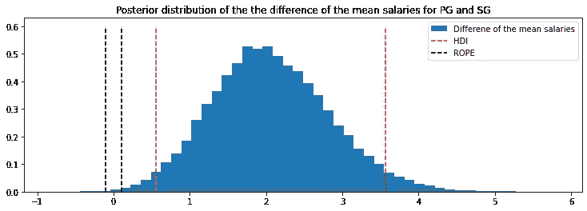

由于绳子完全在 HDI 区间之外，我们拒绝零假设:我们相信，平均而言，PG 球员比 SG 球员挣得多。我们注意到，在这种情况下，人类发展指数

```
[0.5580346 , 3.57072747]
```

所以，即使我们取[-0.5，0.5]这样更宽的绳子，仍然可以拒绝零假设。此外，正如上一篇文章中所讨论的，贝叶斯观点允许我们回答更复杂的问题。比如说，我们有多大把握说一个控卫球员比 SG 球员多赚 50%呢？

```
figsize(12.5, 4)
rel_difference=100*(PG_mean-SG_mean)/SG_mean #difference of the means
prob=len(rel_difference[rel_difference>50])/len(rel_difference)
plt.hist(rel_difference, bins=50, density=True, label='Relative differene of the mean salaries')
plt.title('Posterior distribution of the the relative difference of the means')
plt.vlines(50, 0,0.011, linestyle='--', color='red', label='HDI')
print(f"The probability that a PG player earn 50% more than an SG player is: {prob}")
plt.show()The probability that a PG player earn 50% more than an SG player is: 0.8830833333333333
```

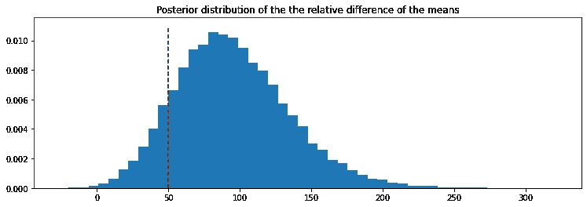

我们很有信心 PG 球员比 SG 球员多挣 50%。

**第 3.2 部分:小前锋和大前锋**

我们可以使用上一节中的框架来做类似的分析。

```
SF=df[df['Position']=='SF']['Salary']
PF=df[df['Position']=='PF']['Salary']
pooled_mean=np.r_[SF, PF].mean()
pooled_std=np.r_[SF, PF].std()variance=2*pooled_std
with pm.Model() as model_2:
    mu_A=pm.Normal("mu_A", pooled_mean, sd=variance)
    mu_B=pm.Normal("mu_B", pooled_mean, sd=variance)
    std_A=pm.Uniform("std_A", 1/100, 100)
    std_B=pm.Uniform("std_B", 1/100, 100)
    nu_minus_1=pm.Exponential("nu-1", 1.0/29) obs_A=pm.StudentT("obs_A", mu=mu_A, lam=1.0/std_A**2, nu=nu_minus_1+1, observed=SF)
    obs_B=pm.StudentT("obs_B", mu=mu_B, lam=1.0/std_B**2, nu=nu_minus_1+1, observed=PF)
    start=pm.find_MAP()
    step=pm.Metropolis(vars=[mu_A, mu_B, std_A, std_B, nu_minus_1])
    trace_2=pm.sample(25000, step=step)
    burned_trace_2=trace_2[10000:]
```

我们绘制了 SF 和 PF 职位平均工资的后验分布直方图。

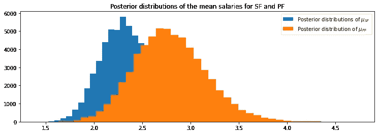

与之前的比较不同，我们看到两个后验分布重叠更多。我们可以研究这两种分布的区别。首先，我们使用 ROPE=[-0.1，0.1]和 95% HDI 区间。

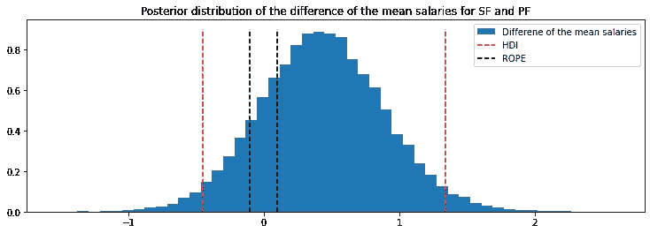

我们没有足够的证据通过上述决策规则拒绝或接受这些 ROPE 和 HDI 选择的零假设。让我们仔细看看人类发展指数。

```
array([-0.44822444,  1.34450148])
```

我们看到，如果我们坚持这个人类发展指数，那么除非我们选择一个非常宽的绳子(因此，接受零假设)，我们的数据不足以做出结论性的决定。

**第 3.3 部分:中锋 vs 大前锋**

通过类似的代码，我们可以比较中锋和大前锋的工资。我们将根据几种选择以及 HDI 和 ROPE 绘制平均工资的差异。

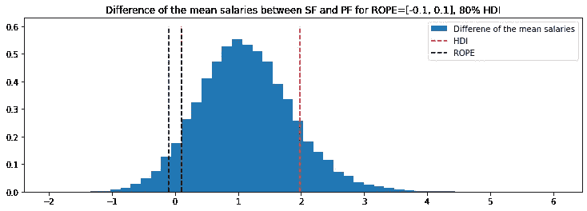

我们看到，如果选择 ROPE=[-0.1，0.1]和 95% HDI 区间，我们的数据无法做出最终决定。然而，假设我们把人类发展指数降低到 80%。在这种情况下，我们有信心中锋球员的平均收入高于大前锋球员。

**结论**

我们希望读者能从这篇文章中学到一些东西。首先，BEST 提供了一个进行贝叶斯 A/B 测试的通用框架，它可以定制客户的业务方法。其次，BEST 可以方便地用 PyMC3 实现。最后但同样重要的是，对于 NBA 来说，我们很有信心得分后卫球员的平均收入高于得分后卫球员。我们不太有信心说中锋比大前锋挣得多。然而，我们没有足够的证据来区分小前锋和大前锋球员的工资。

**参考文献**

[1] John K. Kruschke，贝叶斯估计取代了 t 检验

[2] PyMC3 最佳教程，[https://docs.pymc.io/notebooks/BEST.html](https://docs.pymc.io/notebooks/BEST.html)