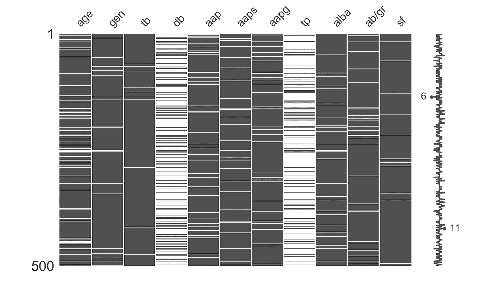
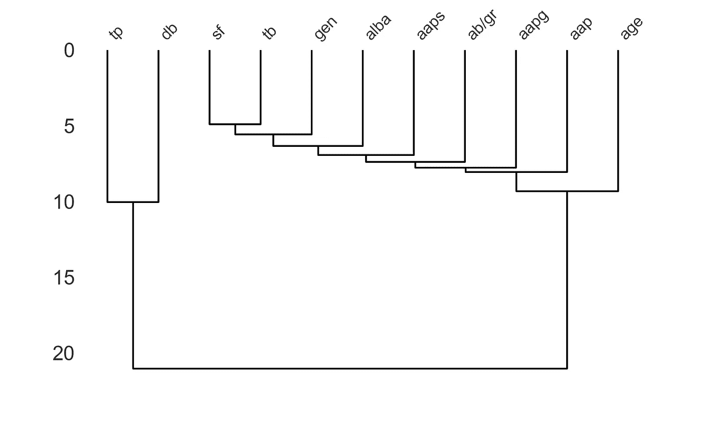
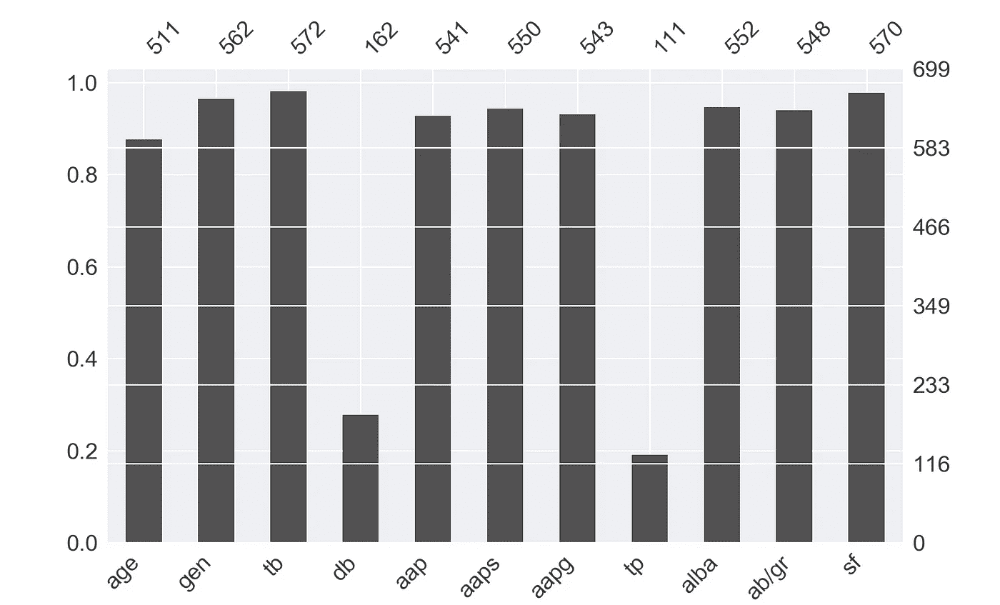
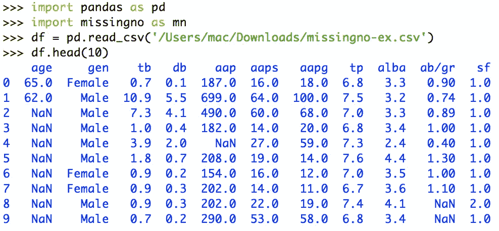
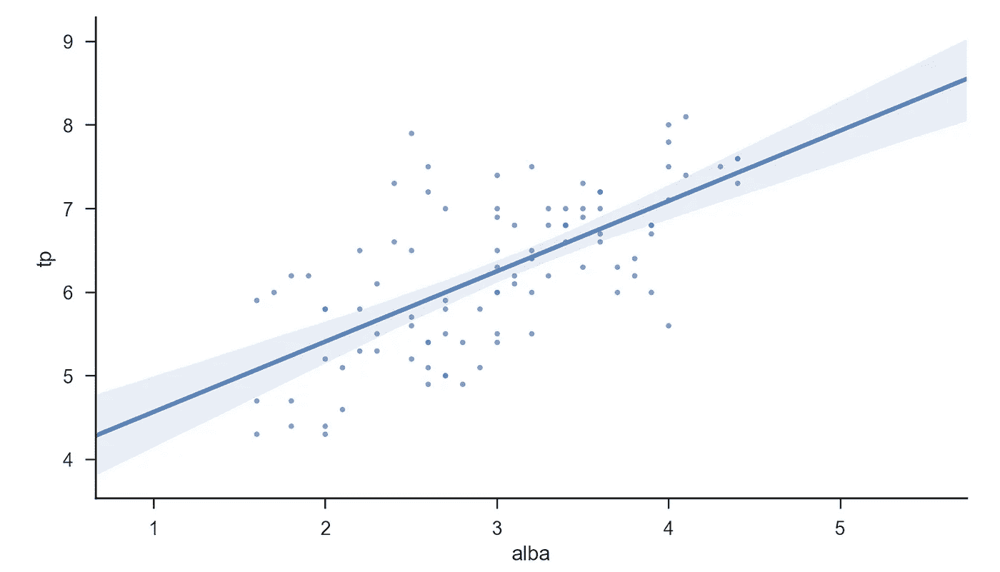
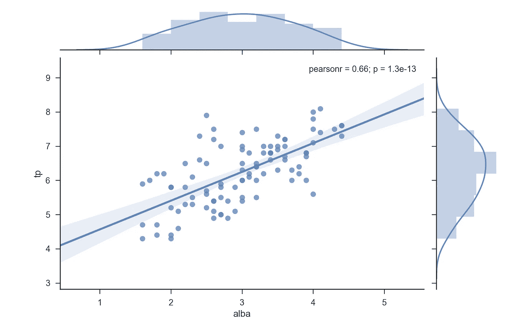
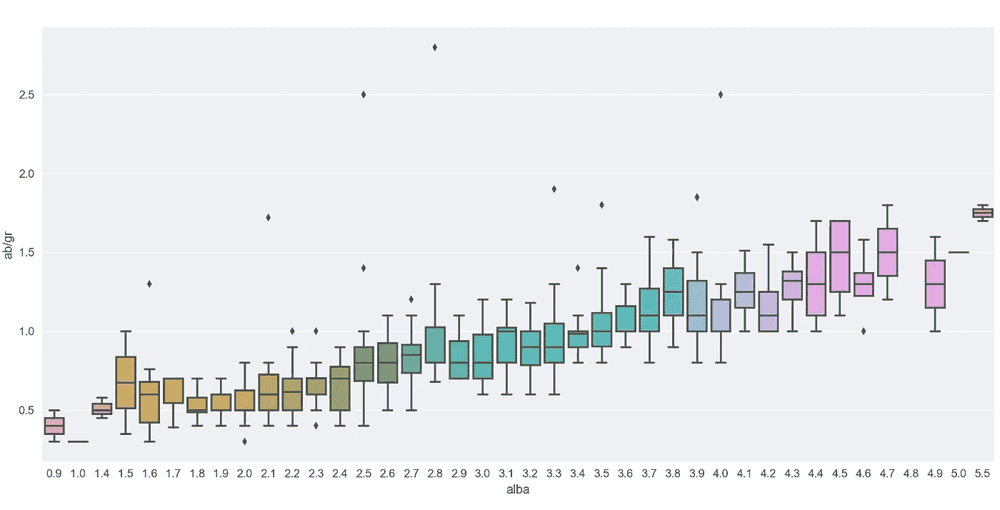
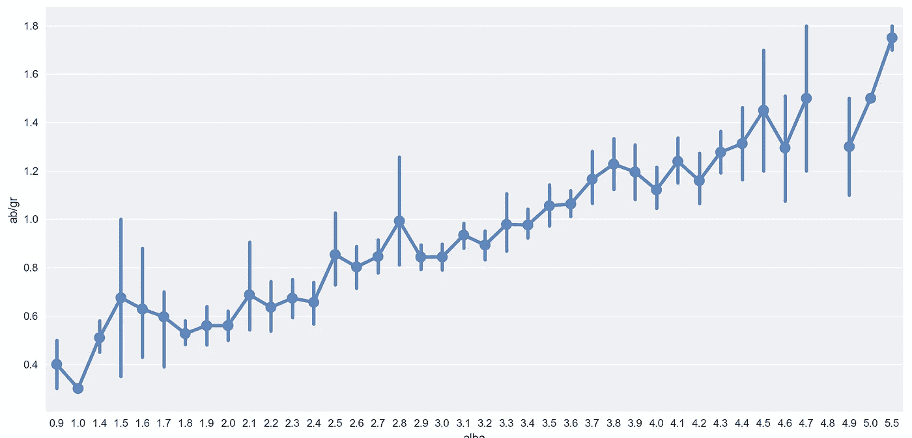
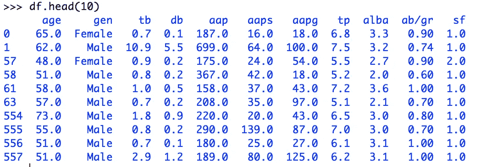
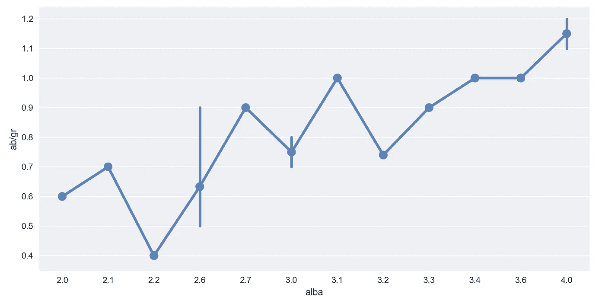

# 初始和探索性数据分析的基本指南

> 原文：<https://towardsdatascience.com/a-basic-guide-to-initial-and-exploratory-data-analysis-6d2577dfc242?source=collection_archive---------14----------------------->

## 用 Python 写了几个例子

本文最后一次更新是在 2021 年 9 月 1 日。

# **简介**

数据分析师在不同的工作环境中有不同的定义。数据分析师可能参与各种工作，包括管理信息系统、报告、数据工程、数据库管理等。在真实场景中。也不一定不好。但在这里，我们将讨论的是数据分析师的实际工作，而不是公司让他们做什么。数据分析师的字面意思是分析数据的人——不是设计管道让数据流动，也不是维护数据库——只是分析。[找出数据的含义](https://linktr.ee/kovid)。识别趋势。支持业务团队做出更好的决策，提高整体效率。这个角色更倾向于核心统计学，而不是核心计算机科学。

记住这一点，对于数据分析师来说，在开始发现数据的含义之前，完成以下两个步骤是很有用的

*   通过查看不同的数据点及其在给定数据集中的可用性和分布，找出有用的信息。
*   根据可用性找出不同变量之间的相互关系。人们还可以检查数据的质量，这是我们的第一步。

*这不是一篇关于你可以用来执行这两个步骤的所有方法的全面综述。只是对其中一些的基本概述。*


照片由[艾萨克·史密斯](https://unsplash.com/@isaacmsmith?utm_source=unsplash&utm_medium=referral&utm_content=creditCopyText)在 [Unsplash](https://unsplash.com/s/photos/charts?utm_source=unsplash&utm_medium=referral&utm_content=creditCopyText) 上拍摄。*希望这不是你作为数据分析师要做的分析。对了，这是不是一个很好的图！:)*

# 初始数据分析

**使用** [**可视化数据集的完整性没有遗漏**](https://github.com/ResidentMario/missingno)**——*数据不完整*是一个主要问题——无论是基于机器的数据收集还是基于人类的数据收集。这两种方法都容易出错。如果在分析任何给定的数据集之前确定了数据的完整性，那么数据的完整性就不是问题。如果根据不完整的数据做出决策，那将是一场灾难。思考的食粮——考虑*没有数据比不完整数据更好的情况，以得出*合理合理的结论/推论。**

> **这个想法是为了检查数据的不完整性**

**下图显示了数据集中 *db* 和 *tp* 的数据稀少，而 *tb、sf、*和 *gen* 的数据丰富。**

****

*****故意* *扭曲*** 肝脏患者数据取自[https://archive . ics . UCI . edu/ml/datasets/ILPD+(Indian+Liver+Patient+Dataset)](https://archive.ics.uci.edu/ml/datasets/ILPD+(Indian+Liver+Patient+Dataset))**

**使用以下方法获得上面的图:**

```
**import** pandas **as** pd
**import** missingno **as** mn
**from** IPython **import** get_ipython
get_ipython().run_line_magic(**'matplotlib'**, **'inline'**)
df = pd.read_csv(**'/Users/mac/Downloads/missingno-ex.csv'**)
mn.matrix(df.sample(500), figsize=(10,6))
```

**这个想法是**

> **确定两个或多个字段的数据可用性之间的相关性**

**对于大型数据集，从该数据集中随机抽取一个*样本*并绘制数据，以确定数据丢失的频率。此外，使用以下代码行绘制一个**树状图**到*来确定两个或更多字段*的数据可用性之间的相关性:**

```
mn.dendrogram(df, figsize=(10,6))
```

****

**为了识别两个变量之间的配对差异，绘制一个**树状图**。欲知详情，请阅读—[http://www . nonlinear . com/support/progenesis/comet/FAQ/v 2.0/dendrogram . aspx](http://www.nonlinear.com/support/progenesis/comet/faq/v2.0/dendrogram.aspx)**

**为了简单起见，使用条形图来可视化数据——在特定变量包含数据的地方显示绝对数字。**

```
mn.bar(df, figsize=(10,6))
```

****

****绝对数字****

**既然我们对数据的分布和可用性有了一些了解，我们就可以研究数据了。**

**人们可能想知道的第一件事是数据集实际上是什么样子。为了得到这个提示，可以打印出数据集中的第一个`n`记录。`NaN`表示数据不可用。稍后我们将讨论`NaN`值。**

****

**使用 pandas 数据框架探索数据**

# **探索性数据分析**

**现在我们对数据的外观有了一些了解，是时候使用 [Seaborn](https://seaborn.pydata.org/) 来探索数据了。**

> **这个想法是看数据集中的两个给定变量是如何相互关联的？**

**看完数据后，想到的第一个分析问题是*这个数据集中两个相互关联的变量是怎样的？*或者说，当某个变量发生变化时，另一个变量的值是如何变化的？或者这两个变量之间是否存在关系。**

****

**即使寻找线性回归拟合线可能不是动机，人们可能仍然希望探索数据所承载的价值。重要的是要知道两个变量之间是否存在关系(**相关性**)，如果存在，值如何变化(**回归**)**

**使用这个简单的代码得到上面的图表。**

```
**import** matplotlib.pyplot **as** plt
**import** seaborn **as** sns
sns.set_context("**notebook**", font_scale=1.1)
sns.set_style("**ticks**")
sns.lmplot('**alba**', '**tp**',
           data=df,
           fit_reg=True,
           scatter_kws={"marker": "D",
                        "s": 10})
plt.show()
```

**除了上一个图表的内容之外，为了可视化上一个图表中绘制的这些变量的值的分布，而不是`sns.lmplot`，可以使用下面的代码行使用`sns.jointplot`:**

```
sns.jointplot(x="total_bill", y="tip", data=tips, kind="reg")
```

****

**阅读更多关于**Pearson r**—[https://docs . scipy . org/doc/scipy-0 . 14 . 0/reference/generated/scipy . stats . Pearson r . html](https://docs.scipy.org/doc/scipy-0.14.0/reference/generated/scipy.stats.pearsonr.html)**

**让我们来看看可视化数据的最有用的 EDA 方法之一——箱线图。**

> **这个想法是研究数据集中变量的分布**

**箱线图主要用于*研究数据集*中变量的分布。尽管直方图也可用于此，但相比之下，箱线图在某些情况下提供了更好的数据汇总。箱线图告诉我们数据的形状、可变性和中心。虽然，当我们只热衷于通过某种方式了解分布情况以告诉我们数据偏向了哪一侧时，直方图可以满足我们的目的，使我们免于其他细节。**

```
**import** pandas **as** pd **import** matplotlib.pyplot **as** plt
**import** seaborn **as** sns
df = pd.read_csv(**'/Users/mac/Downloads/missingno-ex.csv'**)
sns.factorplot(x='**alba**',y= '**ab/gr**',data=df,kind='box',aspect=1)
plt.show()
```

****

**了解更多关于**箱形图** —1 的信息。[https://flowing data . com/2008/02/15/how-to-read-and-use-a-box-and-whisker-plot/](https://flowingdata.com/2008/02/15/how-to-read-and-use-a-box-and-whisker-plot/)和 2。[https://www . nature . com/nmeth/journal/v11/N2/pdf/nmeth . 2813 . pdf](https://www.nature.com/nmeth/journal/v11/n2/pdf/nmeth.2813.pdf)**

**在 Seaborn 中使用因子点图，可以像这样可视化上面已经可视化的相同数据。**

```
sns.factorplot(x='**alba**',y= '**ab/gr**',data=df,kind='point',aspect=1)
```

****

****清理数据** —显然，这需要在我们开始分析之前完成，并且是为使用数据做准备的一部分——因此，它是初始数据分析阶段而不是 EDA 的一部分。**

**当您使用[**missing no**](https://github.com/ResidentMario/missingno)**库来可视化数据丢失的位置时，您没有清理数据以供使用。第一部分是从数据集中移除空值。然后删除重复项。****

```
****import** pandas **as** pd **import** matplotlib.pyplot **as** plt
**import** seaborn **as** snsdf = pd.read_csv(**'/Users/mac/Downloads/missingno-ex.csv'**)
# Cleaning the data now
df = df.dropna().drop_duplicates()
sns.factorplot(x='**alba**',y= '**ab/gr**',data=df,kind='box',aspect=1)
plt.show()**
```

********

****这是用 dropna()和 drop_duplicates()清理后数据的样子。注意最左边一列中缺少的索引——顺便说一下，这不是数据集的一部分。它只代表行号。****

********

****经过清理后，这就是保留下来供使用的数据。****

****这是对您可以在数据分析过程的前两步中使用的几个示例的基本介绍，即，****

1.  ******初始数据分析** —对数据的性质及其收集方式的初步探索。这一部分包括清理和管理数据，以便对分析有用。****
2.  ******探索性数据分析** —涉及全面的探索，主要是通过可视化的方法，其中一些方法在上面已经提到。****
3.  ******建模**——为给定数据创建模型，并建立不同变量之间的关系——使用训练数据集。****
4.  ******验证** —检查模型是否适用于未用于训练的数据集，即测试数据集。如果模型有效，那么你继续下一步。否则，你回去改进模型。****
5.  ******预测** —如果模型得到验证，您可以很有把握地说，数据集中的某个变量相对于数据集中的另一个变量将如何变化。这是最后阶段。****

## ****结论****

****前两步很重要，尤其是在对数据缺乏信任的情况下。这种缺乏信任可能是由各种原因引起的，如*您收集数据的方式、数据的来源、数据是否有偏差、数据是否被有意篡改、*等等。执行前两个步骤，即初始数据分析和探索性数据分析，很容易识别数据集的问题，而不会花费任何时间来做出错误的和错误的模型和预测。****