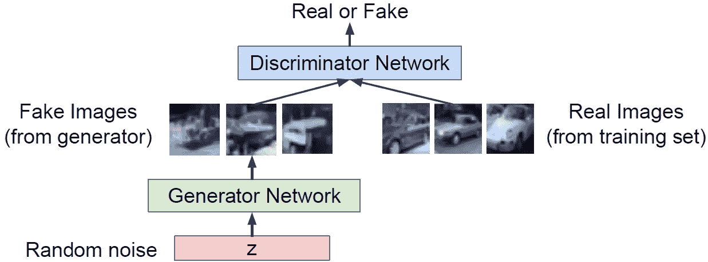
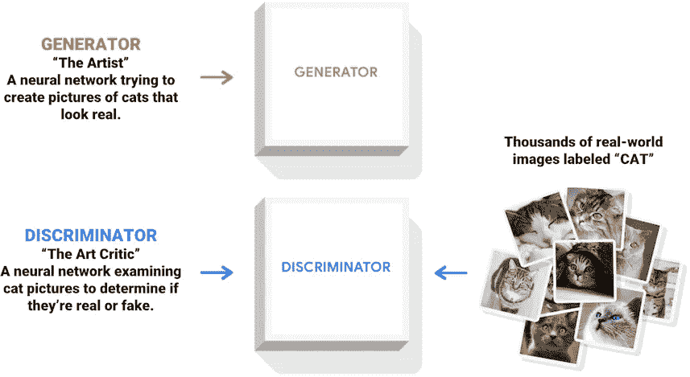
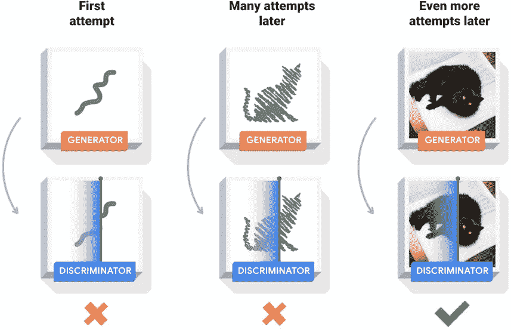
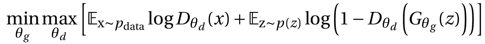
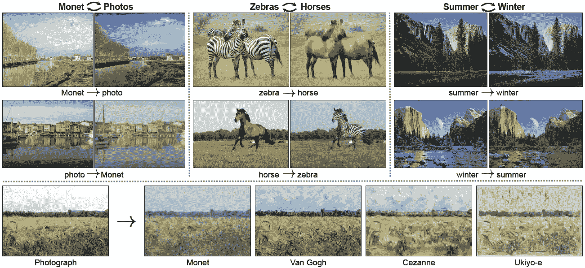

# 生成对抗网络的基本介绍

> 原文：<https://towardsdatascience.com/a-basic-intro-to-gans-generative-adversarial-networks-c62acbcefff3?source=collection_archive---------24----------------------->

## [入门](https://towardsdatascience.com/tagged/getting-started)

## 甘是如何工作的？他们为什么这么有趣？

*我有机会在甘斯做了 3 个月的研究实习。我读了很多科学论文和博客。在这篇文章中，我试图传达我所学到的和觉得值得分享的基本知识。*

# 目录

1)简介
2)GANs 是如何工作的？
2.1)原理:生成器 vs 鉴别器
2.2)数学上:双人极大极小游戏
3)为什么 GANs 这么有趣？
4)结论和参考文献

**图 1** :使用 GANs 从原始图像生成的现实而虚构的名人肖像。来源:英伟达**【4】**。

# 1)简介

在过去的十年里，可用数据量的爆炸式增长——大数据——算法的优化和计算能力的不断进化，使**人工智能** (AI)能够执行越来越多的人类任务。2017 年，Andrey Ng 预测[人工智能将像电一样产生深远的影响](https://www.gsb.stanford.edu/insights/andrew-ng-why-ai-new-electricity)。

如果我们声称 AI 的目的是模拟人类的智能，那么主要的难点就是创造力。在人工智能领域，我们谈论**生成模型**，当今最流行的模型之一是 GANs(表示“生成对抗网络”)。在 2016 年的一次研讨会上， [Yann LeCun 称 GANs 是“过去 20 年深度学习领域最酷的想法”](https://www.technologyreview.com/2018/02/21/145289/the-ganfather-the-man-whos-given-machines-the-gift-of-imagination/)。

甘斯**引入了**对抗学习**的概念，因为它们存在于两个神经网络之间的竞争中。这些技术使研究人员能够创建看起来逼真但完全由计算机生成的人脸照片。他们还允许制作有争议的“深度造假”视频。实际上，GANs 可以用来模仿任何数据分布(图像、文本、声音等。).**

**GANs 2018 年的结果示例见**图 1** :这些图像是假的，但非常真实。这些虚构的名人肖像的生成，来自 Celeba-HQ 的真实肖像数据库，由 30，000 幅图像组成，耗时 19 天。生成的图像大小为 1024×1024。**

# **GANs 是如何工作的？**

****生成对抗网络** (GANs)是一种带有隐式密度估计的生成模型，是无监督学习的一部分，使用两个神经网络。因此，我们理解“生成性对抗网络”中的“生成性”和“网络”这两个术语。**

## **2.1)原理:发生器与鉴别器**

****

****图二**:发生器和鉴别器的作用。来源:斯坦福 cs 231n**【2】**。**

**其原理是一个双人游戏:一个被称为生成器的神经网络和一个被称为鉴别器的神经网络。**发生器**试图通过生成看起来真实的图像来欺骗鉴别器，而**鉴别器**试图区分真实和虚假的图像。因此，我们理解“生成对抗网络”中的“对抗”一词。参见**图 2** 。**

****

****图 3** :解释:发生器和鉴别器的作用。来源: [TensorFlow](https://www.tensorflow.org/beta/tutorials/generative/dcgan) 。**

**在**图 2** 的左下方，我们可以看到我们的发生器样本来自一个简单的分布:随机噪声。生成者可以解释为艺术家，鉴别者可以解释为艺术批评家。参见**图 3** 。**

****

****图 4** :发电机和鉴别器培训。来源: [TensorFlow](https://www.tensorflow.org/beta/tutorials/generative/dcgan) 。**

**在训练过程中，发生器逐渐变得更擅长创建看起来真实的图像，而鉴别器变得更擅长区分它们。当鉴别器不再能够区分真实图像和伪造图像时，该过程达到平衡。参见**图 4** 。因此，如果鉴别器训练有素，并且生成器设法生成看起来真实的图像来欺骗鉴别器，那么我们就有了一个良好的生成模型:我们正在生成看起来像训练集的图像。**

**在这个训练阶段之后，我们只需要生成器对新的(错误的)真实数据进行采样。我们不再需要鉴别器了。请注意，随机噪声保证了发生器不会总是产生相同的图像(这会欺骗鉴别器)。**

**请注意，在图 4 中的**训练开始时，发生器仅产生一个看起来不像训练数据的随机噪声。****

## **2.2)数学上:双人极大极小游戏**

**生成器 *G* 和鉴别器 *D* 以**双人极大极小游戏**的形式联合训练。最小最大目标函数是:**

****

****方程式(1)****

**其中 *θ_g* 为 *G* 的参数， *θ_d* 为 *D* 的参数。**

**下面我们简单的把 *D_{θ_d}* 称为 *D* ，把 *G_{θ_g}* 称为 *G* 。**

**根据定义， *D* 输出真实图像在区间 *[0，1]*:
*D(x)*等于 *1* (或者接近于 *1* )如果 *D* 认为 *x* 是真实数据，
*D(x)*等于*0***

***我们可以证明，在均衡状态下， *D* 处处输出 *1/2* ，因为 *D* 不知道如何区分虚假生成的数据和真实数据。***

***因为*x∞p _ { data }*， *x* 是实数据。根据 *G* 的定义， *G(z)* 是一个假生成的数据。例如， *x* 将是一只猫的真实图像，而 *G(z)* 将是一只猫的假生成图像。因此， *D(x)* 是鉴别器对于真实输入 *x* 的输出，而*D(G(z)】*是鉴别器对于伪生成数据 *G(z)* 的输出。***

***在**【1】**之后，来自**等式(1)** 的两人极大极小游戏被写成使得 *θ_g* 和 *θ_d* 进化，使得子节 **2.1)** 中的以下几点为真:
鉴别器 *D* 试图区分真实数据 *x*
更准确地说，鉴别器 *D* 与 *θ_d* ( *θ_g* 固定)一起运行，以最大化目标函数，使得 *D(x)* 接近于 *1* ( *x* 为真实数据)，并且使得*D(G(z)*接近于 *0
生成器 *G* 试图欺骗鉴别器 *D* 认为其生成的假数据是真实的。
更准确地说，生成器 *G* 与 *θ_g* ( *θ_d* 固定)一起运行，以最小化目标函数，使得*D(G(z)】*接近于 *1* (一个错误生成的数据被鉴别器检测为真)。****

***虽然我们是在无监督学习中(数据没有标注)，但是我们选择由 *G* 生成的数据有一个 *0* 标签为假(不管鉴别器返回什么)，真实的学习数据有一个 *1* 标签为真。因此，我们可以定义一个损失函数。***

***论文**【1】**证明了极小极大对策对于 *p_g = p_{data}* 有一个全局(唯一)最优，其中 *p_g* 是生成分布， *p_{data}* 是真实数据分布。然而，在实践中，让 *p_g* 向 *p_{data}* 收敛并不容易。***

# ***3)为什么甘这么有意思？***

***生成模型有几个非常有用的应用:彩色化、超分辨率、艺术作品的生成等。一般来说，使用模拟模型优于真实模型的优点是计算速度更快。***

***Goodfellow 的教程**【3】**和 Stanford 的讲座**【2】**中给出了很多有趣的例子。特别是 Goodfellow 在 4:15 到 12:33 的会议“[生成性对抗性网络(NIPS 2016 教程)](https://youtu.be/HGYYEUSm-0Q?t=255)”中给出的例子，让人印象深刻。***

******

*****图 5** : CycleGAN:用 GANs 把真实的影像转置成现实的虚构影像。来源:柏克莱人工智能研究(BAIR)实验室**【5】**。***

***图 5 给出了一个例子。伯克利大学研究人员开发的 CycleGan 将这些真实图像转换成现实的虚构图像，反之亦然。这个概念被称为**图像到图像转换**，是一类视觉和图形问题，其目标是使用对齐图像对的训练集来学习输入图像和输出图像之间的映射。对于 Tensorflow，CycleGAN 上有一个[教程](https://www.tensorflow.org/tutorials/generative/cyclegan)。***

******

*****图 6** :使用 GANs 的几种图像变换。来源:柏克莱人工智能研究(BAIR)实验室**【6】**。***

***第二个例子如图 6 中的**所示。例如，空中转地图功能对谷歌地图或类似的应用程序非常有用，边缘转照片功能可以帮助设计师。*****

# ***4)结论***

***GANs 的应用增长迅速，尤其是在图像方面。我相信 GANs 对公司来说是非常有趣的。例如，GANs 可以生成新医学图像的逼真图像，图像到图像的翻译可以帮助设计人员绘图并更具创造性。此外，当我们只有一百张图像并且希望有更多时，GANs 可以用于**数据扩充**。***

***GANs 也被开发用于二进制输出(生病与否)或离散输出(四舍五入的血压、四舍五入的体重……)**【7】**。这项关于表格数据的新研究带来了很多好处，特别是对于**隐私**的目的。例如，医院可以向他们的合作伙伴发送虚假的真实数据(保持特征之间的相关性),而不是发送 Excel 表格中的机密数据。***

***感谢阅读，希望这篇文章对你有用。不要犹豫，在评论中给出反馈。随时联系我 [*推特*](https://twitter.com/sylvaincom) *。****

# ***参考***

***伊恩·古德菲勒、让·普热-阿巴迪、米尔扎、徐炳、戴维·沃德-法利、谢尔吉尔·奥泽尔、亚伦·库维尔和约舒阿·本吉奥。"[生成对抗网](https://www.semanticscholar.org/paper/Generative-Adversarial-Nets-Goodfellow-Pouget-Abadie/54e325aee6b2d476bbbb88615ac15e251c6e8214)" *NIPS* (2014)。
**【2】**费-、和杨威。 [CS231n:用于视觉识别的卷积神经网络](http://cs231n.stanford.edu/)。[第 13 讲|生成模型](https://www.youtube.com/watch?v=5WoItGTWV54)。*斯坦福大学*(2017 年春季)。
**【3】**伊恩·古德菲勒。" [NIPS 2016 教程:生成对抗网络](https://www.semanticscholar.org/paper/NIPS-2016-Tutorial%3A-Generative-Adversarial-Networks-Goodfellow/2c740e574eea66fdcf473e15ed2c228baef2eccd)"ArXiv abs/1701.00160 (2017)。
**【4】**泰罗·卡拉斯、蒂莫·艾拉、s·莱恩和 j·莱蒂宁。[为了提高质量、稳定性和多样性而逐步种植甘蔗。*ArXiv ABS/1710.10196*(2018)。
**【5】**朱俊彦、t·帕克、菲利普·伊索拉和阿列克谢·阿·埃夫罗斯。"](https://www.semanticscholar.org/paper/Progressive-Growing-of-GANs-for-Improved-Quality%2C-Karras-Aila/744fe47157477235032f7bb3777800f9f2f45e52)[使用循环一致对抗网络的不成对图像到图像翻译](https://www.semanticscholar.org/paper/Unpaired-Image-to-Image-Translation-Using-Networks-Zhu-Park/c43d954cf8133e6254499f3d68e45218067e4941)" *2017 IEEE 计算机视觉国际会议(ICCV)*(2017):2242–2251。
**【6】**菲利普·伊索拉、、周廷辉和阿列克谢·埃夫罗斯。"[用条件对抗网络进行图像到图像的翻译](https://www.semanticscholar.org/paper/Image-to-Image-Translation-with-Conditional-Isola-Zhu/8acbe90d5b852dadea7810345451a99608ee54c7)" *2017 年 IEEE 计算机视觉与模式识别大会(CVPR)*(2017):5967–5976。
**e .崔、s .比斯瓦尔、b .马林、j .杜克、w .斯图尔特和孙。[使用生成式对抗网络生成多标签离散患者记录](https://www.semanticscholar.org/paper/Generating-Multi-label-Discrete-Patient-Records-Choi-Biswal/5320c90d52541d5581f0a8c4b75d9b2da81299ce)。 *MLHC* (2017)。*****