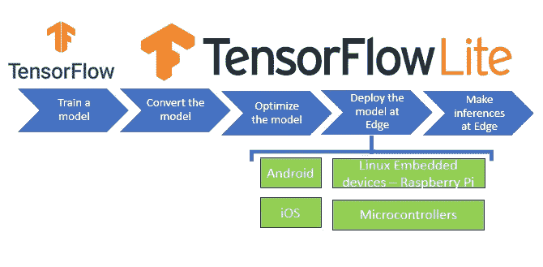
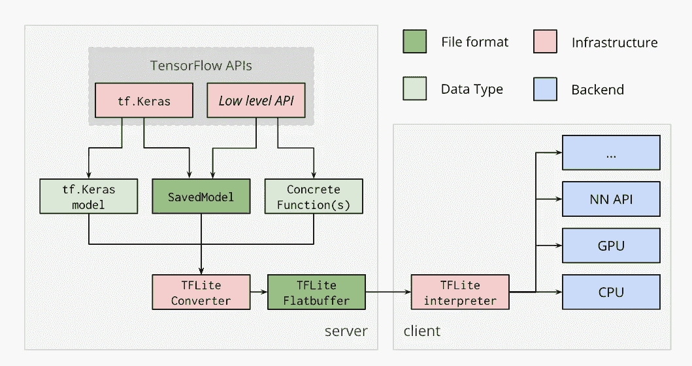

# TensorFlow Lite 的基本介绍

> 原文：<https://towardsdatascience.com/a-basic-introduction-to-tensorflow-lite-59e480c57292?source=collection_archive---------7----------------------->

## 介绍 TensorFlow Lite 转换器、量化优化和在边缘运行 Tensorflow Lite 模型的解释器

*在本文中，我们将了解在边缘部署深度学习模型所需的功能，什么是 TensorFlow Lite，以及如何使用 TensorFlow Lite 的不同组件在边缘进行推断。*


Priscilla Du Preez 在 Unsplash 上拍摄的照片

***你正在尝试将你的深度学习模型部署在一个他们没有良好网络连接但仍然需要深度学习模型来提供出色性能的区域。***

> TensorFlow Lite 可用于这种情况

## 深度学习模型在边缘进行推理的特征

1.  **轻量级:**边缘设备在存储和计算能力方面资源有限。深度学习模型是资源密集型的，因此我们在边缘设备上部署的模型应该是轻量级的，具有较小的二进制大小。
2.  **低延迟:**边缘的深度学习模型应该做出更快的推断，而不管网络连接性如何。由于推断是在边缘设备上进行的，因此将消除从设备到服务器的往返行程，从而使推断更快。
3.  **安全:**模型部署在边缘设备上，推断在设备上进行，没有数据离开设备或在网络上共享，因此不存在数据隐私问题。
4.  **最佳功耗:**网络需要大量功率，边缘设备可能没有连接到网络，因此功耗需求较低。
5.  **预训练:**模型可以在内部或云端进行训练，用于不同的深度学习任务，如图像分类、对象检测、语音识别等。并且可以很容易地部署以在边缘做出推断。

Tensorflow Lite 提供了在边缘进行推理所需的所有功能。

***但是 TensorFlow Lite 是什么？***

**TensorFlow Lite 是一个开源、产品就绪、跨平台的深度学习框架，可以将 TensorFlow 中预先训练的模型转换为一种特殊的格式，可以针对速度或存储进行优化**。

特殊格式模型可以**部署在边缘设备上，如使用 Android 或 iOS 或 Linux 的移动设备，基于嵌入式设备，如 Raspberry Pi 或微控制器，以在边缘进行推理**。



***tensor flow Lite(TF Lite)是如何工作的？***

## 选择并训练一个模型

假设您想要执行图像分类任务。第一件事是决定任务的模型。你的选择是

*   创建自定义模型
*   使用预先训练好的模型，如 InceptionNet、MobileNet、NASNetLarge 等。
*   在预先训练的模型上应用迁移学习

## 使用转换器转换模型

模型定型后，您将把模型转换为 Tensorflow Lite 版本。 **TF lite 模型是一种特殊格式的模型，在准确性方面很有效，并且是一种占用空间较少的轻量型模型，这些特性使 TF lite 模型非常适合在移动和嵌入式设备上工作。**

**TensorFlow Lite 转换流程**



来源:https://www.tensorflow.org/lite/convert/index

**在从 Tensorflow 模型到 Tensorflow Lite 模型的转换过程中，文件的大小会减小**。我们可以选择进一步减小文件大小，同时权衡模型的执行速度。

**Tensorflow Lite 转换器将 Tensorflow 模型转换为 Tensorflow Lite 平面缓冲文件(*)。tflite* )。**

Tensorflow Lite 平面缓冲文件部署到客户端，在我们的例子中，客户端可以是运行在 iOS 或 Android 上的移动设备或嵌入式设备。

***如何将 TensorFlow 模型转换为 TFlite 模型？***

训练完模型后，您现在需要保存模型。

**保存的模型在单个文件中序列化模型的架构、权重和偏差以及训练配置。保存的模型可以很容易地用于共享或部署模型。**

转换器支持使用保存的模型

*   **tf.keras.Model:** 使用 keras 创建并编译模型，然后使用 TFLite 转换模型。

```
#Save the keras model after compiling
**model.save('model_keras.h5')
model_keras= tf.keras.models.load_model('model_keras.h5')**# Converting a tf.Keras model to a TensorFlow Lite model.
**converter = tf.lite.TFLiteConverter.from_keras_model(model_keras)
tflite_model = converter.convert()**
```

*   SavedModel :一个 SavedModel 包含一个完整的 TensorFlow 程序，包括权重和计算。

```
#save your model in the SavedModel format
**export_dir = 'saved_model/1'
tf.saved_model.save(model, export_dir)**# Converting a SavedModel to a TensorFlow Lite model.
**converter = lite.TFLiteConverter.from_saved_model(export_dir)
tflite_model = converter.convert()**
```

***export_dir*** 遵循一个惯例，其中最后一个路径组件是模型的版本号。

**SavedModel** 是保存在 ***export_dir，*** 上的元图，使用 **lite 转换为 TFLite 模型。TFLiteConverter** 。

*   **具体功能:** TF 2.0 默认开启急切执行，影响性能和可部署性。为了克服性能问题，我们可以使用 **tf.function 来创建图形**。图形包含模型结构，以及模型的所有计算操作、变量和权重。

将模型导出为具体函数，然后将具体函数转换为 TF Lite 模型

```
**# export model as concrete function**
func = tf.function(model).get_concrete_function(
    tf.TensorSpec(model.inputs[0].shape, model.inputs[0].dtype))#Returns a serialized graphdef representation of the concrte function
**func.graph.as_graph_def()**# converting the concrete function to Tf Lite 
**converter =  tf.lite.TFLiteConverter.from_concrete_functions([func])
tflite_model = converter.convert()**
```

## 优化模型

***为什么要优化模型？***

边缘模型需要重量轻

*   在边缘设备上占用较少的空间。
*   在带宽较低的网络上下载速度更快
*   为模型占用更少的内存，以便更快地做出推断

处于边缘的模型也应该具有运行推理的低延迟。轻量级和低延迟模型可以通过减少预测所需的计算量来实现。

优化减少了模型的大小或改善了延迟。在模型的大小和模型的准确性之间有一个权衡。

***tensor flow Lite 中优化是如何实现的？***

Tensorflow Lite 通过以下方式实现优化

*   量化
*   权重修剪

**量子化**

当我们保存 TensorFlow 模型时，它存储为包含计算操作、激活函数、权重和偏差的图形。激活函数、权重和偏差是 32 位浮点。

> 量化降低了用于表示张量流模型的不同参数的数字的精度，这使得模型重量轻。

**量化可以应用于权重和激活。**

*   **具有 32 位浮点的权重可以转换为 16 位浮点或 8 位浮点或整数，并且**将减小模型的大小。
*   **权重和激活都可以通过转换为整数来量化，**这将提供低延迟、更小的尺寸和降低的功耗。

**权重修剪**

正如我们修剪植物以去除植物的非生产性部分，使其更结果实和更健康一样，我们也可以修剪模型的权重。

> 权重修剪会修剪模型中对模型性能影响很小的参数。

**权重剪枝实现模型稀疏，稀疏模型压缩效率更高。**修剪后的模型将具有相同的大小和运行时延迟，但具有更好的压缩性能，可在边缘实现更快的下载时间。

## 部署 TF Lite 模型并进行推理

TF lite 模型可以部署在 Android 和 iOS 等移动设备上，以及 Raspberry 和微控制器等边缘设备上。

要从边缘设备进行推断，您需要

*   初始化解释器，并用模型加载解释器
*   分配张量，得到输入和输出张量
*   通过读入张量对图像进行预处理
*   通过调用解释器对输入张量进行推理。
*   通过映射推理的结果来获得图像的结果

```
# Load TFLite model and allocate tensors.
**interpreter = tf.lite.Interpreter(model_content=tflite_model)
interpreter.allocate_tensors()**#get input and output tensors
**input_details = interpreter.get_input_details()
output_details = interpreter.get_output_details()**# Read the image and decode to a tensor
**img = cv2.imread(image_path)
img = cv2.resize(img,(WIDTH,HEIGHT))**#Preprocess the image to required size and cast
**input_shape = input_details[0]['shape']
input_tensor= np.array(np.expand_dims(img,0), dtype=np.float32)**#set the tensor to point to the input data to be inferred
**input_index = interpreter.get_input_details()[0]["index"]
interpreter.set_tensor(input_index, input_tensor)**#Run the inference
**interpreter.invoke()
output_details = interpreter.get_output_details()[0]**
```

***还有其他方法可以改善延迟吗？***

Tensorflow lite 使用委托来提高 TF Lite 模型在边缘的性能。 **TF lite delegate 是一种将部分图形执行交给另一个硬件加速器的方式，比如 GPU 或 DSP** (数字信号处理器)。

TF lite 使用几个硬件加速器来提高速度、准确性和优化功耗，这是在边缘运行推理的重要特性。

**结论:** TF lite 模型是轻量级模型，可以部署在移动设备、Raspberry Pi 和微控制器等边缘设备上进行低延迟推理。当与硬件加速器一起使用时，TF lite delegate 可用于进一步提高速度、准确性和功耗

## 参考资料:

[](https://www.tensorflow.org/lite/guide) [## TensorFlow Lite 指南

www.tensorflow.org](https://www.tensorflow.org/lite/guide) 

https://www.tensorflow.org/model_optimization/guide/pruning

[](https://www.tensorflow.org/model_optimization/guide/quantization/post_training) [## 训练后量化|张量流模型优化

www.tensorflow.org](https://www.tensorflow.org/model_optimization/guide/quantization/post_training) 

[https://www . tensor flow . org/lite/performance/model _ optimization](https://www.tensorflow.org/lite/performance/model_optimization)