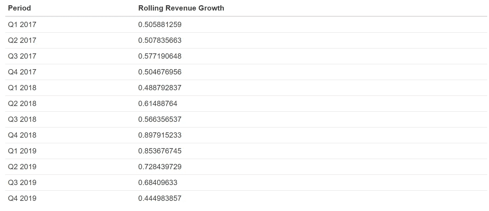
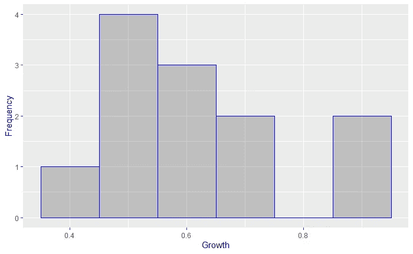
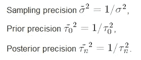
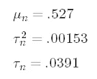

# 估计收入增长的贝叶斯方法

> 原文：<https://towardsdatascience.com/a-bayesian-approach-to-estimating-revenue-growth-55d029efe2dd?source=collection_archive---------19----------------------->

## 使用正态-正态模型的一个实例

图片由来自 Pixabay 的洛伦佐·卡法罗提供

***注来自《走向数据科学》的编辑:*** *虽然我们允许独立作者根据我们的* [*规则和指导方针*](/questions-96667b06af5) *发表文章，但我们不认可每个作者的贡献。你不应该在没有寻求专业建议的情况下依赖一个作者的作品。详见我们的* [*读者术语*](/readers-terms-b5d780a700a4) *。*

也许你是一个投资者，正试图决定一只股票是否值得投资。也许你最近才听说贝叶斯推理，并想了解它在现实世界中的应用。也许您是一位经验丰富的分析师，偶然发现了这篇文章，并觉得标题很有趣。不管你来自哪里，我感谢你阅读这篇文章。我将谈论正态-正态模型，贝叶斯统计中的基础模型之一，以及如何使用它来估计公司收入的增长率。这个评估可以用来决定公司是否值得投资。

这篇文章的第一个目的是展示如何使用正态-正态模型将主观叠加纳入数据分析。第二个是提供一些正态-正态模型和贝叶斯推理背后的直觉，而不会陷入太多的机制中。我会在这里和文末反复说，但这一块不构成投资建议。这是有教育意义的。本文中表达的所有信息和选项均以作者的个人身份发布，独立于作者可能与 RobustWealth，Inc .达成的任何雇佣协议。

有了这个免责声明，让我们开始吧！

# 手头的任务

财务建模通常是指预测一家公司的基本价值，以得出该公司股票的合理价格估计。一些最常用的评估指标是收入、收益和现金流。我们要考察的公司是 MongoDB，一家软件服务公司。它于 2017 年开始公开交易，收入增长巨大。

在 RStudio 中创建；所有的图和表都是在 RStudio 中创建的

考虑到这家公司还很年轻，而且正处于成长阶段，为了给公司估值，关注收入是合理的。该公司 10-K 文件中的数据，即年度财务报告，显示了从 2016 财年开始的季度收入数据。年度数据从 2014 年开始。为了使用比六个年度数字(转化为五个增长数字)多一点的数据，我计算了季度基础上一年的滚动收入增长。该数据如下所示。

在这篇文章的最后，我将比较使用年终数据和季度数据的分析结果。(虽然我没有进行正式的分析，但我认为季度数据中存在一定程度的序列相关性。这对于解释正态-正态模型的概念来说无关紧要，但在实践中肯定是需要注意的。)

预测公司收入的一种常用方法是使用一定时间内的平均历史收入增长率。对于拥有多年数据的公司来说，这不一定是个坏习惯，尤其是如果增长率遵循正态分布的话。鉴于样本数据如此之少，以及我将在下面绘制的数据直方图，在这种情况下，使用样本均值可能是不明智的。

贝叶斯推理在样本量很小的情况下特别有用，在这种情况下，人们会主观地认为样本数据不能恰当地代表更大样本的情况。

为了进行贝叶斯推理，需要一个先验分布和一个抽样模型。在定义这些分布之前，我将回顾一下贝叶斯推理的一些基础知识，以及先验分布和抽样模型是如何发挥作用的。如果你熟悉贝叶斯定理及其在分布中的应用，可以跳过这一部分。

# 贝叶斯定理和分布

最简单的形式，贝叶斯定理被定义为

这相当于

如果给一个人明确定义的概率来使用，这一切都很好，但是分布使这个过程有点复杂。

首先，我用 *θ* 代替 *A* ，用 *Y* 代替 *B* 。在这种情况下， *Y* 指的是样本数据中的点，而 *θ* 指的是 MongoDB 收入的真实平均增长率。用上述替换重写公式的第二种形式导致

换句话说，我试图建模的分布是给定样本增长率的平均收入增长率的分布。我将用样本数据和一点点判断来定义这个分布 *P* ( *Y* | *θ* )。我还需要平均增长率的先验分布 *P* ( *θ* )和数据的边际分布 *P* ( *Y* )。分析员有责任定义抽样分布以及定义 *θ* 的先验分布。一旦有了采样分布*P*(*Y*|*θ*，获得 *P* ( *Y* )的正确方法就是求解下面的积分:

在实践中，这可能很难做到，但有一个捷径。由于在这种情况下 *Y* 仅取决于 *θ* ，因此 *P* ( *Y* )是一个无条件的概率分布，包含了 *Y* 的所有可能性。这意味着分布下的面积将等于 1(一个事件的所有概率之和等于 1)，积分将等于 1 乘以一个归一化常数。该等式可以更简单地表示为，而不是求解该归一化常数

*P*(*θ*|*Y*)∧*P*(*Y*|*θ*)*P*(*θ*)

其中∝代表“与...成比例”换句话说，一个人不需要担心 *P* ( *Y* )。完成一项任务后，下一步是定义一个抽样分布和一个先验分布。

(注:技术上， *Y* 是以样本方差为条件的。在这种情况下，方差被假定为已知的常数。因为方差被假定为已知的常数，所以它可以从符号中省略。)

# 定义抽样模型和先验分布

我将用一个正态模型来描述抽样分布。查看了数据的直方图后，人们可能会认为有更好的分布来表示数据。在这种情况下，我喜欢正态分布，因为它是连续的，并且沿着所有实数都有支持(收入增长理论上可能是负的或正的)。

为了定义这个采样模型，我将计算这个数据集的均值和方差，并将它们用作采样模型的参数。这将采取的形式是

其中第一项代表 MongoDB 收入的未知真实平均增长率，第二项代表增长率的方差；假设这个方差是已知的。人们可以很容易地假设均值是已知的，而方差是未知的，或者两者都是未知的；所有这三类情况都有很好的记录，并有大量关于如何处理它们的文献。正态-正态模型适用于方差已知而均值未知的情况，因此我做出了目前的假设。

接下来，必须定义θ的先验分布。出于同样的原因，我使用正态分布的采样模型(连续，支持正值和负值)，我将使用正态分布作为我的先验。必须为变量θ定义均值和方差。我将这个分布定义为

其中第一项是先验均值，第二项是先验方差。有大量的文献致力于选择先验；这篇文章的主要焦点是如何应用正态-正态模型，所以我没有花大力气定义我的先验分布。

为了选择一个先验均值的值，我查看了过去 19 年[(multpl.com)](https://www.multpl.com/s-p-500-sales-growth/table/by-year)标准普尔 500 指数的平均销售收入增长率，然后乘以 MongoDB 的β。在股票领域，β指的是单个股票回报与更广泛的一篮子股票(通常称为指数)回报的协方差除以指数回报的方差。根据 Seeking Alpha 的数据，MongoDB 的β值约为 1.26，Seeking Alpha 是一个研究网站，提供许多股票的新闻、数据和分析。每当观察到β > 1 时，人们可以假设股票比与之比较的指数更不稳定；为此，我将指数的收入增长乘以β。其他方法可能包括关注软件服务行业中稍微老一点的公司，或者其他行业中年龄相近的公司。没有一种方法是完美的，所有可行的方法都有各自的优点。

下一个必须赋值的参数是先验方差。需要明确的是，这不是增长率的假设方差，而是平均增长率的假设方差；这个先验方差是为了反映先验均值的准确性的确定性。如果完全相信这是使用的正确平均值，方差可以设置为非常接近于 0(出于计算目的，实际上不能使用 0，但一个非常小的数如. 00001 就足够了)。另一方面，如果一个人对估计值没有多少信心，可以用一个很大的方差来表示这个确定性水平。在这种情况下，先验平均值约为 4.5%，我不知道自己对这一估计有多大把握。为了定义我的分布，我将使用 10%的标准差。这样，我可以有效地声明，我 95%相信θ的真实值在-15.5%和 24.5%之间(4.5+/-2 个标准偏差)。鉴于 MongoDB 的平均增长率约为 61%，这一估计可能显得非常保守，但这正是贝叶斯推理强大的原因。MongoDB 大部分时间都在牛市中交易，这对软件公司尤其有利。先验分布反映了来自多个市场周期的数据，从而反映了增长和收缩的多个阶段。在经济收缩的可能性、MongoDB 不能有效地执行其战略的可能性以及仅仅由于规模而导致的收入增长放缓之间，我持有一种主观信念，即 MongoDB 的真实平均增长率低于样本数据所显示的水平。我选择的先验分布代表了这种信念。现在，我可以研究分析的输出。

概括地说，这两个模型的表格如下:

太好了，我们继续分析吧！

# 后验分析和直觉

我将更多地关注这些形式提供的直觉，而不是手动完成推导。任何真正对使用正态-正态模型感兴趣的人都应该研究上述参数的推导。维基百科有一些很好的文档，大多数贝叶斯统计的入门教材都详细介绍了推导过程。

当正态分布与样本均值上的先验分布的正态结合用于抽样模型时，得到的后验分布是两个正态模型的乘积。正态-正态模型的强大之处在于，这些分布的乘积也是正态分布，尽管有更新的参数。在贝叶斯术语中，正态先验分布是共轭先验分布，这意味着它和它产生的后验分布具有相同的形式。后验分布是正态分布这一事实可能看起来没什么大不了的，但根据要建模的数据和要估计的参数，有许多情况下后验分布并不具有如此熟悉的形式。因为这种后验分布是明确定义的，所以可以直接从中取样，从而很容易计算出它的汇总统计量。

下面的符号和重新参数化来自 Peter Hoff 的教科书“贝叶斯统计的第一课”中的第 5 章，这本书是我在第一次本科贝叶斯统计课程中使用的，也是我最近一直在学习的书。

后验分布采用以下形式

其中第一项指的是后验均值，第二项指的是后验方差。计算这些更新参数的公式如下

和

这些公式可能看起来有点吓人，但希望你能看到它们之间的一些相似之处。对于获得对这些公式的直觉来说，一个常见的并且特别有用的实践是从精度而不是方差的角度来看公式。精度是方差的倒数。

在这种情况下，我们需要观察三个相关的精度:

如果将后验方差公式倒过来计算后验精度，可以看到后验精度用标准差表示为

这可以精确地写成

在这种形式中，显然后验精度是先验精度和样本精度之和乘以样本大小。后验均值也可以根据精度重写:

这里，很明显，后验均值是先验均值和样本均值的加权平均值。

对于数据，后验参数为:

这就是最新的参数。平均增长率的后验估计值约为 52.7% —比样本平均值略低，但并不低得离谱。我采用了一种主观信念，用一种分布来表示这种信念，并用这种分布来增强分析。万岁！这就是贝叶斯推理的力量。只要信念可以被定义，它们就可以以一种严格的方式被纳入分析中。让我们多谈一点我拥有的和我没有的。

有了后验标准差，我就可以计算出估计值的可信区间。对于那些不熟悉贝叶斯统计的人来说，可信区间和置信区间不是一回事，尽管它们是以相似的方式计算的。后验均值的 95%可信区间为 0.527+/2∫0.0391.527+/2∫0.0391，得出 44.88%和 60.52%的点。有了这个可信的区间，我可以断言，我 95%确定后验均值的真实值落在这个区间内。即使在这一点上，我也不把这个更新的平均值当作一个已知的实体。此外，我并不是说 52.7%是我对未来一年滚动收入增长率的预测。如果我想在这个框架内进行预测，我会使用后验预测分布。因为那是一个单独的主题，所以我在这里不涉及它，但是推导那个分布的过程类似于推导后验分布。

从这个分析中应该注意到两个关键的含义:第一个是随着样本量的增加，后验均值和后验方差越来越多地由样本数据决定。我不会说有一个明确的截止点，但在一定数量的数据中，增加一个先验并不会使指针移动太多。直觉上，这是合理的。如果您有足够丰富的采样数据，采样数据可能代表数据中的实际结构，您可能看不到利用先验分布的必要性。

为了强调第一点，我严格使用年终数据重新运行了分析，这将提供五个数据点的样本大小。使用相同的先验分布，新的抽样均值和方差约为 59.8%和. 012(或 11.1%标准差)，后验均值和方差约为 23%和. 0019(或 4.45%标准差)。均值的后验估计值比第一次迭代中观察到的值低得多；随着样本量的显著减少，先验在输出中扮演着更重要的角色。标准差变化不大，但我可以看到它变大了，尽管第二次采样的标准差变小了。我的估计要低得多，对估计的信心也略低(可信区间更宽)。

该分析的第二个含义是，先验方差越小，先验精度越高，对后验均值和后验方差的影响越大。一个人对先验越有信心，对后验估计的影响就越大。为了说明这一点，我用先前方差的不同值重新运行了原始分析。先前均值的值都是 0.045，抽样均值和方差来自滚动收入数据。下表显示了该实验的结果。

我也会画出分布图。

注意先验方差设为 0.05 的后验分布与先验均值的接近程度。随着我增加先验方差(有效地表示先验均值的置信度降低)，后验分布的中心向样本均值移动。此外，虽然后验方差的变化幅度在表中可能没有那么大，但从上面的分布图中，我们可以看到分布是如何逐渐变宽的；换句话说，平均增长真实值的可信区间扩大了。

# 摘要

简单回顾一下，我分析了一家年轻的公司，并想估计其收入的真实增长率。考虑到我拥有的少量样本数据和平均增长率将低于样本数据所显示的主观信念，我使用贝叶斯推理来增强分析。我为数据定义了一个抽样模型，为反映主观观点的平均增长率定义了一个先验，并利用正态-正态模型得出公司平均增长率的后验估计和区间。我希望这篇贝叶斯推理的简介以及对结果的分析对你有所帮助。我不建议使用这篇文章中的具体数字来对 MongoDB 进行任何评估，但是希望您可以将这些概念应用到自己的分析中。我附加了一个到 GitHub 代码库的链接；没有什么特别复杂的，但我会本着透明和可复制的精神来分享。

[https://github.com/vinai-oddiraju/TDS_Blog_Post1.git](https://github.com/vinai-oddiraju/TDS_Blog_Post1.git)

最后，我要感谢那些花时间阅读我的草稿并在整个过程中提供反馈的朋友和家人。由于这是我第一次以这种方式写一个项目，他们的支持尤其值得感谢。谢谢，保重！

# 放弃

本报告中表达的想法和观点仅代表我个人，不一定代表我公司的观点。本报告旨在提供教育，不应被理解为个人投资建议，也不应被理解为购买、出售或持有任何证券或采取任何投资策略的建议。

# 来源

[1]霍夫，彼得 D. *贝叶斯统计方法的第一课* (2007)。打印。