# R/Python 中线性混合模型(LMM)的贝叶斯方法

> 原文：<https://towardsdatascience.com/a-bayesian-approach-to-linear-mixed-models-lmm-in-r-python-b2f1378c3ac8?source=collection_archive---------6----------------------->

## [视频教程](https://towardsdatascience.com/tagged/video-tutorial)

## 实现这些比你想象的要简单

似乎有一种普遍的误解，认为贝叶斯方法比 T4 的方法更难实现。有时这是真的，但是更多的时候现有的 R 和 Python 库可以帮助简化这个过程。

> 更简单的实现≠扔进一些数据，看看有什么坚持。(我们已经有了这方面的机器学习。:P)

人们让贝叶斯方法听起来比实际更复杂，主要是因为其中涉及了很多术语(例如*弱先验、后验预测分布、*等)。)这并不直观，除非您以前使用过这些方法。

意识形态的冲突加剧了这种误解——“频繁主义者与贝叶斯主义者之争。”(如果你以前不知道，现在你知道了。)问题是人们，尤其是统计学家，通常会争论哪种方法更有效，而事实上答案是“视情况而定”

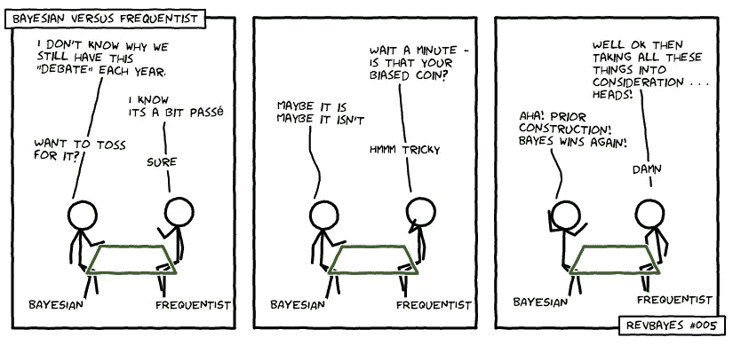

证据一:这是一个温和的例子，说明为什么这场争吵毫无意义[https://twitter.com/RevBayes/status/506577193804111872](https://twitter.com/RevBayes/status/506577193804111872)

> 贝叶斯方法，像其他任何方法一样，只是我们使用的工具。它们有优点也有缺点。

因此，随着一些个人的“热点”的方式，让我们继续有趣的东西，并实现一些贝叶斯线性混合(LMM)模型！

# 一眼

以下是我将要介绍的内容(包括 R 和 Python):

1.  选择先验的实用方法(*需要定义贝叶斯模型*
2.  如何使用 R 和 Python 实现贝叶斯 LMM 的分步指南(分别使用`brms`和`pymc3`)
3.  快速 MCMC 诊断有助于您在流程早期发现潜在问题

**贝叶斯模型检查、比较和评估方法不在本文讨论范围内。(评价一个模特的方式比 RMSE 多。)我已经发表了一篇** [**的后续文章，更详细地介绍了这些**](/evaluating-bayesian-mixed-models-in-r-python-27d344a03016) **。**

Python 教程

r 教程

# 设置

*如果你对混动车型不熟悉我推荐你先* [*复习一下这里覆盖的一些基础*](/when-mixed-effects-hierarchical-models-fail-pooling-and-uncertainty-77e667823ae8) *。同样，如果你对贝叶斯推论不是很熟悉的话我推荐* [*艾林金*](https://medium.com/u/1d8994ad0efc?source=post_page-----b2f1378c3ac8--------------------------------)*[*的惊人文章*](/bayesian-inference-intuition-and-example-148fd8fb95d6?source=---------8------------------) *向前看。**

*让我们回到我在上一篇文章中提到的营销例子。简而言之，我们的数据集由模拟的网站反弹时间(即客户在网站上花费的时间长度)组成，而**的总体目标是找出年轻人在网站上花费的时间是否比老年人多。***

*该数据集有 613 个观察到的“反弹时间”(`bounce_time`，秒)，这些时间是在 8 个位置(`county`)收集的，每个位置都有一个关联的`age`，该关联的【】后来被中心缩放(`std_age`)。但是，每个位置的观测值数量各不相同(例如，一个位置有 150 个观测值，而另一个位置只有 7 个)。*

**

# *步骤 1:探索性数据分析(EDA)*

*EDA 是数据分析的无名英雄，你不应该认为它只是绘制数据。*

*(我会远离那些暗示它是“无聊的东西”的帖子，或者那些只是希望自动化它以便你可以直接进入建模的帖子，即使你使用的是 ML 算法。如果你这样做，你就错过了一个非常强大的工具。)就个人而言，我认为这是你的分析工作流程中最关键的步骤之一。它可以作为一个迭代工具来帮助你调整你的建模策略，特别是当你的策略是从简单的开始，逐步建立更复杂的模型时。*

> *EDA 不仅仅是绘制数据，它还是一种迭代工具，可以帮助您调整建模策略。*

*例如，在我们的例子中，我们可以拟合的最简单的模型是使用`sklearn` (Python)或`lm` (R)的基本线性回归，并看看它如何捕捉我们数据中的可变性。*

*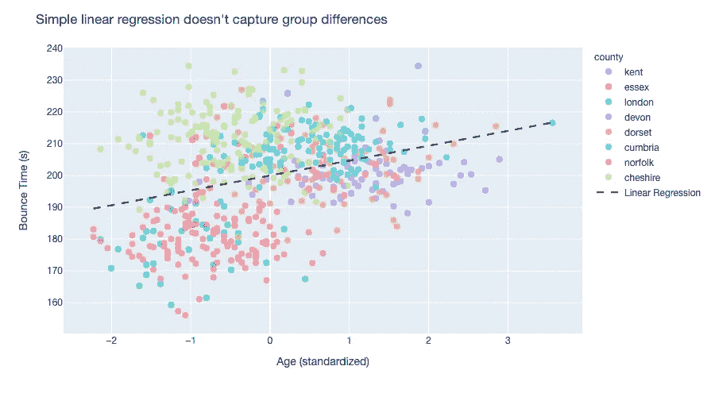*

***我们也可以考虑更复杂的模型，比如线性混合效应模型。**同样，通过一些 EDA，我们看到这种模型可以更好地捕捉群体可变性，因此可能是更好的策略。我们可以使用`seaborn.lmplot`或 ggplot2 的`geom_smooth`快速构建一些直观的 EDA 图。这里**看起来变截距和变截距/变斜率模型可能是很好的研究对象。**(我们的 EDA 还揭示了一个[辛普森悖论](https://en.wikipedia.org/wiki/Simpson%27s_paradox)的例子，其中一条全局回归线与单个县的趋势不匹配。)*

*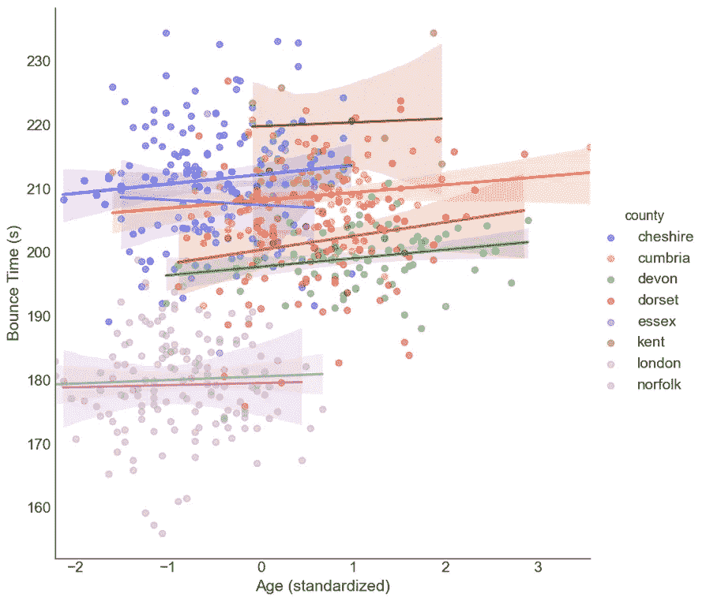*

*我们将继续进行**三个候选模型:线性回归、随机截距模型和随机截距+斜率模型。**
(简单的线性模型被视为基线，有助于举例说明建模过程。)*

# *步骤 2:在一些虚假数据的帮助下选择先验*

> *注意:在这一点上，我假设你熟悉贝叶斯推理，不会深入到它的主要组成部分。如果你不是，停下来，去看看上面推荐的阅读材料。*

*贝叶斯推理要求我们在完全定义我们的模型之前为我们的参数选择*先验分布(“先验”)*。与其使用*********先验信息，还不如选择******先验信息。****************

*但是你如何定义什么是“弱”先验呢？*

> *好的弱信息先验考虑了你的数据和被问到的问题，以生成可信的数据集。*

*定义弱信息先验的一个常用策略是根据你的可能性和先验组合创建一个模拟数据的“活页本”。(该程序被称为*预先预测检查*。)不要将先验视为独立的(边缘)实体，用它们模拟数据可以让我们了解它们如何与可能性相互作用，以及这对先验是否会生成**似是而非的数据点。***

*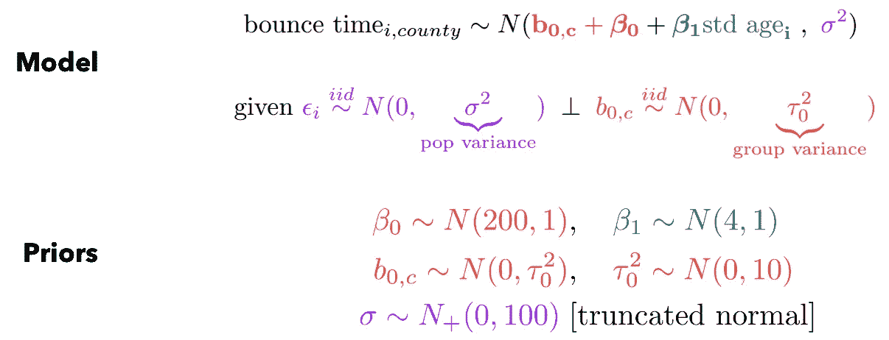*

*我们的变截距模型和先验的概率定义*

*例如，让我们尝试为我们的*随机截距模型参数* (β0、β1、B0、τ0 和σ)选择弱先验，并模拟一些数据。*

*我通过一种迭代策略选择了上述先验，这种策略将 EDA 步骤中关于人口和群体趋势的信息与特定群体的经验均值和方差估计相结合(见下文)。你必须根据你自己的数据和正在考虑的问题来探索一些选择。*

***R 模拟***

## ***Python 模拟***

> ***定义弱信息先验的常用策略是创建模拟数据的“翻页书”(也称为先验预测检查)。***

*下面是一本电子书的例子( ***左动画*** )。**我们看到大多数模拟数据点都是“合理的”，**这意味着我们看到大多数假数据点都在我们当前的反弹率范围内(≈160–250)。其他数据超出了我们的数据范围，但仍在可信范围内(例如，高达 500–600 秒)。相反，如果我们使用**通用*弱先验***[例如 N(0，100)和 Inv-Gamma(1，100)]，我们会看到许多模拟的反弹率< 100 秒。甚至是< 0，这显然是概率较小的( ***右*** )。*

*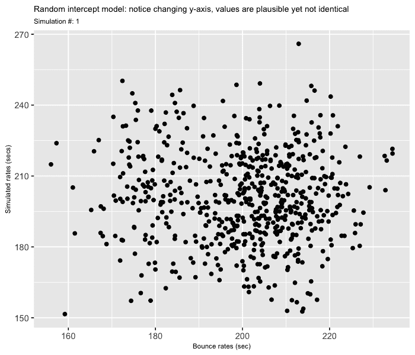**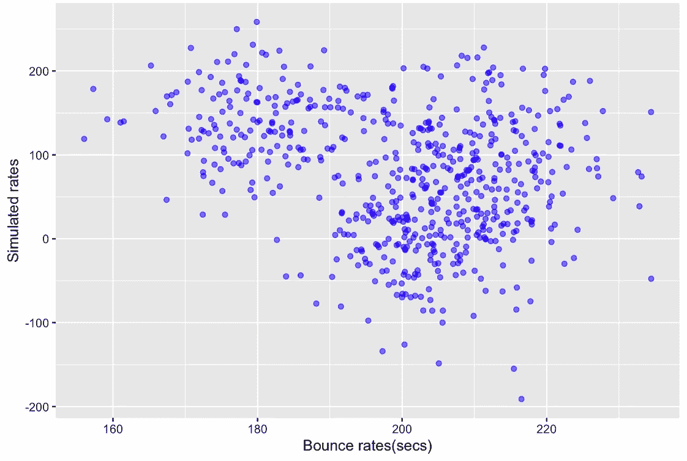*

*如果你有兴趣了解更多关于如何选择优先[的信息，请查看 Stan 开发团队的资源页面。](https://github.com/stan-dev/stan/wiki/Prior-Choice-Recommendations)*

# *步骤 3:拟合贝叶斯模型*

*在前面的步骤中已经选择了一些合理的*弱先验*，我们现在可以专注于从步骤 1 构建我们的候选模型。正如我在本文开头提到的，R 和 Python 中有**现有的库可以大大简化拟合贝叶斯线性混合模型。***

## ***1)** `[**brms**](https://paul-buerkner.github.io/brms/index.html)**: an**` **运行在** [**Stan**](https://mc-stan.org/) 上的 R 包*

*如果你熟悉`lme4`和`lmer`函数的公式生成器，那么你已经成功了 90%。是的，就这么简单！除了一些指定贝叶斯设置的附加选项，`brms`提供了简单明了的功能。如果你深入了解它的所有功能——拟合 gam，模拟高斯过程，甚至通过`mice`输入数据，这是一个出色的库。我不会在这里讨论这些，但是我鼓励你多读一些。*

*下面是使用我们的反弹时间数据，用`brms`实现变截距模型的例子。首先，该软件包通过内置函数`prior`使定义先验变得容易，该函数将分布分配给选定的模型参数类、组或系数(`prior(distribution(...), class=..., group=..., coef=...)`)。例如，我们可以将截距的法线先验设置为`prior(normal(...), class=Intercept)`。您可以使用内置函数`get_prior()`来了解如何设置这些标志。类似地，您可以从[广泛的可用分布](http://mc-stan.org/rstanarm/reference/priors.html)中选择先验。*

*接下来，您可以用`brm`函数拟合模型，该函数提供了与`lmer`类似的公式生成器和选项。你可以进一步[修改贝叶斯方法特有的选项](https://paul-buerkner.github.io/brms/reference/brm.html)比如要运行的 MCMC 链的数量和运行长度。*

*从模型中提取基本信息很简单。该库提供打印与模型拟合`summary()`和后验估计`posterior_summary()`相关的模型概要的功能。*

> ***注:**使用`bounce_time ~ 1 + std_age`公式时，BRMS 假设预测值为**均值居中**。如果你的预测不是以均值为中心，你应该使用`bounce_time ~ 0 + intercept + std_age`来代替。你可以[在这里](https://cran.r-project.org/web/packages/brms/brms.pdf)(第 38-39 页)阅读更多内容*

## *2)运行在[和](https://docs.pymc.io/PyMC3_and_Theano.html)上的 PyMC3 `: a Python library`*

*尽管有多种库适合贝叶斯模型，但 PyMC3 无疑提供了 Python 中最用户友好的语法。虽然新版本正在开发中(PyMC4 现在运行在 Tensorflow 上)，但这个库中的大多数功能将在未来的版本中继续工作。*

> ***与 R 中的** `**brms**` **包相比，P** `**yMC3**` **要求你显式地陈述模型的每个单独的组件——从先验到似然。***

**

*完整的规范并不像听起来那么糟糕。一旦您指定了模型(如左图所示),使用上下文管理器来构建就变得简单了。*

*嗯，大部分时间😉。*

> *对这个包唯一的警告是你的模型的参数化会对它的采样效率有很大的影响。*

*例如，下面的模型代码使用了与上面所示模型略有不同的参数化(即[居中参数化](https://twiecki.io/blog/2017/02/08/bayesian-hierchical-non-centered/))。*

*首先，我们用上下文管理器和`pm.Model()`方法初始化模型。这将基本上封装一个模型的变量和可能性因素。接下来，我们可以开始使用[多种内置分布](https://docs.pymc.io/api/distributions.html)为我们的每个组件(先验、超先验和似然)分配分布。*

*建立模型分布很简单。首先通过`pm.your_distribution_class()`定义你想要使用的分布类，然后给它分配一个标签并修改它的分布参数，最后把它分配给一个*上下文变量* (例如`beta1=pm.Normal('std_age', mu=mu0, sigma=tau0)`用标签`std_age`和参数`mu0`和`tau0`把`beta1`定义为普通的)。*

*一旦你的模型组件被设置好，你只需要设置`pm.trace()`函数来存储你的后验样本。与`brms`类似，您还可以进一步[修改贝叶斯方法的特定选项](https://docs.pymc.io/api/backends.html)，例如要运行的 MCMC 链的数量和运行长度。*

*由于 PyMC3 依赖于`arviz`进行事后可视化，因此有必要将模型输出保存为`InferenceData`类型，以便以后在模型诊断和事后检查中使用。*

*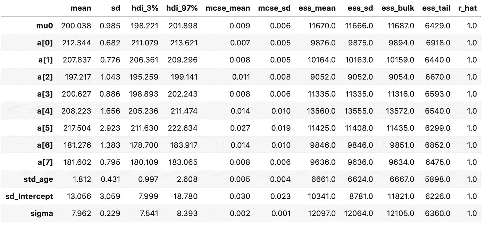*

*上述随机截距模型的输出；alpha 表示特定于县的拦截*

# *步骤 3.a: MCMC 诊断*

*唷！这是很多信息。然而，没有一些好的诊断，任何建模努力都是不完整的。(注意:模型检查、评估和比较也是这个过程的一部分，但是我会在另一篇文章**中更详细地介绍它们。)***

***传统上，两种诊断可视化方法——MCMC 迹线图和自相关函数(ACF)图——有助于我们了解采样是否存在问题。换句话说，我们的样本以及我们的推论有多可靠？这些工具诉诸于马尔可夫链的一些理论属性，并且是理解马尔可夫链性能的良好的检查。然而，`brms`和`pymc3`使用先进的 MCMC 方法，这些方法提供了额外的诊断，可以更精确地了解它们的性能。***

> ***除了常规诊断之外，其他方法也可用于高级技术，如[哈密尔顿蒙特卡罗](https://en.wikipedia.org/wiki/Hamiltonian_Monte_Carlo) (HMC)，可以提供更详细的马尔可夫链性能图。***

***让我们深入了解一个实施传统和 HMC 相关诊断的示例。***

## ***传统 MCMC 诊断***

***上面强调的两个常见的可视化帮助我们理解***

1.  ***马尔可夫链具有[良好的混合](https://en.wikipedia.org/wiki/Markov_chain_mixing_time)(即似乎已经收敛到稳态分布)***
2.  ***样本不违反[马尔可夫特性](https://en.wikipedia.org/wiki/Markov_property#:~:text=A%20stochastic%20process%20has%20the,is%20called%20a%20Markov%20process.)(例如自相关在滞后 1 之后消失)***

*****在 R** 中，您可以使用适合您的模型使用`bayesplot`中的`mcmc_trace`和`mcmc_acf`功能轻松生成这些。***

***线性回归示例***

***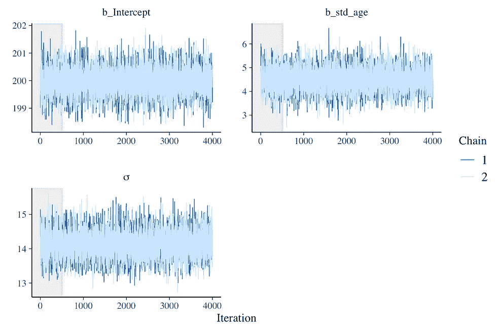******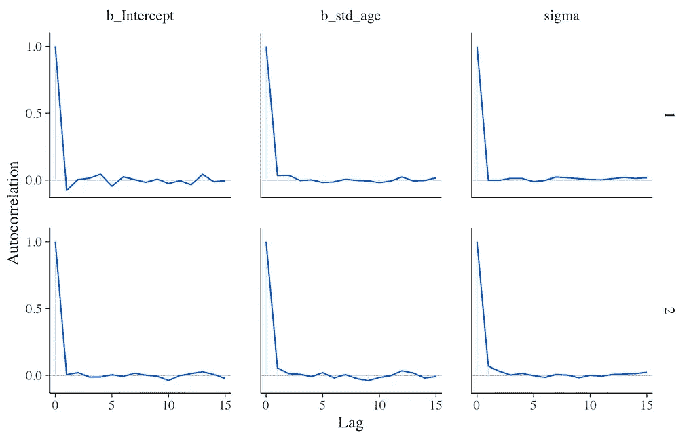***

***R 中线性回归模型的跟踪图(左)和自相关图(右)***

***Python `pymc3`中的**有一个内置的集成，通过`arviz`来可视化这些，你只需要模型中指定的 trace 对象。*****

***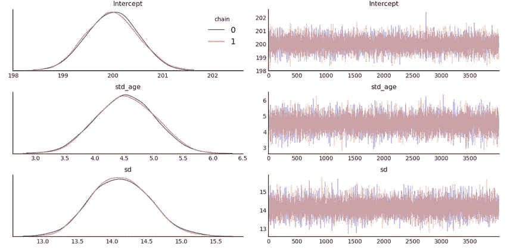******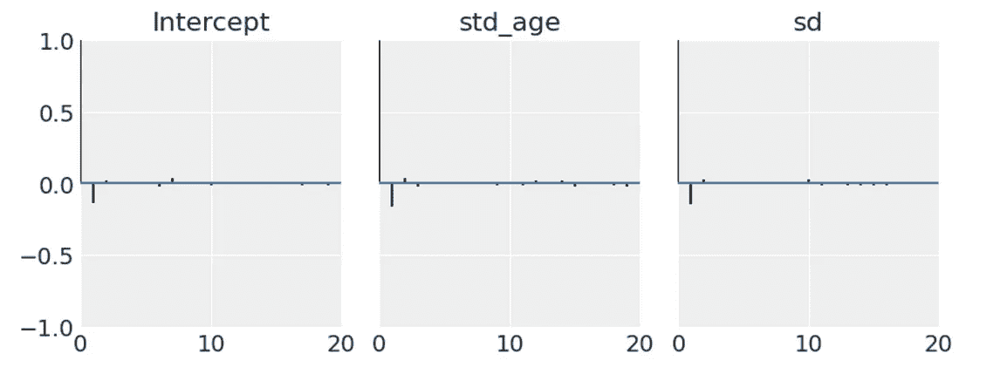***

***Python 中线性回归模型的追踪图(左)和自相关图(右)***

## ***哈密尔顿蒙特卡罗诊断***

***如上所述，哈密顿蒙特卡罗提供了我们可以使用的额外诊断。`pymc3`和`brms`都运行在一个叫做[不掉头采样](http://www.stat.columbia.edu/~gelman/research/published/nuts.pdf)的非常高效的 HMC 采样器上。***

***这里粗一句话，高级总结:***

> ***HMC 使用一阶梯度来指导有用方向上的采样，这有助于它比传统的 MCMC 方法更快地收敛到后验，并且 NUTS 动态更新可以影响 HMC 性能的参数(即，步长ε和步数 L)。***

***坚果，对不对？！(希望大家能原谅不好的双关语)。为了澄清最后一点，考虑一下在类似梯度的更新方面发生了什么，例如，如果你选择的步长太小或步长数太高，你可能会浪费计算时间。虽然这是一个有用的类比，但该算法如何工作的细节更加复杂和优雅。***

***回到“那又怎样，伙计？”嗯，在链没有混合或者 ACF 显示出对样本的更高依赖性的情况下，很难诊断发生了什么。***

***然而，如果你使用 HMC 或坚果，你可以看看****发散过渡，这可以帮助你了解你的后臀的几何形状(！！)**。当建议的下一步偏离采样器设定的最有效路径时，就会出现这些问题。*****

> *****发散是强有力的诊断，它允许你理解后几何。*****

*****想象这些可以**在两个方面有所帮助:*******

1.  *******检测您的采样器在穿越后部“景观”时遇到困难的“位置”**(可能是由于局部高度可变性或弯曲的几何形状)。在这种情况下，您可以考虑重新参数化您的模型，以“平滑”那些高曲率区域。*****
2.  *******排除“假阳性”偏差**(标记的偏差转换与非偏差转换表现相同)*****

*****下面的例子说明了发散如何帮助识别链被“卡住”或被错误标记为发散 ***(绿色)*** 。在左图和右图中，绿色点或线高度集中的区域表明存在收敛问题(即，您可以在下面的`tau`中看到这种漏斗状集中)。在这里，采样器不能充分探索由`tau`定义的后部区域，因此我们对`tau`的推断是不可靠的。相反，在轨迹被错误地标记为发散但表现得像非发散轨迹的情况下，我们也可以获得其他参数推断的置信度(例如`theta1,...,theta8`)。*****

*****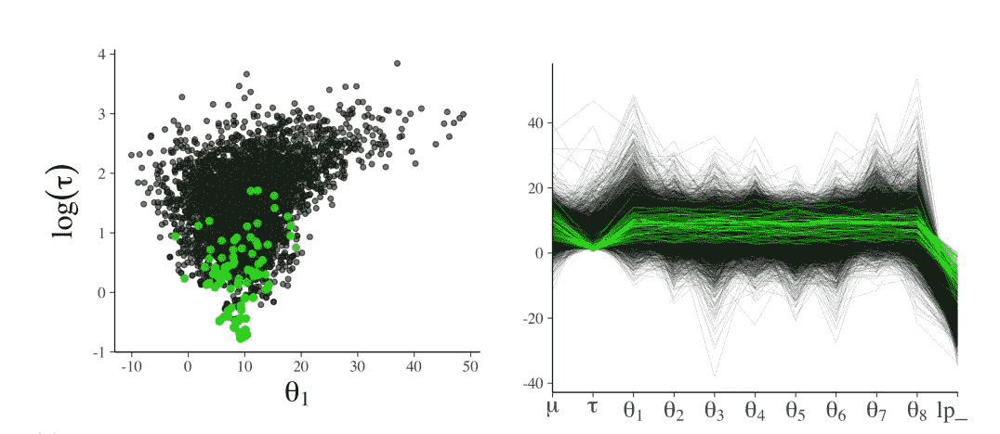*****

*****Gabry，Jonah 等人(2019 年)*****

*****要了解更多关于解释这些强有力的诊断图的信息，请查看迈克尔·贝当古的这篇文章。要在 **R 中运行该诊断，使用`bayesplot`中的** `**mcmc_scatter**` **功能**。*****

*****在 **Python** 中你可以使用`plot_parallel` PyMC3 内置函数。*****

*****在这种情况下，我们可以看到没有任何像上面看到的发散轨迹，因此我们的链毫无困难地探索了后面的几何形状(即收敛)。*****

*****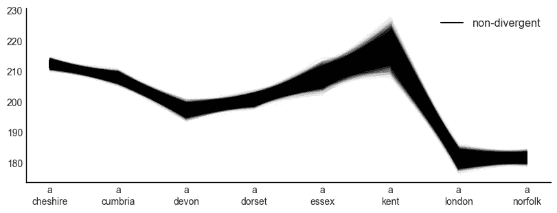**********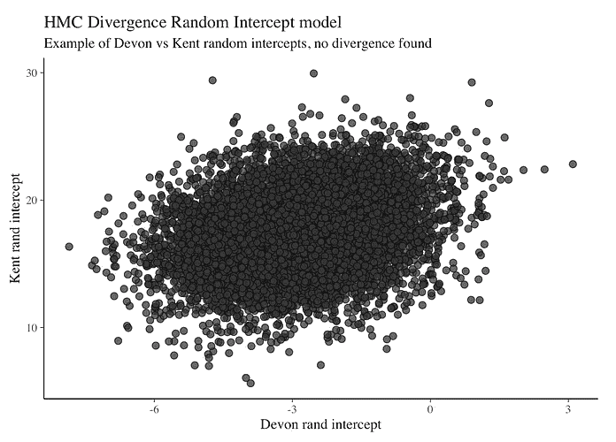*****

*****Python(左)和 R(右)中的不同诊断*****

# *******结论*******

*****像`pymc3`和`brms`这样的软件包极大地简化了贝叶斯模型的拟合。然而，实现更简单并不意味着我们应该忘记建模过程中的关键步骤，这些步骤可以帮助我们构建更好的模型。*****

*****我希望你已经学会了一些选择好的先验分布的新方法，如何对贝叶斯混合模型进行故障诊断，以及为什么 EDA 可以是一个强大的工具(不仅仅是在贝叶斯设置中)。*****

*****最后，我的希望是让人们不要因为“它们听起来很难”而回避贝叶斯方法，而是为他们提供可以添加到他们的工具集中的新方法。*****

# *****参考*****

1.  *****Gelman，a .，Carlin，J. B .，Stern，H. S .，Dunson，D. B .，Vehtari，a .，和 Rubin，D. B. (2013 年)。贝叶斯数据分析。CRC 出版社。*****
2.  *****盖布里、乔纳等人，《贝叶斯工作流程中的可视化》*英国皇家统计学会杂志:A 辑(社会中的统计学)*182.2(2019):389–402。*****

*****如果你喜欢这篇文章，请随意分享！如果您有任何问题，或者您看到任何不正确/有问题的内容，请发表评论或发推文( [@ecoronado92](https://twitter.com/ecoronado92) )。*****

*****所有的 R 代码都可以在[这里找到](https://htmlpreview.github.io/?https://github.com/ecoronado92/towards_data_science/blob/master/hierarchical_models/bayes_lmm/R/bayesian_linear_mixed_model.html)*****

*****所有的 Python 代码都可以在[这里找到](https://github.com/ecoronado92/towards_data_science/blob/master/hierarchical_models/bayes_lmm/python/bayesian_linear_mixed_effects.ipynb)*****

***** [## ecoronado 92/走向 _ 数据 _ 科学

### 报告包含的材料和例子实施贝叶斯线性混合效应(层次模型)模拟…

github.com](https://github.com/ecoronado92/towards_data_science/tree/master/hierarchical_models/bayes_lmm)  [## 当混合效应(分层)模型失败时:汇集和不确定性

### 一个直观和可视化的指南，其中部分池变得麻烦，贝叶斯方法可以帮助量化…

towardsdatascience.com](/when-mixed-effects-hierarchical-models-fail-pooling-and-uncertainty-77e667823ae8)  [## 在 R/Python 中评估贝叶斯混合模型

### 了解“后验预测检查”的含义以及如何直观地评估模型性能

towardsdatascience.com](/evaluating-bayesian-mixed-models-in-r-python-27d344a03016)*****