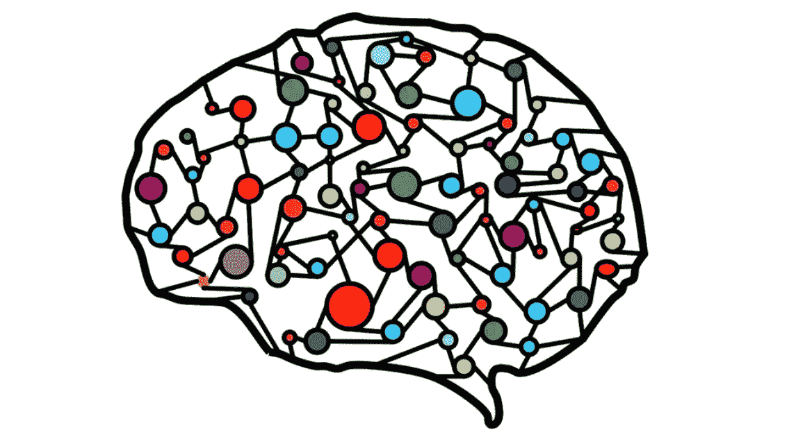
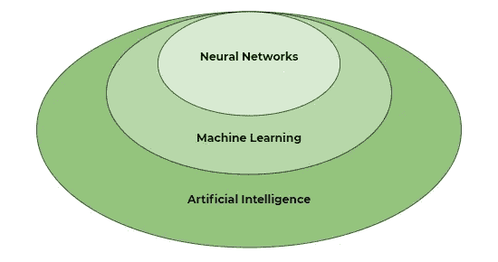
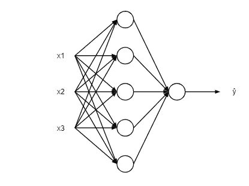
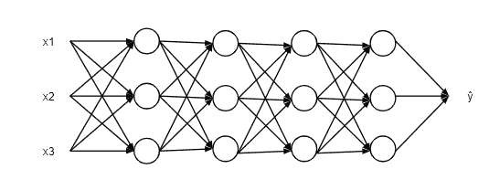
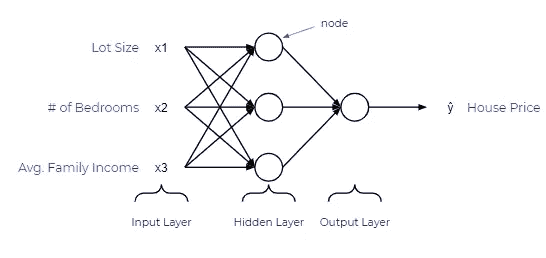
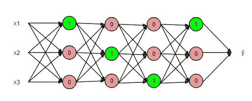

# 对神经网络如何工作的初学者友好的解释

> 原文：<https://towardsdatascience.com/a-beginner-friendly-explanation-of-how-neural-networks-work-55064db60df4?source=collection_archive---------6----------------------->

## 五岁儿童理解神经网络基础知识

图片由[皮克斯拜](https://pixabay.com/?utm_source=link-attribution&utm_medium=referral&utm_campaign=image&utm_content=3501528)的[艾哈迈德·加德](https://pixabay.com/users/ahmedgad-9403351/?utm_source=link-attribution&utm_medium=referral&utm_campaign=image&utm_content=3501528)拍摄

# 目录

1.  前言
2.  人工智能、机器学习和神经网络
3.  基本神经网络的机制
4.  神经网络的类型
5.  神经网络应用

# 前言

几周前，当我开始学习神经网络时，我发现对于这样一个复杂的主题来说，介绍性信息的质量是不存在的。我经常读到神经网络是模仿大脑的算法，或者具有类似于*大脑的*结构，这并没有真正帮助我。因此，本文旨在以任何人都可以理解的方式教授神经网络的基础知识，尤其是那些机器学习的新手。

# 人工智能、机器学习和神经网络

在了解什么是神经网络之前，我们需要先退几步，了解什么是人工智能和机器学习。

## 人工智能和机器学习

同样，这令人沮丧，因为当你谷歌人工智能的意思时，你会得到类似“它是机器对人类智能的模拟”的定义，尽管这可能是真的，但它可能会对新学习者产生误导。

从最简单的意义上来说，**人工智能(AI)** 指的是赋予机器或软件基于预定义的规则或模式识别模型做出自己决定的能力的想法。*模式识别模型*的想法导致了**机器学习**模型，这是一种基于样本数据建立模型的算法，可以对新数据进行预测。注意，机器学习是人工智能的一个子集。

有许多机器学习模型，如线性回归、支持向量机、随机森林，当然还有神经网络。这让我们回到了最初的问题，什么是神经网络？

## 神经网络

从根本上来说，**神经网络本质上是数学方程的网络**。它接受一个或多个输入变量，并通过一个方程式网络，产生一个或多个输出变量。你也可以说一个神经网络接受一个输入向量并返回一个输出向量，但是我不会在本文中讨论矩阵。

# 基本神经网络的机制

再说一次，我不想太深入地了解其中的机制，但是向您展示一个基本神经网络的结构是什么样子是值得的。

在神经网络中，有一个**输入层**，一个或多个**隐藏层**，以及一个**输出层**。输入层由一个或多个**特征变量**(或输入变量或独立变量)组成，表示为 x1，x2，…，xn。隐藏层由一个或多个隐藏**节点**或隐藏单元组成。节点就是上图中的一个圆圈。类似地，输出变量由一个或多个输出单元组成。

给定的层可以有许多节点，如上图所示。

同样，给定的神经网络可以有许多层。通常，更多的节点和更多的层允许神经网络进行更复杂的计算。

上面是一个潜在的神经网络的例子。它有三个输入变量，批量、卧室数量和平均。家庭收入。通过向这个神经网络提供这三条信息，它将返回一个输出，房价。那么它到底是如何做到这一点的呢？

就像我在文章开头说的，神经网络只不过是一个方程网络。神经网络中的每个节点由两个函数组成，一个线性函数和一个激活函数。这是事情变得有点混乱的地方，但是现在，把线性函数想成一些最佳拟合线。另外，把激活功能想象成一个电灯开关，它会产生一个介于 1 或 0 之间的数字。

发生的情况是，输入特征(x)被馈入每个节点的线性函数，产生值 z。然后，值 z 被馈入激活函数，激活函数确定灯开关是否打开(在 0 和 1 之间)。

因此，每个节点最终确定下一层中的哪些节点被激活，直到它到达输出。从概念上讲，这是神经网络的本质。

如果您想了解不同类型的激活函数，神经网络如何确定线性函数的参数，以及它如何像“机器学习”模型一样进行自学，您可以在网上找到专门针对神经网络的完整课程！

# 神经网络的类型

神经网络发展如此之快，以至于现在有几种类型的神经网络，但下面是你可能经常听说的三种主要类型的神经网络。

## 人工神经网络

人工神经网络(ann)就像上面图像中的神经网络，它由一组连接的节点组成，这些节点接受一个或一组输入并返回一个输出。这是最基本的神经网络类型，如果你上过课的话，你可能会首先学到。人工神经网络由我们讨论过的所有内容以及传播函数、学习率、成本函数和反向传播组成。

## 卷积神经网络(CNN)

卷积神经网络(CNN)是一种使用称为**卷积**的数学运算的神经网络。[维基百科将卷积](https://en.wikipedia.org/wiki/Convolution)定义为对两个函数进行数学运算，产生第三个函数，表达一个函数的形状如何被另一个函数修改。因此，CNN 在其至少一层中使用卷积而不是一般的矩阵乘法。

## 递归神经网络(RNN)

递归神经网络(RNNs)是一种人工神经网络，其中节点之间的连接沿着时间序列形成一个[有向图](https://en.wikipedia.org/wiki/Directed_graph)，允许它们使用内部存储器来处理可变长度的输入序列。由于这一特性，rnn 在处理序列数据方面表现出色，如文本识别或音频识别。

# 神经网络应用

神经网络是强大的算法，它带来了一些以前不可能实现的革命性应用，包括但不限于以下内容:

*   **图像和视频识别**:由于图像识别功能，我们现在有了像安全面部识别和 Bixby 视觉这样的东西。
*   推荐系统:有没有想过网飞总是能够推荐你真正喜欢的节目和电影？他们很可能利用神经网络来提供这种体验。
*   **音频识别**:如果你没有注意到的话，“OK Google”和 Seri 在理解我们的问题和我们说的话方面已经变得非常好了。这一成功可以归功于神经网络。
*   **自动驾驶**:最后，我们在完善自动驾驶方面的进步很大程度上要归功于人工智能和神经网络的进步。

# 摘要

总结一下，以下是要点:

*   神经网络是一种机器学习模型或机器学习的子集，机器学习是人工智能的子集。
*   神经网络是一个方程网络，它接受一个输入(或一组输入)并返回一个输出(或一组输出)
*   神经网络由各种组件组成，如输入层、隐藏层、输出层和节点。
*   每个节点由一个线性函数和一个激活函数组成，最终决定了下一层中的哪些节点被激活。
*   有各种类型的神经网络，如 ann、CNN 和 RNNs

# 感谢阅读！

## 特伦斯·申

*创始人*[*ShinTwin*](https://shintwin.com/)*|我们来连线一下*[*LinkedIn*](https://www.linkedin.com/in/terenceshin/)*|项目组合这里是***。**