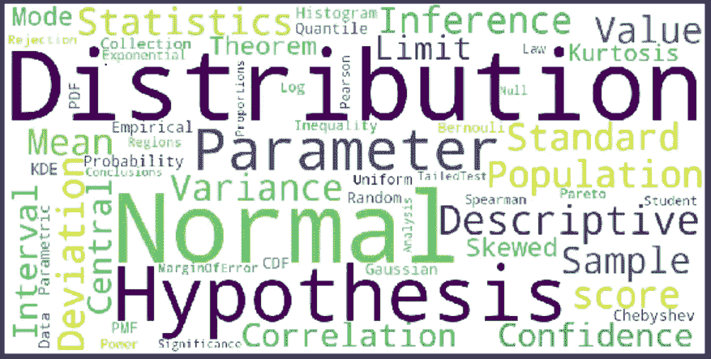
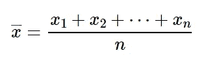
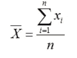
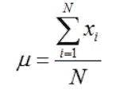
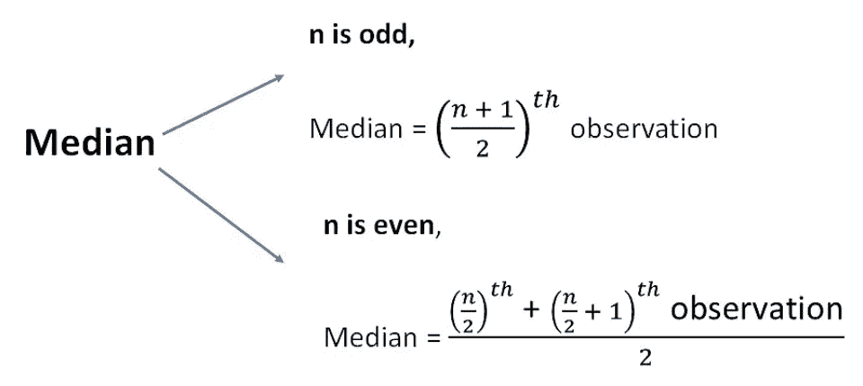
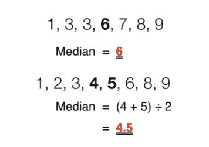
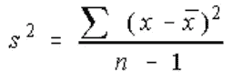
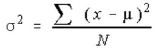
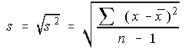

# 数据科学统计学入门指南第一部分

> 原文：<https://towardsdatascience.com/a-beginner-guide-to-statistics-for-data-science-part-i-741f4d92560b?source=collection_archive---------42----------------------->

## 统计的内容、原因和方式

使用 python 中的 WordCloud 创建， [Github 代码](https://github.com/mringupt/Colab/blob/master/CreateWordCloud.py)

什么是统计学？我们为什么需要统计数据？如何用统计学做数据分析？什么是人口？为什么我们有样本？…….这样的例子不胜枚举。嗯，这些是初学者在第一次尝试进入这个领域时会问的少数几个问题。在这篇文章和接下来的文章中，我将以一种超级简单的方式解释统计学的基本概念。敬请关注！！

**什么是统计？**

根据维基百科，“ [**统计学**](https://en.wikipedia.org/wiki/Statistics) 是一门关于数据收集、分析、解释和呈现的数学科学。”

这是一门从数据中学习并做出决策的科学。不多不少。

**我们为什么需要统计数据？**

我们生活在数字时代，在每一点上，我们都在产生数据，即信息。这些信息中的大部分都是通过使用统计学进行数学解释的。例如，如果你在谷歌上搜索一个印度人的平均身高，它会显示 5 英尺。怎么会？你认为他们问过所有 13.3 亿人吗？嗯，这很难要求(考虑到时间、金钱和资源)……那他们怎么会说印度人的平均身高是 5 英尺。这都是因为统计学及其各种解读感兴趣人群的方法。

统计学提供了更好地理解数据的工具。如果使用得当，统计数据可以告诉我们过去发生的任何趋势，并有助于预测未来可能发生的事情。

统计学中首要的事情是理解人口和样本的含义，以及它们之间的区别。

*   **人群:**通俗地说，人群包括每个人和你感兴趣的每个人。例如，如果您对某个特定国家(比如印度)的平均体重感兴趣，那么该国的每个人都属于您的人口数据。
*   **样本:**随机选取的总体子集。统计的唯一目的是发现关于人口的一些重要的东西，但是考虑到人口的规模，获得整个人口的数据是不切实际的，并且需要大量的资源和时间。所以通常我们会收集一个代表总体的样本。

通常，统计分为两部分:

1.  **描述性统计**:描述数据(样本/可见数据)或通过数值计算或图形或表格对数据进行总结的统计部分。举个例子，假设你有一个 100 人的班级在学习物理。现在你可能会对这些学生在期中的整体表现感兴趣。描述统计学允许我们这样做。
    然而，描述性统计不允许得出数据以外的结论(关于人口)。它只是简单地说明你有什么数据。

    通常，有两种类型的统计用于描述数据:

*   **集中趋势的测量:**这些是描述数据中心位置的方法，即一个单一的值，它告诉我们数据的中心在哪里。数据的中心位置可以用 ***表示*** 、 ***方式、*** 和 ***中值*** 来描述。
*   **分布度量:**这些是通过描述数据在集中趋势上的分散程度来总结数据的方法。例如，我们 100 名学生在测试中的平均分数可能是 80 分。但是，并不是所有的学生都会有 80 分。相反，他们的分数会分散开来。有些会高于 80，有些会更低。分布的度量帮助我们总结数据围绕中心趋势的分散程度。为了描述这种差异，可以使用几种统计数据，包括 ***方差**标准差**四分位数*** 等。

**2。推断统计**:它是统计的一部分，根据从总体中抽取的样本得出关于总体参数的结论，如平均值、众数、中位数。因此，样本准确地代表总体是很重要的。它包括抽样和假设检验。例如，你有 100 名学生学习物理的分数数据。你想总结一个城市所有学习物理的学生的分数，推理统计可以帮助你实现这个目标。

**平均值**

它是所有数据点的平均值。如果有 *n* 个数据点 *x1，x2，x3，…，xn* ，那么数据的平均值将为

样本均值公式

**x̅** (x-bar)代表统计中的样本均值。
上述公式也可以用希腊符号**σ**(sigma)来表示

样本均值公式

同样，当我们计算大小为 ***N*** 的总体的平均值时，它被称为总体平均值，用 **μ** (mu)表示

人口平均数公式

**中间值**

它是分隔数据样本的上半部分和下半部分的值。排序时，它是数据的中点。

要计算 n 个数据点的平均值，只需对数据进行排序，找到中间的元素。可能有两种不同的情况:

图片来源:[https://www.teachoo.com/](https://www.teachoo.com/8364/2738/Median/category/Median/)

例如:

图片来源:[维基百科](https://en.wikipedia.org/wiki/Median)

与平均值相比，使用中位数描述数据的主要优点是用于偏斜数据(存在异常值的数据，异常值是指与大多数观察值不同的值。这些或者是自然发生的，由于设备故障，或者是由于输入错误。).在数据有偏差的情况下，中位数更准确地描述了数据。

例如，考虑一下美国个人的收入。如果你把比尔·盖茨的收入作为样本中的一个数据点，这个数据是高度倾斜的，因为与美国任何正常人相比，比尔·盖茨的收入都是巨大的，这使得数据高度倾斜。因此，在这种情况下，通过平均值描述您的数据将不是一个近似的选择，因为平均值将主要代表比尔盖茨的工资。因此，收入中值将是代表美国个人收入的更好方式。

**模式**

它是数据集中最常见的值，即在数据中出现频率更高的值。比如样本[1，3，3，3，3，6，6，6，7，7，7，7，7，12，12，17]的众数是 7。该模式是最容易理解和快速可见的。日常生活中的许多决定都是基于模态概念做出的，比如去大多数人去的地方看电影，或者选择大多数人买的冰淇淋类型。

如果数据包含多个出现频率最高的值，则您有一个多模态分布。如果没有值重复，则数据没有模式。通常，您可以对分类数据、序号数据和离散数据使用该模式。

模式是可用于分类数据(分为不同类别的数据点)的唯一集中趋势测量方法，例如印度最受欢迎的旅游地点。

**均值/众数/中位数用哪个？**

这完全取决于你有什么类型的数据。如果您的数据是对称的，平均值是描述数据中心的最佳值。如果你的数据是高度倾斜的，使用中位数；如果你的数据是绝对的，使用众数。

**差异**

它是平均离差的平方。高方差意味着数据高度分散，而小方差意味着数据紧密聚集。总体方差用σ表示，而样本方差用 s 表示。

让我们考虑 n 个元素的样本总体，x1，x2，…，xn。用样本人口的平均值 **x̅.**数据的样本方差是样本均值和每个数据值之间的平均平方距离。

样本总体方差公式

同样，对于人口方差

人口方差公式

为什么有 n-1 个欠样本方差计算？*样本方差始终小于总体方差，因此，自由度被视为转换因子。这就是所谓的* [**贝塞尔修正**](https://en.wikipedia.org/wiki/Bessel%27s_correction) **。**

**标准偏差**

就像方差一样，标准差也是数据点相对于平均值的分布的度量。唯一的区别是它是方差的平方根。这使得它具有与数据相同的单位，从而便于从洞察力中理解解释。总体标准差用σ表示，而样本标准差用 s 表示。

样本标准差公式

与均值相似，标准差也受异常值和偏斜分布的影响很大。

为什么测量标准差而不是方差？

*   *因为标准差与原始* *观察值具有相同的单位。*
*   *它是高斯(正态)分布中传播的自然量度。*

目前就这些。请继续关注下一篇文章，了解其他有用的概念。快乐学习😊。