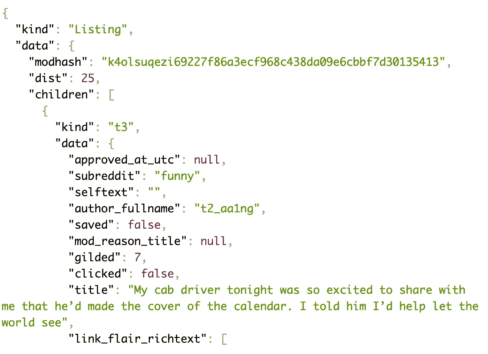
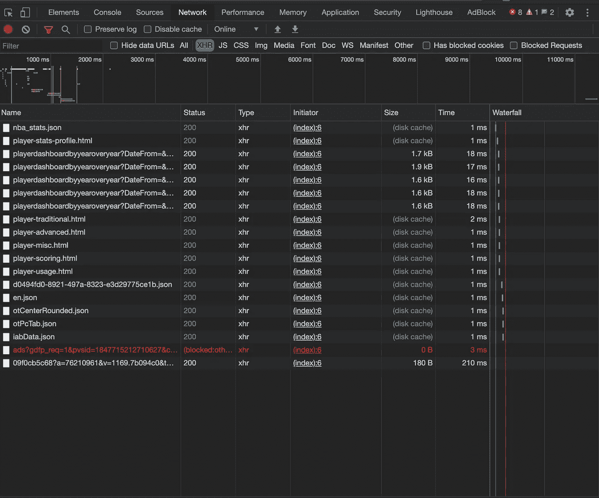

# 使用 Web APIs 访问数据的初学者指南(使用 Python)

> 原文：<https://towardsdatascience.com/a-beginners-guide-to-accessing-data-with-web-apis-using-python-23d262181467?source=collection_archive---------28----------------------->

## 利用 web APIs 的强大功能，为您的数据科学项目挖掘丰富的结构化数据源


照片由[安朵斯·瓦斯](https://unsplash.com/@wasdrew?utm_source=medium&utm_medium=referral)在 [Unsplash](https://unsplash.com?utm_source=medium&utm_medium=referral)

# 文章大纲

1.  什么是 API？什么是 web API，它与数据科学有什么关系？
2.  API 请求的剖析
3.  发掘 Reddit 的秘密——使用 Python 的 Reddit web API 演练
4.  用开发工具发现隐藏的 API
5.  API 礼仪和最佳实践

# 什么是 API？

如果你曾经花时间在编程、数据科学或 web 开发上，你可能会遇到“API”这个术语。即使对一个完全外行的人来说，这个术语也可能耳熟能详。无论您是否熟悉这个概念，您每天都要与 API 进行交互，因为它们在最近几年已经变得无处不在，并且为您可能会发现不可或缺的许多平台和服务提供了便利。

根据字面定义，API 是一个应用程序编程接口。它是一种媒介，不同的应用程序可以通过它以编程的方式相互通信。

举个具体的例子，考虑一下登录一个 app 比如 Medium 的过程。你可以选择使用谷歌或脸书登录。在这种情况下，Medium 应用程序通过谷歌或脸书开发的 API 访问你的用户数据。这种 API 被许多应用程序和平台广泛使用，这减少了应用程序创建者的开发时间，并增加了最终用户的易用性。

API 也有助于数据科学家，因为它们是从各种服务和平台访问大量结构化数据的直接途径。例如，TMDB 的 API 允许用户找到关于电影和表演的信息，而[的 Spotify API](https://developer.spotify.com/documentation/web-api/) 给你提供关于他们歌曲的深度信息(比如“danceability”和“valence”)，你很难通过其他方式找到这些信息。

还有许多其他有趣的事情可以用 API 来做或自动化，这超出了本文的范围。例如，你可以使用 [Spotify 的 API](https://developer.spotify.com/documentation/web-api/) 来编程控制你账户上的音乐播放。您甚至可以将多个 API 连接在一起，让它们协同工作。IFTTT.com[网站](https://ifttt.com/)允许你将 API 链接在一起，以创建基于特定条件触发的小程序。例如，当你收到新的 Twitter 通知时，你可以通过组合相应产品的 API，让你的 Phillips Hue 灯泡改变颜色。

## API 请求的剖析

为了利用 web APIs，我们必须发出一个“请求”。这种请求将通过 HTTP 协议进行。请求本质上是您和远程服务器之间的通信，其中您传达了您试图实现的目标(例如，获取一些数据或创建一个新的博客帖子)。收到请求后，服务器会处理您的请求，提供响应，并在后端执行任何额外的过程，这些过程通常对最终用户是不透明的。

有各种类型的 HTTP 请求，但是出于本文的目的，我将把重点放在“获取请求”上，因为我们的目的是使用 API 来**获取**有用的数据。如果您想了解其他类型请求的更多信息，您可以点击这里查看[。](https://developer.mozilla.org/en-US/docs/Web/HTTP/Methods)

通常，请求将包括以下部分:

*   端点
*   请求类型
*   因素
*   头球
*   响应，响应代码

从广义上讲，当我们提出请求时，我们必须将它指向某个位置。位置或“端点”将由我们试图做的事情或我们请求的信息决定。当我们发出请求时，我们可以传递一组参数，这些参数增加了请求的特定性，还可以传递一些消息头，这将在后面解释。然后，服务器将(希望)提供一个响应(通常以 JSON 形式)和一个响应代码(表明请求是否成功)。

为了更好地说明这个过程，我将使用 Reddit API 和 Python 做一个简单的练习。

# 使用 Reddit API

Reddit API 是由 Reddit 官方创建和维护的，它允许你做任何你能在网站上正常做的事情，比如浏览热门帖子、写评论和提交新的提交内容。出于我们今天的目的，我们将使用 API 来确定任何给定子编辑的前 5 篇帖子，以及与每个帖子相关的一些元数据。在使用新工具时总是这样，在开始编程之前浏览一下官方文档会很有帮助。

我们需要确定的第一件事是**端点**，它从本质上定义了我们到底想要请求什么。在这种情况下，我们想要的端点是 https://www.reddit.com/r/{subreddit_name}/top.json 的“”，因为这将返回属于给定子编辑的顶部帖子。我通过浏览文档找到了这个端点，并选择了一个符合我需要的端点。我们实际上可以在浏览器中查看这个 URL，并看到响应正文如下所示。默认情况下，我们得到的是一大堆相对难以解读的文本。我强烈推荐安装一个 JSON 解析器，比如 JSONViewer for Chrome，它有助于清理 JSON，使它更容易访问。

(JSON 是一种数据存储格式，代表 Javascript 对象表示法，虽然不是 Javascript 的专属。本质上，它是一个包含一系列键值对的长字符串，类似于 Python 字典。当通过 web 传输数据时，JSON 通常是首选的媒介)



JSON 响应的前几行

我们看到的是，在属性“儿童”下，我们得到一个帖子列表。这里的每个帖子都是给定子编辑中排名靠前的帖子之一。在每个帖子的数据中，我们可以找到关于该帖子的更多元数据，例如“gilded ”,这表明该帖子在 Reddit 的说法中是否被授予了“gold”、“title ”,这是该帖子的标题，以及“ups ”,这表明收到的支持票数。

现在，我们希望能够使用 Python 发出这个请求，并打印出我们希望看到的数据。

```
import requests, jsonpayload = {
    'limit': 5,
    't': 'all'
}headers = {
    'User-agent': 'Reddit bot 1.0'
}#For the purposes of demonstration, I will use the /r/funny subredditendpoint = '[https://www.reddit.com/r/funny/top.json'](https://www.reddit.com/r/funny/top.json')r = requests.get(endpoint, headers = headers, params = payload)
r = json.loads(r.content)
```

首先，我们要定义请求的参数。您可以考虑像“过滤器”这样的参数，它修改我们请求的范围。要确定端点可以接受哪些参数，请查看 API 的文档，因为它还会指定任何其他约束/格式要求。在我们的例子中，我们将“limit”参数设置为 5，这意味着我们在响应中只会得到 5 个结果。我们还将“t”参数设置为“all”，这意味着我们希望看到所有时间的热门帖子。我们将所有参数打包到一个名为“有效载荷”的字典中。

接下来，我们为请求头定义一个类似的字典。HTTP 头实质上允许您向服务器传递关于您的请求的附加信息。在我们的例子中，我们不会对标题做太多改动，但是你可以通过这个链接阅读更多关于它们的内容。然而，最好定义一个用户代理，它可以是您想要的任何东西。这是为了避免使用 requests 模块的默认用户代理，因为许多其他人可能正在使用同一个代理，因此可能会阻止您，因为它会认为您正在发出过多的请求。

一旦我们有了头和参数，我们就可以向给定的端点发出请求(使用 requests 模块)，同时使用适当的关键字参数传递头和参数，并将响应存储在名为“r”的变量中。因为响应是 JSON 格式的，所以我们想把它转换成 python 字典，这样我们就可以更容易地操作数据。我们可以使用内置的 json 模块来解析响应内容。

现在我们只剩下一个包含所有 JSON 响应数据的字典。我们现在可以做的是打印每个帖子的一些元数据

```
for i, sub in enumerate(r['data']['children']):
    print(f"{i+1}. {sub['data']['title']}. \n \
          was gilded {sub['data']['gilded']} times \n \
          and was upvoted {sub['data']['ups']} times \n")\------------------------------------------------------------------1\. My cab driver tonight was so excited to share with me that he’d made the cover of the calendar. I told him I’d help let the world see. 
           was gilded 7 times 
           and was upvoted 307860 times 

2\. Guardians of the Front Page. 
           was gilded 17 times 
           and was upvoted 283481 times 

3\. Gas station worker takes precautionary measures after customer refused to put out his cigarette. 
           was gilded 3 times 
           and was upvoted 263008 times 

4\. The conversation my son and I will have on Christmas Eve.. 
           was gilded 23 times 
           and was upvoted 236783 times 

5\. Printers. 
           was gilded 6 times 
           and was upvoted 220424 times
```

显然，这是一个非常简单的例子。但是根据同样的原理，你可以非常快速地访问大量的数据，并将它们存储在熊猫数据框架中，或者将数据导出为 csv 格式以供将来分析。

# 发现“隐藏的”API

有大量的功能性的、有用的和有良好文档记录的 API 供您使用。你可以在[这个链接](https://rapidapi.com/blog/most-popular-api/)看到一些最受欢迎的。然而，有时网站会将 API 用于自己的内部使用，而不是外部用户。这方面的一个例子是 NBA 统计网站。

当你在他们的网站上浏览一个页面，比如[这个，](https://stats.nba.com/player/1628386/)你会得到一堆关于一个 NBA 球员的统计数据。访问这些数据的一种方法是编写一个 web scraper，但这是一个更加耗时和脆弱的解决方案。

但是，如果你打开开发者工具(在 Chrome 中:视图→开发者→开发者工具)，转到网络选项卡(XHR)，然后刷新页面，你会看到网站正在进行一系列 API 调用，以便用相关数据填充页面。



站点在加载时进行的网络调用。如果单击任何给定的请求，还可以查看参数和头，以及其他相关的元数据

其中一项请求如下:

[https://stats.nba.com/stats/playerdashboardbyyearoveryear?date from =&DateTo =&game segment =&last games = 0&league id = 00&Location =&measure type = Base&Month = 0&opponenteamid = 0&Outcome =&PORound = 0&pace adjust = N&PerMode = per game&Period = 0&PlayerID = 1628386&plus MINUS](https://stats.nba.com/stats/playerdashboardbyyearoveryear?DateFrom=&DateTo=&GameSegment=&LastNGames=0&LeagueID=00&Location=&MeasureType=Base&Month=0&OpponentTeamID=0&Outcome=&PORound=0&PaceAdjust=N&PerMode=PerGame&Period=0&PlayerID=1628386&PlusMinus=N&Rank=N&Season=2019-20&SeasonSegment=&SeasonType=Regular+Season&ShotClockRange=&Split=yoy&VsConference=&VsDivision=)

您所看到的基本上是我们在 Reddit 示例中使用的相同的 endpoint + parameters 格式。网站向 https://stats.nba.com/stats/playerdashboardbyyearoveryear 的 T2 发出了一个 API 调用，然后传入了一堆参数(尽管除了 PlayerID 和 Season 之外，它们大部分都是空白的)。

一旦找到这些 API 调用，就可以通过改变参数来尝试编写自己的请求。然而，这种方法的缺点是您需要自己发现所有的端点和参数。幸运的是，至少对于 NBA stats 网站来说，各种在线用户已经为我们记录了[端点和参数](https://github.com/swar/nba_api/tree/master/nba_api/stats/endpoints)。

## API 礼仪和最佳实践

通常，您希望遵循几个最佳实践。尽量不要向 API 发出过多的请求，因为这样做可能会降低服务速度，并导致自己被阻止。通常，尝试每秒发出少于 1 个请求。

此外，通常最好设置一个描述性的和相关的用户代理头，以便 API 主机可以确定问题可能源自何处，并了解谁正在使用他们的服务。

# 结论

总之，使用 API 获取数据是数据科学家工具箱中不可或缺的工具。掌握它们可以让你接触到大量的在线数据，使你能够利用更多不同的数据，促进更复杂的分析。我希望这篇文章对你有所帮助，并希望你在编写自己的请求时有乐趣！