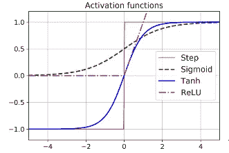
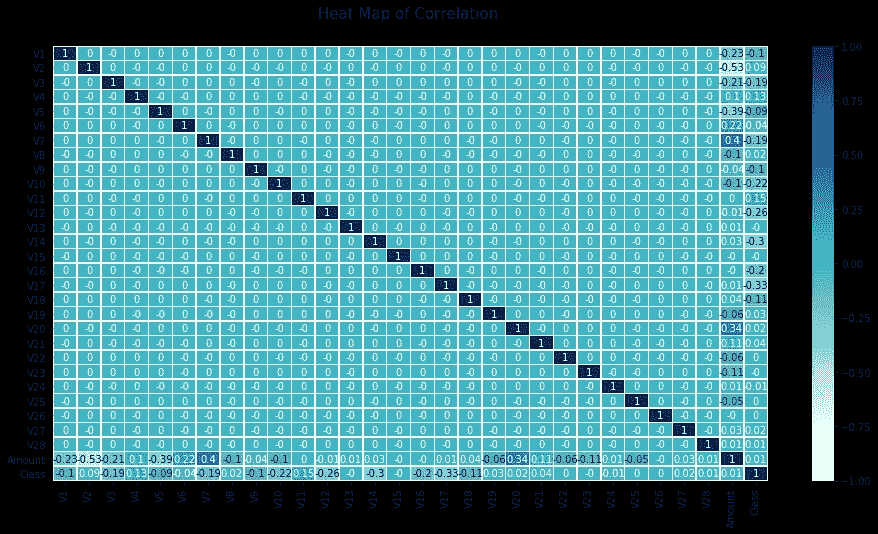
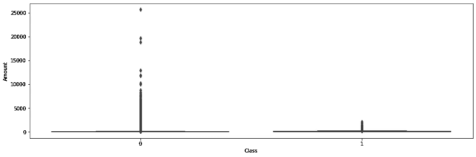
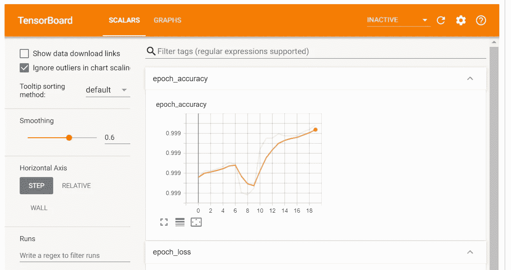
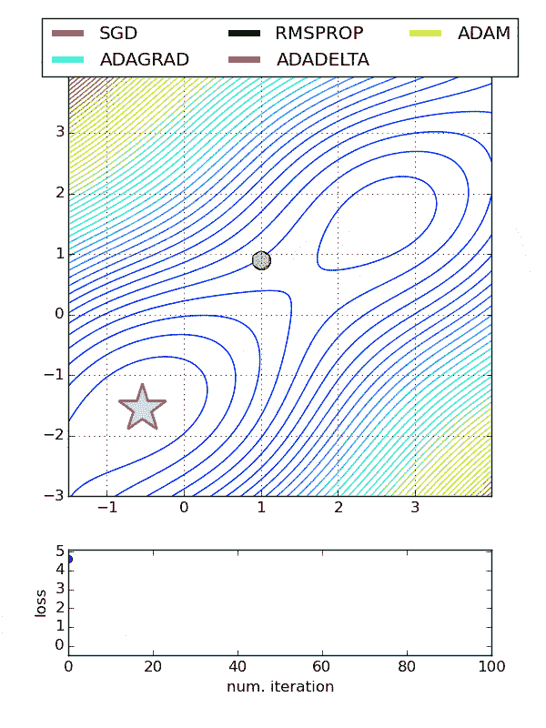

# 使用张量流和 Keras 的人工神经网络初学者指南

> 原文：<https://towardsdatascience.com/a-beginners-guide-to-artificial-neural-network-using-tensor-flow-keras-41ccd575a876?source=collection_archive---------28----------------------->

## 使用人工神经网络构建欺诈检测模型&使用 RandomizedSearchCV 微调超参数


凯利·西克玛在 [Unsplash](https://unsplash.com?utm_source=medium&utm_medium=referral) 上的照片

# 介绍

ann(人工神经网络)是深度学习的核心，是机器学习技术的高级版本。人工神经网络涉及以下概念。输入和输出层、隐藏层、隐藏层下的神经元、前向传播和反向传播。简而言之，输入层是独立变量的集合，输出层代表最终输出(因变量)，隐藏层由神经元组成，在其中开发方程并应用激活函数。前向传播讨论如何开发方程以实现最终输出，而后向传播计算梯度下降以相应地更新学习率。关于操作过程的更多信息可以在下面的文章中找到。

[](/introduction-to-artificial-neural-networks-for-beginners-2d92a2fb9984) [## 面向初学者的人工神经网络介绍

### 理解神经网络的概念

towardsdatascience.com](/introduction-to-artificial-neural-networks-for-beginners-2d92a2fb9984) 

# 深度神经网络

当一个 ANN 包含一个很深的隐藏层堆栈时，它被称为一个*深度神经网络* (DNN)。DNN 使用多个权重和偏差项，每个权重和偏差项都需要训练。只要两次通过网络，该算法就可以自动计算梯度下降。换句话说，它可以确定如何调整所有神经元的每个权重和每个偏置项以减少误差。该过程重复进行，除非网络收敛到最小误差。

让我们一步一步地运行这个算法:

*   开发训练和测试数据以训练和验证模型输出。因为它遵循参数结构，其中它优化了权重和偏置参数项。所有涉及相关性、异常值处理的统计假设仍然有效，必须进行处理
*   输入层由独立变量及其各自的值组成。一个小批量的数据(取决于批量大小)多次通过完整的训练集。每一遍被称为一个时期。纪元越高，训练时间就越长
*   每个小批量被传递到输入层，输入层将其发送到第一个隐藏层。计算该层中所有神经元的输出(对于每个小批量)。结果传递到下一层，重复这个过程，直到我们得到最后一层的输出，即输出层。这是向前传递:它类似于进行预测，只是所有中间结果都被保留，因为向后传递需要它们
*   然后使用损失函数测量网络的输出误差，该损失函数将期望输出与网络的实际输出进行比较
*   计算每个中子对误差项的科学贡献
*   该算法执行梯度下降以基于学习速率(反向传播)调整权重和参数，并且该过程重复进行

> 随机初始化所有隐藏层的连接权重是很重要的，否则训练将会失败。例如，如果将所有权重和偏差初始化为零，则给定层中的所有神经元将完全相同，因此反向传播将以完全相同的方式影响它们，因此它们将保持相同。换句话说，尽管每层有数百个神经元，但你的模型将表现得好像每层只有一个神经元:它不会太聪明。相反，如果你随机初始化权重，你会破坏对称性，并允许反向传播来训练一个多样化的神经元团队(Auré lien Gé ron，2017 年，第 290-291 页)

# 激活功能

激活函数是梯度下降的关键。梯度下降不能在平面上移动，因此有一个明确定义的非零导数以允许梯度下降在每一步都取得进展是很重要的。Sigmoid 通常用于逻辑回归问题，然而，也有其他流行的选择。

## 双曲正切函数

这个函数是 S 形的，连续的，除了输出范围从-1 到+1 之外可以微分。在训练开始时，每层的输出或多或少以 0 为中心，因此有助于加快收敛。

## 整流线性单元

在 Z=0 处不可微的连续函数，当 Z<0 时，它的导数为 0。它产生良好的输出，更重要的是有更快的计算。该函数没有最大输出，因此在梯度下降过程中可能出现的一些问题得到了很好的处理。

## 为什么我们需要一个激活函数？

假设 f(x) = 2x + 5，g(x) = 3x -1。两个不同神经元的方程，其中 x 是输入变量，2 和 3 是权重，5 和-1 是偏差项。在链接这些函数时，我们得到 f(g(x)) = 2(3x -1) + 5 = 6x + 3，这也是一个线性方程。没有非线性类似于在深度神经网络中有一个方程。这种场景下的复杂问题空间是处理不了的。



图一。说明了人工神经网络体系结构中常用的激活函数。作者使用 Excel 开发的图像。

# 损失函数

在处理回归问题时，我们不需要对输出层使用任何激活函数。训练回归问题时使用的损失函数是均方误差。然而，训练集中的异常值可以使用平均绝对误差来处理。对于基于回归的任务，Huber 损失也是广泛使用的误差函数。

当误差小于阈值 t(通常为 1)时，Huber 损失是二次的，但是当误差大于 t 时，Huber 损失是线性的。当与均方误差相比时，线性部分允许其对异常值不太敏感，并且二次部分允许比平均绝对误差更快的收敛和更精确的数字。

分类问题通常使用二元交叉熵或分类交叉熵或稀疏分类交叉熵。二元交叉熵用于二元分类，而分类或稀疏分类交叉熵用于多类分类问题。你可以在下面的链接中找到更多关于损失函数的细节。

**注意:** *分类交叉熵用于因变量的一键表示，当标签以整数形式提供时，使用稀疏分类交叉熵。*

[](https://keras.io/api/losses/) [## Keras 文件:损失

### 损失函数的目的是计算模型在训练过程中应该寻求最小化的数量。注意…

keras.io](https://keras.io/api/losses/) 

# 用 Python 开发人工神经网络

我们将使用来自 [Kaggle](https://www.kaggle.com/mlg-ulb/creditcardfraud) 的信用数据来开发一个使用 Jupyter Notebook 的欺诈检测模型。同样的事情也可以在 Google Colab 中完成。数据集包含欧洲持卡人在 2013 年 9 月的信用卡交易。该数据集显示了两天内发生的交易，其中 284，807 笔交易中有 492 笔欺诈。数据集高度不平衡，正类(欺诈)占所有交易的 0.172%。

```
import tensorflow as tf
print(tf.__version__)import pandas as pd
import numpy as npfrom sklearn.model_selection import train_test_split
import tensorflow as tffrom sklearn import preprocessingfrom tensorflow.keras.models import Sequential
from tensorflow.keras.layers import Dense, Dropout, BatchNormalizationfrom sklearn.metrics import accuracy_score, confusion_matrix, precision_score, recall_score, f1_score, precision_recall_curve, aucimport matplotlib.pyplot as plt
from tensorflow.keras import optimizersimport seaborn as snsfrom tensorflow import kerasimport random as rnimport os
os.environ["CUDA_VISIBLE_DEVICES"] = "3"
PYTHONHASHSEED=0tf.random.set_seed(1234)
np.random.seed(1234)
rn.seed(1254)
```

数据集由以下属性组成。时间、主要成分、数量和类别。更多信息请参考 Kaggle 网站。

```
file = tf.keras.utils
raw_df = pd.read_csv(‘[https://storage.googleapis.com/download.tensorflow.org/data/creditcard.csv'](https://storage.googleapis.com/download.tensorflow.org/data/creditcard.csv'))
raw_df.head()
```

因为大多数属性是主成分，所以相关性将总是为 0(主成分中正交向量的属性)。唯一可能存在异常值的列是金额。对其的快速描述提供了下面概述的统计数据。

```
count    284807.00
mean         88.35
std         250.12
min           0.00
25%           5.60
50%          22.00
75%          77.16
max       25691.16
Name: Amount, dtype: float64
```



图二。说明了数据中所有属性的相关矩阵。作者使用 Jupyter 笔记本开发的图像。

异常值对于检测欺诈至关重要，因为潜在的假设是，较高的交易可能是欺诈活动的迹象。然而，箱线图没有揭示任何特定的趋势来验证上述假设。



图 3。说明了欺诈性和非欺诈性活动的金额的箱线图表示。作者使用 Jupyter 笔记本开发的图像。

## 准备输入输出和训练测试数据

```
X_data = credit_data.iloc[:, :-1]y_data = credit_data.iloc[:, -1]X_train, X_test, y_train, y_test = train_test_split(X_data, y_data, test_size = 0.2, random_state = 7)X_train = preprocessing.normalize(X_train)
```

数量和主成分分析变量使用不同的尺度，因此数据集被归一化。归一化在梯度下降中起着重要的作用。标准化数据的收敛速度要快得多。

```
print(X_train.shape)
print(X_test.shape)
print(y_train.shape)
print(y_test.shape)
```

输出:

```
(227845, 29) #--Number of records x Number of columns
(56962, 29)
(227845,)
(56962,)
```

## 开发人工神经网络层

上面的输出表明我们有 29 个独立变量要处理，因此输入层的形状是 29。任何人工神经网络结构的一般结构概述如下。

```
+----------------------------+----------------------------+
 |      Hyper Parameter       |   Binary Classification    |
 +----------------------------+----------------------------+
 | # input neurons            | One per input feature      |
 | # hidden layers            | Typically 1 to 5           |
 | # neurons per hidden layer | Typically 10 to 100        |
 | # output neurons           | 1 per prediction dimension |
 | Hidden activation          | ReLU, Tanh, sigmoid        |
 | Output layer activation    | Sigmoid                    |
 | Loss function              | Binary Cross Entropy       |
 +----------------------------+----------------------------++-----------------------------------+----------------------------+
 |          Hyper Parameter          | Multiclass Classification  |
 +-----------------------------------+----------------------------+
 | # input neurons                   | One per input feature      |
 | # hidden layers                   | Typically 1 to 5           |
 | # neurons per hidden layer        | Typically 10 to 100        |
 | # output neurons                  | 1 per prediction dimension |
 | Hidden activation                 | ReLU, Tanh, sigmoid        |
 | Output layer activation           | Softmax                    |
 | Loss function                     | "Categorical Cross Entropy |
 | Sparse Categorical Cross Entropy" |                            |
 +-----------------------------------+----------------------------+
```

**密集函数的输入**

1.  单位-输出的尺寸
2.  激活—激活功能，如果未指定，则不使用任何内容
3.  use _ bias 表示图层是否使用偏置矢量的布尔值
4.  内核初始化器——内核权重的初始化器
5.  bias_initializer —偏差向量的初始值设定项。

```
model = Sequential(layers=None, name=None)
model.add(Dense(10, input_shape = (29,), activation = 'tanh'))
model.add(Dense(5, activation = 'tanh'))
model.add(Dense(1, activation = 'sigmoid'))sgd = optimizers.Adam(lr = 0.001)model.compile(optimizer = sgd, loss = 'binary_crossentropy', metrics=['accuracy'])
```

**架构概要**

```
model.summary()Model: "sequential"
_________________________________________________________________
Layer (type)                 Output Shape              Param #   
=================================================================
dense (Dense)                (None, 10)                300       
_________________________________________________________________
dense_1 (Dense)              (None, 5)                 55        
_________________________________________________________________
dense_2 (Dense)              (None, 1)                 6         
=================================================================
Total params: 361
Trainable params: 361
Non-trainable params: 0
_________________________________________________________________
```

## 让我们试着理解上面的输出(使用两个隐藏层提供输出解释):

1.  我们已经创建了一个具有一个输入层、两个隐藏层和一个输出层的神经网络
2.  输入层有 29 个变量和 10 个神经元。因此，权重矩阵的形状为 10×29，偏差矩阵的形状为 10×1
3.  第 1 层中的参数总数= 10 x 29 + 10 x 1 = 300
4.  第一层使用 tanh 作为激活函数，有 10 个输出值。第二层有 5 个神经元，使用 10 个输入，因此权重矩阵是 5×10，偏差矩阵是 5×1
5.  第 2 层中的总参数= 5 x 10 + 5 x 1 = 55
6.  最后，输出层具有一个神经元，但是它具有来自隐藏层 2 的 5 个不同输入，并且具有偏置项，因此神经元的数量= 5+1=6

```
model.fit(X_train, y_train.values, batch_size = 2000, epochs = 20, verbose = 1)Epoch 1/20
114/114 [==============================] - 0s 2ms/step - loss: 0.3434 - accuracy: 0.9847
Epoch 2/20
114/114 [==============================] - 0s 2ms/step - loss: 0.1029 - accuracy: 0.9981
Epoch 3/20
114/114 [==============================] - 0s 2ms/step - loss: 0.0518 - accuracy: 0.9983
Epoch 4/20
114/114 [==============================] - 0s 2ms/step - loss: 0.0341 - accuracy: 0.9986
Epoch 5/20
114/114 [==============================] - 0s 2ms/step - loss: 0.0255 - accuracy: 0.9987
Epoch 6/20
114/114 [==============================] - 0s 1ms/step - loss: 0.0206 - accuracy: 0.9988
Epoch 7/20
114/114 [==============================] - 0s 1ms/step - loss: 0.0174 - accuracy: 0.9988
Epoch 8/20
114/114 [==============================] - 0s 1ms/step - loss: 0.0152 - accuracy: 0.9988
Epoch 9/20
114/114 [==============================] - 0s 1ms/step - loss: 0.0137 - accuracy: 0.9989
Epoch 10/20
114/114 [==============================] - 0s 1ms/step - loss: 0.0125 - accuracy: 0.9989
Epoch 11/20
114/114 [==============================] - 0s 2ms/step - loss: 0.0117 - accuracy: 0.9989
Epoch 12/20
114/114 [==============================] - 0s 2ms/step - loss: 0.0110 - accuracy: 0.9989
Epoch 13/20
114/114 [==============================] - 0s 1ms/step - loss: 0.0104 - accuracy: 0.9989
Epoch 14/20
114/114 [==============================] - 0s 1ms/step - loss: 0.0099 - accuracy: 0.9989
Epoch 15/20
114/114 [==============================] - 0s 1ms/step - loss: 0.0095 - accuracy: 0.9989
Epoch 16/20
114/114 [==============================] - 0s 1ms/step - loss: 0.0092 - accuracy: 0.9989
Epoch 17/20
114/114 [==============================] - 0s 1ms/step - loss: 0.0089 - accuracy: 0.9989
Epoch 18/20
114/114 [==============================] - 0s 1ms/step - loss: 0.0087 - accuracy: 0.9989
Epoch 19/20
114/114 [==============================] - 0s 1ms/step - loss: 0.0084 - accuracy: 0.9989
Epoch 20/20
114/114 [==============================] - 0s 1ms/step - loss: 0.0082 - accuracy: 0.9989
```

**评估输出**

```
X_test = preprocessing.normalize(X_test)results = model.evaluate(X_test, y_test.values)1781/1781 [==============================] - 1s 614us/step - loss: 0.0086 - accuracy: 0.9989
```

## 使用张量板分析学习曲线

TensorBoard 是一个非常棒的交互式可视化工具，可用于查看训练过程中的学习曲线，比较多次跑步的学习曲线，分析训练指标等等。该工具随 TensorFlow 自动安装。

```
import os
root_logdir = os.path.join(os.curdir, “my_logs”)def get_run_logdir():
 import time
 run_id = time.strftime(“run_%Y_%m_%d-%H_%M_%S”)
 return os.path.join(root_logdir, run_id)run_logdir = get_run_logdir()tensorboard_cb = keras.callbacks.TensorBoard(run_logdir)model.fit(X_train, y_train.values, batch_size = 2000, epochs = 20, verbose = 1, callbacks=[tensorboard_cb])%load_ext tensorboard
%tensorboard --logdir=./my_logs --port=6006
```



图 4。说明了人工神经网络运行的张量板输出。作者使用 Jupyter 笔记本开发的图像。

## 超调模型参数

如前所述，对于有多少隐藏层或多少神经元最适合一个问题空间，没有预定义的规则。我们可以使用 RandomizedSearchCV 或 GridSearchCV 来优化一些参数。可以微调的参数如下:

*   隐藏层数
*   隐藏层中的神经元
*   【计算机】优化程序
*   学习率
*   世

**声明开发模型的函数**

```
def build_model(n_hidden_layer=1, n_neurons=10, input_shape=29):

    # create model
    model = Sequential()
    model.add(Dense(10, input_shape = (29,), activation = 'tanh'))for layer in range(n_hidden_layer):
        model.add(Dense(n_neurons, activation="tanh"))model.add(Dense(1, activation = 'sigmoid'))

    # Compile modelmodel.compile(optimizer ='Adam', loss = 'binary_crossentropy', metrics=['accuracy'])

    return model
```

**使用包装类克隆模型**

```
from sklearn.base import clone

keras_class = tf.keras.wrappers.scikit_learn.KerasClassifier(build_fn = build_model,nb_epoch = 100,
 batch_size=10)
clone(keras_class)keras_class.fit(X_train, y_train.values)
```

**创建随机搜索网格**

```
from scipy.stats import reciprocal
from sklearn.model_selection import RandomizedSearchCVparam_distribs = {
 “n_hidden_layer”: [1, 2, 3],
 “n_neurons”: [20, 30],
# “learning_rate”: reciprocal(3e-4, 3e-2),
# “opt”:[‘Adam’]
}rnd_search_cv = RandomizedSearchCV(keras_class, param_distribs, n_iter=10, cv=3)rnd_search_cv.fit(X_train, y_train.values, epochs=5)
```

**检查最佳参数**

```
rnd_search_cv.best_params_{'n_neurons': 30, 'n_hidden_layer': 3}rnd_search_cv.best_score_model = rnd_search_cv.best_estimator_.model
```

优化器也应该微调，因为它们影响梯度下降、收敛和学习率的自动调整。

*   ***Adadelta—***Adadelta 是 Adagrad 的更健壮的扩展，它基于梯度更新的移动窗口来调整学习速率，而不是累积所有过去的梯度
*   ***随机梯度下降—*** 常用。需要使用搜索网格来微调学习率
*   ***Adagrad —*** 对于其他优化器，学习率对于所有参数和每个周期都是恒定的。然而，Adagrad 在处理误差函数的导数时，改变每个参数和每个时间步长“t”的学习速率“η”
*   ***ADAM —*** Adam(自适应矩估计)与一阶和二阶动量一起工作，以防止跳过局部最小值。亚当保存了过去梯度的指数衰减平均值



图 5。展示了不同优化器之间的收敛性。图片来自 GIPHY。

一般来说，通过增加层数而不是每层神经元的数量可以获得更好的输出。

# 参考

奥雷连戈罗恩(2017)。*用 Scikit-Learn 和 TensorFlow 进行动手机器学习:构建智能系统的概念、工具和技术*。塞瓦斯托波尔，加利福尼亚州:奥赖利媒体

*关于作者:高级分析专家和管理顾问，帮助公司通过对组织数据的商业、技术和数学的组合找到各种问题的解决方案。一个数据科学爱好者，在这里分享、学习、贡献；可以在*[*LinkedIn*](https://www.linkedin.com/in/angel-das-9532bb12a/)*和*[*Twitter*](https://twitter.com/dasangel07_andy)*上联系我。*