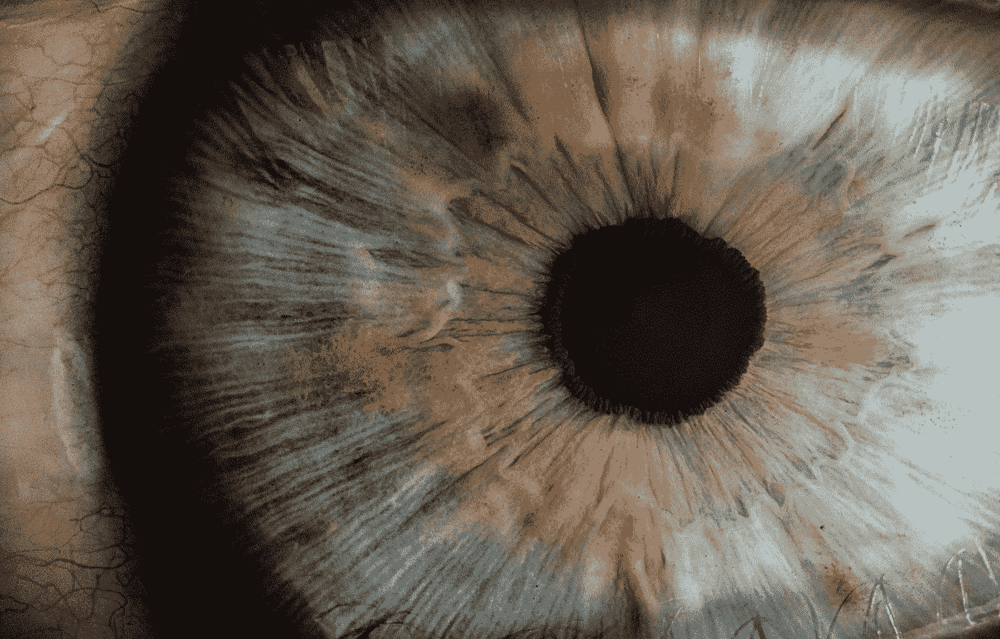
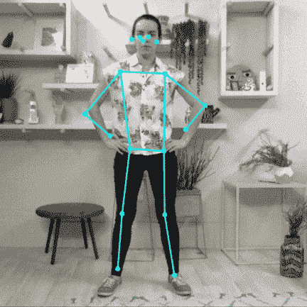
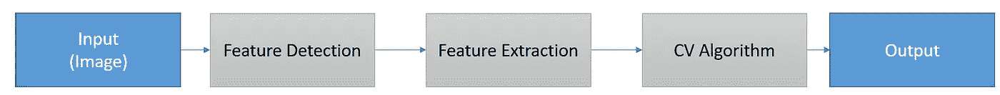
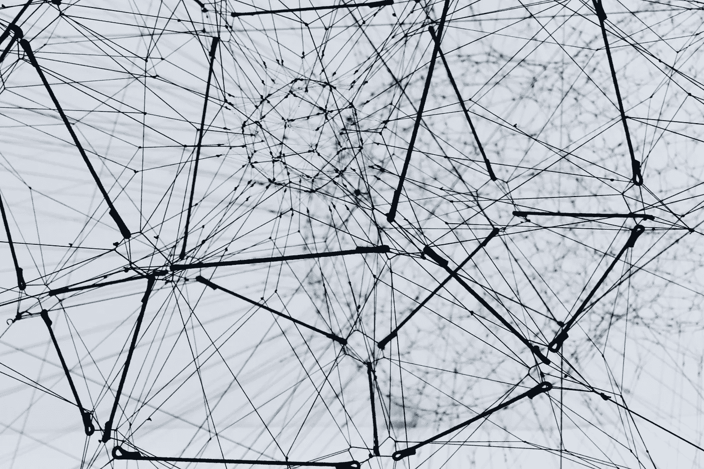
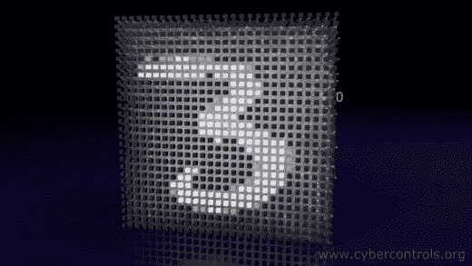
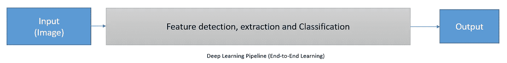

# 计算机视觉入门指南

> 原文：<https://towardsdatascience.com/a-beginners-guide-to-computer-vision-dca81b0e94b4?source=collection_archive---------10----------------------->

## 情报的

## 对人工智能中一个重要领域的友好介绍

> “人工智能是一门严格的科学，专注于设计智能系统和机器，使用的算法技术多少受到我们对大脑的了解的启发”
> 
> — [Yann LeCun](https://research.fb.com/blog/2016/12/artificial-intelligence-revealed/)

计算机视觉(CV)是事实上的人工智能技术之一，存在于我们遇到的许多人工智能应用中。

面部识别、无人驾驶汽车、增强现实和许多其他应用都以某种形式利用了计算机视觉技术。

过去十年，随着人工智能应用获得更多采用，计算机视觉变得更加突出。

人工智能应用采用的增加导致了计算机视觉相关工作和课程数量的增加

**本文将简要介绍计算机视觉在过去五十年中的发展，并探索该领域早期使用的传统 CV 技术。本文将探讨深度学习时代，包括解释从传统的 CV 方法到基于深度学习的方法的转变的原因。**

# 计算机视觉

在我们深入研究各种 CV 技术之前，让我们探索一下计算机视觉试图在功能方面模拟的人体部分。

大多数人类不太重视视觉；这是一种身体机能，很少甚至没有刻意的影响就能自动发挥作用。

照片由 [v2osk](https://unsplash.com/@v2osk?utm_source=unsplash&utm_medium=referral&utm_content=creditCopyText) 在 [Unsplash](https://unsplash.com/s/photos/eyes?utm_source=unsplash&utm_medium=referral&utm_content=creditCopyText) 上拍摄

人类视觉感觉系统已经发展了几千年，使人类能够从三维世界中物体反射到我们眼睛的光线中推断出景物的含义和背景。

我们的眼睛和大脑可以从反射光中推断出对环境的理解。

我们的视觉系统使我们能够确定物体的距离，在不直接接触的情况下预测物体的纹理，并识别我们环境中的所有类型的模式和事件。

计算机视觉是一个过程，通过这个过程，我们试图给计算机系统配备与人类视觉感官系统相同的能力。

计算机视觉的适当定义如下:

> **计算机视觉是机器或系统通过调用一个或多个作用于所提供信息的算法来生成对视觉信息的理解的过程。这些理解然后被转化为决策、分类、模式观察等等。**

我们的视觉感觉系统由眼睛和大脑组成，尽管我们知道眼睛的每个组成部分，如角膜、晶状体、视网膜、虹膜等。，我们并不完全了解大脑是如何工作的。

为了创建能够从图像中提取上下文信息的算法和系统，必须观察模式的原因。那么解决方案可以从对特定模式的原因和结果的理解中得出。

计算机视觉有很多应用，下面是几个:

左:[人脸检测](https://blog.tensorflow.org/2020/03/face-and-hand-tracking-in-browser-with-mediapipe-and-tensorflowjs.html)和面部特征跟踪。中间:[tensor flow 的姿态估计](https://www.google.com/url?sa=i&url=https%3A%2F%2Fwww.tensorflow.org%2Flite%2Fmodels%2Fpose_estimation%2Foverview&psig=AOvVaw1FlOWKWjL11JjEAkeQdjLa&ust=1592963325451000&source=images&cd=vfe&ved=0CA0QjhxqFwoTCLjF2P7oluoCFQAAAAAdAAAAABAD)。右图: [Yolo 对象检测网络](https://gfycat.com/immaterialbareeasternglasslizard-tensorflow-all-tags-samsung-darknet)

***人脸检测*** *:实现能够自动识别和定位图像和视频中人脸的系统的任务。面部检测存在于与面部识别、摄影和动作捕捉相关联的应用中。*

***对象分类*** *:识别关联的 a 类目标对象的过程。对象识别和检测是具有相似结果和实现方法的技术，尽管在各种系统和算法中识别过程先于检测步骤。*

***物体跟踪*** *:一种在一段时间内，从一系列图像中识别、检测、跟踪感兴趣物体的方法。在许多监控摄像机和交通监控设备中可以找到系统内跟踪的应用。*

***姿态估计*** *:从提供的图像、视频或图像序列等数字资产中推断出身体主要关节位置的过程。姿态估计的形式存在于诸如动作识别、人类交互、虚拟现实和 3D 图形游戏的资产创建、机器人等应用中。*

自 20 世纪 70 年代以来，研究人员已经花费了大量的时间和精力，创建了高效而健壮的计算机视觉算法和系统，可以用作上面列出的一些应用的解决方案。

在现代，大多数计算机视觉任务都是使用深度学习方法解决的。

为了更好地理解计算机视觉领域的基础，让我们探索一下传统的算法，这些算法具有用于解决典型计算机视觉问题的基于启发式的逻辑。

# 传统方法

计算机视觉技术的主要目的是提供对图像数据中的上下文的某种形式的理解；然后，这种理解被用于更多定制的目的，例如识别或检测。

算法和传统计算机视觉技术中的几个子程序被开发来从图像中提取场景理解。

传统的计算机视觉管道。作者图片

> 计算机视觉中的特征被描述为数据形式中的一条可测量和可量化的信息，它定义了观察的某些特征。

## 边缘检测

边缘是可以用来描述图像内容的图像特征的例子。边缘检测是开发能够提供一些场景理解的算法的最初尝试之一。

边缘检测属于图像处理的主题，但已经成为计算机视觉中的主要工具。

边缘检测算法识别图像中像素强度急剧变化的点。通过连接这些图像亮度急剧变化的点，我们形成了线条，更正式的说法是边缘。

**为什么边缘是图像中的重要特征？**

从检测到的边缘的分析和组合中可以检索到关于图像的大量信息。例如，仅通过观察检测到的边缘之间的连接和连续性，就可以从边缘信息推断出物体的 3D 组成。

检测到的边缘还暴露了图像的可测量和可量化的属性，例如深度和方向的变化。弯曲的边缘代表方向的变化。

一旦从图像中提取出特征，在这种情况下是边缘，就有可能确定图像中哪些内容是相关的。

下面举几个传统边缘检测算法的例子: [*Canny 边缘检测器*](https://en.wikipedia.org/wiki/Canny_edge_detector) *，* [*Sobel 方法*](https://en.wikipedia.org/wiki/Sobel_operator) *和* [*模糊逻辑方法*](https://uk.mathworks.com/help/fuzzy/fuzzy-logic-image-processing.html) *。*

由 JonMcLoone 在英语维基百科，CC BY-SA 3.0，[https://commons.wikimedia.org/w/index.php?curid=44894482](https://commons.wikimedia.org/w/index.php?curid=44894482)

识别图像中的特征的重要性在于计算机视觉的基本目标，即理解图像中的内容。

从边缘和线条等衍生特征中，可以构建与图像中对象的基本结构组成相对应的三维对象。

传统的计算机视觉涉及对输入和输出的深入分析。深入的分析揭示了可以从图像中提取哪些数学上可表示的特征，并与有效的算法相结合以产生期望的结果。

封装上述过程的传统计算机视觉技术的一个例子是 Haar-like 特征。

图片来自[https://www.researchgate.net/](https://www.researchgate.net/)

**类哈尔特征**用于计算机视觉任务，如物体识别或人脸检测。

它通过使用包含两个相邻矩形的定义窗口来工作，其中每个矩形中像素强度之和之间的差异用于识别面部的片段。

眼睛周围的区域比脸颊周围的相邻区域稍暗，用于眼睛检测的 haar 特征将是所利用的相邻矩形。

可以将计算出的差异与先前确定的阈值进行比较，以识别面部的各个部分，例如眼睛、嘴和鼻子。

另一种用于对象检测的传统计算机视觉技术被称为 **SIFT(尺度不变特征变换)**。它是在 90 年代后期开发的。

SIFT 技术用于识别图像中的对象，与图像的方向、比例和旋转无关。它主要通过识别图像中感兴趣点并累积它们的梯度来工作；这些信息创建了一个图像描述符。包含关键点的描述符与其他描述符的数据库进行比较和匹配。

传统 CV 技术的功效在于检测和提取的特征的质量。

此外，用于创建场景理解的方法和基于启发式的算法是传统 CV 技术的性能和可靠性的重要组成部分。

更多的研究和努力集中在统一和自动化特征提取、工程、学习和分类的所有过程上。

# 深度学习方法

艾莉娜·格鲁布尼亚克在 [Unsplash](https://unsplash.com/s/photos/neural-networks?utm_source=unsplash&utm_medium=referral&utm_content=creditCopyText) 上的照片

## 计算机视觉从传统到深度学习方法的转变

在撰写本文时，大多数计算机视觉相关任务都是使用最先进的深度学习架构解决的。

传统的计算机视觉方法已经被深度学习和随后的神经网络引入的端到端学习解决方案所取代。

计算机视觉的传统方法需要在特征提取阶段开始之前定义特征结构和组成。

计算机视觉从业者必须定义什么样的特定特征最能描述图像中感兴趣的对象。这种特征工程和描述的方法是不可扩展的，尤其是当感兴趣对象的数量很大时。

深度学习在一个自动化的过程中处理特征工程、提取和分类的任务。

通过向神经网络呈现图像，神经网络内的权重和参数呈现概括所呈现图像内的突出特征和空间模式的值。

将标记的图像作为训练数据呈现给神经网络，可以训练神经网络来识别对应于图像数据中特定对象的模式。

[神经网络模拟](https://www.cybercontrols.org/)功劳归于[德米特列夫](https://www.youtube.com/channel/UC8m-a4A0jk2bkesfPdz1z_A)

对于需要检测的尽可能多的物体，该过程是可重复的。

深度学习有一些限制和缺点；拥有大量的训练数据以确保神经网络能够很好地推广到看不见的数据是一个问题，这个问题在几年内限制了深度学习策略的采用。

网络容量和对计算资源的访问也可能成为计算机视觉深度学习方法的瓶颈。

在采用深度学习之前，CV 工程师负责定义和选择最能描述图像或对象的特征。现在，在现代，CV 工程师更关心深度学习模型的实现、训练和评估。

## 深度学习

> 深度学习是机器学习的一个子领域，它涉及利用人工神经网络(ANN)来解决自然语言和计算机视觉任务，如对象检测、对象识别、人脸检测、姿态估计、语义分割等。

深度学习领域中存在各种各样的 ANN 配置，值得注意的配置是卷积神经网络(CNN)、递归神经网络(RNN)和深度神经网络(DNN)。

深度学习中的“深度”一词指出了这样一个事实，即所提到的 ANN 和其他开发的变体由大量的神经网络层组成。

有些关键词普遍存在于深度学习的各个领域；它们是:

*   ***神经网络*** *:以能够保持知识的方式构造的神经元(处理单元)的集合。它们也可以被描述为并行分布式处理器。*
*   ***卷积*** *:卷积是一个数学术语，描述两组元素之间的点积相乘。在深度学习中，卷积运算作用于卷积层中的过滤器/内核和图像数据阵列。因此，卷积层包含发生在滤波器和通过卷积神经网络的图像之间的卷积运算。*
*   ***卷积神经网络*** *:这些是利用层内数学卷积运算的神经网络。*
*   ***权重:*** *这些都是神经元间连接的强度。它们是神经网络中存储知识的关键元素。*

利用计算机视觉的深度学习将特征提取、检测、工程和分类的任务全部委托给神经网络。

因此，深度学习计算机视觉管道看起来类似于下图。

深度学习管道。作者图片

# 结论

到目前为止，我们已经涵盖了解决计算机视觉任务的传统方法和利用深度学习的更现代的方法。

现代和传统的 CV 方法都有更多的概念、想法和技术可以探索。业界的共识是，深度学习是解决计算机视觉任务的主导方法。

对于那些想要探索计算机视觉世界的人来说，深度学习主题和技术是获得实践和专业经验的有利途径。

然而，重温计算机视觉的根源并理解研究人员和工程师在开发传统算法时的直觉总是很有见地的。

很快，我会写一篇文章，更深入地介绍深度学习。

## 现在，你可以阅读以下文章，了解现代简历工程师的角色是什么样的，以及从事机器学习和计算机视觉研究需要什么。

 [## 6 个月的机器学习/计算机视觉工程师

### 在一个我几年前都没有涉足的领域呆上半年是什么感觉

towardsdatascience.com](/6-months-as-a-machine-learning-computer-vision-engineer-c05978592368)  [## 我从攻读计算机视觉和机器学习硕士学位中学到了什么

### 如果你打算从事计算机视觉或机器学习方面的任何形式的高级研究，请阅读本文…你可能…

towardsdatascience.com](/what-i-learnt-from-taking-a-masters-in-computer-vision-and-machine-learning-69f0c6dfe9df) 

# 我希望这篇文章对你有用。

要联系我或找到更多类似本文的内容，请执行以下操作:

1.  订阅我的 [**邮件列表**](https://richmond-alake.ck.page/c8e63294ee) 获取每周简讯
2.  跟我上[中型 ](https://medium.com/@richmond.alake)
3.  通过 [**LinkedIn**](https://www.linkedin.com/in/richmondalake/) 联系我