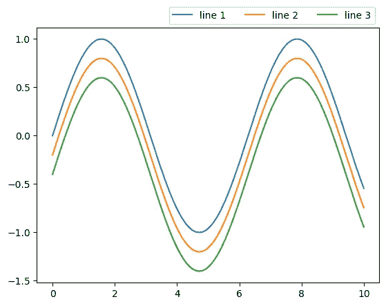

# 创建干净而有趣的 Python 图表的初学者指南

> 原文：<https://towardsdatascience.com/a-beginners-guide-to-creating-clean-and-appetizing-python-charts-f7e1cf1899d2?source=collection_archive---------24----------------------->


照片由[斯特凡](https://unsplash.com/@vladington?utm_source=unsplash&utm_medium=referral&utm_content=creditCopyText)在 [Unsplash](https://unsplash.com/s/photos/dinner?utm_source=unsplash&utm_medium=referral&utm_content=creditCopyText) 上拍摄

## 数据可视化

## 随着诸如 Matplotlib、Seaborn 和 Plotly 之类的优秀图形软件包数量的增加，人们很快就会对如何使它看起来更好感到困惑。这并不意味着你可以偷懒！

当你第一次试图弄清楚如何使你的图表看起来完全符合你的要求时，你会感到困惑，尤其是因为似乎 StackOverflow 上的每个人都有自己绘制和定制图表的方式。当您意识到您不能仅仅应用 Matplotlib 中完全相同的代码来定制 Seaborn 中强大的开箱即用的绘图时，这变得更加令人沮丧。

本文将重点关注在试图用 Matplotlib 创建一个清晰的图表时将会遇到的主要问题，然后深入研究这些工具如何转化为 Seaborn 和 Plotly。

1.  **电镀:**标签，支线剧情，轴刻度，旋转，支线剧情
2.  **成分:**线宽、线型、色调/Cmap、线条颜色、图例和样式。
3.  **调料:** Kwargs，动画，注解，还有其他类似 Seaborn，Plotly 的包。
4.  **上菜:**针对你制作的每张图表要问的问题

# **电镀**

"如何设置标题、轴标签、轴限制等？"可能是关于 Matplotlib 最常搜索的问题之一。我喜欢用`set()`把所有东西都放在一行。

```
import matplotlib.pyplot as pltfig, ax = plt.subplots(figsize = (10,10))
df.plot(kind="line")
ax.set(Title = "Test Title", xlabel = "x label", ylabel= "y label", xlim= (0,5), ylim = (0,5))
```


绘制空白图形

**支线剧情:**关于定制支线剧情已经有很多很棒的文章了，我就简单说一下。以下是你开始时真正需要知道的:

```
fig, (ax1,ax2) = plt.subplots(2,1, sharex=True) #creating a figure with two charts in the same column, that share an x axis.ax3 = ax1.twinx #creating secondary y axis.
```


ax1 是第一个图，因此 ax3 在第一个图上创建了一个双轴

有时在你添加了第二个轴或一些支线剧情后，你的情节和标签看起来会被压扁，所以使用`fig.tight_layout()`来固定间距。

如果你正在绘制一个像`pivot.plot(kind=’line’)`这样的数据透视表，那么你可以做的一个很酷的技巧是`pivot.plot(kind = 'line’, subplots = True)`为数据透视表的每一列快速创建支线剧情。使用`plot()`绘制枢轴将成为你最好的朋友，索引将永远是 x 轴，列将是 y 轴。

**刻度管理:**假设您想要在折线图中绘制一些“对象”类型的数据，但是轴不允许您这样做，因为它需要是一个 int！首先保存分类变量名称的列表，然后将分类列转换为整数(1，2，3，4…)。

选择频率(1，5，10，…)并将其保存在另一个列表中。现在设置您的滴答频率，然后用您的按滴答频率索引的分类变量列表替换标签。代码应该如下所示:

```
cat_labels = df[“column_name"].unique()df[“column_name"] = np.arange(1,100,1) tickfrequency = np.arange[1,100,5] #every 5th tick to be shown on axis ax.xaxis.set_ticks(tickfrequency) ax.xaxis.set_ticklabels(cat_labels[tickfrequency])
```

# **配料**

**线条定制:**线条宽度、标记、颜色和类型可以在[这里找到](https://matplotlib.org/3.1.1/api/_as_gen/matplotlib.pyplot.plot.html)如果你向下滚动到格式字符串。如果愿意，您可以使用`set_dashes()`创建自定义模式。

```
import numpy as np#data for plots
x = np.linspace(0, 10, 100)
y = np.sin(x)fig, ax = plt.subplots()
# Using set_dashes() to modify dashing of an existing lineline1, = ax.plot(x, y, label='line 1')
line1.set_dashes([2, 2, 10, 2]) line2 = ax.plot(x, y-0.4, label='line 3', color='green', marker='o', linestyle='dashed', linewidth=0.5, markersize=0.3)
```


如果我们在同一图形上先画一条线，然后画一个散点，散点会覆盖这条线。现在解决这个问题的一个方法是最后绘制这条线，但是使用`zorder`更容易跟踪。较高的`zorder` 值会覆盖较低的值，把它想象成一个向你走来的 z 轴。

我认为没有足够多的人使用不同的线条模式(我对此也感到内疚)，但是**数据可视化也需要考虑可访问性。** 考虑你的观众是色盲的情况，使用不同的线条图案或色盲友好的颜色图。要了解更多信息，请跟随[这条线索](https://ux.stackexchange.com/questions/94696/color-palette-for-all-types-of-color-blindness)，但一般来说你要**避免以下组合** : 绿色&棕色，蓝色&紫色，绿色&蓝色，浅绿色&黄色，蓝色&灰色，绿色&灰色，绿色&黑色。

**管理颜色:**所以你有 20 个不同的列试图绘制(如果你有更多，请考虑过滤或创建不同的图表)，但颜色在第一个 10 个之后重复！

```
unique = example_df["column_name"].unique()
palette = dict(zip(unique, sns.color_palette()))
```

对于 Matplotlib，你设置`color = palette`，对于 Seaborn，你在你的绘图函数的参数中设置`palette = palette`。

您还可以将分类变量传递给“hue ”,以便在 Seaborn 中自动分配颜色，或者传递给“c ”,以便使用 matplotlib，如下所示。

```
c=example_df['column_name'].apply(lambda x: palette[x]) 
#this is replacing the unique label with the color assigned through the whole column.
```

通过支线剧情和循环，你已经在同一张图表上得到了你的多个情节，但是现在你的传奇完全是一团糟。让我们来看一下如何创建自定义图例。假设您正在绘制第二个 y 轴，但不想要两个图例。

您可以随意设置图例标记，并按如下方式分配标签:

```
from matplotlib.patches import Patch
from matplotlib.lines import Line2Dlegend_elements = [Line2D([0], [0], color='b', lw=4, label='Line1'),
                   Patch(facecolor='r', edgecolor='g',
                         label='Line2')]ax1.legend(handles = legend_elements,loc='best')
```


如果你正在绘制一个循环，以下是有用的

```
from collections import OrderedDicthandles, labels = plt.gca().get_legend_handles_labels()
by_label = OrderedDict(zip(labels, handles))    
ax.legend(by_label.values(), by_label.keys())
```

您可以将图例的`loc`设置为 9 个位置中的一个(3x3 网格)，将其设置为“最佳”，或者通过改变`bbox_to_anchor=(1, 1.1))`的值将其移出图形。`ncols`将允许您通过指定每行放置多少个标签来横向压缩您的图例。

```
ax.legend(by_label.values(), by_label.keys(), bbox_to_anchor=(1,1.1),ncol = 3)
```



你还是不喜欢你的图表吗？然后使用`plt.style.use('ggplot2')`更改样式表。要查看完整的风格列表，[请点击这里](https://matplotlib.org/3.2.1/gallery/style_sheets/style_sheets_reference.html)。

# **调料**

现在事情会变得有点复杂。如果你输入`help(fig.plot)`，你会在最后看到`**kwargs`。`**kwargs` 是一个[字典](https://realpython.com/python-dicts/)的设置，帮助你定制到一个发球台。[这是一篇很好的文章](/a-primer-on-args-kwargs-decorators-for-data-scientists-bb8129e756a7)解释了一般的`*args`和`**kwargs`，但简而言之，因为 Seaborn 方法是建立在 Matplotlib 之上的，所以你可以将任何 Matplotlib 参数传递到 Seaborn 的`**kwargs`中(并像字体一样进行定制)。我在下面谈到了一个比这更简单的方法，你已经学到了。

你一定要知道 中的一个是`gridspec`，因为它可以让你改变支线剧情的比例(也就是说，让上面的变小，下面的变大)。

**动画:**我发现[使用这种方法](/animate-your-graphs-in-python-in-4-easy-steps-243dccad9a7)最简单，而不是用`matplotlib.animation`搞乱不同的编剧和问题。如果你的动画太大[使用这个](https://gifcompressor.com/)来缩小它们的尺寸。

**注解:**这个简单，只用于文本，其中前两个值是 x 和 y 坐标:

```
text = ("This is a really long string that I'd rather have wrapped so that it "
     "doesn't go outside of the figure, but if it's long enough it will go "
     "off the top or bottom!")plt.text(4, 1, text, ha='left', rotation=15, wrap=**True**)
```

对于箭头[和文本](https://matplotlib.org/2.0.0/users/annotations.html)之类的东西，也是类似的:

```
ax.annotate(‘local max’, xy=(2, 1), xytext=(3, 1.5), arrowprops=dict(facecolor=’black’, shrink=0.05) 
```

对于图形上的水平线或垂直线，您可以绘制:

```
plt.axhline(y=0.5, color='r', linestyle='-')
plt.axvline(x=0.5, color='r', linestyle='-')
```

这个包完全是基于 Matplotlib 构建的。由于单线图的复杂性，你需要更多地关注`args`来找出你需要改变的地方。处理所有定制问题的最简单方法是创建一个`fig, ax = plt.subplots()`，将轴传递给参数`ax=ax`，然后使用`ax.set()`定制轴。有些情节不会有`“ax”`参数，但会有一个`“height”`你可以设置。其他情节允许你改变情节的类型，但是你不能轻易改变网格/支线剧情的布局。然而，[知道了](https://matplotlib.org/3.2.1/tutorials/intermediate/gridspec.html) `[gridspec](https://matplotlib.org/3.2.1/tutorials/intermediate/gridspec.html)` [kwarg](https://matplotlib.org/3.2.1/tutorials/intermediate/gridspec.html) 会让你相对轻松地重现许多剧情。

这不是一篇关于最有用的图的文章，但是一定要熟悉`pairplot()`并通过在`sns.heatmap()`中插入 df.corr()来创建相关图。这些是让任何人惊叹的快速方法。


谷歌图片相关图示例

**Plotly:** 它们经历了多次迭代，拥有 Express、Graph Objects、Dash 等子类。它主要是用 Javascript ( [D3.js](https://en.wikipedia.org/wiki/D3.js) 、 [HTML](https://en.wikipedia.org/wiki/HTML) 和 [CSS](https://en.wikipedia.org/wiki/CSS) )在前端构建的，这就是为什么你可以在 HTML 文件(或者嵌入)中与它交互。一开始可能会令人困惑，但可以这样想:

1.  [*plotly . express*](https://plotly.com/python/plotly-express/)*是给你的 Seaborn 式的俏皮话。*
2.  *[](https://plotly.com/python/reference/)**是为了更复杂的可视化和定制。他们不使用支线剧情，而是使用“轨迹”，你可以在同一个剧情中添加轨迹(就像 Matplotlib 中的轴)或者使用它们来创建支线剧情。查看[此链接](https://plotly.com/python/reference/)以深入了解如何定制您的图表。***
3.  ****plotly.dash* 是使用回调的能力(比如有一个滑块来更新不同日期的图表，或者下拉菜单来改变你的 x 和 y 轴)。这是一个非常强大的工具，可以部署在 Heroku 或 Jupyter 笔记本上，但需要一些时间来适应。***

**Plotly 需要记住的一件重要事情是，根据您绘制的数据量，交互速度可能会显著降低。一种方法是使用[这个方法](https://plotly.com/python/webgl-vs-svg/)。**

# ****上菜****

**如果这太多太混乱，不要担心，因为数据可视化并不容易。就像建立机器学习模型一样，**你的大部分时间并没有花在有趣的事情上**——而是花在争论和清理数据上，以便可以可视化。你可以做很多改变，这些改变可能看起来微不足道，没有必要，但是当你把它们加起来，这就是星盘和混乱的星盘之间的区别。**

**在发送任何图表之前，有几个问题需要问自己:**

1.  ****对于电镀:**我的轴的规模和分布基于域有意义吗？我是否在一张图表上放了太多东西或者太多支线剧情？**
2.  ****对于配料:**我能否轻松清晰地理解每条线/条/点所指的内容？你通常会有太多或太少的变化，并不是所有的变化都可以通过颜色和图例来补偿！**
3.  ****为了调味:**我真的需要它是 3D 的、动画的、可交互的吗？一点点盐可以增加味道，但是太多了，人们会感到恶心。在棒线图或哑铃图工作正常的情况下，放入类似桑基图这样的东西是多余的。**

**任何时候你感到困惑，只要记住**你的图表试图从数据中传达一个故事，如果它没有做到这一点，你需要再次浏览它，添加或删除元素。大多数时候，人们不会有足够的耐心耐心听完你对你想要展示的东西的冗长解释。****

**祝你们好运，我希望你们都能给出一些令人惊叹的视觉效果！**