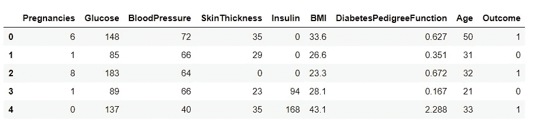
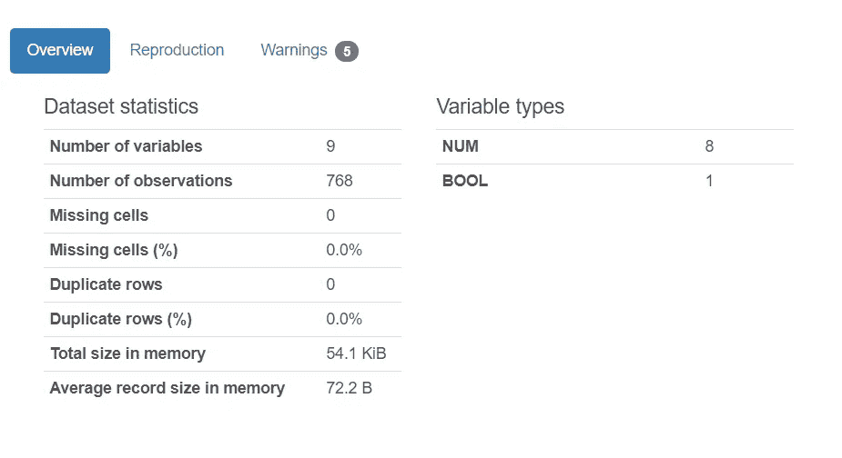
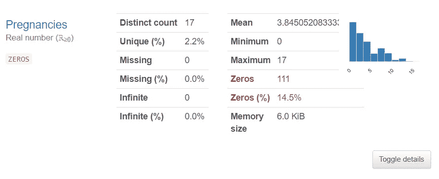
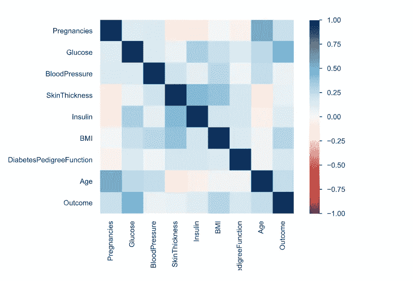
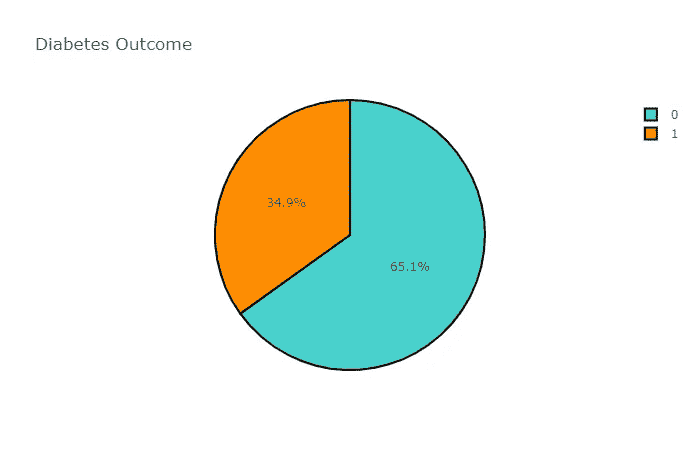
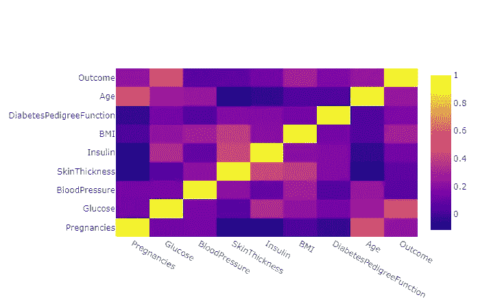
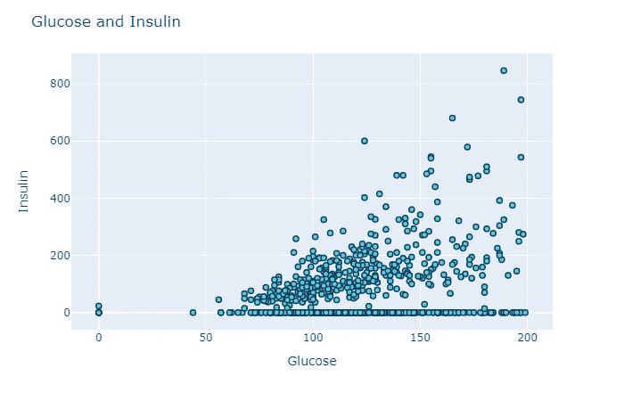
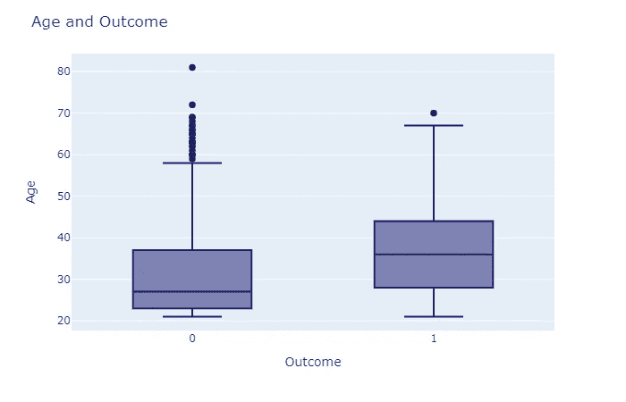
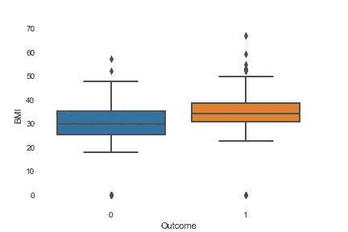

# Python 数据分析初学者指南

> 原文：<https://towardsdatascience.com/a-beginners-guide-to-data-analysis-in-python-188706df5447?source=collection_archive---------2----------------------->

## Python 数据分析入门分步指南


克里斯·利维拉尼在 [Unsplash](https://unsplash.com/s/photos/data-analysis?utm_source=unsplash&utm_medium=referral&utm_content=creditCopyText) 上的照片

# 数据分析师的角色

数据分析师使用编程工具来挖掘大量复杂的数据，并从这些数据中找到相关信息。

简而言之，分析师是从杂乱的数据中获取意义的人。为了在工作场所发挥作用，数据分析师需要具备以下方面的技能:

*   **领域专业知识**——为了挖掘数据并提出与其工作场所相关的见解，分析师需要具备领域专业知识。
*   **编程技能**—作为一名数据分析师，你需要知道使用什么样的库来清理数据、挖掘数据并从中获得洞察力。
*   **统计** —分析师可能需要使用一些统计工具来从数据中获取意义。
*   **可视化技能** —数据分析师需要具备出色的数据可视化技能，以便汇总数据并呈现给第三方。
*   **讲故事—** 最后，分析师需要向利益相关者或客户传达他们的发现。这意味着他们需要创建一个数据故事，并有能力讲述它。

在本文中，我将带您完成使用 Python 的端到端数据分析过程。

## 如果您遵循本教程并按照我的方式编写代码，那么您可以将这些代码和工具用于未来的数据分析项目。

我们将从下载和清理数据集开始，然后继续分析和可视化。最后，我们将围绕我们的数据发现讲述一个故事。

我将使用来自 Kaggle 的一个名为[Pima Indian Diabetes Database](https://www.kaggle.com/uciml/pima-indians-diabetes-database)的数据集，您可以下载该数据集来执行分析。

# 先决条件

在整个分析过程中，我将使用 Jupyter 笔记本。你可以使用任何你喜欢的 Python IDE。

您将需要沿途安装库，我将提供链接，引导您完成安装过程。

# 分析


卢克·切瑟在 [Unsplash](https://unsplash.com/s/photos/data-analysis?utm_source=unsplash&utm_medium=referral&utm_content=creditCopyText) 上的照片

下载完数据集后，你需要阅读*。csv* 文件作为 Python 中的数据帧。你可以使用熊猫图书馆来做到这一点。

如果您还没有安装它，您可以在您的终端中使用一个简单的“*pip install pandas”*来完成。如果你在安装时遇到任何困难，或者只是想了解更多关于熊猫库的知识，你可以在这里查看他们的文档。

## 读取数据

要将数据框读入 Python，首先需要导入 Pandas。然后，您可以读取该文件并使用以下代码行创建数据框:

```
import pandas as pd
df = pd.read_csv('diabetes.csv')
```

要检查数据帧的头部，请运行:

```
df.head()
```



作者图片

从上面的截图中，您可以看到与患者健康相关的 9 个不同变量。

作为一名分析师，您需要对这些变量有一个基本的了解:

*   **怀孕**:患者怀孕的次数
*   **葡萄糖**:患者的葡萄糖水平
*   **血压**
*   **皮肤厚度**:患者皮肤的厚度，单位为毫米
*   **胰岛素**:患者的胰岛素水平
*   **身体质量指数**:患者体重指数
*   **糖尿病糖尿病功能**:亲属有糖尿病史
*   **年龄**
*   **结果**:患者是否患有糖尿病

作为一名分析师，您需要了解这些变量类型(数值型和分类型)之间的区别。

**数值变量**是一种测量变量，具有某种数值意义。除了“*结果*之外，该数据集中的所有变量都是数字。

**分类变量**也叫名义变量，有两个或两个以上可以分类的类别。

变量“*结果*”是分类的——0 代表没有糖尿病，1 代表有糖尿病。

## 快速笔记

在继续分析之前，我想简单说明一下:

分析师也是人，我们经常会对我们期望在数据中看到的东西有先入为主的想法。

***例如，你会认为老年人更有可能患糖尿病。您可能希望在数据中看到这种相关性，但情况可能并不总是如此。***

在分析过程中保持开放的心态，不要让你的偏见影响决策。

## 熊猫简介

这是一个非常有用的工具，可供分析师使用。它生成数据框的分析报告，并帮助您更好地理解变量之间的相关性。

要生成 Pandas 分析报告，请运行以下代码行:

```
import pandas_profiling as pp
pp.ProfileReport(df)
```

该报告将为您提供数据集的一些总体统计信息，如下所示:



作者图片

通过浏览数据集统计数据，我们可以看到数据框中没有缺失或重复的像元。

上面提供的信息通常需要我们运行几行代码来查找，但是使用 Pandas Profiling 生成这些信息要容易得多。

Pandas Profiling 还提供了每个变量的更多信息。我给你看一个例子:



作者图片

这是为变量“怀孕”生成的信息

作为一名分析师，**这份报告节省了大量时间**，因为我们不必检查每个变量，也不必运行太多行代码。

从这里，我们可以看出:

*   变量“*怀孕”*有 17 个不同的值。
*   一个人怀孕的次数最少是 0 次，最多是 17 次。
*   这一列中零值的数量非常少(只有 14.5%)。这意味着数据集中 80%以上的患者都怀孕了。

在报告中，为每个变量提供了这样的信息。这对我们理解数据集和其中的所有列很有帮助。



作者图片

上面的图是一个相关矩阵。它帮助我们更好地理解数据集中变量之间的相关性。

变量“*年龄*”和“*皮肤厚度*”之间存在轻微的正相关关系，这可以在分析的可视化部分进一步研究。

由于如上所示，数据帧中没有**丢失或重复的行**，我们不需要做任何额外的数据清理。

## 数据可视化

现在我们对每个变量都有了基本的了解，我们可以试着找出它们之间的关系。

最简单快捷的方法是生成可视化效果。

在本教程中，我们将使用三个库来完成这项工作——Matplotlib、Seaborn 和 Plotly。

如果你是 Python 的完全初学者，我建议开始熟悉 Matplotlib 和 Seaborn。

这里的是 Matplotlib 的文档，这里的[是 Seaborn 的文档。我强烈建议花一些时间阅读文档，并使用这两个库做教程，以提高您的可视化技能。](https://seaborn.pydata.org/)

Plotly 是一个允许您创建交互式图表的库，需要稍微熟悉 Python 才能掌握。你可以在这里找到安装指南和要求。

如果你完全按照这个教程，你将能够用这三个库制作漂亮的图表。然后，您可以将我的代码用作将来任何分析或可视化任务的模板。

## 可视化结果变量

首先，运行下面几行代码，在安装后导入 Matplotlib、Seaborn、Numpy 和 Plotly:

```
# Visualization Importsimport matplotlib.pyplot as plt
import seaborn as sns
color = sns.color_palette()
get_ipython().run_line_magic('matplotlib', 'inline')
import plotly.offline as py
py.init_notebook_mode(connected=True)
import plotly.graph_objs as go
import plotly.tools as tls
import plotly.express as px
import numpy as np
```

接下来，运行以下代码行来创建一个饼图，可视化结果变量:

```
dist = df['Outcome'].value_counts()
colors = ['mediumturquoise', 'darkorange']
trace = go.Pie(values=(np.array(dist)),labels=dist.index)
layout = go.Layout(title='Diabetes Outcome')
data = [trace]
fig = go.Figure(trace,layout)
fig.update_traces(marker=dict(colors=colors, line=dict(color='#000000', width=2)))
fig.show()
```

这是用 Plotly 库完成的，你会得到一个交互式图表，看起来像这样:



作者图片

您可以摆弄图表，选择更改颜色、标签和图例。

然而，从上面的图表中，我们可以看到数据集中的大多数患者都不是糖尿病患者。其中不到一半的结果为 1(患有糖尿病)。

## Plotly 相关矩阵

类似于在 Pandas Profiling 中生成的相关矩阵，我们可以使用 Plotly 创建一个:

```
def df_to_plotly(df):
    return {'z': df.values.tolist(),
            'x': df.columns.tolist(),
            'y': df.index.tolist() }import plotly.graph_objects as go
dfNew = df.corr()
fig = go.Figure(data=go.Heatmap(df_to_plotly(dfNew)))
fig.show()
```

上面的代码将生成一个类似于上面的相关矩阵:



作者图片

同样，与上面生成的矩阵类似，可以观察到变量之间的正相关关系:

*   年龄和怀孕
*   葡萄糖和结果
*   皮肤厚度和胰岛素

为了进一步了解变量之间的相关性，我们将创建一些图表:

## 可视化葡萄糖水平和胰岛素

```
fig = px.scatter(df, x='Glucose', y='Insulin')
fig.update_traces(marker_color="turquoise",marker_line_color='rgb(8,48,107)',
                  marker_line_width=1.5)
fig.update_layout(title_text='Glucose and Insulin')
fig.show()
```

运行上面的代码应该会得到如下图:



作者图片

变量葡萄糖和胰岛素之间存在正相关。这是有道理的，因为血糖水平较高的人应该摄入更多的胰岛素。

## 想象结果和年龄

现在，我们将可视化变量结果和年龄。为此，我们将使用下面的代码创建一个箱线图:

```
fig = px.box(df, x='Outcome', y='Age')
fig.update_traces(marker_color="midnightblue",marker_line_color='rgb(8,48,107)',
                  marker_line_width=1.5)
fig.update_layout(title_text='Age and Outcome')
fig.show()
```

结果图看起来有点像这样:



作者图片

从上面的图中，你可以看到老年人更容易患糖尿病。患有糖尿病的成年人的平均年龄在 35 岁左右，而没有糖尿病的人的平均年龄要低得多。

然而，有很多异常值。

有一些没有糖尿病的老年人(一个甚至超过 80 岁)，这可以在箱线图中观察到。

## 想象身体质量指数和结果

最后，我们将把变量“*身体质量指数*”和“*结果*”可视化，看看这两个变量之间是否有关联。

为此，我们将使用 Seaborn 库:

```
plot = sns.boxplot(x='Outcome',y="BMI",data=df)
```



作者图片

这里创建的箱线图类似于上面使用 Plotly 创建的箱线图。然而，Plotly 更擅长创建交互式的可视化效果，与 Seaborn 制作的图表相比，这些图表看起来更漂亮。

从上面的方框图中，我们可以看到较高的身体质量指数与积极的结果相关。患有糖尿病的人比没有糖尿病的人更容易患身体质量指数氏症。

您可以通过简单地更改变量名并运行相同的代码行来制作更多类似上面的可视化效果。

我将把它作为一个练习留给你去做，让你更好地掌握 Python 的可视化技巧。

# 数据叙事


照片由 [Blaz Photo](https://unsplash.com/@blazphoto?utm_source=unsplash&utm_medium=referral&utm_content=creditCopyText) 在 [Unsplash](https://unsplash.com/s/photos/book?utm_source=unsplash&utm_medium=referral&utm_content=creditCopyText) 上拍摄

最后，我们可以围绕我们已经分析和可视化的数据讲一个故事。我们的发现可以细分如下:

糖尿病患者比非糖尿病患者更容易衰老。他们也更有可能有较高的身体质量指数氏症，或患有肥胖症。他们的血液中也更可能有较高的葡萄糖水平。血糖水平较高的人也倾向于服用更多的胰岛素，这种正相关性表明糖尿病患者也可能具有较高的胰岛素水平(*这种相关性可以通过创建散点图*来检查)。

本文到此为止！我希望本教程对您有所帮助，并且可以作为您需要创建的项目的未来参考。祝您在数据科学之旅中好运，并祝您学习愉快！

> 随时随地向任何人学习你所能学到的一切；总有一天你会感激你所做的——莎拉·考德威尔。