# 用 python 进行数据分析和机器学习的初学者指南——成人工资数据集

> 原文：<https://towardsdatascience.com/a-beginners-guide-to-data-analysis-machine-learning-with-python-adult-salary-dataset-e5fc028b6f0a?source=collection_archive---------4----------------------->

## 使用 python 进行机器学习的入门教程

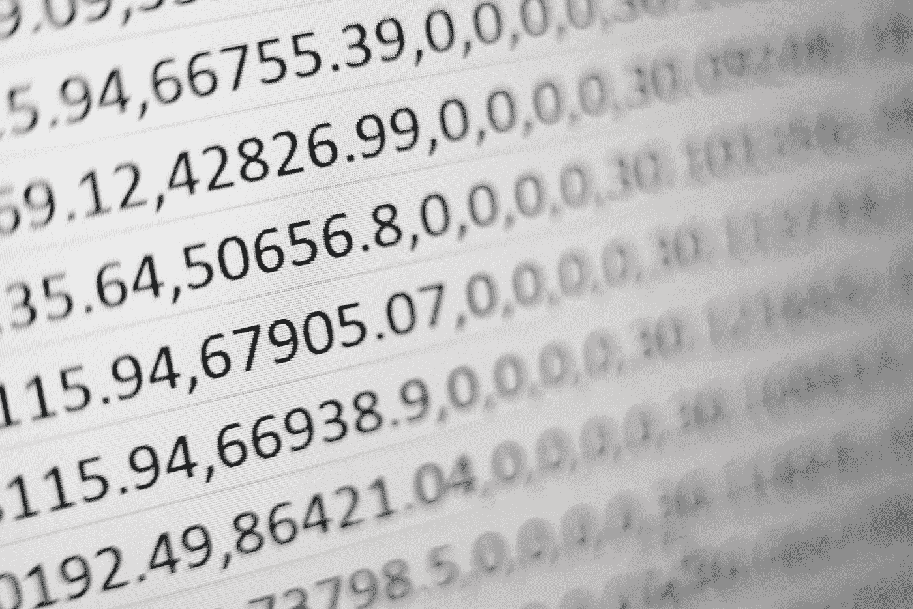

米卡·鲍梅斯特在 [Unsplash](https://unsplash.com/s/photos/number?utm_source=unsplash&utm_medium=referral&utm_content=creditCopyText) 上的照片

你好。如果你想知道**机器学习** (ML)到底是什么，**数据分析**和 ML 有什么关系，为什么每次你碰到 ML/数据分析我们都会听到 **Python** ？别再担心了，你马上就能找到答案了。

一旦你读完这篇文章，你将对什么是机器学习有一些基本的了解，为什么 Python 如此流行来执行 ML 模型的数据分析，你将能够自信地在你的工作场所加入关于 ML 的对话。本文可能是您学习这些技术的第一步。所以，让我们不要再拖延，直接进入主题。

**什么是机器学习？**

机器学习是人工智能(AI)的一个子集，通过从提供的数据中提取模式，训练模型像人一样思考和工作。如果一个 ML 程序有 99 行数据，你的算法可以预测第 100 行，而不需要人工编程。机器学习大致分为三种技术，即**监督学习、非监督学习**、**强化学习**。在本文中，我们将研究监督学习用例，您可以从中了解更多信息。在 medium.com 有许多伟大的文章都在谈论 ML，但我发现[有一篇文章](/machine-learning-101-for-dummies-like-me-bdc6d03e1a38)，它用简单的术语展示了机器学习的完整概述，可能有助于你更多地了解 ML。

**什么是数据分析？** 通俗地说，数据分析无非就是了解你的**数据**。在互联网时代之前，数据非常有限，因为来源很少。但是，现在几乎所有东西都是数据的来源，从你手中的智能手机到你的搜索历史。因此，现在我们不仅拥有海量数据，还拥有各种各样的数据，如结构化、非结构化和半结构化数据。让我们以一个简单的 excel 表格为例，它有 100 列和 50k 多条记录作为数据源。为了从数据中获得一些有用的输出，您需要首先开始理解它。因此，您可以按照这些步骤来分析数据。

*   从名称理解 excel 中列的用途。
*   找出对你有用的栏目。
*   去掉不需要的数据列。
*   从您感兴趣的列中删除重复值或空值。
*   将任何特殊或不需要的字符转换成数字或有意义的数据。

就是这样！您已经完成了清理和分析数据源的基本步骤。当然，当你为一个组织工作时，数据不会是简单的 excel 表格。数据可以是任何格式或任何类型:它可以是 CSV 文件、日志转储文件、事务性文件、数据库等。仅通过人工分析它们将是一项具有挑战性且乏味的任务。因此，我们借助各种可用的编程语言，如 Python、R、Java、SQL、Scala 等。还有很多工具，像 IBM SPSS，Power BI，Matlab。现在，这将我们带到文章中的下一个主题，为什么我们使用 Python 进行数据分析，为什么它是数据科学家或爱好者学习的最佳语言。

**为什么 Python 这么受机器学习的欢迎？**

让你惊讶的是 **Python** 从 90 年代就存在了。但是最近它变得流行是因为它的**开源社区**。Python 比许多编程语言有更多的优势，例如:

*   用 python 编写代码很简单，因为它避免了编写大量样板代码。
*   Python 主要强调其清晰的可读性和**自然语言语法。**
*   由于互联网上有大量的教程，这也很容易学会。
*   Python 的主要优势是它的**强大的库。**

库只不过是函数或方法的集合，你可以在代码中使用它们来执行某些操作，只需在需要时导入并调用它们，而不是从头开始编写。Python 有强大的机器学习库，如 Pandas、NumPy、SciPy、Seaborn、Matplotlib、Scrapy、Scikit-learn、Tensorflow、PyTorch、Plotly 等..

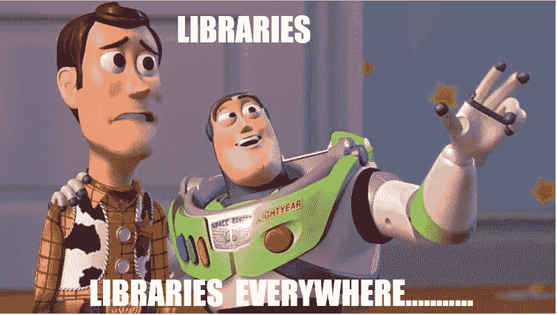

现在，不要被所有这些库和它们的名字所迷惑或淹没。理想情况下，您不会使用所有这些工具来执行数据分析和生成 ML 模型。但是对于一个数据科学家来说，掌握其中一些知识是很有必要的，这样会使他的工作变得容易得多。当您将这些库用于用例时，您会对它们有更好的理解，所以，关于库的讨论已经足够了。让我们在 Python 的帮助下，尝试使用数据分析技术解决一个用例，并建立一个预测性的机器学习模型，从而开始一些行动。

# 使用案例:

正如我前面提到的，互联网上有大量的资源可以用来学习 ML、数据分析和 Python。通过利用这些资源中的一些，我们将挖掘在 [UCI](https://archive.ics.uci.edu/ml/datasets/Adult) 机器学习回购或 [Kaggle](https://www.kaggle.com/anirudhraj/adult-salary-predictor) 中可用的**成人工资数据集**。

我已经将我在这个数据集上的工作整合到我的 Kaggle 笔记本中，可以在这里找到。为了更好地理解，这本笔记本在每一行代码上都有适当的注释，我也会使用笔记本中的代码片段在本文中进行更多的阐述。

**问题陈述** :
你得到了一个 Excel 数据集，它有 15 列 48842 行。我们的任务是分析数据集，并通过开发一个有监督的机器学习模型来预测一个成年人的年收入是否会超过 50k。


由 [Alexander Mils](https://unsplash.com/@alexandermils?utm_source=unsplash&utm_medium=referral&utm_content=creditCopyText) 在 [Unsplash](https://unsplash.com/s/photos/salary?utm_source=unsplash&utm_medium=referral&utm_content=creditCopyText) 上拍摄的照片

好了，让我们从导入一些需要的库/模块开始。正如我在本文前面提到的，库只不过是大量已经编写好的代码，你需要做的就是在需要的时候使用它们。对每个导入的注释将解释其目的。

```
*# Import libraries* 

**import numpy as np** *# linear algebra*
**import pandas as pd** *# data processing,* 

*# Libraries for data visualization*
**import matplotlib.pyplot as pplt ** 
**import seaborn as sns** 
**from pandas.plotting import scatter_matrix**

*# Import scikit_learn module for the algorithm/model: Linear Regression*
**from sklearn.linear_model import LogisticRegression***# Import scikit_learn module to split the dataset into train.test sub-datasets*
**from sklearn.model_selection import train_test_split** *# Import scikit_learn module for k-fold cross validation*
**from sklearn.model_selection import KFold
from sklearn.model_selection import cross_val_score***# import the metrics class*
**from sklearn import metrics**# import stats for accuracy 
**import statsmodels.api as sm**
```

下一步是**加载数据集**。

```
*#load the dataset provided*
**salary_dataset = pd.read_csv('../input/adult-incomedataset/adult.csv')**
```

现在，如果你仔细阅读，上面的这一行代码可能会引起你的兴趣。这一行代码解释了很多关于 Python 简单而自然的语言语法。由于我们想要读取/加载一个 CSV，我们只需使用我们已经导入的 Pandas 库提供的 **read_csv()** 函数，并将其别名为 **pd** 。所以，现在我们需要做的就是从库中调用适当的函数，即 **pd.read_csv()** 。这向我们展示了 Python 库有多强大，可以在一行中加载一个 CSV 文件。

# 分析数据:

让我们开始分析提供的 excel。我们需要知道列、行、空对象等的数量。那么，让我们打开 excel 表，开始计算列数，获得行数，遍历每一行，找出其中的任何特殊字符或空值，找出所提供的每一列的数据类型。听起来单调乏味，对吗？不要担心，Python 和它的库可以提供帮助，让我们来看看如何实现。

```
*# salary dataset info to find columns and count of the data* 
**salary_dataset.info()**
```

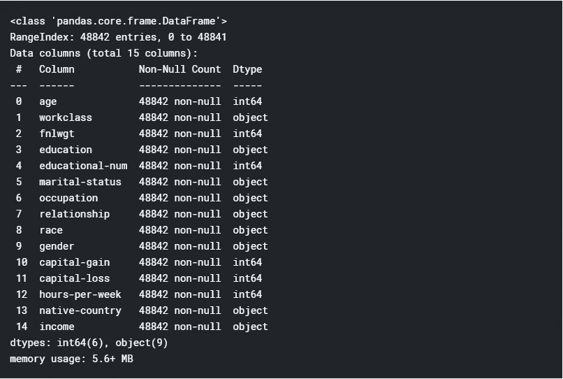

看看这有多简单，同样只是一行代码，我们在其中调用适当的函数**。熊猫提供的 info()** 。我们得到了所有我们需要的信息，比如数据类型、空值计数、行数等。

我们看到一些列名中有特殊字符。我们最好删除它们，因为它们可能会给我们的数据分析带来问题。我们可以用熊猫**轻松做到这一点。**重命名()【函数】如下所示

```
*#replacing some special character columns names with proper names* 
**df.rename(columns={'capital-gain': 'capital gain', 'capital-loss': 'capital loss', 'native-country': 'country','hours-per-week': 'hours per week','marital-status': 'marital'}, inplace=True)
df.columns**
```

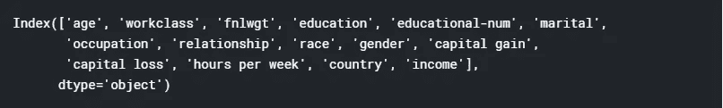

扫一眼提供的数据，我们可以看到数据中有一些特殊字符，如**'？'**。因此，让我们来计算数据中出现的特殊字符的数量。

## 数据清理:

```
*#Finding the special characters in the data frame* 
**df.isin(['?']).sum(axis=0)**
```

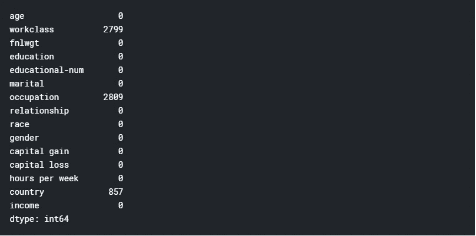

数据中包含特殊字符是不可取的，因为这可能会导致不正确的数据分析和预测模型。所以，我们需要摆脱他们。为了实现这一点，我们可以利用如下所示的库。

```
*# code will replace the special character to nan and then drop the columns* 
**df['country'] = df['country'].replace('?',np.nan)
df['workclass'] = df['workclass'].replace('?',np.nan)
df['occupation'] = df['occupation'].replace('?',np.nan)***#dropping the NaN rows now* 
**df.dropna(how='any',inplace=True)**
```

首先，更换所有的**'？'**用 NaN(NaN 在 pandas 中用作缺失数据的占位符)，为此，使用 python 的 string**replace()**function**用 NumPy 的(之前作为 np 导入)NaN。**

**第二，使用**。dropna()** 函数删除缺少值的行。dropna()可以删除列或行，默认情况下，如果没有提到 axis 关键字，它将删除行。**如果行**中存在任何**缺失值，how='any'** 将删除这些行。你可以通过 w3resource [链接](https://www.w3resource.com/pandas/dataframe/dataframe-dropna.php)了解更多关于 dropna()的信息。**

# **特征工程:**

**机器学习模型需要用数字符号输入数据，以从中提取模式并进行预测。但是，并不是我们的源数据集中提供的所有数据都是数字的。提供的一些数据是分类数据，如工作类别、教育、婚姻状况、职业、关系等。我们需要把这些转换成数字符号。**

**在这里，数据只是我们的模型用作输入的一个特征。因此，我们对数据执行特征工程，从源数据集中创建有意义的数字数据。**

****

**安德鲁·布坎南在 [Unsplash](https://unsplash.com/s/photos/number?utm_source=unsplash&utm_medium=referral&utm_content=creditCopyText) 上的照片**

**我们有 15 个特征(列)，我们的最终目标是预测收入特征，使收入成为我们的**因变量。**如果其余 14 个特征中的任何一个影响目标特征，那么这些特征被称为**独立变量。****

**为了保持文章的简洁并避免与模型无关的数据，我们将避免输入数据中不太独特或有噪声的特征。这有助于我们细化我们的特征以识别独立变量。但是，这可能不适用于所有数据集，这取决于您正在处理的数据类型以及要素的重要性。**

```
*#running a loop of value_counts of each column to find out unique values.* 
**for c in df.columns:
    print ("---- %s ---" % c)
    print (df[c].value_counts())**
```

**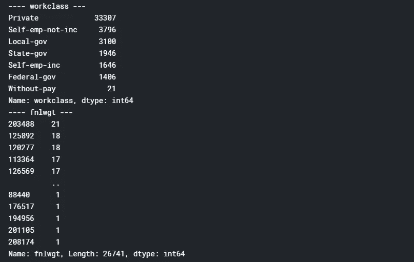**

**这里，我们使用**对所有列运行了一个 for 循环。Pandas 的 value_counts()** 函数，它获得唯一值的计数。我们可以看到，提供的一些数据是唯一的，如“workclass”属性只有 7 个不同的值，而一些列有很多不同的值，如 fnlgwt 属性有大约 2000 多个值。**

**所以，让我们去掉那些有噪声数据的属性。**

```
*#dropping based on uniquness of data from the dataset* 
**df.drop(['educational-num','age', 'hours per week', 'fnlwgt', 'capital gain','capital loss', 'country'], axis=1, inplace=True)**
```

**熊猫**。drop()** 函数用来删除指定的列或行。 **axis=1** 表示我们打算删除列本身， **inplace=True** 表示我们在删除列后用清理后的数据集替换原始数据帧，即 df。**

**现在，我们剩下 8 个特征，它们是**分类数据。**正如我们之前讨论的，我们需要将这些数据转换成我们的 ML 模型可以理解的数字符号。有许多不同的方法来实现这种数据转换，如这里的[所述](https://pbpython.com/categorical-encoding.html)。用数字替换分类数据的简单而基本的方法，即使用 Pandas **。【T21 地图()】功能。****

**让我们从我们的目标属性开始，它是收入列。我们看到收入列有两个唯一值，分别是 **' < =50K'** 和 **' > 50K'** 。我们可以很容易地将这些字符串字符映射到数字数据。map()函数如下所示。**

```
*#mapping the data into numerical data using map function*
**df['income'] = df['income'].map({'<=50K': 0, '>50K': 1}).astype(int)**
```

**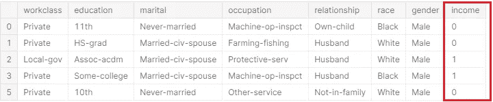**

**我们可以看到，现在我们的收入属性有了数值数据。熊猫。map()函数已经将每个'<=50K’ with 0 value and ‘> 50K '替换为 1 和**。astype(int)** 是指被替换的值应该是类型 **int** 。**

**使用 map 函数，我们可以将数据集中的所有其他分类数据转换为数字数据。**

```
*#gender*
**df['gender'] = df['gender'].map({'Male': 0, 'Female': 1}).astype(int)***#race* **df['race'] = df['race'].map({'Black': 0, 'Asian-Pac-Islander': 1,                     'Other': 2, 'White': 3, 'Amer-Indian-Eskimo': 4}).astype(int)**#marital **df['marital'] = df['marital'].map({'Married-spouse-absent': 0, 'Widowed': 1, 'Married-civ-spouse': 2, 'Separated': 3, 'Divorced': 4,'Never-married': 5, 'Married-AF-spouse': 6}).astype(int)**#workclass **df['workclass'] = df['workclass'].map({'Self-emp-inc': 0, 'State-gov': 1,'Federal-gov': 2, 'Without-pay': 3, 'Local-gov': 4,'Private': 5, 'Self-emp-not-inc': 6}).astype(int)**#education **df['education'] = df['education'].map({'Some-college': 0, 'Preschool': 1, '5th-6th': 2, 'HS-grad': 3, 'Masters': 4, '12th': 5, '7th-8th': 6, 'Prof-school': 7,'1st-4th': 8, 'Assoc-acdm': 9, 'Doctorate': 10, '11th': 11,'Bachelors': 12, '10th': 13,'Assoc-voc': 14,'9th': 15}).astype(int)**#occupation **df['occupation'] = df['occupation'].map({ 'Farming-fishing': 1, 'Tech-support': 2, 'Adm-clerical': 3, 'Handlers-cleaners': 4, 
 'Prof-specialty': 5,'Machine-op-inspct': 6, 'Exec-managerial': 7,'Priv-house-serv': 8,'Craft-repair': 9,'Sales': 10, 'Transport-moving': 11, 'Armed-Forces': 12, 'Other-service': 13,'Protective-     serv':14}).astype(int)***#*relationship
**df['relationship'] = df['relationship'].map({'Not-in-family': 0, 'Wife': 1, 'Other-relative': 2, 'Unmarried': 3,'Husband': 4,'Own-child': 5}).astype(int)**
```

**我们数据集的最终数字输出将是:**

**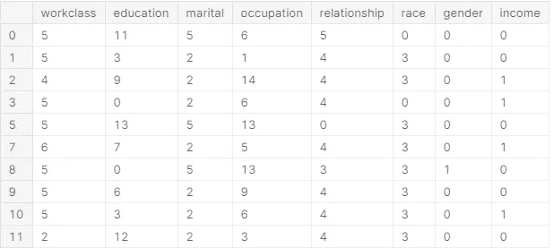**

**这是我们最后的数字符号数据集。其现在可以被馈送到任何 ML 预测建模算法中。在我们尝试这样做之前，我们应该将数据可视化，并寻找我们可以在数据集的变量之间推导出的任何相关性。**

# **数据可视化:**

**这里，我们将尝试找出最终数值数据集的每一列与目标属性 income 之间的关系。这可以通过在收入和其他各栏之间创建一个条形图来实现。**

```
*#plotting a bar graph for Education against Income to see the co-relation between these columns* 
**df.groupby('education').income.mean().plot(kind='bar')**
```

**我们正在使用熊猫 [**绘制条形图。plot()**](https://pandas.pydata.org/pandas-docs/version/0.23.4/generated/pandas.DataFrame.plot.html) 函数可视化教育与收入属性之间的关系。我们通过使用熊猫**对教育价值进行分组来实现它。groupby()** 使用**对收入属性的平均值执行函数。平均值()**。同样，我们可以绘制出所有其他独立属性相对于收入的条形图，如下所示。**

****

**各种特征与收入均值的条形图。**

**通过这些可视化，我们可以推导出我们的独立属性和从属属性之间的一些相关性:**

1.  **拥有专业学校(7)和博士学位(10)教育背景的成年人将有更好的收入，他们的收入很可能高于 5 万英镑。**
2.  **我们的数据表明，职业为专业教授(5)和高级管理人员(7)的人收入超过 5 万英镑的可能性更大。**
3.  **性别条形图为我们提供了一些有用的数据洞察，即男性(0)更有可能有更高的收入。**
4.  **关系图告诉我们，妻子(1)和丈夫(4)有更高的收入。一对已婚夫妇最有可能挣 5 万多英镑。**
5.  **根据数据，亚裔 Pac-Islander 人(1)或白人(3)收入超过 5 万英镑的机会更多。**
6.  **自我雇佣(0)，联邦政府(2)的工人阶级有更高的机会赚取超过 50K。**

**我们可以看到，我们所有的数字属性对我们的目标可变收入都有一些影响。因此，我们应该创建一个 ML 模型，将我们所有的数字数据作为输入。**

# **型号选择:**

**大约有 60 多种预测建模算法可供选择。我们必须很好地理解我们的数据和我们正在寻找的理想解决方案，以缩小我们的模型选择。这里我们的目标是预测收入，收入可以是 0 或 1(小于 50K 或大于 50K ),我们希望确定我们的产出(收入)和其余独立特征(教育、工作类别、性别等)之间的关系。).这个场景是分类的经典例子(分类收入是否是<50K or more ).**

**We are provided with 48K rows of the labeled dataset tagged with the output column “income” to train our model. Whenever the dataset is labeled and output feature is known, we opt for the **监督学习**机器学习技术。因此，我们的用例是一个监督学习加分类问题。根据这些标准，我们可以将选择的型号缩小到以下几种:**

*   **逻辑回归**
*   **KNN 或 k-最近邻**
*   **支持向量机**
*   **朴素贝叶斯分类器**
*   **决策图表**
*   **随机福里斯特**

## **逻辑回归:**

**逻辑回归是用于范畴分类的最简单和最常用的监督机器学习算法之一。逻辑回归的基本概念很容易理解，可以用作任何二元(0 或 1)分类问题的基线算法。对于这个用例，我们将选择逻辑回归作为我们的分类模型，因为对于任何初学者来说，从一个简单而流行的算法开始将是一个良好的开端。**

**逻辑回归是一种统计预测模型，可以预测“是”(1)或“否”(0)。它基于范围在 0 和 1 之间的 *Logit 或 Sigmoid 函数。不要因为听到一个数学函数而害怕。让我简单地给你解释一下。***

**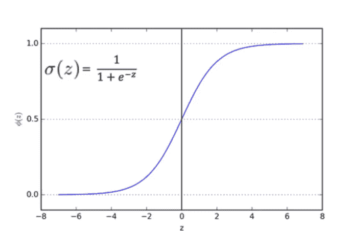**

**sigmoid 函数**

**如果我们在这里观察，sigmoid 函数是一条在值 0 和 1 之间延伸的“S”形曲线，它是根据函数输入一组数据时的输出绘制的。我们可以看到，sigmoid 函数方程是 1 除以 1 加上 e 的-z 次方，其中 e 是一个数学常数，称为欧拉数。**

**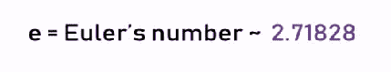**

**所以，等式的输出应该在 0 和 1 之间。如果 z 值为正无穷大，预测值将为 1，如果 z 值为负无穷大，预测值将为 0。如果将我们拥有的数字数据输入 sigmoid 函数，我们将得到一个小于 0.5 的值，即归类为 0，或者大于 0.5 的值，归类为 1。**

**好吧！这是逻辑回归背后的所有数学，学习和理解它真的取决于你，因为 Python 的 *scikit* 库将通过一个函数调用为你解决所有这些数学问题。但是，对于一个优秀的数据科学家来说，了解所有的数学背景是必须的。**

**现在让我们看看如何利用 Scikit python 库来解决我们的分类问题。**

## **识别特征:**

```
*#Transform the data set into a data frame**#X axis = We concatenate the Relationship, Education,Race,Occupation columns concate using np.c_ provided by the numpy library*
**df_x = pd.DataFrame(np.c_[df['relationship'], df['education'], df['race'],df['occupation'],df['gender'],df['marital'],df['workclass']], columns = ['relationship','education','race','occupation','gender','marital','workclass'])***#Y axis = Our* dependent *variable or the income of adult i.e Income* **df_y = pd.DataFrame(df.income)**
```

**在这里，我们将数据分为两个独立特征，一个是作为 df_y 的收入，另一个是作为 df_x 的关系、种族、职业、性别、婚姻、工作类别。**

## **拆分数据:**

```
*#Initialize the linear regression model*
**reg = LogisticRegression()***#Split the data into 77% training and 33% testing data*
*#NOTE: We have to split the dependent variables (x) and the target or independent variable (y)* **x_train, x_test, y_train, y_test = train_test_split(df_x, df_y, test_size=0.33, random_state=42)**
```

**我们从调用 scikit 库中的函数 **LogisticRegression()** 开始，并将它赋给变量 *reg* 。然后，我们使用 **train_test_split()** 将数据分为测试集和训练集，这有助于更好地训练模型并测试其性能。 **test_size=0.33** 用我们拥有的 33%的数据创建一个测试数据集，剩下的 77%将作为我们的训练集来训练我们的模型。这个 split 函数返回一对训练集(x_train，y_train)和一对测试集(x_test，y_test)。**

```
*#Train our model with the training data* **reg.fit(x_train, y_train)***#print our price predictions on our test data*
**y_pred = reg.predict(x_test)**
```

**然后我们使用**训练我们的模型。fit()** 函数为其提供我们的训练集，并使用**获得输出预测。**预测()【函数】通过饲养测试集。**

****预测与评估:****

**现在让我们验证我们的模型是如何工作的。**

```
*#feeding the predict function with our test values in the format 
[['relationship','education','race','occupation','gender','marital','workclass']]*
**reg.predict([[1,7,3,7,0,2,0]])**
```

**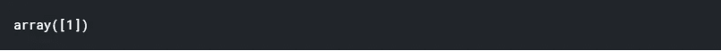**

**我们向我们的模型提供测试数据，以便根据我们之前使用数据可视化所做的假设进行预测。我们假设，如果关系状态为 1 或 4，教育为 7 或 10，种族为 1 或 3，职业为 5 或 7，性别为男性即 0，婚姻状态为 2 或 6，工作级别为 0 或 2，那么一个人的收入将超过 50K。因此，我们正确地预测了一个具有这些特征的人肯定能够赚到超过 50K，并返回了预测值 1。**

**我们可以使用各种模型评估指标来评估我们的模型，比如 python 的 *sklearn* 库提供的准确性。**

```
#printing the accuracy values **
print("Accuracy:",metrics.accuracy_score(y_test, y_pred))**
```

****

**我们实现了 **76%** 的准确度值，这对于任何机器学习预测模型都是好的，尤其是对于分类回归问题。**

# **结论:**

**终于！我们使用 Python 及其强大的库成功创建了一个分类机器学习预测模型，该模型可以预测给定成年人的收入是否会> 50K。**

**我希望你花 15 分钟的时间阅读这篇文章，并了解什么是数据分析，如何建立机器学习模型，以及 python 如何帮助我们建立这些模型。这篇文章可能是你机器学习旅程的第一步，但是请记住马克·吐温的话:**

> **“取得成功的秘诀在于开始行动”**

**如果你在这里，我假设你是一个编程爱好者，想学习机器学习方面的知识。我建议你从学习 python 的基本概念开始，如果你不熟悉， [w3schools](https://www.w3schools.com/python/) 简单而优雅的 Python 教程是学习基础知识的最好地方。**

**一旦你掌握了基础知识，不要急于学习 python 上所有可用的库，你不需要所有的库，从一些对 ML 来说最重要的库开始，比如 Numpy，Pandas，拥有这些库的中级知识足以开始你的数据科学家生涯。**

**Kaggle 是 ML 的一个很好的学习资源，你可以在超过 19，000 个公共数据集上学习和练习。一旦你熟悉了你在这篇文章中学到的基础知识，我建议你去参加 Kaggle 的传奇[泰坦尼克号](https://www.kaggle.com/c/titanic)预测比赛，这是一个分类问题，有一些很棒的笔记本可以学习，并开始编写你的预测模型。**

**让我知道评论中的任何建议或改进。**

> **快乐学习！！再见。**