# Python 数据可视化初学者指南

> 原文：<https://towardsdatascience.com/a-beginners-guide-to-data-visualization-with-python-49f1d257c781?source=collection_archive---------15----------------------->

## 如何用几行代码创建强大的可视化效果


卢克·切瑟在 [Unsplash](https://unsplash.com/s/photos/data-visualization?utm_source=unsplash&utm_medium=referral&utm_content=creditCopyText) 上的照片

> 图表有魔力。一条曲线的轮廓在一瞬间揭示了一个整体的情况——一场流行病、一场恐慌或一个繁荣时代的生活史。曲线通知头脑，唤醒想象力，令人信服。

## 什么是数据可视化？

数据可视化是获取数据并以可视格式呈现的行为。这是一种用于交流信息的强大技术，它允许读者立即从数据中获得洞察力。

## 为什么要数据可视化？

让我举一个小例子来展示数据可视化的强大。

这是一些样本数据，有三个变量——“年龄组”、“使用互联网”和“不使用”

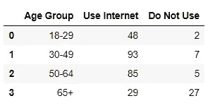

*免责声明:这不是真实的数据，我只是创建它来展示可视化的重要性。*

根据上面的数据，你能找出年龄组和互联网使用之间的关系吗？

你大概可以从数据中看出一些趋势。你也许还能找到互联网使用最频繁的年龄组。

但是，仅仅看上面的数据，很难得到一个清晰的画面。

现在，我用一行代码创建了两个图表来模拟这种关系。

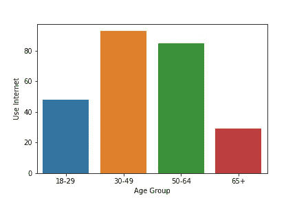

使用互联网

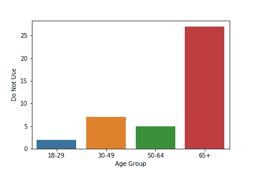

不要使用互联网

看出区别了吗？

从杂乱的数据中生成一个简单的图表可以给我们提供有价值的见解，并帮助我们找到我们从来不知道存在的趋势。

数据可视化通常用于数据科学过程的两个阶段:

*   当你，数据科学家，试图理解数据的时候。
*   当您试图向他人展示您的数据发现时。

在本教程中，我将向您展示如何使用内置库(如 Matplotlib 和 Seaborn)在 Python 中执行探索性数据可视化。

我将使用来自 [Kaggle 的泰坦尼克号数据](https://www.kaggle.com/c/titanic) t 的 [train.csv](https://www.kaggle.com/c/titanic/data?select=train.csv) 文件。

## 导入库

```
import numpy as np
import pandas as pd
import matplotlib.pyplot as plt
import seaborn as sns
%matplotlib inline
```

*注意:确保你已经安装了所有这些库。如果没有，您可以使用简单的 pip 命令安装它们。*

## 创建数据框架

```
df = pd.read_csv("train.csv")
df.head()
```

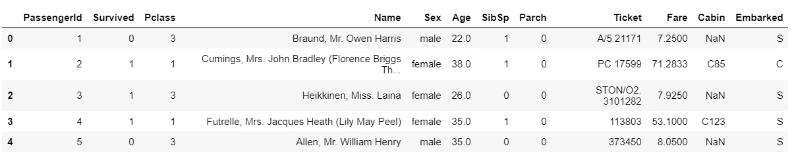

看看数据帧的头部，这是我们得到的信息。

数据帧中有 12 个变量。这些是:

1.  PassengerId:每个乘客的唯一 Id
2.  Pclass:客运类；第一、第二和第三。第一个是上层阶级，第三个是下层阶级。
3.  名字
4.  性
5.  年龄
6.  SibSp:船上的兄弟姐妹和/或配偶人数
7.  Parch:船上父母和/或子女的人数
8.  机票:机票号码
9.  票价
10.  小木屋
11.  装船:装船港
12.  幸存:是否有乘客在泰坦尼克号上幸存。值 1 表示乘客幸存，值 0 表示他们没有。

如果您想更多地了解您的数据集(例如行数)，我建议使用 Pandas profiling。

这是一个功能强大的工具，可用于分析您的数据框。您不必一次又一次地运行代码行来检查缺少的值或变量类型。

```
import pandas_profiling as pp
pp.ProfileReport(df)
```

只需这两行代码，就会在您的数据框上生成一个报告，如下所示:

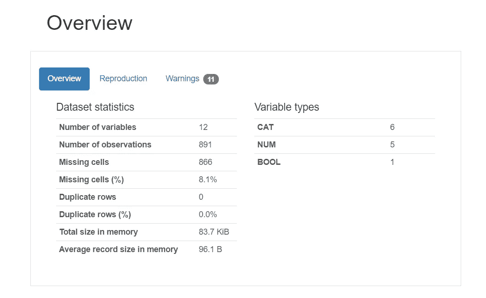

数据框概览为您提供了整个数据集的快速分析，以及缺失值、变量数量和变量类型。

报告的下一部分将为您提供对数据集中每个变量的深入分析，如下所示:

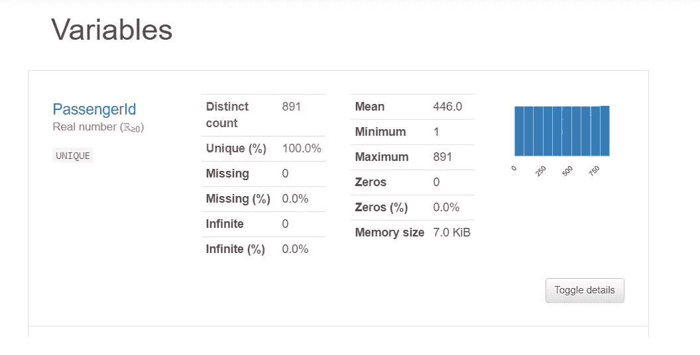

该报告还包括可视化，以映射数据集中不同变量之间的相关性。以下是生成的热图示例:

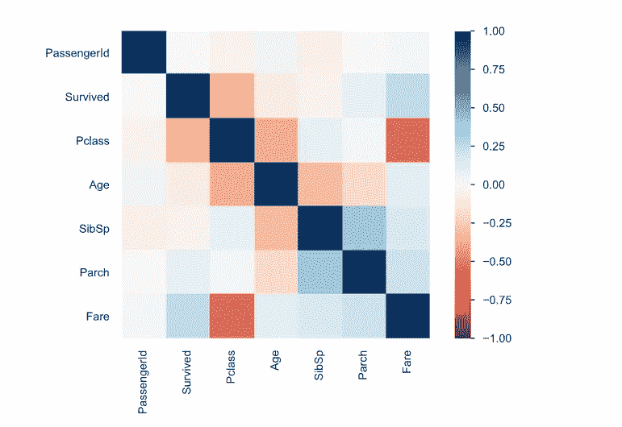

甚至在我们开始分析数据框中的每个变量之前，热图就告诉了我们许多不同变量之间的关系。

只要看一看，我们就可以知道有些值比其他值更高度相关。这在进行预测或回答某些数据问题时非常有帮助，我们将在后面详细解释。

## 数据问题

在开始任何类型的数据分析或可视化之前，您必须在头脑中有一个数据问题。

你试图从数据中得出什么样的见解？有什么特定的趋势或模式吗？

写下几个你想借助可视化回答的问题。

在这种情况下，我们希望在本教程结束时能够回答以下数据问题:

1.  泰坦尼克号上有多少人幸存？
2.  哪种性别更有可能在泰坦尼克号上幸存？
3.  乘客所在的班级对他们的生存有影响吗？
4.  年轻人更有可能在泰坦尼克号上幸存吗？
5.  支付更高票价的乘客更有可能在泰坦尼克号上幸存吗？

既然我们已经知道要寻找什么，我们就可以开始数据可视化了。

## 变量类型

在处理数据时，你会遇到两种主要类型的变量，即**分类变量**和**定量变量**。

**分类**:分类变量，顾名思义，就是有两个或两个以上类别的变量。它表示可以分组的数据类型。

例如:在泰坦尼克号的数据集中，变量“性别”是绝对的。它代表了两类人；男性和女性。

**定量:**定量，或数字变量代表一个可测量的量。

例如:变量“年龄”是一个数量变量。

有不同的方法来可视化定量和定性变量，我们将继续讨论。

## 可视化分类变量

我们将首先通过使用 Seaborn 中的“计数图”来可视化单个变量。

计数图是**可视化分类变量**的一种简单方式。顾名思义，它显示一个变量的频率。

想象泰坦尼克号上有多少人幸存:

```
sns.countplot(x='Survived',data=df)
```

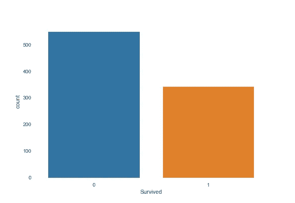

泰坦尼克号生存计数图

从这张图表可以看出，泰坦尼克号上没有生还的人比幸存的人多得多。

使用计数图，我们现在可以可视化数据框中的其他分类变量:

*   性别:

```
sns.countplot(x='Sex',data=df)
```

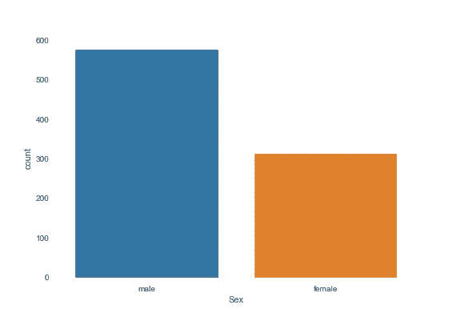

《泰坦尼克号》中的性别分布

泰坦尼克号上的男性乘客似乎比女性乘客多得多。

*   Pclass

```
# Pclass:
sns.countplot(x='Pclass',data=df)
```

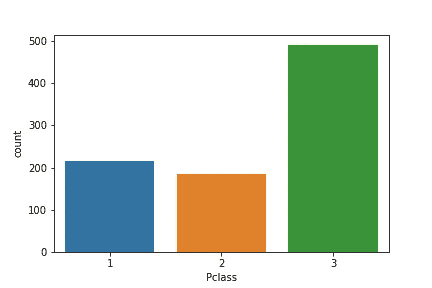

乘客的等级分布

图表显示泰坦尼克号上三等舱的乘客比其他任何舱都多。

*   从事

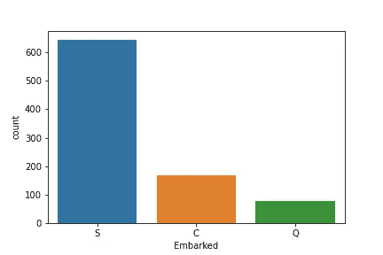

从事

泰坦尼克号上的大多数乘客都是从 s 港上船的。

## 可视化定量变量

为了形象化定量变量的分布，我们可以使用直方图。

直方图相当于计数图，但用于数值数据。

首先，我们将创建一个直方图来可视化泰坦尼克号上乘客的年龄分布:

```
sns.distplot(df['Age'])
```

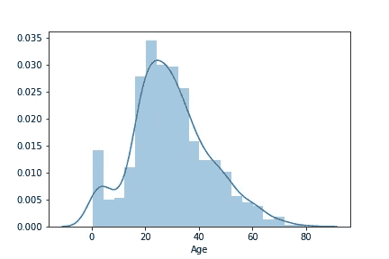

泰坦尼克号乘客的年龄分布

从上面的柱状图可以看出，泰坦尼克号上的大多数乘客年龄在 20-40 岁之间。

接下来，我们将看看变量“Fare”:

```
sns.distplot(df['Fare'])
```

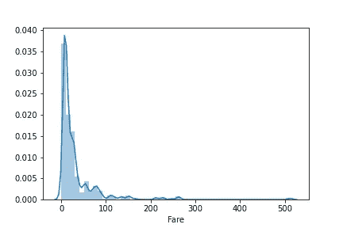

可以观察到，大多数乘客支付了大约 0-50 英镑的车费。有一些异常值——一些价格高达 500 英镑。

较低“等级”的乘客，如三等舱的乘客，支付比较高等级乘客更低的票价是合理的。

我们很容易想象这种关系。

## 可视化多个变量

在进行数据分析时，我们常常希望找到两个变量之间的关系。

例如，在回答问题***‘哪个性别更有可能在泰坦尼克号上幸存？’***

我们需要在这里想象两个变量——“性”和“幸存”

一个简单的方法是创建一个计数图，并添加一个色调函数。“色调”参数允许您选择一个用颜色编码来可视化的变量。

这是可视化分类变量的一个很好的方法。

这里有一个例子:

```
# Visualize survived with sex:
sns.countplot(x='Survived',hue='Sex',data=df)
```

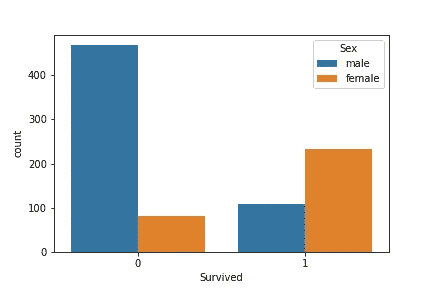

性别对存活率的影响

从这个图中，我们可以清楚地看到，泰坦尼克号上女性幸存者的数量比男性多。

同样，我们可以回答下面的问题— ***乘客所处的阶层对他们的生存有什么影响吗？***

```
sns.countplot(x='Survived',hue='Pclass',data=df)
```

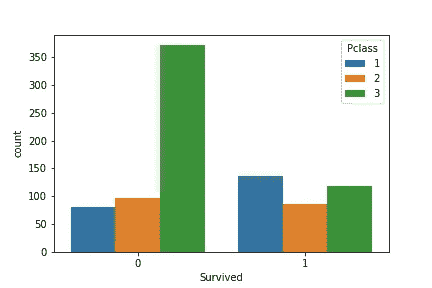

乘客级别的生存计数

```
sns.countplot(x='Pclass',hue='Survived',data=df)
```

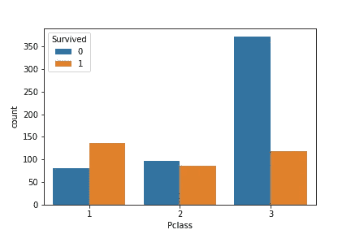

乘客级别与存活率相关

从上面的情节中，我们可以看到，三等舱的乘客比一等舱和二等舱的乘客生还的可能性要小得多。

我们现在可以用“幸存”来形象化变量“上船”

```
# Survived and embarked:
sns.countplot(x='Survived',hue='Embarked',data=df)
```

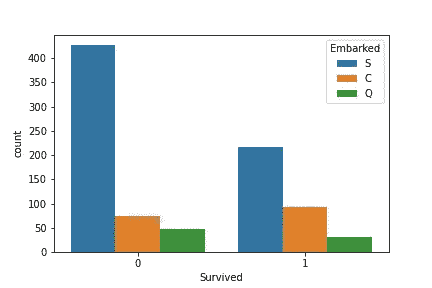

船上生存很重要

接下来，我们将看看如何用分类变量可视化一个定量变量。

“年轻人更有可能在泰坦尼克号上幸存吗？”

为了回答这个问题，我们需要将变量“存活”和“年龄”形象化。我们可以用一个简单的方框图来做这件事。

箱形图为我们提供了数值分布的良好指示，并提供了 5 个数字汇总的信息(最小值、第一个四分位数、中值、第三个四分位数、最大值)。

要完全理解盒子情节，你可以阅读[这篇](https://www.khanacademy.org/math/statistics-probability/summarizing-quantitative-data/box-whisker-plots/a/box-plot-review)文章。

```
# Age and sex with survived
sns.boxplot(data=df, x='Survived', y='Age')
```

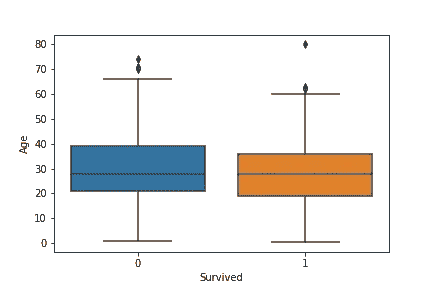

年龄和幸存

从上面的情节来看，泰坦尼克号上一个人的生存和年龄似乎没有明确的关联。

支付更高票价的乘客更有可能在泰坦尼克号上幸存吗？

为了回答这个问题，我们需要将变量“幸存”和“费用”形象化。

为此，我们可以创建一个条形图:

```
sns.barplot(x='Survived',y="Fare",data=df)
```

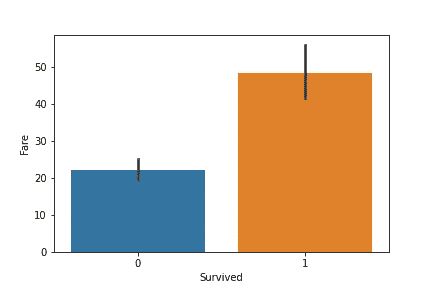

票价和幸存

可以观察到，支付较高票价的乘客比不支付的乘客更有可能幸存。

这可能是由于他们所处的乘客等级。较高级别的乘客比较低级别的乘客更有可能支付较高的票价。

我们可以想象这种关系:

```
sns.barplot(x='Pclass',y='Fare',data=df)
```

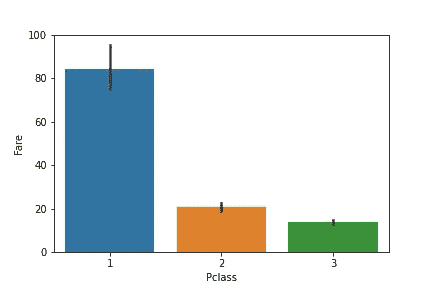

乘客等级和票价

看来我们的假设是正确的！

较高等级的乘客确实比较低等级的乘客支付更多的票价。

有时，我们希望将两个以上的变量相互可视化。例如，我们想知道特定年龄组的男性或女性是否更有可能在泰坦尼克号中幸存。

我们需要想象三个变量——“年龄”、“性别”和“存活”这些变量中有两个是分类变量，一个是定量变量。

你可以通过创建一个变量“年龄”和“性别”的方框图来做到这一点，并创建一个“幸存”的色调

```
# Age and sex with survived:
sns.boxplot(data=df, x='Age', y='Sex', hue ='Survived')
```

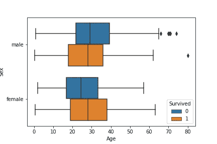

幸存的年龄和性别

我们可以用' Age '、' Pclass '和' Survived '做同样的事情，看看泰坦尼克号幸存乘客的年龄分布。

```
sns.boxplot(data=df, x='Age', y='Sex', hue ='Pclass')
```

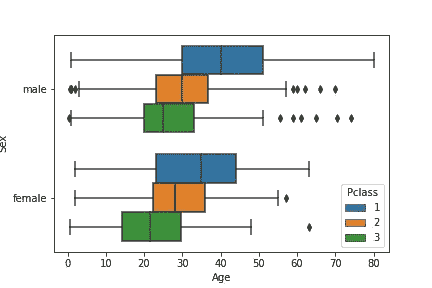

和乘客发生性关系

大多数头等舱和二等舱的乘客年龄较大，这是有道理的，因为他们会有更多的钱去乘坐更高级别的航班。

最后，要查看乘客类别、已付车费和存活率之间的关系，我们可以运行以下代码:

```
sns.barplot(data=df, x='Pclass', y='Fare', hue ='Survived')
```

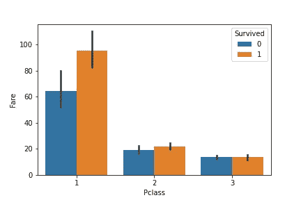

幸存的票价和乘客等级

从上面的可视化中，我们可以观察到两件事:

*   高级别的乘客要比不高级别的乘客多付很多钱。
*   等级较高的乘客更有可能在泰坦尼克号上幸存。

同时可视化两个以上变量之间的关系是非常强大的，因为它可以帮助我们同时找到模式和回答多个数据问题。

使用 Seaborn 中提供的工具创建这样的可视化也非常简单。

## 配对图

配对图是一种可视化类型，它在一个图中绘制多个变量的成对分布。

Seaborn 中的 Pair plots 只接受数字列，因此您需要选择这些列以传递到您的数据集中。

在这个配对图中，我们将每个数值变量并排显示，并选择用变量“存活”来着色:

```
numeric = df.iloc[: , [0,1,5,9]]
sns.pairplot(numeric.dropna(), hue='Survived')
```

生成的配对图如下所示:

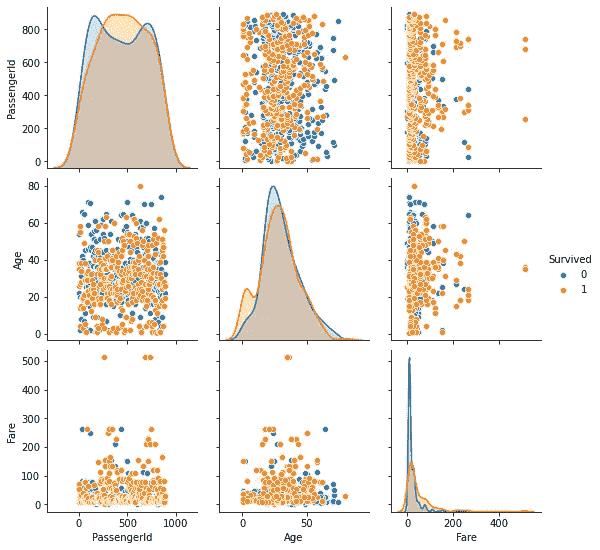

数字列与幸存列的配对图

配对图为我们提供了两种类型的可视化效果——散点图和离差图。你可以在这里阅读更多关于剧情类型[的内容。](https://seaborn.pydata.org/generated/seaborn.distplot.html)

对角线上的距离图为我们提供了单个变量的信息，类似于我们之前创建的直方图。

散点图向我们展示了所有数字变量之间的相关性。从这些变量中似乎没有观察到强有力的关系。

## 热图

我们可以在 Seaborn 生成一个热图，类似于熊猫概况报告中提供的热图。

在生成热图之前，我们需要根据数据框创建一个关联矩阵:

```
cor = df.corr()
sns.heatmap(cor)
```

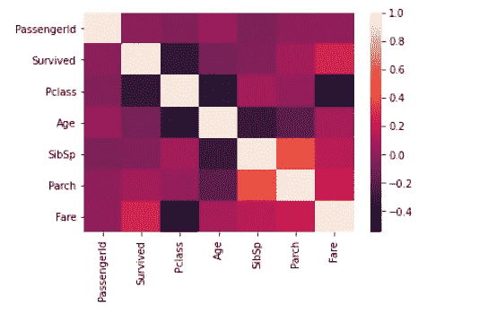

热图

热图向我们展示了数据集中变量之间的相关性。颜色的变化代表不同层次的相关性。

变量之间的相关性范围从-1 到 1。值-1 表示完全负相关，值 1 表示完全正相关。

零值表示变量之间没有任何相关性。

你会注意到热图中的对角线似乎具有 1 的相关性，这是因为每个变量都与自身完全相关。

我们可以在这里观察到一些强关系。

*   变量“SibSp”和“Parch”似乎具有正相关性。
*   变量“票价”和“幸存”似乎也有正相关关系。

## 然后…我们结束了！

我希望这篇教程能帮助你了解一些基本的可视化技术。

这将有助于在几个不同的数据集上进行探索性数据分析和可视化，以了解不同类型的变量使用何种类型的图。

数据可视化是一项很好的技能，因为您可以帮助分解复杂的数据，并根据您的发现提供有价值的见解。

它不仅能帮助你理解数据，还能让你清楚地向他人展示数据。