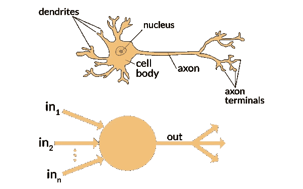
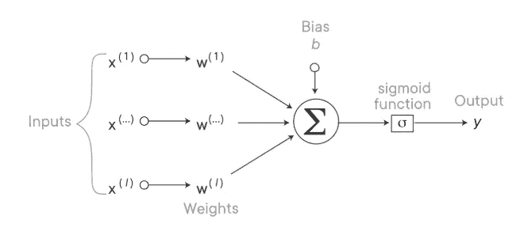

# 深度学习初学者指南

> 原文：<https://towardsdatascience.com/a-beginners-guide-to-deep-learning-ed41ac75c4e5?source=collection_archive---------10----------------------->

## 面向新数据科学家的人工神经网络速成班！

乔希·里默尔在 [Unsplash](https://unsplash.com/s/photos/brain?utm_source=unsplash&utm_medium=referral&utm_content=creditCopyText) 上的照片

近年来,“深度学习”一词已经成为众多招聘人员和公司在职位描述中的常用术语。这是一个极其复杂的课题，一些数据科学家花了一生的时间来研究。对于许多将职业转向数据科学或没有广泛人工智能背景的人来说，这似乎是一个令人生畏的课题。作为一个对此感兴趣的人，我写这篇博客是为了给那些想了解这个话题的人一个简单的概述。

本博客结束时，你将能够:

*   有效地描述什么是深度学习，以及它与机器学习有何不同。
*   描述人工神经网络及其组成部分。
*   提供深度学习的现实应用实例。

## 什么是深度学习？

深度学习是“人工智能”旗下的一类机器学习算法。用最简单的话来说，就是教机器通过例子来学习，很像人类的婴儿！当读到“人工智能”这个词时，你可能会想到流行的科幻电影，这些电影描述了机器人进化到不再需要人类，然后最终毁灭了世界。幸运的是，我们还没有到那一步，但是机器仍然可以做一些令人印象深刻的事情！例如，深度学习可以用于处理 X 射线图像，以便识别肿瘤等不规则性。它还可以用于面部识别、语音识别、文本分类甚至创建自动驾驶汽车！

**那么深度学习和机器学习有什么不同呢？**

请记住，深度学习是机器学习，这一点很重要。它们都使用给定的数据执行功能，并且随着时间的推移越来越好。主要区别在于数据如何呈现给模型。**机器学习算法需要指导和结构化数据，而深度学习网络使用多层人工神经网络(ANN)来自行确定其预测是否准确。**这使得深度学习变得极其强大，因为它可以非常好地处理非结构化数据(即图像、音频文件、文本数据)。

## 什么是人工神经网络？

模仿是最真诚的奉承形式，作为人类，还有什么比模仿人脑的机器学习网络更好的奉承形式呢？！人工神经网络是模仿人脑内部复杂的生物神经系统而设计的计算系统。

显然，人工神经网络不像人类神经系统那样复杂，但我们可以将相似之处可视化。在人类神经元中，有树突、细胞体和轴突。树突从其他神经元接收信号，并将信号向下发送到细胞体，进行一些处理，然后将信号发送到轴突和轴突终末，信号在轴突终末被转移到其他神经元，一遍又一遍(如下所示)。在人工神经网络中，加权输入被输入到一个特征节点，在那里进行一些处理，形成一个输出，然后输入到下一层，一遍又一遍。需要注意的是，输入和输出实际上是二进制的(0 或 1)。图像中没有显示的一点是节点之间的间隙，其中权重被分配给每个输入。

[https://www . quora . com/人工神经网络-计算机科学-生物神经网络之间的区别是什么](https://www.quora.com/What-is-the-differences-between-artificial-neural-network-computer-science-and-biological-neural-network)

**权重**很重要，因为它们决定了哪些特征比其他特征更重要。每个节点都有一个导致该节点“触发”的特定阈值如果加权输入的组合超过阈值，它将触发节点发信号。由于节点是二进制的，网络只是作为一个典型的线性回归模型。通过添加一个**激活函数**，它向输入提供一个非线性变换，使其能够利用相对于误差的差异进行学习。

因此，简单来说，激活函数就像一个数学“网关”,它接收输入并计算一个带有附加偏差的加权和，以确定该节点是否应该激活。这允许一些连接变得更强，导致新的连接出现，或者变弱，导致连接被消除。在下图中，使用了一个 sigmoid 激活函数。

图片来自熨斗学校

有许多不同类型的激活功能可以应用。我在下面列出了一些最常见的，但是你可以在这里[和](https://dashee87.github.io/deep%20learning/visualising-activation-functions-in-neural-networks/)[这里](https://missinglink.ai/guides/neural-network-concepts/7-types-neural-network-activation-functions-right/)了解更多:

*   **Sigmoid 激活函数:**二分类问题输出层的 go-to 函数。给出介于 0 和 1 之间的输出值。
*   **双曲正切(tanh)函数:**在中间层表现良好，因为它给出的值介于-1 和+1 之间。
*   **反正切(arctan)函数:**很多和 tanh 一样的性质，但是范围从-1.6 到+1.6，所以斜率更平缓。
*   **整流线性单元(RELU)功能:**与 tanh 一起最流行的激活功能！当输出<为 0 时，激活正好为 0，这在求导时会很麻烦。
*   **漏 RELU 函数:**通过在输出<为 0 时允许激活稍微为负，解决了 RELU 遇到的导数问题

# 真实世界的例子

让我们通过一个例子来形象地说明什么是神经网络。假设我们想在一个有 20 家不同餐馆的镇上开一家新餐馆。我们希望在给定某些输入特征的情况下预测一家餐馆的销售额，这些输入特征包括:位置、不同食品的价格以及食品选择的多样性。

现在，让我们分别看一下每项功能:

*   ***位置*** —路过餐厅的人都会被算作潜在顾客，所以位置有助于决定路过的人的数量是有道理的。
*   ***定价****——食品的定价方式决定了人们的承受能力，进而影响销售额。*
*   ****品种****——*在一家餐厅有更广泛的选择可能会被认为是一家更高质量的餐厅，并可能吸引更多的顾客。*

**

*图片由熨斗学校提供*

*因此，在食品供应中有更广泛的*品种可能会增加餐馆的感知质量，但另一方面，如果*价格高，顾客可能会感知餐馆的质量更高。这表明几个输入可能影响一个' ***'隐藏的*** '特征。在传统的神经网络中，输入和输出相互独立，但是在**递归神经网络(RNNs)** 中，节点可以使用前一个节点的输出作为当前节点的输入。你可以在这里了解更多关于 RNNs [的信息。](https://hackernoon.com/rnn-or-recurrent-neural-network-for-noobs-a9afbb00e860)***

****隐藏层**是一层节点(在本例中为路过的人数、可负担性和感知质量),其输出取决于其他节点的输入(在本例中为位置、价格和多样性),因此不像网络输出那样可见。**

****

**熨斗学校的人工神经网络图像**

**要被认为是“深度学习”，人工神经网络需要至少有两个隐藏层。每一层可以有任意数量的节点，并且可以有任意数量的层。如果你有兴趣了解更多关于不同类型的神经网络，你可以在这里了解更多关于**。****

****感谢您花时间阅读这篇博文！希望这能给你启发和信心，让你了解更多关于深度学习的知识。****

## *****参考文献*****

1.  ****[https://hacker noon . com/deep-learning-vs-machine-learning-a-simple-explain-47405 B3 eef 08](https://hackernoon.com/deep-learning-vs-machine-learning-a-simple-explanation-47405b3eef08)****
2.  ****[https://www . zendesk . com/blog/machine-learning-and-deep-learning/](https://www.zendesk.com/blog/machine-learning-and-deep-learning/)****

****3.[https://www.asimovinstitute.org/author/fjodorvanveen/](https://www.asimovinstitute.org/author/fjodorvanveen/)****

****4.[https://hacker noon . com/rnn-or-recurrent-neural-network-for-noobs-a9 afbb 00 e 860](https://hackernoon.com/rnn-or-recurrent-neural-network-for-noobs-a9afbb00e860)****

****5.[https://dashee 87 . github . io/deep % 20 learning/visualizing-activation-functions-in-neural-networks/](https://dashee87.github.io/deep%20learning/visualising-activation-functions-in-neural-networks/)****

****6.熨斗学校模块 6:第 44 部分****