# 用 Python 获取和分析工资数据的初学者指南

> 原文：<https://towardsdatascience.com/a-beginners-guide-to-grabbing-and-analyzing-salary-data-in-python-e8c60eab186e?source=collection_archive---------18----------------------->

## 提供三个用于探索性数据分析的 Python 库，让您的生活更加轻松

当我第一次开始学习 Python 时，我希望我拥有的资源之一是关于如何获取和分析数据的非常简单、实用的示例。多年来，我坚持使用 Excel 只是因为我可以相对快速地做任何事情，而且在当时，Python 似乎是一个值得怀疑的收益。

下面，我想讨论三个对探索性数据分析(EDA)非常有用的库，向那些可能想知道学习 Python 的成本效益的人强调每个库的价值。下面显示的完整代码可以在这里找到一个 [Jupyter 笔记本](https://github.com/mattygyo/medium_articles/blob/master/Levels.fyi%20Walkthrough.ipynb)。

## 查看 Levels.fyi 数据

如果你在其中一家公司(脸书/苹果/亚马逊/网飞/谷歌)工作，你可能听说过网站 [**级别。对于那些没有这样做的人来说，levels 可以很容易地比较和对比不同公司的不同职业水平，而且相对于其他薪酬网站，如**](http://levels.fyi)**[glassdoor.com](http://glassdoor.com)，Levels 通常被认为在实际技术工资方面更准确。Levels.fyi 有一个很好的界面，它的可视化使比较不同公司的工资级别变得很容易，但是，我发现自己想以一种网站上预先汇总的视图不允许的方式来分析数据。下面是我如何做的一步一步的过程。接下来，你需要一些东西来编写 Python(推荐 [Jupyter](https://medium.com/codingthesmartway-com-blog/getting-started-with-jupyter-notebook-for-python-4e7082bd5d46) )，并且知道如何安装提到的各种库(推荐初学者下载 [Anaconda](https://www.anaconda.com/) )。**

# 获取数据

检索数据是最令人困惑的部分，因为站点结构决定了数据的可访问性。幸运的是，在使用开发人员工具检查网络调用后，我发现 level.fyi 从单个端点交付其全部薪水有效负载。用 Python 抓取 JSON 数据简单得离谱，我个人就用了`[requests](https://github.com/psf/requests/)`库。将它与`[pandas](https://github.com/pandas-dev/pandas)`库结合起来，我们已经用两行代码将 JSON 存储到一个整洁的数据帧中:

```
import pandas as pd
import requestsdata = requests.get('https://www.levels.fyi/js/salaryData.json').json()
df = pd.DataFrame(data)
```

使用`requests.get`允许我们发出适当的 http 请求并返回一个响应对象。在末尾添加`json()`将响应转换成 JSON。现在我们已经有了 JSON 格式的数据，我们需要做的就是构造一个数据帧，产生如下结果:

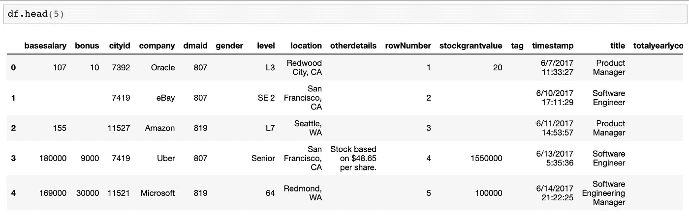

我们的数据框架示例

你可以看到有一些无用的栏目，比如`rowNumber`。我们将继续进行并删除它们，这样我们就不会在接下来的步骤中打乱我们的分析。我们还希望用数字“NaN”替换空白值，以便接下来的步骤中的一些探索性分析能够正常运行:

```
import numpy as npdf = df.drop(['cityid', 'dmaid','rowNumber'], axis=1)
df = df.replace("", np.nan)
```

现在我们已经清理了数据框架，让我们开始研究数据集吧！

# 探索性数据分析

熊猫有很多真正有用的方法来快速理解你的数据集，如`describe()`、`info()`、`shape()`等。虽然它们本身肯定是有用的，但我发现在早期记住它们会很麻烦。他们也更关注描述性统计，这并不能帮助你理解更大的问题，如数据完整性或相关性。幸运的是，这是 Python 的地盘，有三个库在为我们做繁重的工作方面做得非常好。

## 了解缺失数据的完整性

对于这个数据集，我首先想了解每个特征的完整性，以及我是否有足够的数据来进行有意义的分析(例如，检查按性别划分的工资差异，或按任期划分的股票/奖金差异)。为了做到这一点，我更喜欢使用 [missingno](https://github.com/ResidentMario/missingno) 库，它可以返回各种可视化结果，以帮助更好地理解数据集中缺失的数据。我需要做的就是导入这个库并使用下面的一行程序:

```
import missingno as msnomsno.matrix(df, figsize=(12, 8))
```

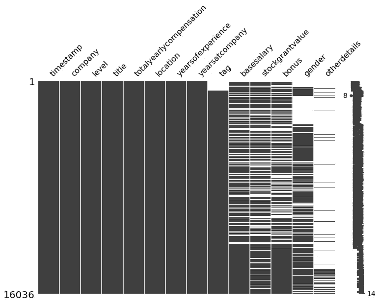

运行 msno.matrix()的输出

瞧啊。除了查看数据有多完整，我们还了解到某些功能，如“标签”、“基本工资”和“奖金”并不总是表单填写所必需的，但后来变成了必需的。它还显示，除了“其他详细信息”(和“性别”)，可选数据如“股票价值”被频繁填写，可以包含在我的初始分析中。

## 使用 Pandas_profiling 了解数据结构

现在我对数据的完整性有了一个快速的想法，我可以运行一个更深入的探索性分析。为此，我将使用一个名为 [Pandas Profiling](https://github.com/pandas-profiling/pandas-profiling) 的库。把它想象成`dataframe.describe()`，但是用了类固醇。Pandas Profiling 获取数据集的每个特征，查看数据类型，然后创建一个巨大的页面，使用分布图、分类箱、极值等详细描述每个特征。它还提供了数据集、相关矩阵的概述，以及使用上述 MissingNo 库显示所有缺失数据的部分！Lukas Frei 在这里写了一篇关于图书馆的文章，我强烈推荐这篇文章来更深入地了解熊猫概况。

我们需要做的第一件事是确保我们的数据类型是正确的类型，以便 Pandas Profiling 可以正确地解释它们。使用`df.info()`表明我们所有的列当前都是对象类型，所以让我们用下面的代码来改变它:

```
df['timestamp'] = pd.to_datetime(df['timestamp'])df[['yearsofexperience','basesalary','bonus','stockgrantvalue','totalyearlycompensation','yearsatcompany']] = df[['yearsofexperience','basesalary','bonus','stockgrantvalue','totalyearlycompensation','yearsatcompany']].apply(pd.to_numeric)
```

如果你再次运行`df.info()`，你会看到‘时间戳’是一个日期时间，其他的都变成了浮点数。现在我们的数据格式正确了，让我们使用单线奇迹来生成熊猫简介！

```
import pandas_profiling as ppdf.profile_report(style={'full_width':True})
```

一旦它运行，您应该会看到类似下图的东西，以及数据集的概述！

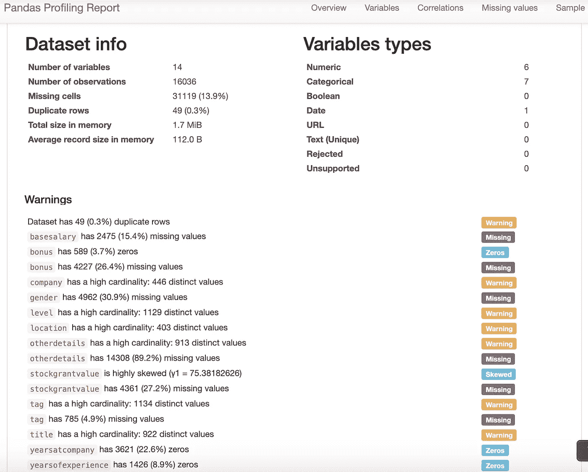

熊猫概况概述

很酷，对吧？除了汇总数据，它还突出显示相关信息，如高度基数数据、变量中缺失数据的百分比和零值。对于这篇文章，我最感兴趣的是`totalyearlycompensation`，所以让我们检查一下这个变量，看看我们能学到什么…

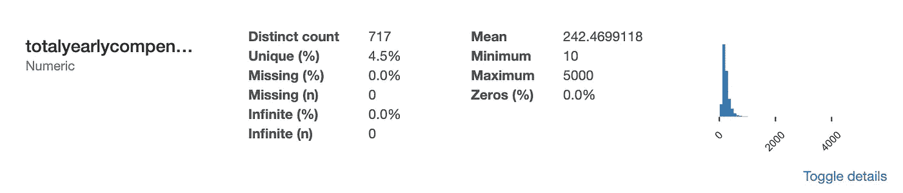

“总薪酬”变量的汇总

我们已经可以看到一些东西导致了数据的严重倾斜，因为分布高度集中在左侧。展开详细信息并转到`extreme values`选项卡，显示如下内容:

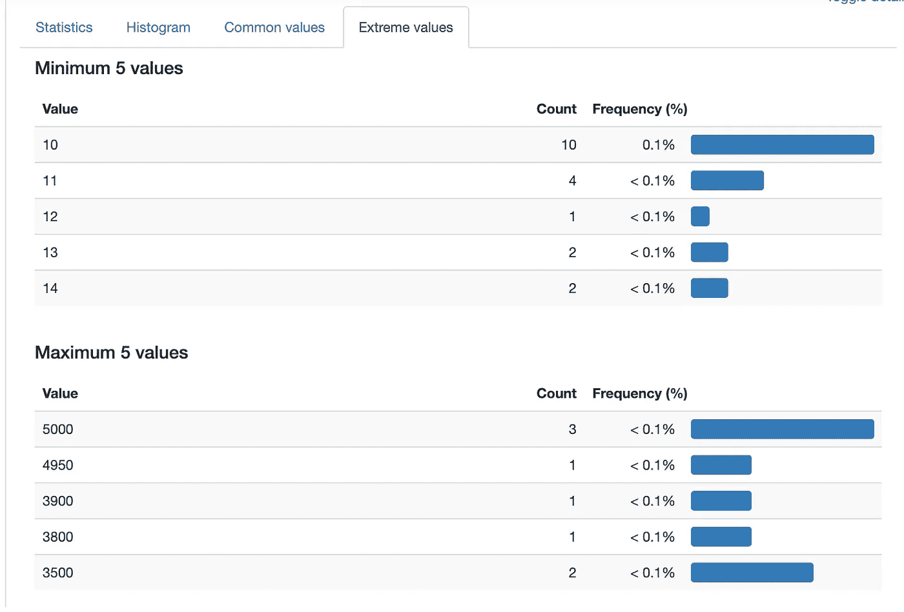

“总年度薪酬”的最小值/最大值

最高值是 5000 似乎有点奇怪，所以我们需要去[https://www.levels.fyi/addcomp.html](https://www.levels.fyi/addcomp.html)了解输入工资数据的表单是什么样子的:

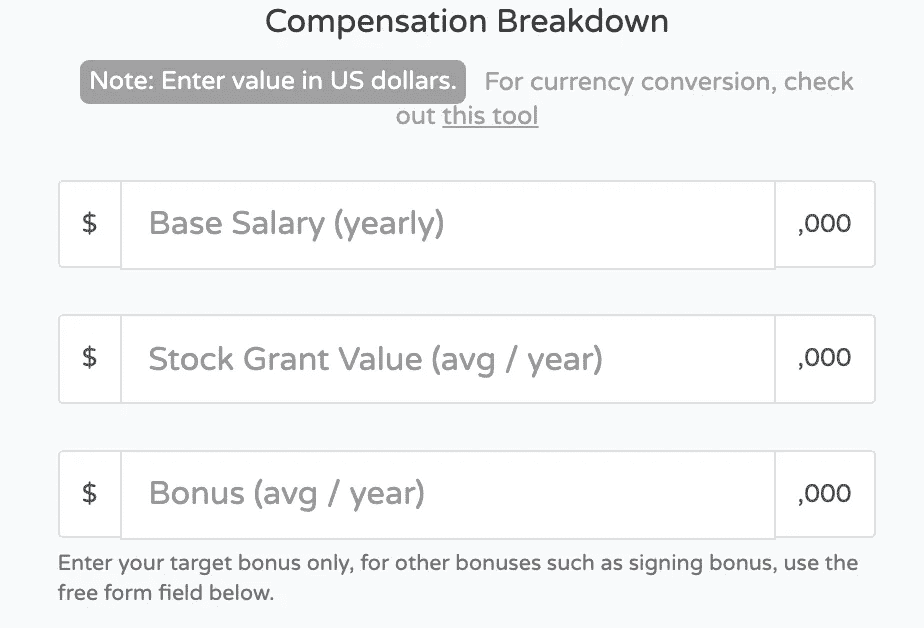

Levels.fyi 表单

查看表单会发现歪斜的几种可能性。有些人可能一年挣 500 多万美元(有可能！)，可能有人只是输入了垃圾数据，和/或可能有一段时间网站上的用户输入了不同的数据(整数而不是千)。由于我们无法控制数据质量，让我们看看“统计”选项卡是否能帮助我们了解更多信息:

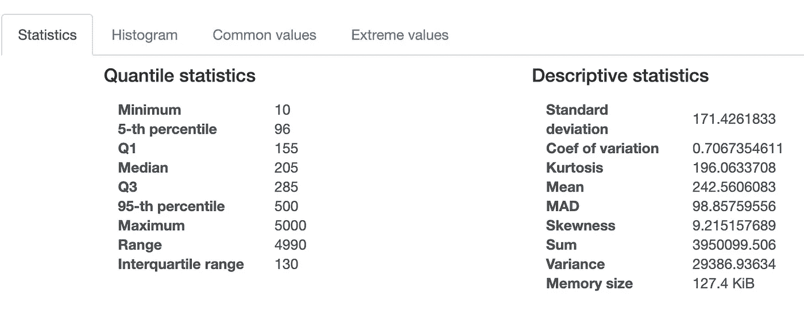

“总薪酬”变量的统计数据

当查看左侧的分位数数据时，我们可以看到 5/95%标记似乎与整体数据相匹配(范围在 96，000 美元到 500，000 美元之间)。我们可以使用 Python 中另一个令人兴奋的方法`quantile`来轻松过滤掉前 5%和后 5%的数据，而不是试图创建静态过滤器或梳理数据来删除这些异常值:

```
df = df[df['totalyearlycompensation'].between(df['totalyearlycompensation'].quantile(.05),df['totalyearlycompensation'].quantile(.95))]
```

哒哒！我们已经即时动态地从数据集中移除了异常值。如果我们重新运行 pandas-profiling 我们的`totalyearlycompensation`变量现在看起来像这样:

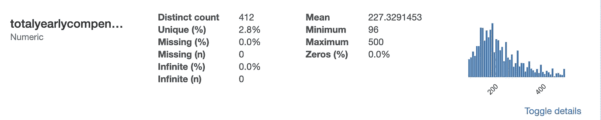

过滤分位数后的总年薪

您甚至可以进一步推断，使用 pandas [查询](https://pandas.pydata.org/pandas-docs/stable/reference/api/pandas.DataFrame.query.html)方法来分析数据的特定子集。例如:

```
df.query("company in ('Facebook','Amazon','Apple','Netflix','Google') and title in ('Product Manager','Software Engineer') and yearsofexperience>4 and yearsofexperience<16").profile_report(style={'full_width':True})
```

为我们提供了一份报告，该报告分析了具有 5-15 年经验的 FAANG 产品经理和软件工程师的子集。

你可以进一步使用一些额外的库来绘制一个 violin plot 的比较图！

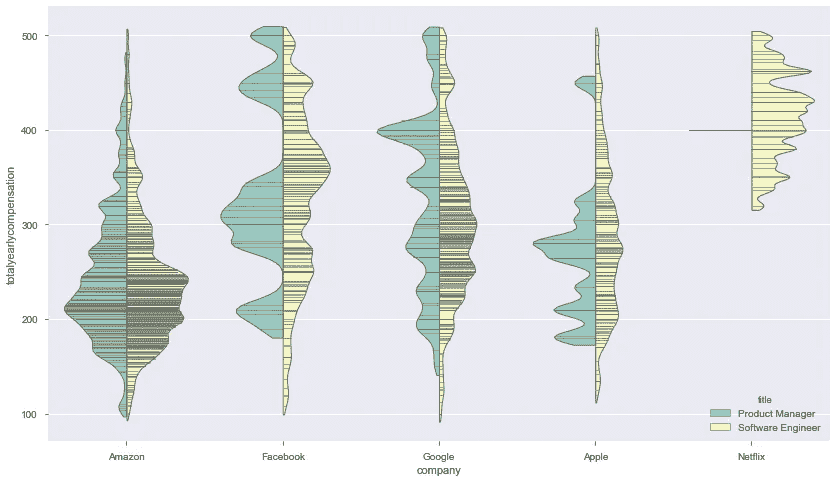

看看我的 [Jupyter 笔记本](https://github.com/mattygyo/medium_articles/blob/master/Levels.fyi%20Walkthrough.ipynb)如何做到这一点！

# 用 AutoViz 让电脑为你做一切

最初，我的文章只打算讨论上面的两个库，但是有一个新的版本我也想介绍一下，它叫做 [AutoViz](https://github.com/AutoViML/AutoViz) 。这是一个较新的库，本质上是寻找数据集的“相关”细节，以逻辑方式将它们组合在一起，然后以各种图形形式向用户提供输出。如本[文章](https://danrothdatascience.github.io/datascience/autoviz.html)所述:

> XGBoost 模型被重复用于确定最一致的特征集，每次通过使用随机的特征集来确定该特征集是重要的；然后，最突出的选定特征可用于指导未来的绘图和可视化

要在我们的数据集上应用和尝试这一点，我们需要做的就是添加几行额外的代码，并命名我们要分析的因变量(在本例中为 totalyearlycompensation)。让我们将数据集过滤给软件工程师，这样我们可以在查看输出时分析单个作业类型:

```
from autoviz.AutoViz_Class import AutoViz_Class
AV = AutoViz_Class()df = df[df['title'] == 'Software Engineer']df_av = AV.AutoViz(filename="", sep=",", depVar="totalyearlycompensation", dfte=df, header=0, verbose=2, lowess=False, chart_format="svg", max_rows_analyzed=15000, max_cols_analyzed=30)
```

运行上面的代码后，您应该会看到类似这样的内容，后面是一些图表:

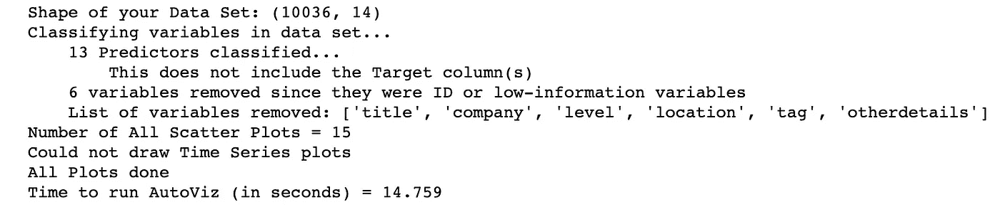

AutoViz 的摘要输出

因此，我们可以看到，在数据集中的 13 个特征中，AutoViz 决定放弃 6 个，因为信息相关性低，令人惊讶的是，公司和位置也在其中。然而，如果我们使用`df.value_counts(normalize=True)`查看位置统计，我们会发现 51%的工资仅来自 5 个位置，因此可能没有足够的数据使位置成为一个强有力的指标。

现在让我们看看它生成的图表，看看我们能学到什么。在“根据目标变量映射的连续变量”下，我们看到以下内容:

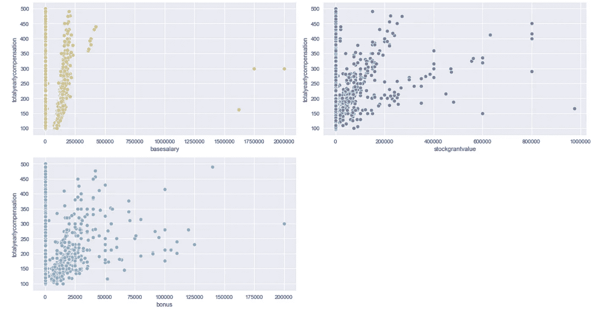

根据目标变量映射的连续变量散点图

由此我们可以看出:

1.  不管年度总薪酬是多少，基本工资一般都在 25 万美元左右
2.  股票奖励和奖金变化很大，可能占软件工程师年度总薪酬的很大一部分
3.  奖金往往更均匀地分散，而股票奖励似乎有三个点集群(90/50/20 度角)。这可能是一个数据质量问题，但这也可能意味着股票价值大幅上升

考虑输出时，直方图 KDE 部分非常重要，因此我们接下来讨论这一部分。首先，我们可以看到男性约占数据集的 88%,因此考虑到严重的不平衡，提取性别间有意义的见解将是困难的。其次，数据严重倾向于职业生涯早期的人——63%的报告工资来自有 0-6 年工作经验的人。这告诉我们，那些有更多经验的人可能希望在下太多结论之前考虑有限的样本量。

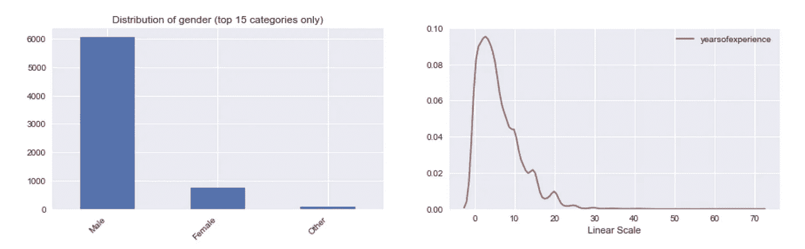

性别和经验年限

KDE 图部分的下一组变量也显示了强烈的右偏。特别是 Bonus 和 stockgrantvalue 也有几个峰值。这是 KDE 的说法，即这些是数据集中概率最高的选择。

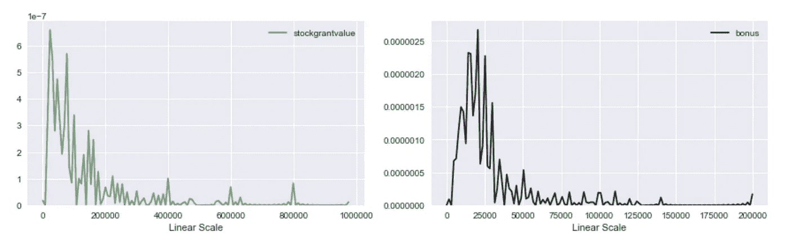

KDE 为股票期权价值和红利绘制图表

为什么这很重要？如果我们继续只查看成对散点图部分，我们会遇到这种情况:

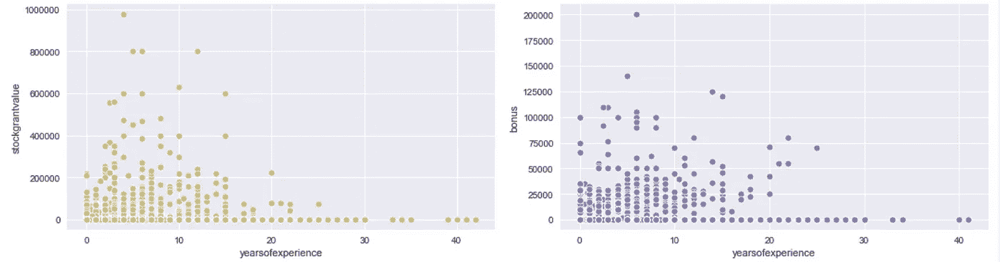

股票价值和奖金与经验年限的关系

如果我们没有看到 KDE 的偏斜，我就无法判断，对于奖金，40%的价值实际上低于数字“40”。

AutoViz 是一个优秀的新库，当您初次查看数据时，它实际上有可能节省您的时间。如上所示，该程序不会将您从畸形或古怪的数据中拯救出来，因此理解您的数据集是生成有用见解的关键！

# 结论

希望这篇文章给了你一些新的工具，让你在开始使用数据集时可以使用。我可能会在未来的帖子中讨论更多深入和核心的包，但我认为这些包在高价值输出和低强度输入之间实现了良好的混合。就我个人而言，我从 missingno 开始，在我确信数据相对完整后运行 pandas_profile，然后过滤/按摩到更详细的数据集，以针对 AutoViz 运行更细粒度的自动生成的洞察。感谢阅读！